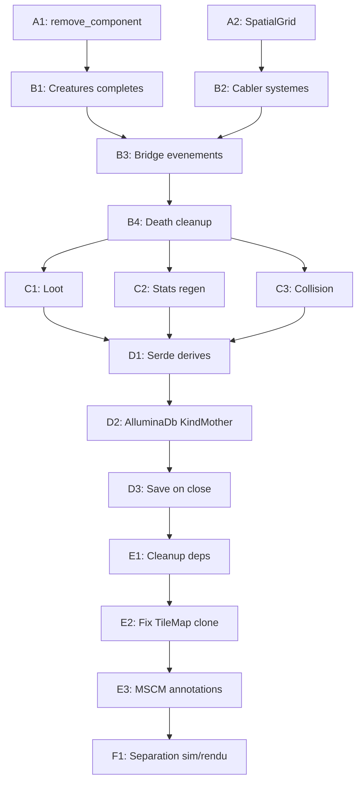

# Plan de Correction et Consolidation MVP Allumina

## Scope MVP revise (sans multijoueur)

Systemes retires du MVP :

- Reseau (Lobby MWS, serveur autoritaire)
- Trade joueur-joueur
- Interest management, anti-triche reseau
- Phases 50 (Network input) et 950 (Network output)

Systemes conserves : Game loop, Carte, Mouvement+A*, Combat, IA, Spawn, Troupe, Stats, Skills, Loot, Inventaire, Recolte, Craft, Or+NPC marchands, Persistence solo (KindMother), Solo offline.

---

## Phase A -- Patches kernel (prerequis)

### A1. Ajouter `remove_component<T>()` sur World

Fichier : [mge/crates/mge-ecs/src/world.rs](mge/crates/mge-ecs/src/world.rs)

`SparseSet::remove()` existe deja en interne. Il suffit d'exposer une methode publique sur `World` :

```rust
pub fn remove_component<T: Component>(&mut self, id: EntityId) {
    if !self.is_alive(id) { return; }
    let type_id = TypeId::of::<T>();
    if let Some(&idx) = self.type_index.get(&type_id) {
        self.storages[idx].remove(id);
    }
}
```

Ajouter un test dans [mge/crates/mge-core/src/lib.rs](mge/crates/mge-core/src/lib.rs) (`test_remove_component`).

Re-exporter dans `lib.rs` de mge-ecs et mge-core.

### A2. Spatial index basique (grille par secteurs)

Fichier : [mge/crates/mge-plugin-spatial/src/systems.rs](mge/crates/mge-plugin-spatial/src/systems.rs) (actuellement stub)

Implementer une grille de secteurs simple :

```rust
pub struct SpatialGrid {
    cell_size: f32,
    cells: HashMap<(i32, i32), Vec<EntityId>>,
}

impl SpatialGrid {
    pub fn query_radius(&self, x: f32, y: f32, radius: f32) -> Vec<EntityId>;
    pub fn rebuild(&mut self, world: &World);
}
```

Stocker `SpatialGrid` comme composant singleton (meme pattern qu'`AlluminaMap`). Ajouter un systeme `spatial_index_update_system` en Phase 5 (avant input) qui reconstruit la grille chaque tick.

Impact : le `find_target` dans mge-rpg-ai passe de O(n) a O(k) ou k = entites dans le voisinage.

---

## Phase B -- Cablage des systemes existants

### B1. Completer le spawner : creatures avec composants complets

Fichier : [mge/examples/allumina_prototype/src/spawner.rs](mge/examples/allumina_prototype/src/spawner.rs)

Apres le spawn de Position2D + Velocity2D + PathfindingState + EntitySprite, ajouter :

```rust
world.insert(new_entity, mge_rpg_stats::Health { current: 50.0, max: 50.0, regen_rate: 0.5 });
world.insert(new_entity, mge_rpg_stats::StatBlock::default());
world.insert(new_entity, mge_rpg_combat::CombatStats { atk: 8.0, esq: 5.0, par: 3.0, atk_speed: 40.0, damage_base: 6.0, damage_type: mge_rpg_combat::DAMAGE_TYPE_SLASH });
world.insert(new_entity, mge_rpg_combat::Armor::default());
world.insert(new_entity, mge_rpg_ai::AIState::new(wx, wy, 6.0, 12.0));
world.insert(new_entity, mge_rpg_ai::AiTargetable);
world.insert(new_entity, mge_rpg_inventory::LootTable::new(vec![...]));
```

Les valeurs seront parametrables via un fichier JSON `creatures.json`.

Ajouter un champ `spawner_entity: EntityId` sur les creatures spawnees pour permettre le decrement de `current_count` a la mort.

### B2. Cabler les 7 systemes manquants dans AlluminaPlugin

Fichier : [mge/examples/allumina_prototype/src/plugin.rs](mge/examples/allumina_prototype/src/plugin.rs)

Ajouter les phases et systemes :

```rust
pub const PHASE_COMBAT: PhaseId = PhaseId(200);
pub const PHASE_SKILL: PhaseId = PhaseId(300);
pub const PHASE_HARVEST: PhaseId = PhaseId(400);
pub const PHASE_AI: PhaseId = PhaseId(500);
pub const PHASE_ECONOMY: PhaseId = PhaseId(800);
pub const PHASE_PERSIST: PhaseId = PhaseId(900);

// Dans build():
engine.add_named_system(PHASE_COMBAT, "combat", mge_rpg_combat::combat_resolution_system);
engine.add_named_system(PHASE_SKILL, "skill_gain", mge_rpg_progression::skill_gain_system);
engine.add_named_system(PHASE_HARVEST, "harvest", crate::harvest::harvest_system);
engine.add_named_system(PHASE_HARVEST, "harvest_respawn", crate::harvest::harvest_respawn_system);
engine.add_named_system(PhaseId(402), "craft", crate::craft::craft_system);
engine.add_named_system(PHASE_AI, "ai_tick", mge_rpg_ai::ai_tick_system);
engine.add_named_system(PHASE_ECONOMY, "trade_buy", crate::economy::trade_buy_system);
engine.add_named_system(PHASE_ECONOMY, "trade_sell", crate::economy::trade_sell_system);
```

Enregistrer les composants manquants : `Health`, `DeadTag`, `StatBlock`, `DerivedStats`, `CombatStats`, `Armor`, `AttackCooldown`, `AIState`, `AiTargetable`, `SkillSet`, `Inventory`, `Equipment`, `Item`, `LootTable`, `HarvestNode`, `CraftStation`, `Gold`, `Merchant`.

### B3. Bridge evenements Allumina <-> RPG pack

Probleme : `AttackTargetEvent` (allumina) != `AttackRequestEvent` (mge-rpg-combat). Et `AiAttackRequestEvent` (mge-rpg-ai) != `AttackRequestEvent` (mge-rpg-combat).

Creer un nouveau systeme bridge dans un fichier `combat_bridge.rs` :

```rust
// @phase 150 (entre input et combat)
pub fn combat_bridge_system(world: &mut World, ctx: &mut Context) {
    // Convertir AttackTargetEvent -> AttackRequestEvent
    for ev in ctx.events.iter::<AttackTargetEvent>() {
        ctx.emit(AttackRequestEvent { attacker: ev.attacker, target: ev.target });
    }
    // Convertir AiAttackRequestEvent -> AttackRequestEvent
    for ev in ctx.events.iter::<AiAttackRequestEvent>() {
        ctx.emit(AttackRequestEvent { attacker: ev.attacker, target: ev.target });
    }
}
```

### B4. Fix spawner current_count decrement a la mort

Creer un systeme `death_cleanup_system` dans un nouveau fichier `death.rs`, Phase 250 (apres combat) :

```rust
pub fn death_cleanup_system(world: &mut World, ctx: &mut Context) {
    for ev in ctx.events.iter::<EntityDeathEvent>() {
        // Decrementer le compteur du spawner parent
        if let Some(owner_id) = world.get::<SpawnerOwner>(ev.entity) {
            if let Some(mut spawner) = world.get_mut::<SpawnerData>(owner_id.spawner) {
                spawner.current_count = spawner.current_count.saturating_sub(1);
            }
        }
        // Generer le loot
        // ... (voir Phase C)
    }
}
```

Ajouter un composant `SpawnerOwner { pub spawner: EntityId }` sur les creatures.

---

## Phase C -- Systemes gameplay manquants

### C1. Loot system

Nouveau fichier : `mge/examples/allumina_prototype/src/loot.rs`

Phase 700 (apres spawn, avant economy).

```rust
pub fn loot_system(world: &mut World, ctx: &mut Context) {
    for ev in ctx.events.iter::<EntityDeathEvent>() {
        let loot_table = world.get::<LootTable>(ev.entity);
        // Roll RNG pour chaque entree
        // Spawn item entities au sol (Position2D + Item)
        // Ou ajouter directement a l'inventaire du killer si a portee
    }
}
```

### C2. Stats regen system

Fichier : [mge/crates/rpg/mge-rpg-stats/src/systems.rs](mge/crates/rpg/mge-rpg-stats/src/systems.rs) (actuellement stub)

```rust
pub fn health_regen_system(world: &mut World, ctx: &mut Context) {
    let dt = ctx.delta_secs() as f64;
    world.for_each1_mut::<Health, _>(|id, health| {
        if !world.has_component::<DeadTag>(id) && health.current < health.max {
            health.current = (health.current + health.regen_rate * dt).min(health.max);
        }
    });
}
```

Note : `for_each1_mut` ne donne pas acces a `world` pour `has_component`. Il faudra pre-collecter les IDs morts, ou utiliser un pattern differentseparant la lecture des DeadTag.

### C3. Collision basique

Nouveau composant dans [mge/examples/allumina_prototype/src/components.rs](mge/examples/allumina_prototype/src/components.rs) :

```rust
pub struct Collision {
    pub radius: f32,
    pub blocking: bool,
}
impl Component for Collision {}
```

Modifier `movement_system` pour verifier les collisions entre entites via la SpatialGrid.

---

## Phase D -- Persistence solo via KindMother

### D1. Ajouter serde derives sur les composants cles

Fichiers concernes (ajouter `#[derive(Serialize, Deserialize)]`) :

- `mge-rpg-stats/src/components.rs` : `StatBlock`, `Health`, `DerivedStats`
- `mge-rpg-combat/src/components.rs` : `CombatStats`, `Armor`
- `mge-rpg-inventory/src/components.rs` : `Inventory`, `Equipment`, `Item`
- `mge-rpg-progression/src/components.rs` : `SkillSet`, `SkillValue`
- `mge-plugin-spatial/src/components.rs` : `Position2D`

Ajouter `serde = { version = "1", features = ["derive"] }` aux Cargo.toml de ces crates (en feature optionnelle `serde` pour ne pas forcer la dependance).

### D2. Module persistence Allumina

Nouveau fichier : `mge/examples/allumina_prototype/src/persistence.rs`

Pattern KindMother (SQLite via `rusqlite` avec feature `legacy-sqlite`) :

```rust
pub struct AlluminaDb {
    conn: Mutex<Connection>,
}

impl AlluminaDb {
    pub fn open(path: &Path) -> Result<Self>;
    pub fn save_world(&self, world: &World) -> Result<()>;
    pub fn load_world(&self, world: &mut World) -> Result<()>;
}
```

Tables SQLite :

- `player` : position, stats, skills, inventory, gold
- `creatures` : position, type, health (pour respawn)
- `harvest_nodes` : current_stock, respawn_timer
- `world_meta` : seed, tick_count, timestamp

Systeme Phase 900 : `persistence_check_system` -- sauvegarde toutes les 60 secondes + a la fermeture.

### D3. Sauvegarde a la fermeture

Dans `main.rs`, intercepter `WindowEvent::CloseRequested` pour appeler `AlluminaDb::save_world()` avant `target.exit()`.

Ajouter `rusqlite = { version = "0.32", features = ["bundled"] }` au Cargo.toml du prototype.

---

## Phase E -- Nettoyage et conformite

### E1. Supprimer les dependances inutilisees

Fichier : [mge/examples/allumina_prototype/Cargo.toml](mge/examples/allumina_prototype/Cargo.toml)

Retirer :

- `mge-social-*` (6 crates) -- pas utilises
- `mge-vn-*` (4 crates) -- pas utilises
- `mge-rpg-quest` -- stub, pas dans le MVP
- `mge-rpg-dialogue` -- stub, pas dans le MVP
- `mge-plugin-audio` -- pas de backend audio

Corriger la description : `"Allumina MVP — Sandbox RPG solo (MGE)"`

### E2. Eliminer le clone TileMap dans le spawner

Remplacer le pattern `world.iter1::<AlluminaMap>().map(clone)` par une approche en deux passes :

1. Collecter les donnees de spawn necessaires
2. Valider les positions avec un acces direct a la TileMap

Ou stocker la TileMap dans une `Arc<TileMap>` partagee.

### E3. Annotations MSCM sur les 17 fichiers allumina

Ajouter les blocs MSCM conformes (avec `@id`, `@role`, `@layer`, `@domain`, `@do`) sur chaque fichier du prototype :


| Fichier               | @id propose                             |
| --------------------- | --------------------------------------- |
| main.rs               | `allumina.prototype.main`               |
| plugin.rs             | `allumina.prototype.plugin`             |
| components.rs         | `allumina.prototype.components`         |
| events.rs             | `allumina.prototype.events`             |
| movement.rs           | `allumina.prototype.movement`           |
| pathfinding.rs        | `allumina.prototype.pathfinding`        |
| pathfinding_system.rs | `allumina.prototype.pathfinding_system` |
| troops.rs             | `allumina.prototype.troops`             |
| spawner.rs            | `allumina.prototype.spawner`            |
| input_handler.rs      | `allumina.prototype.input`              |
| isometric.rs          | `allumina.prototype.isometric`          |
| tilemap.rs            | `allumina.prototype.tilemap`            |
| renderer.rs           | `allumina.prototype.renderer`           |
| craft.rs              | `allumina.prototype.craft`              |
| economy.rs            | `allumina.prototype.economy`            |
| harvest.rs            | `allumina.prototype.harvest`            |
| content_loader.rs     | `allumina.prototype.content_loader`     |


### E4. Supprimer ou fusionner mge-query

Le crate `mge-query` (13 lignes, pur re-export) n'apporte rien. Le supprimer du workspace ou le garder comme placeholder documente.

---

## Phase F -- Separation simulation/rendu (structurelle)

### F1. Extraire la boucle de simulation

Restructurer `main.rs` pour separer clairement :

- `fn simulation_tick(engine: &mut Engine)` -- pure simulation, pas de rendu
- `fn render_frame(engine: &Engine, renderer: &mut WgpuRenderer, camera: &IsoCamera)` -- extraction sprites + draw

Cela ne necessite pas de multithreading pour le MVP solo, mais pose la structure pour un decoupage futur (thread simulation vs thread rendu).

### F2. Deplacer la gestion winit hors de la simulation

Actuellement, `AlluminaInput` est mis a jour directement dans la boucle winit (`main.rs` L223-228) puis lu par `input_processing_system`. Ce pattern est correct pour le solo mais doit etre documente comme point d'injection reseau futur.

---

## Ordre d'execution recommande




