# Implementation MVP Allumina Prototype

## Etat actuel

- **MGE Core** : fonctionnel (`Engine`, `World` ECS, `EventQueue`, `Scheduler` par `PhaseId`, `Time`, `Rng`, `Plugin` trait)
- **Plugins spatial/render/input** : composants definis (`Position2D`, `Sprite`, `Camera2D`), mais aucun rendu reel
- **7 crates RPG pack** : tous des stubs vides (`// TODO` dans components.rs, systems.rs, events.rs)
- **allumina_prototype** : scaffold vide (`println!` dans main.rs)
- **Demo pathfinding** (`demos/mge-pathfinding-labyrinthe/`) : jeu fonctionnel avec combat, AI, invocations, A*, rendu minifb - sert de reference pour les patterns

## Architecture cible

```mermaid
flowchart TD
    subgraph allumina ["allumina_prototype (main.rs)"]
        GameMain["main()"]
        AlPlugin["AlluminaPlugin"]
        RenderLoop["wgpu render loop"]
    end

    subgraph mgeCore ["mge-core"]
        Engine
        World
        Scheduler
        EventQueue
    end

    subgraph rpgPack ["RPG Pack (a remplir)"]
        Stats["mge-rpg-stats"]
        Combat["mge-rpg-combat"]
        Inventory["mge-rpg-inventory"]
        AI["mge-rpg-ai"]
        Progression["mge-rpg-progression"]
    end

    subgraph plugins ["Plugins MGE"]
        Spatial["mge-plugin-spatial"]
        Render2D["mge-plugin-render-2d"]
        Input["mge-plugin-input"]
    end

    subgraph alluminaMods ["Modules Allumina"]
        TileMap["tilemap.rs"]
        Isometric["isometric.rs"]
        Troops["troops.rs"]
        Spawner["spawner.rs"]
        Harvest["harvest.rs"]
        Craft["craft.rs"]
        Economy["economy.rs"]
        WgpuRender["wgpu_renderer.rs"]
    end

    GameMain --> Engine
    AlPlugin --> Stats
    AlPlugin --> Combat
    AlPlugin --> Inventory
    AlPlugin --> AI
    AlPlugin --> Spatial
    RenderLoop --> WgpuRender
    WgpuRender --> Isometric
    WgpuRender --> TileMap
```




## Phase 1 : Fenetre wgpu + tilemap isometrique (priorite)

### 1a. Setup wgpu dans allumina_prototype

**Fichier** : [mge/examples/allumina_prototype/Cargo.toml](mge/examples/allumina_prototype/Cargo.toml)

- Ajouter deps : `winit = "0.30"`, `wgpu = "24"`, `image = "0.25"`, `bytemuck`, `pollster`, `serde`, `serde_json`
- Garder les deps MGE existantes

**Fichier** : `mge/examples/allumina_prototype/src/main.rs`

- Creer la fenetre winit 1280x720
- Init wgpu (instance, surface, device, queue)
- Game loop : `engine.tick(dt)` puis rendu wgpu
- Structure : `AlluminaApp` qui possede `Engine` + `WgpuRenderer`

### 1b. Renderer isometrique

**Nouveau fichier** : `mge/examples/allumina_prototype/src/renderer.rs`

- `WgpuRenderer` : gere device/queue/surface/pipeline
- Chargement de texture atlas depuis les PNG du grassland tileset
- Shader de sprite batching (quad instancing)
- Conversion coordonnees monde -> ecran isometrique :

```
  screen_x = (world_x - world_y) * TILE_HALF_W
  screen_y = (world_x + world_y) * TILE_HALF_H
  

```

**Nouveau fichier** : `mge/examples/allumina_prototype/src/isometric.rs`

- Fonctions de conversion iso <-> monde
- Camera isometrique (pan, zoom)

### 1c. Tilemap

**Nouveau fichier** : `mge/examples/allumina_prototype/src/tilemap.rs`

- `TileMap { width, height, tiles: Vec<Tile> }`
- `Tile { graphic_id, flags }`
- Chargement depuis JSON (`maps/mvp_village.json`)
- Rendering : iterer les tiles visibles dans la camera, envoyer les sprites au renderer

**Nouveau fichier** : `mge/examples/allumina_prototype/assets/maps/mvp_village.json`

- Carte 64x64 (petit pour commencer) avec village + foret + mine

## Phase 2 : RPG Pack -- remplir les stubs

### 2a. mge-rpg-stats

**Fichier** : [mge/crates/rpg/mge-rpg-stats/src/components.rs](mge/crates/rpg/mge-rpg-stats/src/components.rs)

```rust
pub struct StatBlock { pub values: [f64; 16] }  // indexe par StatId
pub struct DerivedStats { pub hp_max, mp_max, end_max, aggro, weight_max: f64 }
pub struct Health { pub current: f64, pub max: f64, pub regen_rate: f64 }
pub struct DeadTag;
```

**events.rs** : `StatChangedEvent`, `EntityDeathEvent`

### 2b. mge-rpg-combat

**Fichier** : [mge/crates/rpg/mge-rpg-combat/src/components.rs](mge/crates/rpg/mge-rpg-combat/src/components.rs)

```rust
pub struct CombatStats { pub atk, esq, par, atk_speed, damage_base: f64, pub damage_type: u8 }
pub struct Armor { pub ar: [f64; 3], pub resistance: f64 }  // [tranc, cont, perc]
pub struct AttackCooldown { pub remaining: f32, pub interval: f32 }
```

**events.rs** : `AttackRequestEvent`, `DamageEvent`, `AttackMissEvent`
**systems.rs** : `combat_resolution_system` (la sequence atk->esq->par->degats du doc Caracs)

### 2c. mge-rpg-inventory

**Fichier** : [mge/crates/rpg/mge-rpg-inventory/src/components.rs](mge/crates/rpg/mge-rpg-inventory/src/components.rs)

```rust
pub struct Inventory { pub slots: Vec<Option<EntityId>>, pub capacity: usize }
pub struct Equipment { pub slots: [Option<EntityId>; 6] }  // head,torso,legs,main,off,acc
pub struct Item { pub type_id: u32, pub quality: u8, pub weight: f32, pub stack: u32 }
pub struct WeaponData { pub dmg_min: f64, pub dmg_max: f64, pub dmg_type: u8, pub range: f32 }
pub struct ArmorData { pub ar: [f64; 3], pub resistance: f64 }
pub struct LootTable { pub entries: Vec<LootEntry> }
```

### 2d. mge-rpg-ai

**Fichier** : [mge/crates/rpg/mge-rpg-ai/src/components.rs](mge/crates/rpg/mge-rpg-ai/src/components.rs)

```rust
pub enum CreatureState { Idle, Chase, Attack, Return }
pub struct AIState { pub state: CreatureState, pub spawn_point: (f32,f32), pub aggro_radius: f32, pub leash_radius: f32, pub target: Option<EntityId>, pub attack_range: f32 }
```

**systems.rs** : `ai_tick_system` (FSM 5 etats du MVP)

### 2e. mge-rpg-progression

**Fichier** : [mge/crates/rpg/mge-rpg-progression/src/components.rs](mge/crates/rpg/mge-rpg-progression/src/components.rs)

```rust
pub struct SkillSet { pub skills: Vec<SkillValue> }
pub struct SkillValue { pub id: u32, pub base: f64, pub gain_factor: f64, pub lock: u8 }
```

**events.rs** : `SkillCheckEvent`, `SkillGainEvent`

## Phase 3 : Systemes de jeu dans allumina_prototype

### 3a. Modules Allumina specifiques

Tous dans `mge/examples/allumina_prototype/src/` :

- `plugin.rs` : `AlluminaPlugin` impl `Plugin` -- enregistre tous les composants et systemes
- `components.rs` : composants specifiques Allumina (TroopOwner, TroopFollower, Spawner, HarvestNode, etc.)
- `pathfinding.rs` : A* sur la grille de tiles (pattern de la demo pathfinding)
- `troops.rs` : systeme de troupes (suivi, balise, combat par agression)
- `spawner.rs` : spawners fixes avec timer
- `input.rs` : gestion inputs winit (clic deplacement, clic attaque, balise)
- `harvest.rs` : recolte simplifiee (noeuds fixes)
- `craft.rs` : recettes directes
- `economy.rs` : or + NPC marchands + trade

### 3b. Game loop

```rust
fn main() {
    let mut engine = Engine::new(EngineConfig {
        seed: 42, headless: false,
        fixed_timestep_ms: Some(33), // 30 TPS
        tick_budget_ms: Some(30),
    });
    engine.add_plugin(AlluminaPlugin);
    engine.build();

    // winit event loop
    // chaque frame : engine.tick(dt) puis renderer.draw(engine.world())
}
```

Les systemes enregistres par phases (conforme au MVP doc) :

- Phase 10 : timer tick
- Phase 50 : input processing
- Phase 100 : movement + pathfinding
- Phase 200 : combat resolution
- Phase 300 : skill checks + gain
- Phase 400 : harvest + craft
- Phase 500 : AI tick
- Phase 600 : spawn system
- Phase 700 : loot + inventory
- Phase 900 : persistence check

## Phase 4 : Contenu et integration

- Charger les sprites du grassland tileset (`assets/2D_Isometric_Tile_Pack/grassland_tileset_updated/`)
- Creer la carte MVP (village + foret + mines + donjon)
- Configurer les monstres, items, recettes depuis JSON (configs du MVP Sandbox doc)
- Sprites placeholder pour entites (carre colore ou petit sprite)

## Fichiers modifies/crees (resume)

**Modifies** (7 crates RPG pack -- remplir stubs) :

- `mge/crates/rpg/mge-rpg-stats/src/{components,events,systems}.rs`
- `mge/crates/rpg/mge-rpg-combat/src/{components,events,systems}.rs`
- `mge/crates/rpg/mge-rpg-inventory/src/{components,events}.rs`
- `mge/crates/rpg/mge-rpg-ai/src/{components,events,systems}.rs`
- `mge/crates/rpg/mge-rpg-progression/src/{components,events}.rs`

**Modifies** (allumina_prototype existant) :

- `mge/examples/allumina_prototype/Cargo.toml` (ajout deps wgpu, winit, etc.)
- `mge/examples/allumina_prototype/src/main.rs` (remplacement scaffold)

**Crees** (~12 fichiers dans allumina_prototype) :

- `src/plugin.rs`, `src/components.rs`, `src/renderer.rs`, `src/isometric.rs`
- `src/tilemap.rs`, `src/pathfinding.rs`, `src/troops.rs`, `src/spawner.rs`
- `src/input_handler.rs`, `src/harvest.rs`, `src/craft.rs`, `src/economy.rs`
- `assets/maps/mvp_village.json`
- `assets/shaders/sprite.wgsl`

## Ordre d'implementation recommande

Commencer par Phase 1 (fenetre wgpu + tilemap isometrique rendu) pour avoir un feedback visuel immediat, puis Phase 2 (RPG pack) pour avoir les composants, puis Phase 3 (systemes de jeu) pour assembler le MVP.