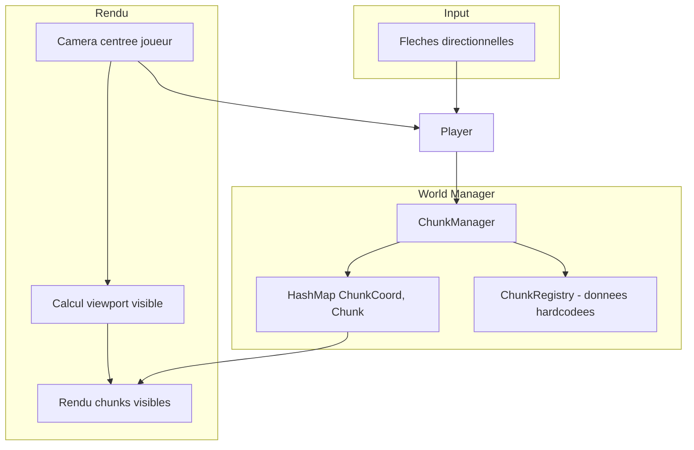
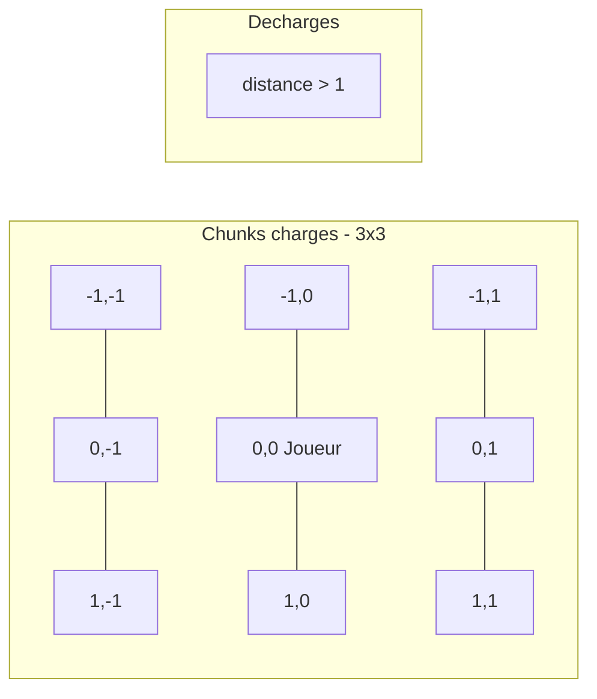

# Systeme de chunks, camera et deplacement clavier

## Architecture cible




## 1. Controles clavier (remplace clic)

Fichier : [main.rs](demos/mge-pathfinding-labyrinthe/src/main.rs)

- Fleches directionnelles : deplacement direct (sans pathfinding pour le joueur)
- Le joueur se deplace en continu tant que la touche est maintenue
- Vitesse = `entity.speed * dt`
- Collision avec obstacles : bloquer le mouvement

```rust
let mut dir = Vec2::default();
if window.is_key_down(Key::Up) { dir.y -= 1.0; }
if window.is_key_down(Key::Down) { dir.y += 1.0; }
if window.is_key_down(Key::Left) { dir.x -= 1.0; }
if window.is_key_down(Key::Right) { dir.x += 1.0; }
let dir = dir.normalize_or_zero();
entity.position = entity.position.add(dir.scale(entity.speed * dt));
```

## 2. Nouveau module `chunk.rs`

Structure de donnees :

```rust
pub const CHUNK_SIZE: i32 = 64;  // 64x64 tiles

pub struct ChunkCoord { pub x: i32, pub y: i32 }

pub struct Chunk {
    pub coord: ChunkCoord,
    pub terrain: Vec<Terrain>,  // CHUNK_SIZE * CHUNK_SIZE
    pub spawn_points: Vec<SpawnPoint>,  // zones de spawn monstres
}

pub struct SpawnPoint {
    pub local_pos: GridNode,  // position dans le chunk
    pub monster_type: MonsterType,
    pub respawn_delay: f32,
}

pub struct ChunkManager {
    active_chunks: HashMap<ChunkCoord, Chunk>,
    registry: ChunkRegistry,  // donnees hardcodees
}
```

## 3. ChunkRegistry (monde non-procedural)

Fichier : `chunk_data.rs`

- Carte du monde predefinee (ex: 4x4 chunks = 256x256 tiles)
- Chaque chunk a son terrain defini (murs, routes, forets, etc.)
- Seuls les spawn points sont actives aleatoirement au chargement

```rust
impl ChunkRegistry {
    pub fn get_chunk_data(&self, coord: ChunkCoord) -> Option<ChunkTemplate>;
}
```

## 4. Chargement/dechargement dynamique

Logique dans `ChunkManager::update()` :

1. Calculer le chunk du joueur : `player_chunk = (player_pos / (CHUNK_SIZE * TILE_SIZE)).floor()`
2. Charger les 9 chunks (3x3 autour du joueur)
3. Dechargement : chunks a plus de 1 chunk de distance sont retires




## 5. Camera fixee sur joueur

Fichier : [render.rs](demos/mge-pathfinding-labyrinthe/src/render.rs)

- `camera_offset` = position joueur - centre ecran
- Toutes les positions de rendu sont decalees par `camera_offset`
- Seuls les chunks visibles dans le viewport sont rendus

```rust
pub struct Camera {
    pub center: Vec2,  // = player.position
}

impl Camera {
    pub fn world_to_screen(&self, world_pos: Vec2, screen_size: (usize, usize)) -> (i32, i32) {
        let sx = world_pos.x - self.center.x + (screen_size.0 as f32 / 2.0);
        let sy = world_pos.y - self.center.y + (screen_size.1 as f32 / 2.0);
        (sx as i32, sy as i32)
    }
}
```

## 6. Spawn procedural des monstres

- Chaque chunk a des `SpawnPoint` predefinis
- Au chargement du chunk : instancier les monstres avec position exacte aleatoire (± quelques tiles)
- Les monstres restent dans leur chunk (pathfinding limite au chunk ou chunks adjacents)

## 7. Adaptation du pathfinding

- Le pathfinding doit fonctionner sur plusieurs chunks
- Option A : A* sur la grille composite des chunks charges
- Option B : Interface `WorldGrid` qui delegue `terrain_at(x, y)` au bon chunk

```rust
impl ChunkManager {
    pub fn terrain_at(&self, world_x: i32, world_y: i32) -> Terrain;
    pub fn is_walkable(&self, world_x: i32, world_y: i32) -> bool;
}
```

## Fichiers a creer/modifier


| Fichier          | Action                                               |
| ---------------- | ---------------------------------------------------- |
| `chunk.rs`       | Nouveau - structures Chunk, ChunkCoord, ChunkManager |
| `chunk_data.rs`  | Nouveau - ChunkRegistry avec donnees hardcodees      |
| `camera.rs`      | Nouveau - Camera et transformations                  |
| `main.rs`        | Modifier - input clavier, boucle chunk manager       |
| `render.rs`      | Modifier - rendu avec camera offset                  |
| `grid.rs`        | Adapter ou deprecier (remplace par ChunkManager)     |
| `pathfinding.rs` | Adapter pour utiliser ChunkManager                   |


## Exemple de monde (4x4 chunks)

```
+--------+--------+--------+--------+
| Foret  | Plaine | Plaine | Montagne|
| (0,0)  | (1,0)  | (2,0)  | (3,0)  |
+--------+--------+--------+--------+
| Plaine | Village| Route  | Desert |
| (0,1)  | (1,1)  | (2,1)  | (3,1)  |
+--------+--------+--------+--------+
| Marais | Route  | Spawn  | Ruines |
| (0,2)  | (1,2)  | (2,2)  | (3,2)  |
+--------+--------+--------+--------+
| Lac    | Plaine | Plaine | Donjon |
| (0,3)  | (1,3)  | (2,3)  | (3,3)  |
+--------+--------+--------+--------+
```

Joueur spawn en (2,2), chunk central.