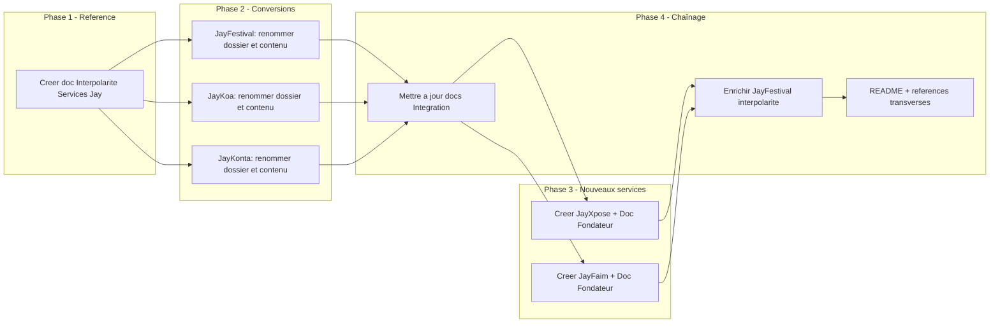

# Plan : Conversions documentation et interpolarité des services Jay

## 1. Objectif et périmètre

- **Conversions** : Renommer dossiers et contenu pour Miyukini Festival Service → **JayFestival**, Miyukini Agenda → **JayKoa**, Miyukini Account → **JayKonta** (service COG avec marques **JayBudget** et **JayKonta**).
- **Nouveaux services** : Créer **JayXpose** (profil exposant / site vitrine, intégré dans JayFestival) et **JayFaim** (réservation/commande nourriture en ligne, couplable à JayFestival), avec documents fondateurs.
- **Plus-value** : Documenter l’**interpolarité** : JayXpose dans JayFestival, JayFaim couplé JayFestival, JayKoa comme intégrateur de tout ce qui manipule des dates (JayRDV, JayFestival, et futurs services).

---

## 2. Conversions de dossiers et fichiers

### 2.1 Miyukini Festival Service → JayFestival

| Action                         | Détail                                                                                                                                                                                                                                       |
| ------------------------------ | -------------------------------------------------------------------------------------------------------------------------------------------------------------------------------------------------------------------------------------------- |
| Renommer le dossier            | [docs/services/MiyukiniFestivalService/](docs/services/MiyukiniFestivalService/) → `docs/services/JayFestival/`                                                                                                                              |
| Renommer le document fondateur | `Miyukini Festival Service - Document Fondateur.md` → `JayFestival - Document Fondateur.md`                                                                                                                                                  |
| Contenu                        | Remplacer "Miyukini Festival Service" par "JayFestival", "MFS" par "JayFestival" (ou conserver "MFS" en abréviation technique si utile dans les schémas d’intégration). Préciser que le **service COG** est JayFestival (marque officielle). |
| Fichiers concernés             | Tous les fichiers du dossier (y compris publics/ et sous-dossiers) : titres, liens internes, références.                                                                                                                                     |
| Liens entrants                 | Mettre à jour tous les liens pointant vers `MiyukiniFestivalService` ou `Miyukini Festival Service` dans [docs/services/](docs/services/), [README.md](README.md), [docs/reference/](docs/reference/) (~45 fichiers d’après grep).           |

### 2.2 Miyukini Agenda → JayKoa

| Action                | Détail                                                                                                                                                                                                                                                                                        |
| --------------------- | --------------------------------------------------------------------------------------------------------------------------------------------------------------------------------------------------------------------------------------------------------------------------------------------- |
| Renommer le dossier   | [docs/services/MiyukiniAgenda/](docs/services/MiyukiniAgenda/) → `docs/services/JayKoa/`                                                                                                                                                                                                      |
| Renommer les fichiers | `Miyukini Agenda - *.md` → `JayKoa - *.md` (Document Fondateur, Ecrans et UI, Parcours Utilisateurs, Bornage Implementation, Operateurs et Toolkits, Audit Documentation et Manques). Dans `reference/` : `JayKoa - Niveaux Securite...`, `JayKoa - Integration Services Consommateurs`, etc. |
| Contenu               | Remplacer "Miyukini Agenda" par "JayKoa". **Renforcer le positionnement** : « JayKoa intègre tout ce qui manipule des dates » — entrées agenda de JayRDV, JayFestival, et tout futur service (formations, interventions, etc.) ; vue calendrier agrégée, conflits, export.                    |
| Liens entrants        | Mettre à jour les liens dans les docs Account, Festival, JayRDV, README, reference (~17+ fichiers).                                                                                                                                                                                           |

### 2.3 Miyukini Account → JayKonta (service COG, marques JayBudget + JayKonta)

| Action                | Détail                                                                                                                                                                                                                                                                                                                                                                                                                                                     |
| --------------------- | ---------------------------------------------------------------------------------------------------------------------------------------------------------------------------------------------------------------------------------------------------------------------------------------------------------------------------------------------------------------------------------------------------------------------------------------------------------- |
| Renommer le dossier   | [docs/services/MiyukiniAccount/](docs/services/MiyukiniAccount/) → `docs/services/JayKonta/`                                                                                                                                                                                                                                                                                                                                                               |
| Renommer les fichiers | `Miyukini Account - Document Fondateur.md` → `JayKonta - Document Fondateur.md` (le document couvre les deux points d’entrée). Référence : `JayKonta - Integration Services.md`, `JayKonta - Niveaux Securite et Protection Donnees.md`, `JayKonta - Points Entree JayBudget et JayKonta.md`.                                                                                                                                                              |
| Contenu               | Remplacer "Miyukini Account" (service COG) par "JayKonta" lorsque l’on désigne le service ; "Miyukini Purse" → **JayBudget** (point d’entrée perso) ; "Miyukini Account" (point d’entrée entreprise) → **JayKonta** (marque entreprise). Conserver la structure publics : `publics/Purse` et `publics/Account` peuvent rester (identifiants internes) en mettant à jour les libellés dans les _index et documents (Purse = JayBudget, Account = JayKonta). |
| Liens entrants        | Mettre à jour tous les liens vers MiyukiniAccount et références à Purse/Account dans les autres services et README.                                                                                                                                                                                                                                                                                                                                        |

---

## 3. Document de référence : Interpolarité des services Jay

Créer un document unique qui fixe la **plus-value interpolarité** :

- **Emplacement** : [docs/reference/](docs/reference/) — par ex. `Miyukini Conceptual References - Interpolarite Services Jay.md` (aligné à la nomenclature et aux autres références conceptuelles).
- **Contenu minimal** :
  - **Principe** : Les services Jay sont conçus pour se coupler ; l’interpolarité est une propriété de conception, pas un ajout a posteriori.
  - **JayXpose ↔ JayFestival** : JayXpose (profil exposant / site vitrine) s’intègre dans JayFestival ; la fiche exposant et le répertoire exposants peuvent s’appuyer sur JayXpose ; un exposant peut avoir une vitrine JayXpose et participer à des éditions JayFestival.
  - **JayFaim ↔ JayFestival** : Les commandes en ligne JayFaim (restauration, food trucks, etc.) peuvent se coupler avec JayFestival (restauration sur événement, créneaux, stands) ; flux commande / créneaux / paiement selon Mandats.
  - **JayKoa, intégrateur des dates** : JayKoa intègre les dates de JayFestival (éditions, participations, ateliers), de JayRDV (RDV, créneaux), et tout service qui manipule des plages temporelles ; vue agenda agrégée, détection de conflits, export. Énoncé explicite : « JayKoa intègre tout ce qui manipule des dates. »
- **Références croisées** : Lien vers les documents fondateurs JayFestival, JayKoa, JayKonta, JayRDV, et vers les futurs JayXpose et JayFaim.

Ce document sera référencé depuis le README (section Services / Documentation) et depuis chaque document fondateur concerné (section Intégration / Interpolarité).

---

## 4. Nouveaux services : structure et documents fondateurs

### 4.1 JayXpose

- **Dossier** : `docs/services/JayXpose/`.
- **Fichiers à créer** :
  - `_index.md` : présentation du service, lien vers le document fondateur et (optionnel) publics.
  - `JayXpose - Document Fondateur.md` : Contexte, Portée, Raison d’être (profil exposant / site vitrine pour artisans, artistes, petites marques), Principes directeurs, **Intégration et interpolarité** (JayXpose s’intègre dans JayFestival ; fiche exposant, répertoire ; vitrine autonome possible), Niveaux de sécurité si pertinent, Prochaines étapes, Références (Glossaire, JayFestival, document Interpolarité).
- **Publics** : optionnel en phase 1 (Exposants, Utilisateur non connecté) ; le fondateur peut suffire pour cadrer l’interop avec JayFestival.

### 4.2 JayFaim

- **Dossier** : `docs/services/JayFaim/`.
- **Fichiers à créer** :
  - `_index.md` : présentation (réservation/commande nourriture en ligne), lien vers le document fondateur.
  - `JayFaim - Document Fondateur.md` : Contexte, Portée, Raison d’être (réservation de tables, commande en ligne, restauration), Principes directeurs, **Intégration et interpolarité** (couplage avec JayFestival : restauration sur événement, créneaux, stands ; consommation de Miyubooking, Miyustore, JayKonta selon besoins), Prochaines étapes, Références (JayFestival, JayKoa si dates, document Interpolarité).
- **Publics** : optionnel en phase 1 (Restaurateurs, Clients, Utilisateur non connecté).

Les deux documents fondateurs suivent le même canevas que [JayRDV - Document Fondateur](docs/services/JayRDV/JayRDV%20-%20Document%20Fondateur.md) et [Miyukini Festival Service - Document Fondateur](docs/services/MiyukiniFestivalService/Miyukini%20Festival%20Service%20-%20Document%20Fondateur.md) (Contexte, Portée, Raison d’être, Principes, Intégration, Références).

---

## 5. Mises à jour en chaîne

### 5.1 Documents « Integration » existants

- [Miyukini Account - Integration Services](docs/services/MiyukiniAccount/reference/Miyukini%20Account%20-%20Integration%20Services.md) : après conversion, devenir `JayKonta - Integration Services.md` ; remplacer "Miyukini Festival Service" par "JayFestival", "Miyukini Agenda" par "JayKoa", "Miyukini Account" par "JayKonta" / "JayBudget" selon le contexte.
- [Miyukini Agenda - Integration Services Consommateurs](docs/services/MiyukiniAgenda/reference/Miyukini%20Agenda%20-%20Integration%20Services%20Consommateurs.md) : après conversion, devenir `JayKoa - Integration Services Consommateurs.md` ; ajouter une phrase explicite : « JayKoa intègre tout ce qui manipule des dates (JayRDV, JayFestival, futurs services). » ; remplacer "MFS" par "JayFestival", "Miyukini Agenda" par "JayKoa".

### 5.2 JayFestival (après renommage)

- Dans le document fondateur JayFestival : ajouter une section **Interpolarité** (ou l’enrichir) : intégration de JayXpose (profil/vitrine exposant), couplage possible avec JayFaim (restauration sur événement), consommation de JayKoa pour toutes les dates (éditions, participations, conflits).
- Mettre à jour les références à "Miyukini Account" / "MFS" dans les publics (Organisateurs, Exposants, Visiteurs) vers JayKonta/JayBudget et JayFestival.

### 5.3 README.md

- Section **Services** (tableau et liste) : remplacer "Miyukini Festival Service" par **JayFestival**, "Miyukini Agenda" par **JayKoa**, "Miyukini Account" / "Miyukini Purse" par **JayKonta** et **JayBudget** (un seul service, deux marques).
- Ajouter **JayXpose** et **JayFaim** dans le tableau avec une courte description et mention de l’interpolarité (JayXpose dans JayFestival, JayFaim couplé JayFestival).
- Ajouter dans **Documentation de référence** un lien vers le document [Interpolarité des services Jay](docs/reference/) (une fois créé).
- Mettre à jour les liens `docs/services/` vers les dossiers renommés (JayFestival, JayKoa, JayKonta).

### 5.4 Références transverses

- [Miyukini Conceptual References - Politique Residence Donnees Sensibles](docs/reference/Miyukini%20Conceptual%20References%20-%20Politique%20Residence%20Donnees%20Sensibles.md) : remplacer les mentions "Miyukini Festival Service", "Miyukini Account", "Miyukini Agenda" par JayFestival, JayKonta/JayBudget, JayKoa si des exemples y font référence.
- Fichiers dans [docs/market/](docs/market/) (ex. Odoo) : si des liens ou libellés pointent vers MFS / Miyukini Account / Miyukini Agenda, les mettre à jour vers JayFestival / JayKonta / JayKoa pour cohérence (à traiter fichier par fichier selon occurrences).

---

## 6. Ordre d’exécution recommandé

1. **Créer le document Interpolarité** pour avoir la source de vérité avant les conversions.
2. **Conversions** : JayFestival, puis JayKoa, puis JayKonta (renommage dossiers + fichiers + contenu).
3. **Mise à jour des documents d’intégration** (JayKonta, JayKoa) et des liens dans les docs déjà convertis.
4. **Créer JayXpose et JayFaim** (dossiers + documents fondateurs) en s’appuyant sur le doc Interpolarité.
5. **Enrichir le document fondateur JayFestival** (section Interpolarité : JayXpose, JayFaim, JayKoa).
6. **README et références transverses** (Politique résidence, market si nécessaire).

---

## 7. Récapitulatif des livrables

| Livrable                                                                        | Type                         |
| ------------------------------------------------------------------------------- | ---------------------------- |
| `docs/reference/Miyukini Conceptual References - Interpolarite Services Jay.md` | Nouveau                      |
| `docs/services/JayFestival/` (ex-MiyukiniFestivalService)                       | Renommé + contenu mis à jour |
| `docs/services/JayKoa/` (ex-MiyukiniAgenda)                                     | Renommé + contenu mis à jour |
| `docs/services/JayKonta/` (ex-MiyukiniAccount)                                  | Renommé + contenu mis à jour |
| `docs/services/JayXpose/_index.md` + `JayXpose - Document Fondateur.md`         | Nouveau                      |
| `docs/services/JayFaim/_index.md` + `JayFaim - Document Fondateur.md`           | Nouveau                      |
| Mise à jour Integration (JayKonta, JayKoa), README, références transverses      | Modifié                      |

**Estimation** : ~58+ fichiers à toucher (renommages, remplacements de texte, liens) ; les plus sensibles sont les chemins relatifs après renommage des dossiers (tous les `../MiyukiniFestivalService/` → `../JayFestival/`, etc.).