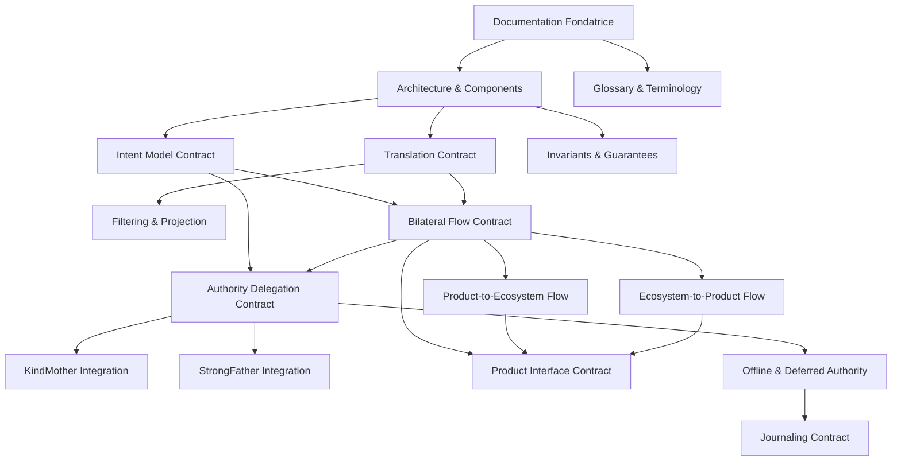

# Documentation Complete de Bonding Brother

## Contexte

Le document fondateur [BondingBrother - Documentation Fondatrice.md](docs/core/BondingBrother/BondingBrother%20-%20Documentation%20Fondatrice.md) est deja present. Il etablit les principes fondamentaux de Bonding Brother en 12 sections. Ce plan vise a creer les documents contractuels et informatifs necessaires pour une documentation complete, comparable a StrongFather (~28 documents).

## Protocole a suivre

Selon le [Protocole d'ecriture de documentation conceptuelle](docs/protocols/Miyukini%20Framework%20-%20Protocole%20Ecriture%20Documentation%20Conceptuelle.md) :

- Cycle en 4 phases : Planification -> Distribution -> Verification -> Gel
- 1 agent = 1 document
- Maximum 4 agents simultanes
- Tests unitaires pour recherche d'incoherences/ambiguites

## Structure documentaire proposee (30 documents)

### Vague 1 : Fondations (prerequis pour tout le reste)

Ces documents etablissent l'architecture de base et doivent etre rediges en premier.

| # | Document | Dependance | Description |

|---|----------|------------|-------------|

| 1 | Documentation Fondatrice | - | EXISTE DEJA |

| 2 | Architecture & Components | #1 | Structure technique, composants internes |

| 3 | Glossary & Terminology | #1 | Vocabulaire canonique etendu (Section 11 du fondateur) |

### Vague 2 : Modele d'Intention et Traduction (coeur fonctionnel)

Ces documents detaillent le mecanisme central de Bonding Brother.

| # | Document | Dependance | Description |

|---|----------|------------|-------------|

| 4 | Intent Model Contract | #2 | Expression, structure et cycle de vie des intentions |

| 5 | Translation Contract | #2 | Regles de traduction intention <-> demande |

| 6 | Filtering & Projection Contract | #2, #5 | Regles de filtrage des resultats |

### Vague 3 : Flux Bilateraux

| # | Document | Dependance | Description |

|---|----------|------------|-------------|

| 7 | Bilateral Flow Contract | #4, #5 | Vue d'ensemble des flux bidirectionnels |

| 8 | Product-to-Ecosystem Flow | #7 | Flux detaille Produit -> Ecosysteme |

| 9 | Ecosystem-to-Product Flow | #7 | Flux detaille Ecosysteme -> Produit |

### Vague 4 : Relations avec les Autorites

| # | Document | Dependance | Description |

|---|----------|------------|-------------|

| 10 | Authority Delegation Contract | #4, #7 | Regles de delegation aux autorites |

| 11 | KindMother Integration Contract | #10 | Interface et protocole avec Kind Mother |

| 12 | StrongFather Integration Contract | #10 | Interface et protocole avec Strong Father |

### Vague 5 : Interface Produit

| # | Document | Dependance | Description |

|---|----------|------------|-------------|

| 13 | Product Interface Contract | #7, #8, #9 | Contrat d'interface stable pour les produits |

| 14 | Product Adaptation Rules | #13 | Regles d'adaptation des produits a BB |

| 15 | Extension & Specialization Contract | #13 | Mecanisme d'extension par specialisation |

### Vague 6 : Offline et Temporalite

| # | Document | Dependance | Description |

|---|----------|------------|-------------|

| 16 | Offline & Deferred Authority Contract | #10 | Mode deconnecte et autorite differee |

| 17 | Journaling Contract | #16 | Journalisation systematique des intentions |

| 18 | Sync & Reconnection Contract | #16, #17 | Synchronisation a la reconnexion |

### Vague 7 : Tracabilite et Responsabilite

| # | Document | Dependance | Description |

|---|----------|------------|-------------|

| 19 | Audit & Traceability Contract | #17 | Auditabilite complete des interactions |

| 20 | Responsibility Model Contract | #19 | Attribution des responsabilites |

### Vague 8 : Invariants et Garanties

| # | Document | Dependance | Description |

|---|----------|------------|-------------|

| 21 | Invariants & Guarantees | #2 | Invariants techniques non negociables |

| 22 | Violations & Anti-Patterns | #21 | Ce que BB ne doit JAMAIS faire |

### Vague 9 : Gestion des Erreurs

| # | Document | Dependance | Description |

|---|----------|------------|-------------|

| 23 | Error & Rejection Model | #4, #10 | Modele de gestion des erreurs et rejets |

### Vague 10 : Securite et Performance

| # | Document | Dependance | Description |

|---|----------|------------|-------------|

| 24 | Security & Threat Model Contract | #10, #21 | Modele de menace et contre-mesures |

| 25 | Performance & Scalability Contract | #7, #16 | Contraintes de performance |

### Vague 11 : Evolution et Maintenance

| # | Document | Dependance | Description |

|---|----------|------------|-------------|

| 26 | Versioning & Evolution Contract | #13, #15 | Regles de versionnement |

| 27 | Migration & Compatibility Contract | #26 | Regles de migration et retrocompatibilite |

### Vague 12 : Reference et Support

| # | Document | Dependance | Description |

|---|----------|------------|-------------|

| 28 | Examples & Use Cases | #7, #13 | Exemples concrets d'utilisation |

| 29 | FAQ & Common Questions | Tous | Questions frequentes |

| 30 | Reference Implementation Guidelines | #2, #21 | Guidelines d'implementation |

| 31 | Testing & Validation Contract | #21, #23 | Contrat de test et validation |

## Dependances critiques



## Ordonnancement propose pour l'execution

Phase 2 du protocole (Distribution) suivra cet ordre :

**Batch 1 (4 agents max)** :

- Architecture & Components
- Glossary & Terminology
- Invariants & Guarantees
- (3 documents en parallele)

**Batch 2 (4 agents max)** :

- Intent Model Contract
- Translation Contract
- Violations & Anti-Patterns
- Error & Rejection Model
- (4 documents en parallele)

**Batch 3 (4 agents max)** :

- Filtering & Projection Contract
- Bilateral Flow Contract
- Authority Delegation Contract
- Product Interface Contract
- (4 documents en parallele)

**Batch 4 (4 agents max)** :

- Product-to-Ecosystem Flow
- Ecosystem-to-Product Flow
- KindMother Integration Contract
- StrongFather Integration Contract
- (4 documents en parallele)

**Batch 5 (4 agents max)** :

- Product Adaptation Rules
- Extension & Specialization Contract
- Offline & Deferred Authority Contract
- Journaling Contract
- (4 documents en parallele)

**Batch 6 (4 agents max)** :

- Sync & Reconnection Contract
- Audit & Traceability Contract
- Responsibility Model Contract
- Security & Threat Model Contract
- (4 documents en parallele)

**Batch 7 (4 agents max)** :

- Performance & Scalability Contract
- Versioning & Evolution Contract
- Migration & Compatibility Contract
- Reference Implementation Guidelines
- (4 documents en parallele)

**Batch 8 (3 agents max)** :

- Examples & Use Cases
- Testing & Validation Contract
- FAQ & Common Questions
- (3 documents en parallele)

## Nomenclature des fichiers

Selon les regles utilisateur, tous les fichiers suivront le format :

```
BondingBrother - <Sujet>.md
```

Emplacement : `docs/core/BondingBrother/`

## Mini log de planification

**Ambiguites detectees** :

- Aucune ambiguite bloquante. Le document fondateur est tres complet.

**Dependances critiques** :

- Architecture & Components est prerequis pour presque tous les autres documents
- Intent Model Contract et Translation Contract sont prerequis pour les flux
- Authority Delegation Contract est prerequis pour les integrations KM/SF

**Decisions structurantes** :

- 30 documents au total (incluant le fondateur existant)
- Organisation en 12 vagues thematiques
- Execution en 8 batches de 3-4 agents simultanes
- Priorite aux documents fondamentaux (Architecture, Glossaire, Invariants)