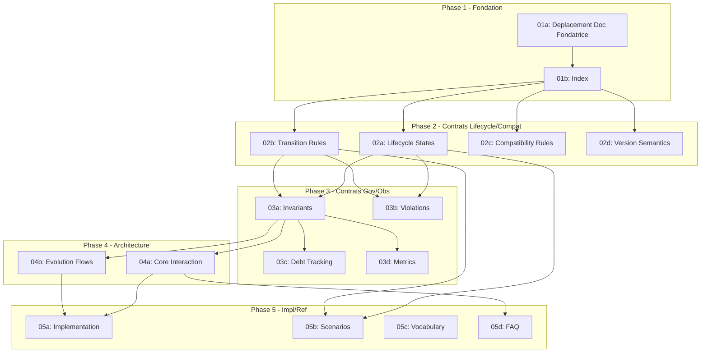

# Plan de Documentation Ever Buddy

## 1. Contexte

Ever Buddy est le **core de cycle de vie et d'évolution** (Strate 4). Il gouverne :

- Les **états de cycle de vie** (DRAFT, ACTIVE, DEPRECATED, RETIRED, ARCHIVED)
- Les **transitions contrôlées** entre états
- Les **règles de compatibilité** et de versionnement
- La **dette structurelle** et sa surveillance
- La **traçabilité** de toutes les évolutions

**Document de base :** [Ever Buddy - Documentation Fondatrice](docs/core/EverBuddy/Ever%20Buddy%20-%20Documentation%20Fondatrice.md) (847 lignes, statut FONDATION)

**Références utilisées :**

- [Glossaire](docs/reference/Miyukini%20Conceptual%20References%20-%20Glossaire.md) - Définitions canoniques
- [Lois Autonomie Systeme](docs/reference/Miyukini%20Conceptual%20References%20-%20Lois%20Autonomie%20Systeme.md) - Conformité LOI-1 a LOI-6
- [Tools et Toolkits](docs/reference/Miyukini%20Conceptual%20References%20-%20Tools%20et%20Toolkits.md) - Cycle de vie des Tools

---

## 2. Structure cible

```
docs/core/EverBuddy/
├── _index.md
├── foundation/
│   └── Ever Buddy - Documentation Fondatrice.md  # A DEPLACER
├── contracts/
│   ├── lifecycle/
│   │   ├── Ever Buddy - Lifecycle States Contract.md
│   │   └── Ever Buddy - Transition Rules Contract.md
│   ├── compatibility/
│   │   ├── Ever Buddy - Compatibility Rules Contract.md
│   │   └── Ever Buddy - Version Semantics Contract.md
│   ├── governance/
│   │   ├── Ever Buddy - Invariants & Guarantees.md
│   │   └── Ever Buddy - Violations & Anti-Patterns.md
│   └── observability/
│       ├── Ever Buddy - Debt Tracking Contract.md
│       └── Ever Buddy - Metrics & Alerting Contract.md
├── architecture/
│   ├── Ever Buddy - Core Interaction Contract.md
│   └── Ever Buddy - Evolution Flows.md
├── implementation/
│   └── Ever Buddy - Reference Implementation Guidelines.md
└── reference/
    ├── Ever Buddy - Evolution Scenarios.md
    ├── Ever Buddy - Vocabulary & Glossary.md
    └── Ever Buddy - FAQ & Common Questions.md
```

---

## 3. Distribution des taches (16 documents)

### [01] - Fondation et Index (sequentiel)


| Tache | Document                                                          | Source                          |
| ----- | ----------------------------------------------------------------- | ------------------------------- |
| 01a   | Deplacement `foundation/Ever Buddy - Documentation Fondatrice.md` | Existant                        |
| 01b   | `_index.md` - Index de navigation                                 | Pattern KindMother/StrongFather |


### [02] - Contrats Lifecycle et Compatibility (parallele - 4 agents)


| Tache | Document                                                               | Contenu                                                       |
| ----- | ---------------------------------------------------------------------- | ------------------------------------------------------------- |
| 02a   | `contracts/lifecycle/Ever Buddy - Lifecycle States Contract.md`        | Section 4 : DRAFT, ACTIVE, DEPRECATED, RETIRED, ARCHIVED      |
| 02b   | `contracts/lifecycle/Ever Buddy - Transition Rules Contract.md`        | Section 4 : Matrice transitions valides, periodes minimales   |
| 02c   | `contracts/compatibility/Ever Buddy - Compatibility Rules Contract.md` | Section 4 : Retrocompatibilite, compatibilite amont, ruptures |
| 02d   | `contracts/compatibility/Ever Buddy - Version Semantics Contract.md`   | Section 4 : Versionnement majeur/mineur/correctif             |


### [03] - Contrats Governance et Observability (parallele - 4 agents)


| Tache | Document                                                              | Contenu                                          |
| ----- | --------------------------------------------------------------------- | ------------------------------------------------ |
| 03a   | `contracts/governance/Ever Buddy - Invariants & Guarantees.md`        | Section 7 : INV-EB-1 a INV-EB-12                 |
| 03b   | `contracts/governance/Ever Buddy - Violations & Anti-Patterns.md`     | Derive des invariants : cas de violations        |
| 03c   | `contracts/observability/Ever Buddy - Debt Tracking Contract.md`      | Section 5 : Surveillance dette structurelle      |
| 03d   | `contracts/observability/Ever Buddy - Metrics & Alerting Contract.md` | Section 8 : Metriques d'etat, transition, alerte |


### [04] - Architecture (parallele - 2 agents)


| Tache | Document                                                 | Contenu                                                           |
| ----- | -------------------------------------------------------- | ----------------------------------------------------------------- |
| 04a   | `architecture/Ever Buddy - Core Interaction Contract.md` | Section 3 + 8 : Relations avec tous les cores                     |
| 04b   | `architecture/Ever Buddy - Evolution Flows.md`           | Section 8 : Flux observation, consultation, planification, alerte |


### [05] - Implementation et Reference (parallele - 4 agents)


| Tache | Document                                                             | Contenu                           |
| ----- | -------------------------------------------------------------------- | --------------------------------- |
| 05a   | `implementation/Ever Buddy - Reference Implementation Guidelines.md` | Guidelines depuis Section 11      |
| 05b   | `reference/Ever Buddy - Evolution Scenarios.md`                      | Section 10 : 5 scenarios types    |
| 05c   | `reference/Ever Buddy - Vocabulary & Glossary.md`                    | Section 9 : Vocabulaire canonique |
| 05d   | `reference/Ever Buddy - FAQ & Common Questions.md`                   | Questions frequentes derivees     |


---

## 4. Dependances critiques




**Regles :**

- Phase 1 est sequentielle (01a puis 01b)
- Phases 2-5 peuvent etre paralleles a l'interieur de chaque phase
- Chaque phase depend de la completion de la phase precedente

---

## 5. Parametres de generation

```
COMPLEXITE : Complexe
CHARGE CONTEXTUELLE : Elevee
MODELE AUTORISE : Cursor Auto (Mode 2/3) ou 1 modele premium
MODE IA ACTIF : AI Mode 1 ou 2
```

**Contraintes par document :**

- Chaque document doit referencer la Documentation Fondatrice
- Chaque document doit inclure les references croisees vers le Glossaire
- Format : H1 titre, section Contexte, section Portee/Scope
- Pas d'anticipation des etapes suivantes

---

## 6. Verification et tests

A chaque document :

- Verification de coherence avec la Documentation Fondatrice
- Verification des references croisees
- Detection des ambiguites ou contradictions
- Validation de la conformite aux Lois d'Autonomie

**Audit final :**

- Coherence inter-documents
- Completude par rapport a la Documentation Fondatrice
- Conformite au protocole

