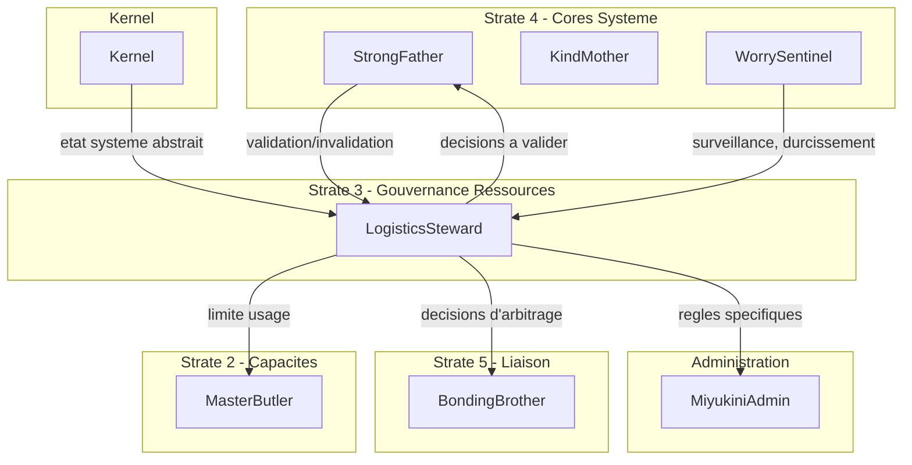

# Documentation Complete du Core LogisticsSteward

## Contexte

LogisticsSteward est le core responsable de la **gouvernance de l'allocation, de la priorisation et de la limitation des ressources**. Il arbitre l'usage des ressources selon des regles explicites sans jamais les controler techniquement (separation stricte avec le Kernel).

**Question fondamentale :** "Qui a le droit d'utiliser quoi, quand, et a quel niveau de priorite ?"

---

## Phase 1 : Documentation de LogisticsSteward

### 1.1 Reorganisation de la structure

Deplacer le fichier existant et creer l'arborescence standard :

```
docs/core/LogisticsSteward/
  _index.md                                    [CREER]
  foundation/
    LogisticsSteward - Documentation Fondatrice.md  [DEPLACER]
  architecture/
    LogisticsSteward - Architecture & Flows.md      [CREER]
    LogisticsSteward - Core Interaction Contract.md [CREER]
  contracts/
    resources/
      LogisticsSteward - Quota Definition Contract.md       [CREER]
      LogisticsSteward - Priority Management Contract.md    [CREER]
      LogisticsSteward - Resource Arbitration Contract.md   [CREER]
    degradation/
      LogisticsSteward - Degradation Strategy Contract.md   [CREER]
    governance/
      LogisticsSteward - Invariants & Guarantees.md         [CREER]
      LogisticsSteward - Violations & Anti-Patterns.md      [CREER]
    integration/
      LogisticsSteward - Kernel Integration Contract.md     [CREER]
      LogisticsSteward - StrongFather Integration Contract.md [CREER]
      LogisticsSteward - MasterButler Integration Contract.md [CREER]
      LogisticsSteward - WorrySentinel Integration Contract.md [CREER]
      LogisticsSteward - BondingBrother Integration Contract.md [CREER]
    security/
      LogisticsSteward - Threat Model Contract.md           [CREER]
  implementation/
    LogisticsSteward - Reference Implementation Guidelines.md [CREER]
  reference/
    LogisticsSteward - Vocabulary & Glossary.md             [CREER]
    LogisticsSteward - FAQ & Common Questions.md            [CREER]
    LogisticsSteward - Examples & Use Cases.md              [CREER]
```

### 1.2 Documents a rediger (19 fichiers)

**Priorite 1 - Foundation et Index :**

- `_index.md` : Navigation, invariants cles, relations avec les autres cores
- `foundation/LogisticsSteward - Documentation Fondatrice.md` : Enrichir le brouillon existant

**Priorite 2 - Contrats Resources (coeur metier) :**

- `Quota Definition Contract.md` : Definition formelle des quotas, types, regles d'attribution
- `Priority Management Contract.md` : Niveaux de priorite, regles de preemption
- `Resource Arbitration Contract.md` : Processus d'arbitrage, entrees/sorties

**Priorite 3 - Architecture :**

- `Architecture & Flows.md` : Composants conceptuels, flux d'arbitrage
- `Core Interaction Contract.md` : Modele d'interaction avec les autres cores

**Priorite 4 - Contrats Integration (6 cores) :**

- `Kernel Integration Contract.md` : Etat systeme abstrait, lecture seule
- `StrongFather Integration Contract.md` : Validation des arbitrages
- `MasterButler Integration Contract.md` : Limitation des capacites
- `WorrySentinel Integration Contract.md` : Surveillance et durcissement
- `BondingBrother Integration Contract.md` : Transport des decisions
- (MiyukiniAdmin : traite dans Phase 2)

**Priorite 5 - Gouvernance et Securite :**

- `Invariants & Guarantees.md` : INV-LS-1 a INV-LS-N
- `Violations & Anti-Patterns.md` : Violations cataloguees
- `Degradation Strategy Contract.md` : Logique de degradation controlee
- `Threat Model Contract.md` : Menaces sur l'arbitrage

**Priorite 6 - Implementation et Reference :**

- `Reference Implementation Guidelines.md`
- `Vocabulary & Glossary.md`
- `FAQ & Common Questions.md`
- `Examples & Use Cases.md`

---

## Phase 2 : Adaptation des autres cores

### 2.1 StrongFather

**Fichiers a modifier :**

- [docs/core/StrongFather/_index.md](docs/core/StrongFather/_index.md) : Ajouter relation LogisticsSteward dans le tableau "Relations avec les autres Cores"

**Fichier a creer :**

- `docs/core/StrongFather/contracts/integration/StrongFather - LogisticsSteward Integration Contract.md`

**Nature de la relation :** StrongFather valide/invalide les decisions d'arbitrage de LogisticsSteward, tranche en cas de conflit de regles.

### 2.2 MasterButler

**Fichiers a modifier :**

- [docs/core/MasterButler/_index.md](docs/core/MasterButler/_index.md) : Ajouter relation LogisticsSteward

**Fichier a creer :**

- `docs/core/MasterButler/contracts/integration/Master Butler - LogisticsSteward Integration Contract.md`

**Nature de la relation :** MasterButler expose les capacites, LogisticsSteward limite leur usage (pas leur existence).

### 2.3 BondingBrother

**Fichiers a modifier :**

- `docs/core/BondingBrother/architecture/BondingBrother - Core Interaction Contract.md` : Ajouter LogisticsSteward

**Fichier a creer :**

- `docs/core/BondingBrother/contracts/integration/BondingBrother - LogisticsSteward Integration Contract.md`

**Nature de la relation :** BondingBrother transporte les decisions d'arbitrage sans les interpreter.

### 2.4 WorrySentinel

**Fichiers a modifier :**

- [docs/core/WorrySentinel/WorrySentinel - Documentation Fondatrice.md](docs/core/WorrySentinel/WorrySentinel - Documentation Fondatrice.md) : Ajouter section relation avec LogisticsSteward

**Nature de la relation :** WorrySentinel peut invalider un etat systeme juge incoherent, declencher durcissement des regles, superviser derives.

### 2.5 Kernel

**Fichiers a modifier :**

- [docs/kernel/_index.md](docs/kernel/_index.md) : Ajouter relation LogisticsSteward

**Nature de la relation :** Kernel fournit l'etat systeme abstrait (lecture seule), execute les arbitrages decides.

### 2.6 MiyukiniAdmin

**Fichiers a modifier :**

- [docs/core/MiyukiniAdmin/_index.md](docs/core/MiyukiniAdmin/_index.md) : Ajouter relation LogisticsSteward

**Fichier a creer :**

- `docs/core/MiyukiniAdmin/contracts/integration/MiyukiniAdmin - LogisticsSteward Integration Contract.md`

**Nature de la relation :** MiyukiniAdmin peut obtenir priorites maximales, soumis a gouvernance globale sauf protocole d'exception.

---

## Phase 3 : Verification et coherence

- Audit des references croisees entre tous les documents modifies
- Verification de coherence des invariants
- Validation de la nomenclature (respect des regles utilisateur)

---

## Phase 4 : Gel et versionnement

- `LogisticsSteward - Audit Phase 3 Verification.md`
- `LogisticsSteward - Gel et Versionnement v1.0.0.md`

---

## Diagramme de relations LogisticsSteward




---

## Estimation de volume

- **Phase 1 :** 19 documents a creer/enrichir
- **Phase 2 :** 6 cores a adapter (6 index + 5 contrats d'integration)
- **Phase 3 :** 1 rapport d'audit
- **Phase 4 :** 2 documents de gel

**Total :** ~32 fichiers markdown