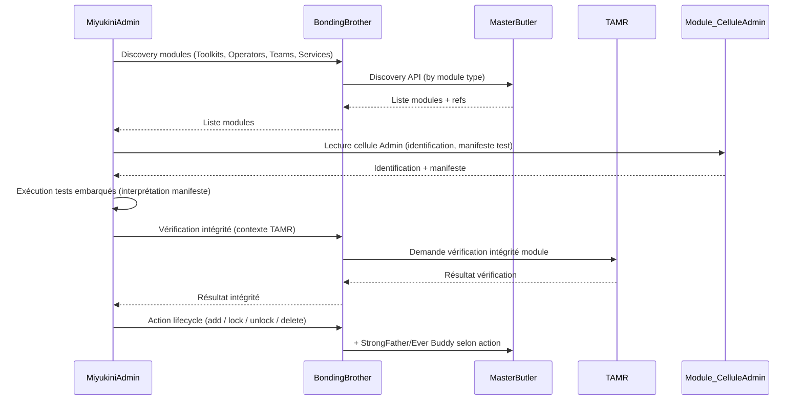

# Plan — Documentation MiyukiniAdmin : Tests des modules et cycle de vie

## Contexte et objectif

Vous souhaitez documenter une nouvelle fonctionnalité MiyukiniAdmin qui permet de :

1. **Tester** les composants des strates au-dessus : Kits d'outils, Opérateurs, Équipes d'opérateurs, Services — chaque module embarque ses propres protocoles de tests ; seul MiyukiniAdmin peut les exécuter et interpréter le manifeste de test embarqué.
2. **Identifier les modules présents** via Master Butler et localiser la **cellule du module destinée à MiyukiniAdmin** (identification, manifeste de test, intégrité).
3. **Vérifier l'intégrité** des modules en collaboration avec les cores (champ d'action TAMR).
4. **Gérer le cycle de vie** des modules : ajouter, verrouiller/déverrouiller, supprimer un module — exclusivement via MiyukiniAdmin.

La rédaction doit suivre le [Protocole d'écriture documentation conceptuelle](docs/protocols/Miyukini%20Prompt%20Protocol%20-%20Ecriture%20Documentation%20Conceptuelle.md) : planification, 1 agent = 1 document, nomenclature des tâches [xx] - [document à produire], pas de fusion de documents.

---

## Éléments de référence identifiés

| Référence                                                                                                                                                | Usage dans le plan                                                                           |
| -------------------------------------------------------------------------------------------------------------------------------------------------------- | -------------------------------------------------------------------------------------------- |
| [MiyukiniAdmin - Documentation Fondatrice](docs/core/MiyukiniAdmin/foundation/MiyukiniAdmin%20-%20Documentation%20Fondatrice.md)                         | Périmètre fonctionnel à étendre (tests des modules, cellule Admin, lifecycle).               |
| [MiyukiniAdmin - Cycle Tests Contract](docs/core/MiyukiniAdmin/contracts/testing/MiyukiniAdmin%20-%20Cycle%20Tests%20Contract.md)                        | Tests système (performance, charge) ; à distinguer des tests embarqués par module.           |
| [MiyukiniAdmin - Unit Tests Contract](docs/core/MiyukiniAdmin/contracts/testing/MiyukiniAdmin%20-%20Unit%20Tests%20Contract.md)                          | Tests DB/conformité ; à distinguer des tests de modules.                                     |
| [Master Butler - Discovery API Contract](docs/core/MasterButler/contracts/api/Master%20Butler%20-%20Discovery%20API%20Contract.md)                       | Découverte des modules (capacités, par module) ; MiyukiniAdmin interroge via BondingBrother. |
| [Master Butler - Operator Declaration Contract](docs/core/MasterButler/contracts/integration/Master%20Butler%20-%20Operator%20Declaration%20Contract.md) | Déclaration des capacités/modules ; cohérence avec la cellule Admin.                         |
| [TAMR - Intervention Types Contract](docs/core/TAMR/contracts/intervention/TAMR%20-%20Intervention%20Types%20Contract.md)                                | Champ d'action TAMR pour intégrité et interventions humaines.                                |
| [TAMR - Inviolable Limits / intégrité](docs/core/TAMR/contracts/governance/TAMR%20-%20Invariants%20&%20Guarantees.md)                                    | Intégrité système ; collaboration MiyukiniAdmin–TAMR.                                        |
| [Miyukini Conceptual References - Tools et Toolkits](docs/reference/Miyukini%20Conceptual%20References%20-%20Tools%20et%20Toolkits.md)                   | Manifeste Kit d'outils ; base pour étendre au manifeste de test et cellule Admin.            |
| [MiyukiniAdmin - Core Interaction Contract](docs/core/MiyukiniAdmin/architecture/MiyukiniAdmin%20-%20Core%20Interaction%20Contract.md)                   | Accès aux cores uniquement via BondingBrother.                                               |

---

## Concept clé : Cellule Admin (cellule du module destinée à MiyukiniAdmin)

À définir dans le nouveau contrat :

- **Définition** : Surface qu’un module (Kit d’outils, Opérateur, Équipe d’opérateurs, Service) expose **uniquement** à MiyukiniAdmin. Elle n’est pas consommée par les autres Opérateurs.
- **Contenu minimal** :
  - **Identification du module** : id, version, type (toolkit / operator / team / service), origine.
  - **Manifeste de test embarqué** : liste des tests que le module déclare, protocole d’exécution (comment MiyukiniAdmin invoque les tests), format des résultats.
  - **Métadonnées d’intégrité** : informations permettant à MiyukiniAdmin + cores (dont TAMR) de vérifier l’intégrité (empreinte, contrats, versions).
- **Règle** : Seul MiyukiniAdmin peut lire et utiliser la cellule Admin ; seul MiyukiniAdmin peut exécuter et interpréter les tests du manifeste embarqué.

---

## Flux cible (à documenter)

---

## Documents à créer ou à mettre à jour

### 1. Nouveau contrat principal (1 document)

**Fichier** : `docs/core/MiyukiniAdmin/contracts/testing/MiyukiniAdmin - Module Testing and Lifecycle Contract.md`

**Contenu à couvrir** :

- **Contexte et portée** : tests des outils et strates au-dessus ; cellule Admin ; lifecycle des modules ; exclusivité MiyukiniAdmin.
- **Définition de la Cellule Admin** : rôle, contenu obligatoire (identification, manifeste de test, métadonnées d’intégrité), format déclaratif (ex. YAML/JSON), règles d’exclusivité.
- **Identification des modules** : usage de Master Butler via BondingBrother (référence Discovery API) pour lister Kits d’outils, Opérateurs, Équipes d’opérateurs, Services ; comment MiyukiniAdmin obtient pour chaque module la référence vers sa cellule Admin.
- **Manifeste de test embarqué** : structure (liste de tests, protocole d’exécution, critères de succès/échec) ; règles d’exécution par MiyukiniAdmin ; environnement de diagnostic ; pas d’exécution par d’autres composants.
- **Vérification d’intégrité** : collaboration avec les cores, en particulier **TAMR** (champ d’action : intégrité, interventions humaines) ; flux MiyukiniAdmin → BondingBrother → TAMR ; invariants (pas de modification des données métier, traçabilité).
- **Cycle de vie des modules** :
  - **Ajout** : conditions (StrongFather, Ever Buddy si compatibilité), enregistrement Master Butler, traçabilité.
  - **Verrouillage / déverrouillage** : sémantique (blocage d’usage sans suppression), autorité StrongFather, notification CaringNanny/WorrySentinel si pertinent.
  - **Suppression** : conditions (validation StrongFather, éventuellement TAMR), retrait du registre, nettoyage contrôlé.
- **Invariants et interdictions** : ex. seul MiyukiniAdmin exécute les tests embarqués ; toute action lifecycle passe par BondingBrother ; pas de bypass des cores.
- **Références croisées** : Master Butler Discovery API, Operator Declaration, TAMR Intervention Types / Inviolable Limits, Cycle Tests Contract (distinction), Unit Tests Contract (distinction), Documentation Fondatrice.

**Nomenclature tâche** : `[01] - MiyukiniAdmin - Module Testing and Lifecycle Contract`

---

### 2. Mise à jour de la Documentation Fondatrice

**Fichier** : [docs/core/MiyukiniAdmin/foundation/MiyukiniAdmin - Documentation Fondatrice.md](docs/core/MiyukiniAdmin/foundation/MiyukiniAdmin%20-%20Documentation%20Fondatrice.md)

**Modifications** :

- **Section 6 (Périmètre fonctionnel)** : ajouter un sous-bloc « Tests des modules et cycle de vie » (ou l’intégrer dans « Tests Techniques » en le précisant) décrivant :
  - Tests des Kits d’outils, Opérateurs, Équipes d’opérateurs, Services via manifeste embarqué.
  - Rôle de la cellule Admin et exclusivité MiyukiniAdmin.
  - Identification des modules via Master Butler (via BondingBrother).
  - Vérification d’intégrité en collaboration avec les cores (TAMR).
  - Actions admin : ajout, verrouillage/déverrouillage, suppression de modules.
- **Relations avec les cores** : mentionner explicitement l’usage de **Master Butler** pour la découverte des modules (et TAMR pour l’intégrité) si ce n’est pas déjà clair.

**Nomenclature tâche** : `[02] - MiyukiniAdmin - Documentation Fondatrice (extension périmètre)`

---

### 3. Mise à jour de l’index MiyukiniAdmin

**Fichier** : [docs/core/MiyukiniAdmin/_index.md](docs/core/MiyukiniAdmin/_index.md)

**Modifications** :

- Dans **Contracts > Testing**, ajouter une ligne vers le nouveau contrat : `MiyukiniAdmin - Module Testing and Lifecycle Contract`.
- Dans **Périmètre fonctionnel** (tableau), ajouter ou compléter la ligne « Tests des modules et cycle de vie » avec référence au nouveau contrat.
- Dans **Relations avec les Cores**, ajouter **Master Butler** (découverte des modules) et **TAMR** (intégrité / champ d’action) si absents.

**Nomenclature tâche** : `[03] - MiyukiniAdmin _index (liens et périmètre)`

---

## Option non retenue (pour éviter surcharge)

- **MiyukiniAdmin - Master Butler Integration Contract** : ne pas créer un contrat d’intégration dédié pour l’instant ; le **Core Interaction Contract** impose déjà le passage par BondingBrother pour tous les cores (dont Master Butler). Le nouveau contrat de tests/lifecycle référence directement le **Master Butler - Discovery API Contract** pour la découverte des modules.

---

## Ordre d’exécution recommandé

1. **[01]** Rédiger `MiyukiniAdmin - Module Testing and Lifecycle Contract.md`** (document fondateur de la fonctionnalité).
2. **[02]** Mettre à jour la Documentation Fondatrice (périmètre + relations cores).
3. **[03]** Mettre à jour `_index.md` (liens et périmètre).

Les tâches [02] et [03] peuvent être traitées en parallèle après [01].

---

## Contraintes du protocole

- Un agent = un document : pas de rédaction de plusieurs fichiers dans une même tâche.
- Nomenclature : `[xx] - [nom du document à produire]`.
- Dépendances explicites : [02] et [03] dépendent du contenu stabilisé de [01] pour les libellés et les références.
- Conformité glossaire et terminologie : Kit d’outils, Opérateur, Équipe d’opérateurs, Service, Master Butler, TAMR, BondingBrother — selon [Miyukini Conceptual References - Glossaire](docs/reference/Miyukini%20Conceptual%20References%20-%20Glossaire.md).

---

## Résumé

| Livrable                          | Fichier                                                                      | Action                            |
| --------------------------------- | ---------------------------------------------------------------------------- | --------------------------------- |
| Contrat tests modules + lifecycle | `contracts/testing/MiyukiniAdmin - Module Testing and Lifecycle Contract.md` | Créer                             |
| Documentation Fondatrice          | `foundation/MiyukiniAdmin - Documentation Fondatrice.md`                     | Étendre (périmètre, cores)        |
| Index                             | `_index.md`                                                                  | Étendre (liens, périmètre, cores) |

La fonctionnalité « tests des outils et strates au-dessus + cellule Admin + intégrité TAMR + lifecycle modules » est entièrement couverte par le nouveau contrat et les mises à jour ciblées, sans créer de contrat d’intégration MiyukiniAdmin–Master Butler séparé.