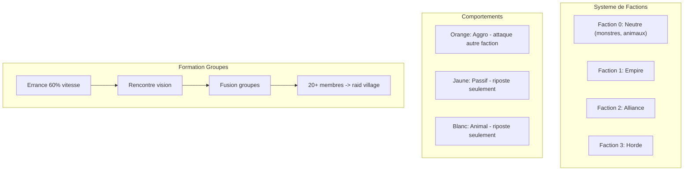
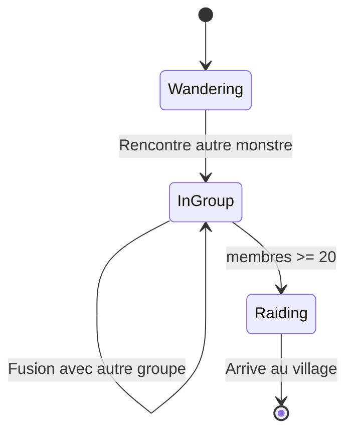

# Systeme de factions, groupes et combat AOE

## Vue d'ensemble




## 1. Nouveau module `faction.rs`

```rust
#[derive(Debug, Clone, Copy, PartialEq, Eq, Hash)]
pub enum Faction {
    Neutral = 0,  // Monstres, animaux
    Empire = 1,
    Alliance = 2,
    Horde = 3,
}

#[derive(Debug, Clone, Copy, PartialEq, Eq)]
pub enum AggroBehavior {
    Aggressive,  // Orange - attaque autre faction en vision
    Passive,     // Jaune - riposte si attaque
    Neutral,     // Blanc - animal, riposte si attaque
}

impl Faction {
    pub fn is_hostile_to(&self, other: &Faction) -> bool {
        *self != Faction::Neutral && *other != Faction::Neutral && *self != *other
    }
}
```

## 2. Modification de `Entity` dans [entity.rs](demos/mge-pathfinding-labyrinthe/src/entity.rs)

Ajouter les champs :

- `faction: Faction`
- `aggro_behavior: AggroBehavior`
- `group_id: Option<u32>` -- ID du groupe
- `aggressor: Option<usize>` -- qui m'a attaque (pour riposte)
- `is_obstacle: bool` -- monstres bloquent le joueur

## 3. Auto-attaque AOE du joueur

Dans [main.rs](demos/mge-pathfinding-labyrinthe/src/main.rs) :

- Rayon : 20 px autour du joueur
- Degats : 1-4
- Cooldown : 1 seconde
- Cibles : toutes les entites hostiles dans le rayon
- Le joueur peut toujours se deplacer (pas d'immobilisation)

```rust
const PLAYER_AOE_RADIUS: f32 = 20.0;
const PLAYER_AOE_COOLDOWN: f32 = 1.0;

fn player_aoe_attack(player: &mut Entity, enemies: &mut [Entity], dt: f32) -> Vec<AttackResult> {
    // Attaque toutes les cibles dans le rayon
}
```

## 4. Balise de ralliement (clic droit)

Nouveau struct dans `rally.rs` :

```rust
pub struct RallyPoint {
    pub position: Vec2,
    pub timer: f32,  // 2.5 secondes
}
```

- Clic droit place la balise
- Tous les followers se dirigent vers la balise
- Duree : 2.5 secondes puis disparait
- Rendu : cercle vert clignotant

## 5. Monstres comme obstacles

Dans la boucle de collision du joueur :

- Les monstres vivants bloquent le mouvement du joueur (comme les murs)
- Utiliser collision AABB pour empecher le passage

## 6. Zones de spawn (refonte de `SpawnPoint`)

Remplacer `SpawnPoint` par `SpawnZone` dans [chunk.rs](demos/mge-pathfinding-labyrinthe/src/chunk.rs) :

```rust
pub struct SpawnZone {
    pub rect: Rect,  // Rectangle local au chunk
    pub creature_type: CreatureType,
    pub aggro: AggroBehavior,
    pub max_count: u32,  // 20-40
    pub current_count: u32,
    pub spawn_interval: f32,
}

pub struct Rect {
    pub x1: i32, pub y1: i32,
    pub x2: i32, pub y2: i32,
}
```

Plusieurs zones par chunk, spawn aleatoire dans la zone jusqu'au max.

## 7. Nouveau module `group.rs` - Formation de groupes

```rust
pub struct MonsterGroup {
    pub id: u32,
    pub leader_idx: usize,
    pub members: Vec<usize>,  // indices dans enemies[]
    pub formation_radius: f32,  // ~100 px
}

pub struct GroupManager {
    pub groups: HashMap<u32, MonsterGroup>,
    next_id: u32,
}
```

### Logique de formation :

1. **Errance** : Monstres se deplacent a 60% de leur vitesse dans leur zone
2. **Rencontre** : Quand un monstre entre dans le champ de vision d'un autre (150px), ils forment un groupe
3. **Chef** : Aleatoire entre les 2 premiers
4. **Maillage** : Membres restent dans un rayon de ~100px autour du chef
5. **Fusion** : Si 2 groupes se croisent, le plus gros absorbe l'autre
6. **Raid** : Si groupe >= 20 membres, ils marchent vers le village (chunk 1,1)




## 8. Modification du rendu dans [render.rs](demos/mge-pathfinding-labyrinthe/src/render.rs)

Couleurs par comportement :

- `COLOR_AGGRO: u32 = 0xFF_E8_95_30` -- Orange (agressif)
- `COLOR_PASSIVE: u32 = 0xFF_E8_E8_30` -- Jaune (passif)
- `COLOR_NEUTRAL: u32 = 0xFF_E8_E8_E8` -- Blanc (animal)

Rendu balise de ralliement : cercle vert pulsant

## 9. Fichiers a creer/modifier


| Fichier         | Action                                              |
| --------------- | --------------------------------------------------- |
| `faction.rs`    | Nouveau - Faction, AggroBehavior                    |
| `rally.rs`      | Nouveau - RallyPoint                                |
| `group.rs`      | Nouveau - MonsterGroup, GroupManager                |
| `spawn_zone.rs` | Nouveau - SpawnZone, logique de spawn               |
| `entity.rs`     | Modifier - ajouter faction, group_id, aggressor     |
| `chunk.rs`      | Modifier - remplacer SpawnPoint par SpawnZone       |
| `chunk_data.rs` | Modifier - definir zones de spawn par chunk         |
| `main.rs`       | Modifier - AOE, balise, collision monstres, groupes |
| `render.rs`     | Modifier - couleurs par comportement, balise        |
| `invocation.rs` | Modifier - ajouter faction Empire                   |


## 10. Exemple de chunk_data avec zones de spawn

```rust
// Chunk foret (0,0)
spawn_zones: vec![
    SpawnZone {
        rect: Rect { x1: 10, y1: 10, x2: 30, y2: 30 },
        creature_type: CreatureType::Wolf,
        aggro: AggroBehavior::Neutral,  // Animal blanc
        max_count: 25,
        ..
    },
    SpawnZone {
        rect: Rect { x1: 40, y1: 40, x2: 60, y2: 60 },
        creature_type: CreatureType::Skeleton,
        aggro: AggroBehavior::Aggressive,  // Orange
        max_count: 30,
        ..
    },
],
```

