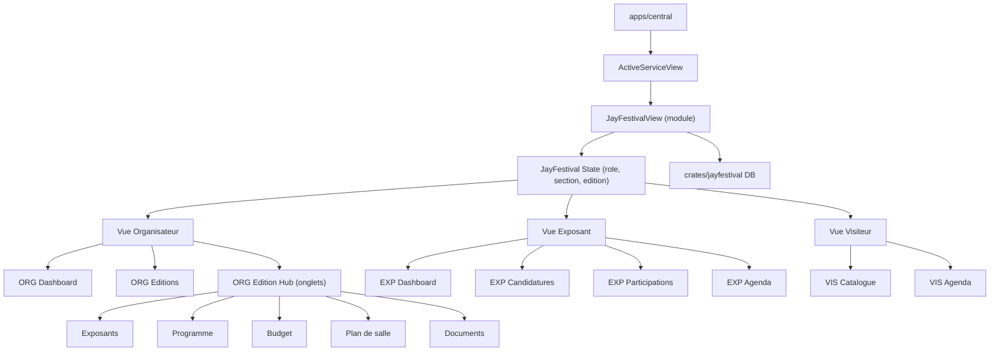

# Implementer JayFestival accessible depuis Central

## Etat actuel

- **Frontend** : `apps/central/src/services/jayfestival_view.rs` - vue minimale (163 lignes) avec liste d'editions et bouton "Nouvelle edition"
- **Backend** : `crates/jayfestival/` - types (Edition, Exposant, Organisateur, EditionExposant, Profile), DB SQLite avec CRUD de base, auth, service adapters (jaykoa, jaykonta, miyunotify, miyubooking)
- **Schema DB** : 5 tables (profiles, editions, organisateurs, exposants, editions_exposants) - manquent les tables programme, budget, documents
- **Pattern existant** : JayXpose montre le pattern Dioxus (sidebar + sections + donnees DB reelles + Signal state)

## Architecture cible




## Partie 1 — Etendre le backend (crates/jayfestival)

### 1.1 Nouveaux types dans [crates/jayfestival/src/data/types.rs](crates/jayfestival/src/data/types.rs)

Ajouter :

- `Animation` : id, edition_id, name, animation_type, start_time, end_time, room, description, status
- `BudgetEntry` : id, edition_id, label, category, amount, entry_type (revenue/depense), date, notes
- `Candidature` : enrichissement via `EditionExposant` existant + ajout champs `candidature_date`, `motif_refus`, `status_candidature`

### 1.2 Nouvelles methodes dans [crates/jayfestival/src/data/kindmother_db.rs](crates/jayfestival/src/data/kindmother_db.rs)

Etendre le schema avec les tables `animations` et `budget_entries`, et des colonnes additionnelles sur `editions_exposants`. Ajouter les methodes CRUD :

- `edition_create`, `edition_update`
- `exposant_create`
- `editions_exposants_create`, `editions_exposants_update_status`
- `animations_by_edition`, `animation_create`, `animation_delete`
- `budget_entries_by_edition`, `budget_entry_create`, `budget_summary`

## Partie 2 — Restructurer la vue JayFestival (apps/central)

### 2.1 Convertir le fichier unique en module

Remplacer `apps/central/src/services/jayfestival_view.rs` par un repertoire module :

```
apps/central/src/services/jayfestival/
  mod.rs              -- JayFestivalView (composant racine), state, routing
  sidebar.rs          -- Sidebar avec navigation par role
  components.rs       -- Composants partages (StatCard, TabButton, Badge, EmptyState, etc.)
  org_dashboard.rs    -- ORG-E04 Tableau de bord organisateur
  org_editions.rs     -- ORG-E05 Liste editions + ORG-E06 Creation
  org_edition_hub.rs  -- ORG-E07 Dashboard edition (hub avec onglets)
  org_exposants.rs    -- ORG-E09/E10/E11 Exposants + Candidatures + Fiche
  org_programme.rs    -- ORG-E17a/b Programme + Animations
  org_budget.rs       -- ORG-E19 Budget (revenus, depenses, balance)
  org_plan.rs         -- ORG-E14 Plan de salle (placeholder interactif)
  exp_dashboard.rs    -- EXP-E04 Dashboard exposant
  exp_candidatures.rs -- EXP-E05/E08/E10 Candidatures + Annuaire
  vis_catalogue.rs    -- VIS Catalogue evenements + agenda
```

### 2.2 Mettre a jour [apps/central/src/services/mod.rs](apps/central/src/services/mod.rs)

Changer `mod jayfestival_view` en `mod jayfestival` et `pub use jayfestival::JayFestivalView`.

## Partie 3 — State management JayFestival

Dans `jayfestival/mod.rs`, un state local via Signal Dioxus :

```rust
enum JayFestivalRole { Organisateur, Exposant, Visiteur }
enum OrgSection { Dashboard, Editions, EditionHub, Compte }
enum OrgEditionTab { Overview, Exposants, Programme, Budget, Plan, Documents, Publish }
struct JayFestivalState {
    role: JayFestivalRole,
    org_section: OrgSection,
    selected_edition_id: Option<String>,
    edition_tab: OrgEditionTab,
    exp_section: ExpSection,
    vis_section: VisSection,
}
```

Le composant racine `JayFestivalView` :

1. Lit les donnees DB via `use_service_connections().read().jayfestival`
2. Gere le state local via `use_signal(|| JayFestivalState::default())`
3. Affiche Sidebar + Contenu selon le role/section actifs

## Partie 4 — Ecrans Organisateur (priorite haute)

### ORG Dashboard (org_dashboard.rs)

- Stats reelles : nb editions, nb exposants total, candidatures en attente, budget global
- Editions recentes (cartes cliquables)
- Bouton "Creer une edition"

### ORG Editions (org_editions.rs)

- Liste filtrable (statut, recherche)
- Formulaire de creation (modal ou inline) avec appel `edition_create`
- Clic sur une edition -> ouvre le hub edition

### ORG Edition Hub (org_edition_hub.rs)

- Navigation par onglets (Vue d'ensemble / Exposants / Programme / Budget / Plan / Documents / Publier)
- Indicateurs synthetiques par onglet
- Charge les donnees de l'edition selectionnee

### ORG Exposants (org_exposants.rs)

- Liste des exposants de l'edition (depuis editions_exposants JOIN exposants)
- Section candidatures avec actions Valider/Refuser
- Fiche exposant (detail avec statut, stand, historique)

### ORG Programme (org_programme.rs)

- Liste d'animations par jour/salle
- Formulaire d'ajout (nom, type, horaires, salle)
- Suppression

### ORG Budget (org_budget.rs)

- Saisie revenus/depenses
- Ventilation par categorie
- Balance (revenus - depenses)

### ORG Plan (org_plan.rs)

- Placeholder avec grille ASCII-like
- Legende (attribue/reserve/libre)
- Attribution manuelle (select exposant -> stand)

## Partie 5 — Ecrans Exposant (priorite moyenne)

### EXP Dashboard (exp_dashboard.rs)

- Candidatures en attente + participations validees
- Prochain evenement
- Alertes (document a signer, facture a payer)

### EXP Candidatures (exp_candidatures.rs)

- Annuaire des evenements ouverts
- Depot candidature (formulaire)
- Suivi des candidatures (statut)

## Partie 6 — Ecrans Visiteur (priorite basse)

### VIS Catalogue (vis_catalogue.rs)

- Liste des editions publiees avec filtres
- Fiche evenement (programme public, exposants)
- Bouton "Ajouter a mon agenda"

## Decisions techniques

- **Pas de nouvelle dependance** : tout utilise Dioxus 0.6, le theme existant, et JayFestivalDb
- **Donnees reelles** : toutes les vues lisent depuis la DB via `conns.read().jayfestival`
- **Mutations** : les creations/modifications passent par de nouvelles methodes sur `JayFestivalDb`
- **Pattern UI** : calque sur JayXpose (sidebar + Signal section + palette theme)
- **Les sections non implementees** affichent un PlaceholderSection coherent

