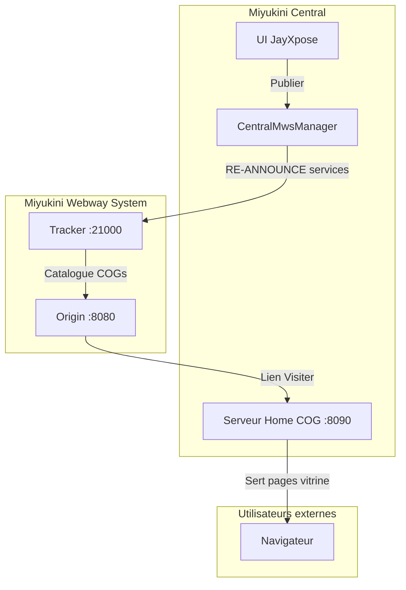

# Plan : Publication JayXpose via serveur web local COG

## Architecture cible

## Fichiers a modifier

### 1. Serveur Home : ajouter routes JayXpose

**Fichier** : [crates/miyukini-central/src/mws/mod.rs](crates/miyukini-central/src/mws/mod.rs)

- Modifier `handle_home_connection()` pour router :
  - `GET /` : Page portail (liste des services actifs avec liens)
  - `GET /jayxpose` : Page d'accueil vitrine
  - `GET /jayxpose/catalogue` : Liste produits
  - `GET /jayxpose/catalogue/{id}` : Fiche produit
  - `GET /jayxpose/contact` : Page contact
- Ajouter reference a `JayXposeDb` pour generer les pages HTML
- Creer fonctions `jayxpose_home_html()`, `jayxpose_catalogue_html()`, etc.

### 2. Mise a jour dynamique des services annonces

**Fichier** : [crates/miyuwebway_participant/src/mws_service.rs](crates/miyuwebway_participant/src/mws_service.rs)

- Ajouter methode `update_services(services: Vec<String>)` qui :
  - Met a jour `identity.services`
  - Envoie un RE-ANNOUNCE au Tracker avec la nouvelle liste

**Fichier** : [crates/miyukini-central/src/mws/mod.rs](crates/miyukini-central/src/mws/mod.rs)

- Ajouter methode `CentralMwsManager::update_services()` qui delegue au participant

### 3. Connecter "Publier" a l'annonce MWS

**Fichier** : [apps/central/src/services/jayxpose/vitrine.rs](apps/central/src/services/jayxpose/vitrine.rs)

- Modifier le handler du bouton "Publier" pour :
  - Mettre a jour `vitrine_status = "publiee"` (existant)
  - Appeler `mws_manager.update_services(vec!["jayxpose"])` si connecte au MWS
- Modifier le handler "Suspendre" pour retirer "jayxpose" des services

### 4. Page portail racine

**Fichier** : [crates/miyukini-central/src/mws/mod.rs](crates/miyukini-central/src/mws/mod.rs)

- Modifier `home_page_html()` pour afficher :
  - En-tete COG (nom, version)
  - Liste des services actifs avec liens locaux (ex: `/jayxpose`)
  - Indicateur de statut MWS

## Dependances

Le serveur Home doit avoir acces a `JayXposeDb` pour generer les pages. Options :

- Passer `Arc<JayXposeDb>` au serveur Home lors du demarrage
- Ou utiliser un canal pour demander les donnees au thread principal

## Notes techniques

- Le serveur Home actuel est un TCP brut avec parsing HTTP minimal
- Les pages sont generees en HTML statique (pas de templates)
- Le routage actuel ne supporte que `GET /` — a etendre pour les sous-routes
- Le Tracker supporte deja RE-ANNOUNCE pour mettre a jour les services

