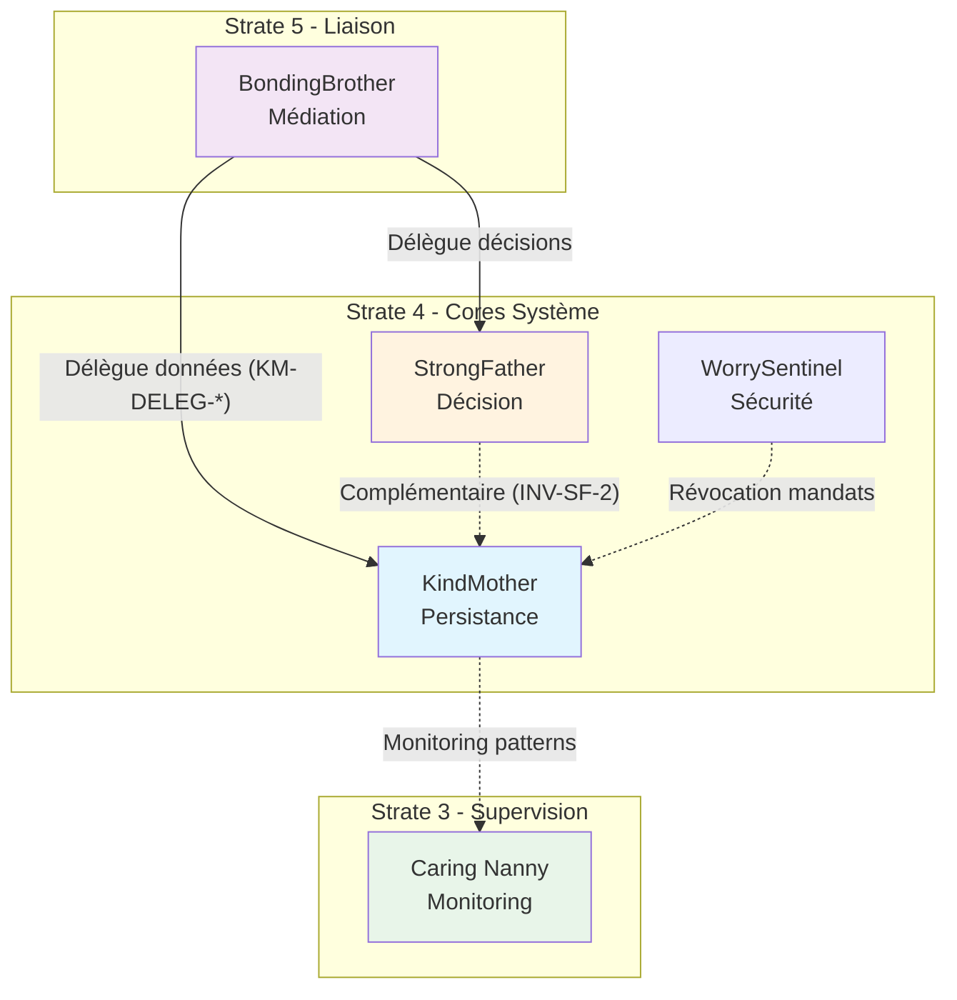

# Mise à jour de la documentation KindMother

## Contexte

KindMother (Core de données, Strate 4) possède 20 fichiers de documentation bien élaborés, mais présente des lacunes par rapport au standard établi par StrongFather :

- **Structure plate** : tous les fichiers dans un seul dossier (pas de sous-dossiers thématiques)
- **Pas d'index de navigation** (`_index.md`)
- **Références croisées incomplètes** : pas de section "Relations avec les autres Cores"
- **Nouveaux concepts non intégrés** : Integrity Degradation System, External Signal Trust, etc.

---

## 1. Réorganisation structurelle

Créer la hiérarchie suivante (alignée sur StrongFather) :

```
docs/core/KindMother/
├── _index.md                    # NOUVEAU : Index de navigation
├── foundation/
│   └── KindMother - Documentation Fondatrice.md
├── contracts/
│   ├── api/
│   │   ├── CoreDataAPI Contract.md
│   │   ├── CoreDataAPI (Surface d'Appel Conceptuelle).md
│   │   └── Interface & Contrat d'Intégration.md
│   ├── instance/
│   │   ├── Instance Model Contract.md
│   │   └── Instance & Authority Domain Model Contract.md
│   ├── lifecycle/
│   │   └── Write Intent Lifecycle Contract.md
│   ├── sync/
│   │   └── Sync & Conflict Resolution Contract.md
│   ├── authority/
│   │   ├── Authority Graph & Cross-Domain Contract.md
│   │   └── Identity & Cross-Domain Trust Contract.md
│   ├── boundaries/
│   │   ├── Runtime Boundary & Enforcement Contract.md
│   │   └── Internal Boundary Contract.md
│   ├── persistence/
│   │   └── Persistence & Storage Contract.md
│   ├── security/
│   │   └── Threat Model & Attack Surface Contract.md
│   ├── compliance/
│   │   └── Adapter Compliance Contract.md
│   └── observability/
│       ├── Observability & Audit Contract.md
│       └── Failure & Degradation Contract.md
├── architecture/
│   └── Internal State Machine (Informative).md
├── implementation/
│   └── Reference Implementation Guidelines.md
├── reference/
│   └── Adapter Examples (Conceptual, Non-Normative).md
└── archive/
```

---

## 2. Création de l'index de navigation

Fichier `_index.md` avec :

- Contexte et définition de KindMother (Core de données, Strate 4)
- Lien vers le [Glossaire](../../reference/Miyukini%20Conceptual%20References%20-%20Glossaire.md)
- Structure de documentation par sections (Foundation, Contracts, Architecture, etc.)
- **Invariants clés** (INV-KM-1 : KindMother ne décide jamais)
- **Relations avec les autres Cores** :


| Core               | Relation                                                                 |
| ------------------ | ------------------------------------------------------------------------ |
| **StrongFather**   | Complémentaire — StrongFather décide, KindMother persiste                |
| **BondingBrother** | Interface — Traduction et délégation via KindMother Integration Contract |
| **WorrySentinel**  | Sécurité — Révocation de mandats, autorité sécurité                      |
| **Caring Nanny**   | Monitoring — Détection d'anomalies patterns KindMother                   |


---

## 3. Mise à jour du contenu

### 3.1 Documentation Fondatrice

Ajouter une section **"Relations avec les autres Cores"** après la section 6 :

- **StrongFather** : Complémentarité décision/persistance, interdictions (INTERD-KM-1 à INTERD-KM-4)
- **BondingBrother** : Délégation des intentions de données (KM-DELEG-01 à KM-DELEG-03)
- **WorrySentinel** : Intégration sécurité (si applicable)
- **Caring Nanny** : Monitoring et détection d'anomalies

Corriger le lien vers les Lois d'Autonomie Système :

- Ancien : `../../reference/Miyukini Framework - Lois Autonomie Systeme.md`
- Nouveau : `../../reference/Miyukini Conceptual References - Lois Autonomie Systeme.md`

### 3.2 Intégration des nouveaux concepts

Référencer dans les documents appropriés :

- **INV-KM-1** (Integrity Degradation System) : KindMother ne décide jamais
- **External Signal Trust** : KindMother ne dépend pas d'Internet (LOI-1)
- **Security Levels** : Adaptation de la traçabilité selon le niveau déclaré
- **Ecosystem Dependency Contract** : Interdiction de contourner KindMother

### 3.3 Mise à jour des références

- Mettre à jour les liens vers le Glossaire (nomenclature actuelle)
- Ajouter les références croisées vers StrongFather et BondingBrother
- Vérifier la cohérence des termes avec le glossaire (WriteIntent, Authority Domain, etc.)

---

## 4. Fichiers à déplacer


| Fichier actuel                                                 | Nouvelle destination       |
| -------------------------------------------------------------- | -------------------------- |
| `KindMother - Documentation Fondatrice.md`                     | `foundation/`              |
| `KindMother - CoreDataAPI Contract.md`                         | `contracts/api/`           |
| `KindMother - CoreDataAPI (Surface d'Appel Conceptuelle).md`   | `contracts/api/`           |
| `KindMother - Interface & Contrat d'Intégration.md`            | `contracts/api/`           |
| `KindMother - Instance Model Contract.md`                      | `contracts/instance/`      |
| `KindMother - Instance & Authority Domain Model Contract.md`   | `contracts/instance/`      |
| `KindMother - Write Intent Lifecycle Contract.md`              | `contracts/lifecycle/`     |
| `KindMother - Sync & Conflict Resolution Contract.md`          | `contracts/sync/`          |
| `KindMother - Authority Graph & Cross-Domain Contract.md`      | `contracts/authority/`     |
| `KindMother - Identity & Cross-Domain Trust Contract.md`       | `contracts/authority/`     |
| `KindMother - Runtime Boundary & Enforcement Contract.md`      | `contracts/boundaries/`    |
| `KindMother - Internal Boundary Contract.md`                   | `contracts/boundaries/`    |
| `KindMother - Persistence & Storage Contract.md`               | `contracts/persistence/`   |
| `KindMother - Threat Model & Attack Surface Contract.md`       | `contracts/security/`      |
| `KindMother - Adapter Compliance Contract.md`                  | `contracts/compliance/`    |
| `KindMother - Observability & Audit Contract.md`               | `contracts/observability/` |
| `KindMother - Failure & Degradation Contract.md`               | `contracts/observability/` |
| `KindMother - Internal State Machine (Informative).md`         | `architecture/`            |
| `KindMother - Reference Implementation Guidelines.md`          | `implementation/`          |
| `KindMother - Adapter Examples (Conceptual, Non-Normative).md` | `reference/`               |


---

## 5. Diagramme de relations inter-Cores




---

## Résumé des livrables

1. **Nouvelle structure de dossiers** (13 sous-dossiers)
2. **Fichier `_index.md**` (index de navigation)
3. **Documentation Fondatrice mise à jour** (section Relations, liens corrigés)
4. **20 fichiers déplacés** vers leurs nouveaux emplacements
5. **Références croisées ajoutées** dans les documents pertinents

