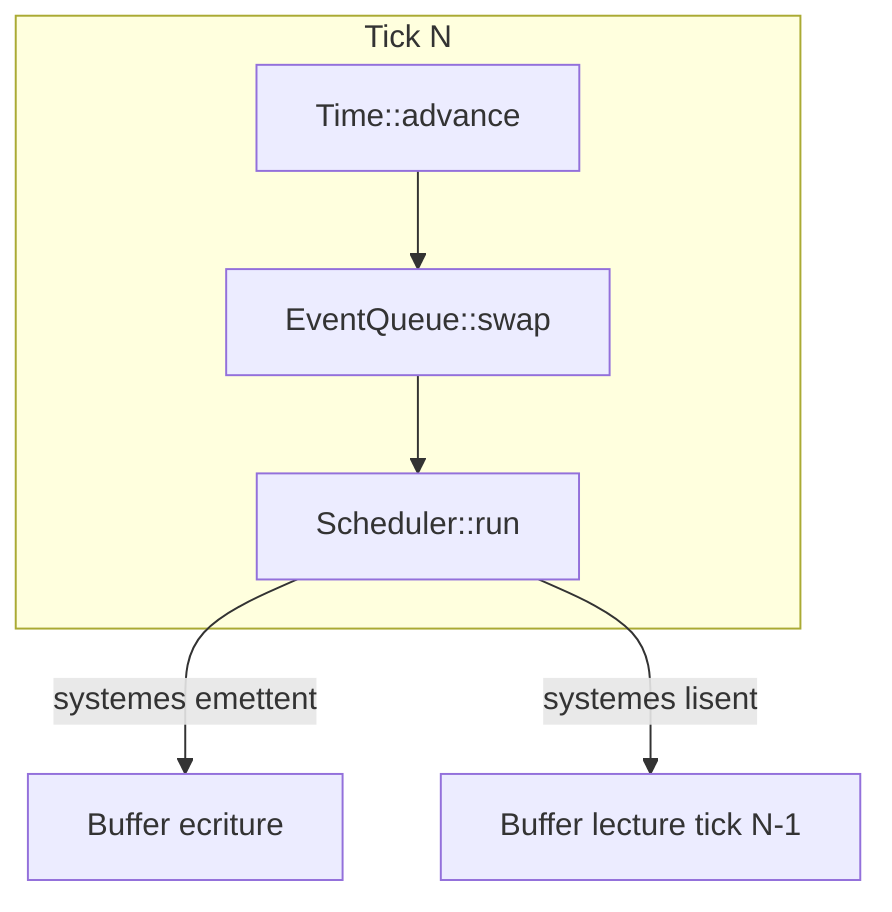

# Implementation mge-core v0.1

## Objectif

Creer le crate `crates/mge-core/` conforme a [docs/mge-core/MGE - Kernel Specification.md](docs/mge-core/MGE%20-%20Kernel%20Specification.md), avec balisage MSCM et 3 tests deterministes.

## Structure du crate

```
crates/mge-core/
├── Cargo.toml
└── src/
    ├── lib.rs           # Racine, re-exports, MSCM crate
    ├── entity.rs        # EntityId (index + generation)
    ├── component.rs     # Trait Component
    ├── world.rs         # World (storage SoA simplifie, iter2/iter3)
    ├── event.rs         # Trait Event
    ├── event_queue.rs   # EventQueue (double buffer, iter::<E>)
    ├── time.rs          # Time (delta, tick_count, time_scale, paused)
    ├── rng.rs           # Rng (seedable, derive par entite)
    ├── scheduler.rs     # Scheduler, PhaseId, systemes
    ├── engine.rs        # Engine, EngineConfig, cycle de vie
    ├── context.rs       # Context (time, rng, events, emit)
    ├── plugin.rs        # Trait Plugin
    └── config.rs        # EngineConfig
```

## Dependances

```toml
[dependencies]
rand = "0.8"
```

`rand` pour `SeedableRng` (SmallRng ou StdRng) — RNG deterministe.

---

## Module 1 : entity.rs — EntityId

- `EntityId` opaque : `(index: u32, generation: u32)`
- `impl EntityId { fn to_bits() -> u64 }` pour derivation seed entite
- Pas d'acces aux champs internes (privatise)
- MSCM : `@id mge.core.entity`, `@role simulation`, `@layer core`, `@do represent_opaque_entity_identifier`

## Module 2 : component.rs — Trait Component

- `pub trait Component: Send + Sync + 'static {}`
- Marqueur pur, pas de logique
- MSCM : `@id mge.core.component`

## Module 3 : world.rs — World

**Stockage v0.1 :** Sparse set par type de composant (pragmatique pour v0.1). Chaque `T: Component` a :

- `dense_entities: Vec<EntityId>`, `dense_data: Vec<T>`, `sparse: HashMap<EntityId, usize>`
- `spawn()` : nouvel EntityId (generation, free list ou append)
- `despawn(id)` : retire des tous les sparse sets, incremente generation pour reuse
- `insert(id, comp)` : enregistrement du type a la premiere insertion (ou via `register_component` au build)
- `iter2::<A,B>()` : intersection des entities ayant A et B, yield `(EntityId, &A, &B)`
- `iter2_mut`, `iter3` equivalents

**Enregistrement :** Le World doit connaitre les types de composants. Lors de `build()`, les plugins appellent `engine.register_component::<T>()`. Le World maintient un `TypeId -> bool` ou structure equivalente. Pour v0.1 simplifie : pas de preregistration stricte ; le premier `insert::<T>` initialise le stockage (ou on exige `register_component` avant tout insert).

**Choix :** Exiger `register_component::<T>()` lors du build. Le World stocke `HashMap<TypeId, SparseSet<T>>` avec un mecanisme type-erased. En Rust cela necessite soit des macros, soit un enum de composants connus. Pour rester simple : utiliser `type_map::TypeMap` ou equivalent, ou implementer un stockage par TypeId avec `Box<dyn Any>` pour le SparseSet — complexe.

**Alternative pragmatique :** Pour v0.1, le World stocke des `Storage<T>` par TypeId. On utilise `std::any::TypeId` + une structure qui permet d'enregistrer dynamiquement. Un `Storage<T>` = (Vec, Vec, HashMap<EntityId, usize>). Pour eviter type erasure on peut avoir un enum `ComponentStorage` avec une variante par type connu — mais cela limite l'extensibilite. La spec dit que les plugins enregistrent les composants au build. Donc le World reçoit une liste de TypeIds et pour chaque insertion on verifie. Le stockage : on ne peut pas avoir `HashMap<TypeId, Storage<???>>` sans type erasure.

**Solution :** Utiliser le pattern "resource container" : chaque `Storage<T>` est une struct generique. Le World garde `Vec<Box<dyn AnyStorage>>` ou on utilise une crate comme `downcast-rs`. Ou encore : le World est generique sur les composants ? Non, trop limitant.

**Approche retenue :** `World` contient un `ComponentStorages` qui utilise un mecanisme de type-erased storage. Une implementation possible : `HashMap<TypeId, Box<dyn ErasedSparseSet>>` ou chaque `ErasedSparseSet` peut faire `get_dense_entities()` et on itere. Pour `iter2::<A,B>`, on demande les EntityIds du storage A, pour chaque on verifie s'il est dans B, et on retourne les refs. Problème : obtenir `&A` et `&B` depuis un trait object — il faudrait des methodes `get_ref(EntityId) -> Option<&dyn Any>` et downcast. Faisable.

**Implementation concrete :** Creer un trait `ComponentStorage` avec `fn get_entity_ids(&self) -> &[EntityId]`, `fn get_ref(&self, id: EntityId) -> Option<&dyn Any>`, `fn get_mut(&mut self, id: EntityId) -> Option<&mut dyn Any>`, `fn insert(&mut self, id: EntityId, value: Box<dyn Any>)`, etc. Chaque `Storage<T>` implemente ce trait. Le World a `HashMap<TypeId, Box<dyn ComponentStorage>>`. On enregistre via `register_component::<T>()` qui insert une `Storage<T>` vide. iter2 : on recupere les storages pour A et B, on intersecte les EntityIds, on downcast et on yield.

- MSCM : `@id mge.core.world`

## Module 4 : event.rs — Trait Event

- `pub trait Event: Send + Sync + 'static {}`
- Marqueur pur
- MSCM : `@id mge.core.event`

## Module 5 : event_queue.rs — EventQueue

- **Double buffer :** deux `HashMap<TypeId, Vec<Box<dyn Any>>>` (write_buffer, read_buffer)
- `emit<E: Event>(&mut self, event: E)` : push dans write_buffer sous `TypeId::of::<E>()`
- `swap()` : echange write <-> read, clear write
- `iter<E: Event>(&self) -> impl Iterator<Item = &E>` : downcast les elements du read_buffer pour E
- Pas de subscribe, pas de callback
- MSCM : `@id mge.core.event_queue`

## Module 6 : time.rs — Time

- `delta_secs: f32`, `tick_count: u64`, `time_scale: f32`, `paused: bool`
- `advance(delta_requested, fixed_timestep)` : calcule delta effectif, incremente tick_count
- Si `paused` : delta_secs = 0
- MSCM : `@id mge.core.time`

## Module 7 : rng.rs — Rng

- Encapsule `rand::rngs::SmallRng` (ou StdRng) seede
- `seed(seed: u64)` pour (re)initialiser
- `derive_for_entity(id: EntityId) -> impl Rng` : `SmallRng::seed_from_u64(global_seed ^ id.to_bits())`
- Ne pas exposer `rand::random()` — tout passe par cet objet
- MSCM : `@id mge.core.rng`

## Module 8 : scheduler.rs — Scheduler

- `PhaseId(pub u32)` — struct transparente
- Systemes stockes : `Vec<(PhaseId, Box<dyn System>)>` ou `System = FnMut(&mut World, &mut Context)`
- `add_system(phase, fn)` : enregistre
- `run(world, ctx)` : tri par PhaseId croissant, execute sequentiellement
- Profiling : optional, hooks avant/apres chaque systeme (no-op par defaut)
- MSCM : `@id mge.core.scheduler`

## Module 9 : context.rs — Context

- `Context<'a>` : `time: &'a Time`, `rng: &'a mut Rng`, `events: &'a EventQueue`, reference vers emit
- `emit<E: Event>(&mut self, event: E)` : delegue a EventQueue (via ref mutable interne vers Engine pour emit)
- Pas de `dyn FnMut` : methode `emit` generique
- MSCM : `@id mge.core.context`

## Module 10 : engine.rs — Engine

- `Engine { world, scheduler, events, time, rng, plugins_pending }`
- `new(config: EngineConfig) -> Self`
- `add_plugin(plugin: P)`
- `build()` : resolution dependances (ordre simple pour v0.1), appelle `plugin.build(engine)` pour chaque plugin
- `tick(delta: f32)` : 1) Time::advance, 2) EventQueue::swap, 3) Scheduler::run
- `world()`, `world_mut()`, `events()`, `emit()`, `set_seed()`
- MSCM : `@id mge.core.engine`

## Module 11 : plugin.rs — Plugin

- `pub trait Plugin { fn name(&self) -> &str; fn build(&self, engine: &mut Engine); fn dependencies(&self) -> &[&str] { &[] } }`
- v0.1 : dependances = ordre d'ajout (pas de resolution topologique)
- MSCM : `@id mge.core.plugin`

## Module 12 : config.rs — EngineConfig

- `seed: u64`, `headless: bool`, `fixed_timestep_ms: Option<u32>`, `tick_budget_ms: Option<u32>`
- MSCM : `@id mge.core.config`

---

## Incoherence spec : tick() et delta

La spec dit que le Game Runtime appelle `tick()` — mais qui fournit le delta ? Le Engine doit soit (a) recevoir le delta en parametre `tick(delta)`, soit (b) le calculer lui-meme (fixed timestep, ou temps systeme). La spec dit "tick() reçoit un delta explicite" — donc `tick(&mut self, delta_secs: f32)` ou `tick(&mut self)` avec un `Engine::set_delta()` avant ? Pour fixed timestep, le Time a un accumulateur. Le plus propre : `tick(&mut self, real_delta_secs: f32)` — le runtime fournit le temps reel ecoule, l'Engine decide (fixed ou variable). Pour fixed, Time consomme du accumulateur.

---

## Tests deterministes

### Test 1 : tick simple

- Creer Engine avec config (seed fixe)
- Ajouter un plugin minimal qui enregistre un systeme incrementant un compteur (composant sur une entite)
- build(), tick(0.016) x 10
- Assert : tick_count == 10, compteur attendu

### Test 2 : event propagation N -> N+1

- Plugin A : systeme en PhaseId(0) emet `PropagationEvent { tick: ctx.time.tick_count }`
- Plugin B : systeme en PhaseId(1) lit les events, ecrit les tick lus dans un composant
- tick() x 2
- Assert : au tick 2, le composant contient [0] (events emis au tick 0 sont lus au tick 1, donc le systeme B au tick 1 lit ; au tick 2 on lit les events du tick 1)
- Verifier le double buffer : emit au tick N, lecture au tick N+1

### Test 3 : seed reproductible

- Engine 1 : seed 42, tick(0.016) x 5, systeme qui utilise rng.u32() et stocke dans un composant
- Engine 2 : meme seed 42, meme nombre de ticks, meme ordre
- Assert : meme sequence de valeurs RNG (meme etat composant)

---

## Integration workspace

Ajouter dans [Cargo.toml](Cargo.toml) :

```toml
"crates/mge-core",
```

---

## Ordre d'implementation recommande

1. entity, component, config
2. event, event_queue
3. time, rng
4. world (storage sparse set)
5. context, scheduler
6. plugin, engine
7. lib.rs, MSCM partout
8. Tests

---

## Diagramme flux tick




