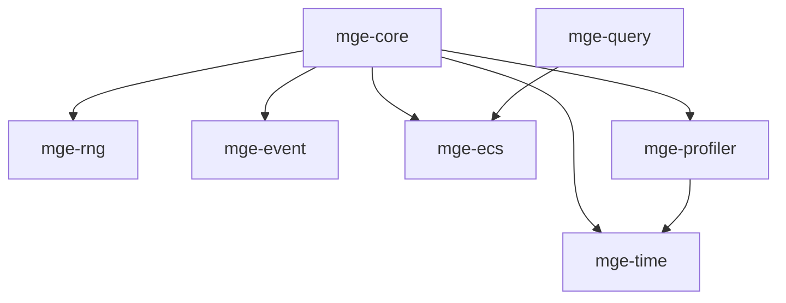
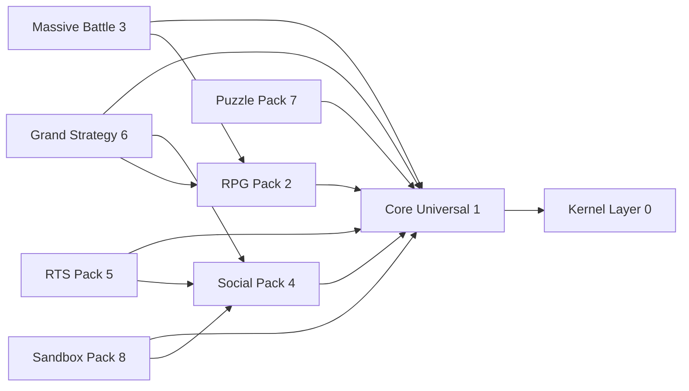

# MGE -- Restructuration Workspace et Documentation

## Contexte

Le MGE actuel consiste en un seul crate monolithique `[crates/mge-core/](crates/mge-core/)` (16 fichiers source) integre au workspace COG. La cible est un workspace **independant** `mge/` contenant ~112 crates organises en couches : Kernel (0), Core Universal Pack (1), et 11 packs genre-specifiques (2-12).

Le refactoring preserve le code existant de `mge-core` en l'eclatant dans 7 crates kernel distincts.

---

## Phase A -- Workspace et Kernel (prioritaire)

### A1. Creation du workspace `mge/`

Creer `mge/Cargo.toml` comme workspace racine independant :

```toml
[workspace]
resolver = "2"
members = [
  "crates/mge-core",
  "crates/mge-time",
  "crates/mge-rng",
  "crates/mge-event",
  "crates/mge-ecs",
  "crates/mge-query",
  "crates/mge-profiler",
  # packs ajoutes incrementalement
]

[workspace.package]
edition = "2021"
license = "Proprietary"
repository = "https://github.com/StudioMiyukini/miyukini-cog"

[workspace.lints.rust]
unsafe_code = "forbid"
```

Retirer `"crates/mge-core"` du `Cargo.toml` racine COG et ajouter un commentaire pointant vers `mge/`.

### A2. Refactoring Kernel -- Extraction des 7 crates

Deplacer `crates/mge-core/` vers `mge/crates/mge-core/` puis extraire :


| Crate          | Source actuelle                                       | Responsabilite                                      |
| -------------- | ----------------------------------------------------- | --------------------------------------------------- |
| `mge-core`     | `engine.rs`, `config.rs`, `plugin.rs`, `context.rs`   | Engine, boot, tick, plugin trait, config            |
| `mge-time`     | `time.rs`                                             | Time, delta, fixed timestep, time scale, pause      |
| `mge-rng`      | `rng.rs`                                              | Deterministic RNG, seed, entity-specific derivation |
| `mge-event`    | `event.rs`, `event_queue.rs`                          | Event trait, EventQueue (double buffer)             |
| `mge-ecs`      | `world.rs`, `entity.rs`, `component.rs`, `storage.rs` | World, EntityId, Component trait, SoA storage       |
| `mge-query`    | queries dans `world.rs` (iter1/2/3, for_each_mut)     | Query helpers, Query2Mut                            |
| `mge-profiler` | `profiling.rs`                                        | TickMetrics, PhaseMetrics, SystemMetrics, budget    |


**Graphe de dependances kernel :**




`mge-core` devient l'orchestrateur qui depend des 6 autres. Les crates feuilles (`mge-time`, `mge-rng`) n'ont aucune dependance interne.

### A3. Structure fichier de chaque crate kernel

Chaque crate kernel suit le pattern Miyukini standard :

```
mge/crates/mge-{name}/
  Cargo.toml
  src/
    lib.rs        # Re-exports publics + MSCM root (@id mge.kernel.{name})
    {modules}.rs  # Code metier
  index.md        # Resume AI-Native (max 80 lignes)
```

---

## Phase B -- Core Universal Pack (6 crates)

Pack de plugins essentiels utilises par quasi tous les genres. Chaque plugin suit la structure AI-Native obligatoire :

```
mge/crates/mge-plugin-{name}/
  src/
    mod.rs          # @id mge.plugin.{name}.v1, @role plugin, @domain
    components.rs   # Structs Component
    systems.rs      # 1 fn = 1 effet
    events.rs       # Structs Event
    helpers.rs      # Optionnel
  index.md
  Cargo.toml
```


| Crate                      | Domain      | Composants cles                               | Depend de                   |
| -------------------------- | ----------- | --------------------------------------------- | --------------------------- |
| `mge-plugin-spatial`       | spatial     | Position2D, Velocity2D, Rotation, SpatialHash | mge-ecs                     |
| `mge-plugin-input`         | input       | InputState, KeyBinding                        | mge-event                   |
| `mge-plugin-render-2d`     | render      | Sprite, Camera2D, RenderLayer                 | mge-ecs, mge-plugin-spatial |
| `mge-plugin-audio`         | audio       | AudioSource, AudioListener                    | mge-event                   |
| `mge-plugin-basic-physics` | physics     | Collider, RigidBody, CollisionEvent           | mge-plugin-spatial          |
| `mge-plugin-save-load`     | persistence | SaveState, Snapshot                           | mge-ecs, mge-event          |


---

## Phase C -- Genre Packs (Packs 2-12)

Chaque pack est un sous-repertoire thematique avec ses propres crates. Organisation :

```
mge/crates/{pack-name}/
  mge-{prefix}-{module}/
    src/
      mod.rs
      components.rs
      systems.rs
      events.rs
    index.md
    Cargo.toml
```

### Prefixes par pack


| Pack              | Repertoire        | Prefixe   | Nb crates |
| ----------------- | ----------------- | --------- | --------- |
| RPG               | `rpg/`            | `rpg`     | 7         |
| Massive Battle    | `massive-battle/` | `mb`      | 6         |
| Social Simulation | `social/`         | `social`  | 8         |
| RTS               | `rts/`            | `rts`     | 8         |
| Grand Strategy    | `grand-strategy/` | `gs`      | 10        |
| Puzzle            | `puzzle/`         | `puzzle`  | 9         |
| Sandbox           | `sandbox/`        | `sb`      | 9         |
| Platformer        | `platformer/`     | `pl`      | 6         |
| Shooter           | `shooter/`        | `sh`      | 5         |
| Roguelike         | `roguelike/`      | `rl`      | 4         |
| Racing            | `racing/`         | `race`    | 4         |
| Factory           | `factory/`        | `factory` | 4         |
| Idle              | `idle/`           | `idle`    | 5         |
| Tycoon            | `tycoon/`         | `tycoon`  | 4         |
| Visual Novel      | `visual-novel/`   | `vn`      | 6         |
| TCG               | `tcg/`            | `tcg`     | 5         |


### Dependances inter-packs typiques




Les packs 9-12 (Tactical/Action, Economic, Narrative, Card) dependent tous du Core Universal Pack et potentiellement du RPG Pack.

---

## Phase D -- Documentation

### D1. Documentation par crate (`index.md`)

Chaque crate (112 total) recoit un `index.md` conforme AI-Native Standard :

```markdown
Plugin: mge-{pack}-{name}
Version: v1
Domain: {domain}

Components:
- {list}

Systems:
- {system} (phase {N})

Events:
- {list}

Helpers:
- {list}

Hot path: yes/no
Headless safe: yes/no
AI-Native Score: X/10
```

### D2. Documentation par pack

Creer sous `docs/Miyukini_Game_Engine/packs/` un fichier par pack :

```
docs/Miyukini_Game_Engine/packs/
  MGE - Pack RPG.md
  MGE - Pack Massive Battle.md
  MGE - Pack Social Simulation.md
  MGE - Pack RTS.md
  MGE - Pack Grand Strategy.md
  MGE - Pack Puzzle.md
  MGE - Pack Sandbox.md
  MGE - Pack Platformer.md
  MGE - Pack Shooter.md
  MGE - Pack Roguelike.md
  MGE - Pack Racing.md
  MGE - Pack Factory.md
  MGE - Pack Idle.md
  MGE - Pack Tycoon.md
  MGE - Pack Visual Novel.md
  MGE - Pack TCG.md
```

Chaque doc de pack contient :

- Contexte et portee
- Liste des crates avec responsabilite
- Graphe de dependances intra-pack
- Composants, systemes et events principaux
- Exemples d'utilisation

### D3. Mise a jour des documents existants

- **[MGE - Architecture Generale.md](docs/Miyukini_Game_Engine/MGE - Architecture Generale.md)** : mettre a jour pour refleter les 12 packs et le kernel eclate
- **[MGE - Roadmap.md](docs/Miyukini_Game_Engine/MGE - Roadmap.md)** : ajouter les phases pour les packs genre
- **[_index.md](docs/Miyukini_Game_Engine/_index.md)** : ajouter les references vers les docs pack
- **Nouveau : `MGE - Pack Architecture.md`** : document chapeau expliquant la philosophie des packs, les dependances inter-packs, et les regles de composition

### D4. MIP / blocks.json / domains.json

Chaque pack doit generer :

- `blocks.json` : index ultra-compresse de tous les blocs MSCM du pack
- `domains.json` : carte des domaines couverts par le pack
- Projetes depuis les balises MSCM dans le code

---

## Phase E -- Examples

```
mge/examples/
  minimal_game/       # Kernel + spatial + input + render-2d (2D controllable)
  rpg_demo/           # Core + RPG pack (combat, progression)
  rts_demo/           # Core + RTS pack (selection, production, AI)
  sandbox_demo/       # Core + Sandbox pack (agents, needs, world)
  allumina_prototype/ # Multi-pack (RPG + Social + Narrative)
```

Chaque example a son propre `Cargo.toml` avec dependances `path = "../crates/..."`.

---

## Strategie d'implementation

L'implementation se fait en 5 vagues sequentielles :

1. **Vague 1** : Workspace + Kernel refactoring (Phase A) -- fondation obligatoire
2. **Vague 2** : Core Universal Pack (Phase B) -- prerequis pour tous les packs
3. **Vague 3** : RPG + Social + Puzzle packs -- les plus matures en termes de design
4. **Vague 4** : MB + RTS + GS + Sandbox packs -- systemes strategiques complexes
5. **Vague 5** : Tactical/Action + Economic + Narrative + Card packs + Examples

Documentation produite en parallele de chaque vague.

---

## Inventaire total

- **Crates kernel** : 7
- **Crates Core Universal** : 6
- **Crates genre packs** : 99
- **Total crates** : 112
- **Fichiers index.md** : 112
- **Docs pack** : 16
- **Docs architecture** : 3 (mise a jour) + 1 (nouveau)
- **Examples** : 5

