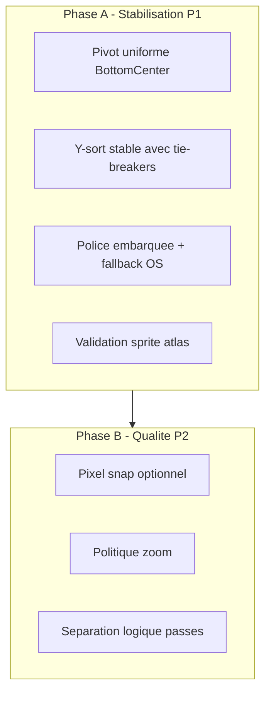

# Plan d'implémentation — Moteur graphique 2D isométrique robuste

Conformité avec [audit-rendu-2d-isometrique.md](docs/Miyukini_Game_Engine/audit-rendu-2d-isometrique.md) et [MGE - Rendu 2D Isometrique Robuste.md](docs/Miyukini_Game_Engine/MGE%20-%20Rendu%202D%20Isometrique%20Robuste.md).

---

## Architecture cible




---

## Phase A — Correctifs P1 (stabilisation)

### 1. Pivot uniforme

**Fichier :** [mge/examples/allumina_prototype/src/renderer.rs](mge/examples/allumina_prototype/src/renderer.rs)

**1.1 `draw_sprites`** (l.1198-1212)  
`screen_pos` est traité comme coin haut-gauche alors que `camera.project()` retourne le centre/pieds.

Modifier le mapping des instances :

```rust
let half_w = s.size_w / 2.0;
let top_left_y = sy - s.size_h;
InstanceRaw {
    screen_pos: [sx - half_w, top_left_y],
    ...
}
```

**1.2 `draw_tilemap`**  
Le pivot BottomCenter est déjà correct (l.776-780). Aucune modification.

**1.3 (Optionnel) Enum SpritePivot**  
Ajouter dans un module commun si besoin de varier (UI TopLeft vs entités BottomCenter). Pour l’instant, BottomCenter par défaut suffit.

---

### 2. Y-sort stable

**Fichier :** [mge/examples/allumina_prototype/src/main.rs](mge/examples/allumina_prototype/src/main.rs)

**2.1 Structure des données**  
Remplacer `Vec<(f32, f32, u8)>` par `Vec<(f32, f32, u8, EntityId)>` pour garder `EntityId` dans le tri.

**2.2 Boucle de collecte** (l.77-79)  
Conserver `EntityId` dans les tuples :

```rust
for (eid, pos, sprite) in engine.world().iter2::<Position2D, EntitySprite>() {
    entity_sprites.push((pos.x, pos.y, sprite.character_id, eid));
}
```

**2.3 Tri avant rendu**  
Après `entity_sprites.retain(...)` (l.105), avant `draw_tilemap` :

```rust
use std::cmp::Ordering;
entity_sprites.sort_by(|a, b| {
    let sum_a = a.0 + a.1;
    let sum_b = b.0 + b.1;
    sum_a.partial_cmp(&sum_b).unwrap_or(Ordering::Equal)
        .then_with(|| a.0.partial_cmp(&b.0).unwrap_or(Ordering::Equal))
        .then_with(|| a.3.to_bits().cmp(&b.3.to_bits()))
});
```

**2.4 Signature de `draw_tilemap`**  
Adapter pour accepter `impl IntoIterator<Item = (f32, f32, u8)>` afin d’éviter une allocation dans le hot path :

```rust
pub fn draw_tilemap<I>(..., entity_sprites: I, ...)
where I: IntoIterator<Item = (f32, f32, u8)>
```

Appel :

```rust
entity_sprites.iter().map(|t| (t.0, t.1, t.2))
```

Dans le corps de `draw_tilemap`, remplacer `.iter().map(...)` par `.into_iter().map(...)`.

---

### 3. Texte multiplateforme

**Fichier :** [mge/examples/allumina_prototype/src/dev_text.rs](mge/examples/allumina_prototype/src/dev_text.rs)

**3.1 Police embarquée**  
Ajouter `mge/examples/allumina_prototype/assets/fonts/` et y placer une TTF (ex. [Liberation Sans](https://github.com/liberationfonts/liberation-fonts/releases) ou [DejaVu Sans](https://dejavu-fonts.github.io/) — licence libre). Charger en priorité via `include_bytes!` :

```rust
const EMBEDDED_FONT: &[u8] = include_bytes!("../assets/fonts/LiberationSans-Regular.ttf");
```

**3.2 Ordre de chargement**  

1. Essayer `Font::from_bytes(EMBEDDED_FONT, ...)`
2. Sinon fallback OS :
  - Windows : `%WINDIR%\Fonts\arial.ttf`, `segoeui.ttf`  
  - macOS : `/System/Library/Fonts/Supplemental/Arial.ttf`, `/Library/Fonts/Arial.ttf`  
  - Linux : `/usr/share/fonts/truetype/dejavu/DejaVuSans.ttf`, `/usr/share/fonts/liberation/LiberationSans-Regular.ttf`
3. Si échec : utiliser une police par défaut embarquée ou un placeholder graphique (quad blanc + log warn).

**3.3 Atlas texte**  

- Augmenter `atlas_w` initial à 256  
- Arrondir les dimensions à une puissance de deux  
- Garder la gestion baseline/advance actuelle (rasterize par caractère)

---

### 4. Validation atlas sprites

**Fichier :** [mge/examples/allumina_prototype/src/renderer.rs](mge/examples/allumina_prototype/src/renderer.rs)

**4.1 `copy_sprite_to_atlas`**  
Avant la copie, vérifier les dimensions :

```rust
const SLOT_SIZE: u32 = 100;
if w != SLOT_SIZE || h != SLOT_SIZE {
    log::warn!(
        "Sprite {:?} : attendu {}x{}, reçu {}x{} (crop ou scale)",
        path.file_name().unwrap_or_default(),
        SLOT_SIZE, SLOT_SIZE, w, h
    );
}
```

Si nécessaire, garder un comportement de fallback (crop ou placeholder couleur) avec ce warning.

---

## Phase B — Correctifs P2 (qualité visuelle)

### 5. Pixel-perfect (optionnel)

**5.1 Snap caméra**  
Dans [mge/examples/allumina_prototype/src/isometric.rs](mge/examples/allumina_prototype/src/isometric.rs), ajouter une méthode sur `IsoCamera` :

```rust
pub fn snap_to_pixel_grid(&mut self, viewport_w: f32, viewport_h: f32) {
    let screen = world_to_screen(WorldPos::new(self.center_x, self.center_y));
    let px_per_unit = self.zoom * TILE_HALF_W; // facteur de conversion
    // Arrondir center_x/y pour aligner sur la grille pixel
    self.center_x = (self.center_x * px_per_unit).round() / px_per_unit;
    self.center_y = (self.center_y * px_per_unit).round() / px_per_unit;
}
```

**5.2 Politique de zoom**  
Option dans `IsoCamera` ou config : `zoom_mode: PixelPerfect | Free`. En mode PixelPerfect, n’autorisant que `1.0`, `2.0`, `3.0`, etc.

**5.3 Half-pixel offset shader**  
Dans [mge/examples/allumina_prototype/assets/shaders/sprite_instanced.wgsl](mge/examples/allumina_prototype/assets/shaders/sprite_instanced.wgsl), ajouter un uniform optionnel `pixel_offset: vec2<f32>` et l’utiliser dans le calcul NDC. Désactivé par défaut pour éviter le jitter sur objets animés.

---

### 6. Séparation logique passes

Conformément à la spec (WorldBelow, World, WorldDebug, UI, OverlayText), documenter les phases dans `draw_tilemap` avec des commentaires de couche. Aucune modification fonctionnelle pour l’instant ; les passes restent dans un seul render pass.

---

## Fichiers impactés


| Fichier                 | Modifications                                                                     |
| ----------------------- | --------------------------------------------------------------------------------- |
| `renderer.rs`           | Pivot `draw_sprites`, signature `draw_tilemap`, validation `copy_sprite_to_atlas` |
| `main.rs`               | Type `entity_sprites`, tri Y-sort, appel `draw_tilemap`                           |
| `dev_text.rs`           | Police embarquée, fallback OS, atlas 256px                                        |
| `isometric.rs`          | (Phase B) `snap_to_pixel_grid`, option zoom                                       |
| `sprite_instanced.wgsl` | (Phase B) uniform pixel offset optionnel                                          |
| `assets/fonts/`         | Nouveau dossier + TTF embarquée                                                   |


---

## Dépendances

- Télécharger une TTF libre (Liberation Sans ou DejaVu Sans) dans `assets/fonts/`
- Créer `mge/examples/allumina_prototype/assets/fonts/` si absent

---

## Tests de validation

- Deux entités à Y différents : la plus grande Y est dessinée devant
- Sprite 64×128 : log de warning, pas de crash
- Panneau Dev ouvert : labels visibles sur Windows/Linux/macOS
- `draw_sprites` avec position pieds : sprite aligné comme dans `draw_tilemap`
- Tri stable : ordre reproductible entre frames pour mêmes positions

---

## Estimation

- Phase A : 1–2 jours
- Phase B : 0,5–1 jour

