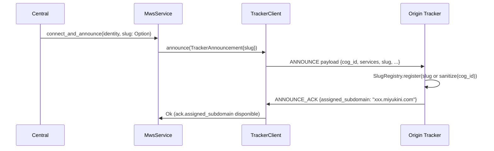
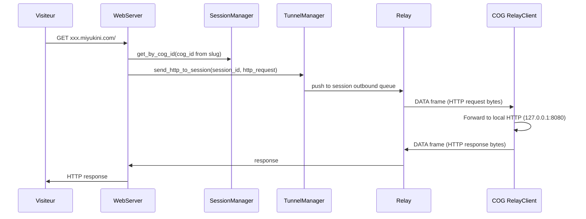

# Plan : SSL wildcard, Phase 2 tunnel HTTP, et slug dans ANNOUNCE

## 1. Certificat SSL wildcard Let's Encrypt

### Contexte

Le DNS wildcard `*.miyukini.com` pointe deja vers Origin. Le certificat actuel (auto-signe ou Let's Encrypt simple) ne couvre que `miyukini.com` / `origin.miyukini.com`. Il faut un certificat wildcard pour `*.miyukini.com`, car Let's Encrypt exige le **challenge DNS-01** pour les wildcards (le challenge HTTP-01 ne fonctionne pas sur les sous-domaines).

### Etape 1 : Challenge DNS-01 manuel

```bash
# Sur le VPS ou en local
sudo certbot certonly --manual --preferred-challenges dns \
  -d "miyukini.com" -d "*.miyukini.com"
```

Certbot affichera un enregistrement TXT a ajouter temporairement dans le DNS (Hostinger) :

- Type : `TXT`
- Nom : `_acme-challenge` (ou `_acme-challenge.miyukini.com` selon le fournisseur)
- Valeur : (chaque fournie par certbot)

Apres propagation DNS (quelques minutes), appuyer sur Entree pour que certbot valide.

### Etape 2 : Installer les certificats sur le VPS

Les certificats seront dans `/etc/letsencrypt/live/miyukini.com/` :

- `fullchain.pem` (certificat)
- `privkey.pem` (cle privee)

### Etape 3 : Mettre a jour la configuration Nginx

Modifier [docs/doc_for_website/origin-miyukini.conf](docs/doc_for_website/origin-miyukini.conf) :

- Bloc principal (ligne ~22) : remplacer les chemins TLS par ceux de Let's Encrypt.
- Bloc wildcard COG (ligne ~94) : utiliser les memes chemins (le certificat wildcard couvre les deux).

```nginx
ssl_certificate     /etc/letsencrypt/live/miyukini.com/fullchain.pem;
ssl_certificate_key /etc/letsencrypt/live/miyukini.com/privkey.pem;
```

### Etape 4 : Renouvellement automatique (optionnel)

Pour un renouvellement sans intervention manuelle, utiliser un plugin DNS (ex. `certbot-dns-hostinger` s'il existe) ou un hook :

```bash
# Renouvellement manuel tous les 90 jours (ou configurer un cron)
sudo certbot renew --manual-auth-hook /path/to/dns-hook.sh
```

Si Hostinger n'a pas de plugin certbot, documenter la procedure manuelle dans [MWS - Implementation Origin Hostinger](docs/miyukini-webway-system/deploiement/MWS%20-%20Implementation%20Origin%20Hostinger.md).

---

## 2. Cote COG : passer le slug dans l'ANNOUNCE via MiyuWebwayParticipant

### Fichiers a modifier


| Fichier                                                                                                    | Modification                                                                                                                                                     |
| ---------------------------------------------------------------------------------------------------------- | ---------------------------------------------------------------------------------------------------------------------------------------------------------------- |
| [crates/miyuwebway_participant/src/protocol.rs](crates/miyuwebway_participant/src/protocol.rs)             | Ajouter `slug: Option<String>` a `AnnouncePayload`, `assigned_subdomain: Option<String>` a `AnnounceAckPayload` (avec `#[serde(default)]`)                       |
| [crates/miyuwebway_participant/src/tracker_client.rs](crates/miyuwebway_participant/src/tracker_client.rs) | Ajouter `slug: Option<String>` a `TrackerAnnouncement`, l'inclure dans le `AnnouncePayload` envoye, et lire `assigned_subdomain` dans l'ACK pour log/usage futur |
| [crates/miyuwebway_participant/src/mws_service.rs](crates/miyuwebway_participant/src/mws_service.rs)       | Construire le `TrackerAnnouncement` avec le slug (depuis config ou identite)                                                                                     |
| [crates/miyukini-central/src/mws/mod.rs](crates/miyukini-central/src/mws/mod.rs)                           | Ajouter `subdomain_slug: Option<String>` a `CentralMwsConfig` et le passer au `MwsService` lors de `connect_and_announce`                                        |


### Origine du slug cote COG

- Option A : nouveau champ `subdomain_slug` dans `CentralMwsConfig` (configuration utilisateur).
- Option B : derive automatiquement du `cog_id` si non fourni (deja gere cote Origin).

Les deux sont supportees : fournir un slug personnalise, ou laisser `None` pour utiliser le `cog_id` derive par Origin.

### Flux




---

## 3. Phase 2 : Proxy HTTP via tunnel Relay (masquage complet)

### Enjeu architectural

Actuellement :

1. Le **Relay** garde les sessions COG ouverts (tunnel `tunnel_rx` pour envoyer des DATA au COG).
2. Le **COG** se connecte au Relay via `connect_and_register`, recoit le permis, puis **ferme la connexion** et ne reste pas connecte.
3. Le tunnel DATA est concu pour du trafic **COG vers COG** (pas Origin vers COG).

Pour la Phase 2, il faut :

- Une connexion **persistante** du COG au Relay (nouveau flux cote `MiyuWebwayParticipant`).
- Un moyen pour **Origin** d'injecter des requetes HTTP vers une session COG.
- Un **handler cote COG** pour recevoir ces requetes et les transmettre au serveur HTTP local.

### Architecture Phase 2




### Modifications cote Origin


| Composant         | Modification                                                                                                                                                                         |
| ----------------- | ------------------------------------------------------------------------------------------------------------------------------------------------------------------------------------ |
| `main.rs`         | Donner au `WebServer` une ref vers `RelayServer` (ou `SessionManager` + `TunnelManager`) pour pouvoir envoyer en session                                                             |
| `relay/tunnel.rs` | Ajouter `send_to_session(session_id, data: Bytes)` pour envoyer vers une session sans tunnel COG-COG (cas Origin → COG)                                                              |
| `relay/server.rs` | Exposer une methode `inject_http_request(cog_id, request_bytes) -> Result<response_bytes>` qui : 1) resout cog_id → session_id, 2) envoie la requete, 3) attend la reponse (timeout) |
| `web/server.rs`   | Dans `handle_cog_subdomain_request`, si le COG a une session Relay active : appeler `inject_http_request` au lieu de `proxy_http_request` (proxy direct)                             |


### Modifications cote COG (MiyuWebwayParticipant)


| Composant         | Modification                                                                                                                                                                                                                                               |
| ----------------- | ---------------------------------------------------------------------------------------------------------------------------------------------------------------------------------------------------------------------------------------------------------- |
| `relay_client.rs` | **Connexion persistante** : apres `connect_and_register`, lancer une tache qui garde le flux ouvert et ecoute les trames. Sur réception de `MessageType::Data`, transmettre le payload comme requete HTTP au serveur local et renvoyer la reponse en DATA. |
| `mws_service.rs`  | Au demarrage, lancer la tache "relay listener" en parallele du heartbeat. Configurer l'URL du serveur HTTP local (ex. `home_http_bind` ou `127.0.0.1:8080`) pour le forwarding.                                                                            |


### Protocole HTTP-over-DATA

- Le payload du DATA est la requete HTTP brute (GET /path HTTP/1.1\r\nHost: ...).
- La reponse du COG est la reponse HTTP brute dans un DATA inverse.
- Il faut un protocole request/response : le COG envoie un DATA avec la reponse. Origin doit associer reponse a requete (numero de sequence ou correlation id).

### Ordre d'implementation recommande

1. **slug COG** (simple, valeur immediate)
2. **SSL wildcard** (operationnel, documente)
3. **Phase 2** (plus complexe, connexion persistante + protocole request/response)

