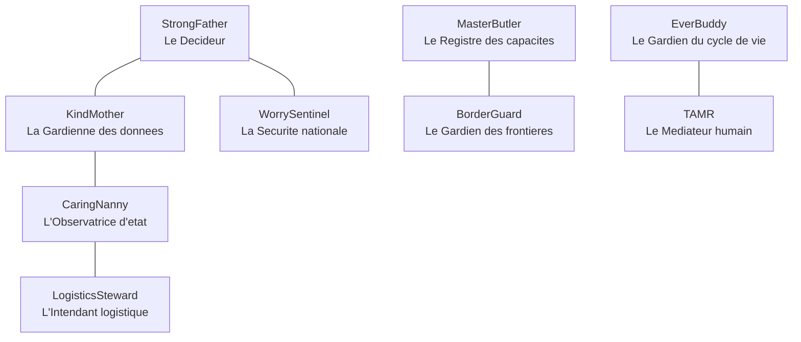
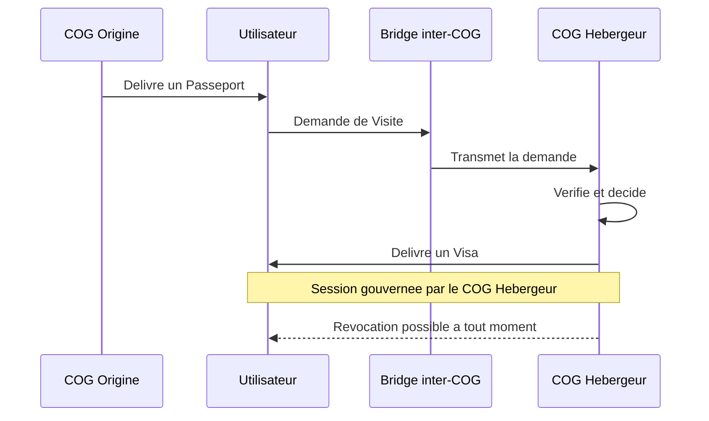
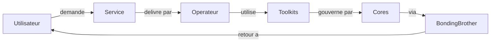
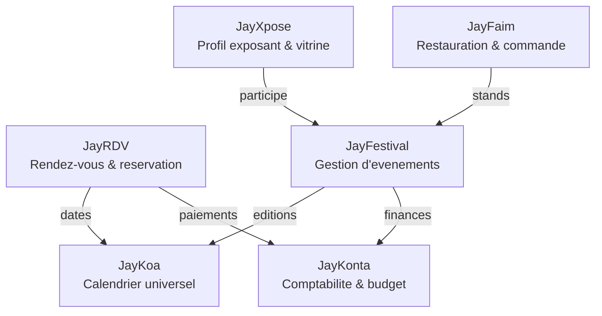
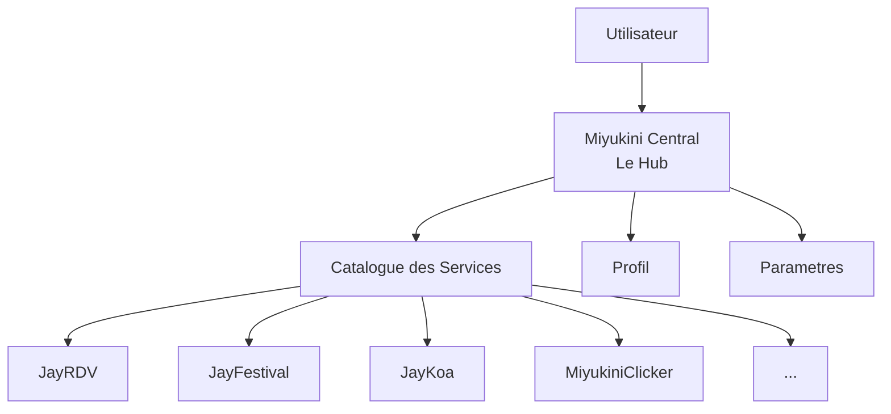

# Miyukini COG

> *"Miyukini is not an OS. It's the cog that makes digital systems work together."*

**Miyukini** est un **COG** — un **Core-Orchestrated Governance Environment**. Ce n'est pas un framework, pas une bibliotheque, pas un OS. C'est un **ecosysteme logiciel gouverne** : un environnement complet dans lequel des entites logicielles operent selon des regles strictes, des contrats verifiables, et une gouvernance centralisee — du noyau technique jusqu'a l'interface utilisateur.

---

## Sommaire

0. [L'Experience Vibe Coding — Un projet entierement pilote par IA](#0-lexperience-vibe-coding--un-projet-entierement-pilote-par-ia)  
   - [Workflow de l'auteur — Outillage et process](#workflow-de-lauteur--outillage-et-process)  
   - [Mon histoire — Du non-codeur a l'ecosysteme](#mon-histoire--du-non-codeur-a-lecosysteme)
1. [La Philosophie — Pourquoi Miyukini existe](#1-la-philosophie--pourquoi-miyukini-existe)
2. [L'Ampleur du Projet — Ce qui est construit](#2-lampleur-du-projet--ce-qui-est-construit)
3. [Les Strates — Comment tout s'organise](#3-les-strates--comment-tout-sorganise)
4. [Les Mecanismes Inedits](#4-les-mecanismes-inedits)
5. [Les Toolkits — La boite a outils universelle](#5-les-toolkits--la-boite-a-outils-universelle)
6. [Les Operateurs — Les executants gouvernes](#6-les-operateurs--les-executants-gouvernes)
7. [Les Services — Ce que l'utilisateur voit](#7-les-services--ce-que-lutilisateur-voit)
8. [Miyukini Central — Le point d'entree](#8-miyukini-central--le-point-dentree)
9. [Services implementes — Detail fonctionnel](#9-services-implementes--detail-fonctionnel)
10. [Etat des lieux du projet](#10-etat-des-lieux-du-projet)
11. [Documentation de reference](#11-documentation-de-reference)
12. [Licence](#12-licence)

---

## 0. L'Experience Vibe Coding — Un projet entierement pilote par IA

### Le pari : construire un ecosysteme logiciel complet en Vibe Coding

Miyukini COG est, a notre connaissance, l'un des **plus gros projets entierement concu et implemente en Vibe Coding** — c'est-a-dire en pilotage integral par agents IA, sous supervision humaine.

L'intégralite du code Rust (70+ crates, 49 Toolkits, 9 Cores, des milliers de fichiers), de la documentation (1000+ pages), de l'architecture, et des protocoles a ete produite par des **modeles de langage** (Claude, GPT-4, Gemini) utilises comme **agents de developpement** dans Cursor IDE — et non comme simples assistants de completion.

> **Vibe Coding** : le developpeur humain ne tape plus de code. Il definit l'intention, la vision, les contraintes. L'IA genere, structure, implemente. L'humain supervise, valide, oriente.

### Pourquoi c'est remarquable

Ce projet n'est pas une demo, un prototype, ou un side-project. C'est un **ecosysteme logiciel complet** avec :
- Une **architecture en strates** (8 niveaux, du Kernel aux Services)
- **9 Cores de gouvernance** fonctionnels
- **49 Toolkits** implementes comme crates Rust
- **6 Services utilisateur** avec backend et interface graphique
- **2 jeux complets** jouables (MiyukiniClicker, MiyukiniSurvivor)
- Un **Hub desktop natif** (Miyukini Central)
- Un **serveur de donnees chiffre** (KindMother) avec protocole TCP/JSON
- **1000+ pages** de documentation conceptuelle, technique et de marche

Tout cela produit en **Vibe Coding**, avec un seul developpeur humain qui orchestre les agents IA.

### Le probleme : comment faire du Vibe Coding a grande echelle ?

Le Vibe Coding fonctionne bien pour un script, un composant, un petit projet. Mais a l'echelle d'un ecosysteme de 70+ crates avec des milliers de fichiers, **les agents IA perdent le contexte**, inventent des conventions, et divergent les uns des autres.

Miyukini a resolu ce probleme en creant **des protocoles et des outils specifiquement concus pour les agents IA** :

### Les protocoles inventes pour piloter les IA

#### MSCM — Miyukini Semantic Code Markup

Un **systeme de balisage semantique** integre directement dans les commentaires du code source :

```rust
//! @id toolkit.auth.miyauth
//! @role security
//! @layer domain
//! @human Kit d'outils d'authentification
//! @do manage_authentication_and_identity
```

Chaque bloc de code porte ses propres metadonnees semantiques : identifiant unique, role, couche architecturale, description humaine, et description fonctionnelle. Les agents IA peuvent ainsi **comprendre le code sans lire des milliers de fichiers** — ils interrogent les balises.

#### MIP — MSCM Index Protocol

Un **systeme d'indexation structurelle globale** genere automatiquement a partir du code balise MSCM :

```
mscm_index/
├── registry.json      # Gouvernance (version, integrite)
├── blocks.json        # Identite semantique de chaque bloc
├── hierarchy.json     # Structure parent-enfant
├── graph.json         # Relations transverses
├── domains.json       # Vision metier par domaine
├── layers.json        # Architecture technique par couche
├── dependencies.json  # Dependances logiques
├── files.json         # Cartographie code → blocs
└── stats.json         # Metriques globales
```

Le MIP transforme le codebase en un **graphe semantique exploitable par IA** : memoire structurelle du projet, modele de navigation, couche de gouvernance. Un agent IA peut comprendre l'architecture globale du projet **en lisant un seul fichier JSON** au lieu de parcourir des centaines de fichiers source.

> *"La semantique est dans le code (MSCM). La structure est dans l'index (MIP). La gouvernance est dans le graphe."*

#### Prompt Protocols — Protocoles de pilotage des agents IA

Trois protocoles normatifs definissent **comment les agents IA doivent travailler** sur le projet :

| Protocole | Role |
|-----------|------|
| **Protocole d'Implementation Generale** | Cycle obligatoire en 4 phases : Planification → Distribution → Verification → Gel. Selection du modele IA, gestion du contexte, interdiction de toute interpretation libre. |
| **Protocole MIP** | Regles de generation et de maintenance de l'index structurel. Tout code produit DOIT etre conforme MSCM. |
| **Protocole d'Ecriture Documentaire** | Regles pour la generation de documentation conceptuelle par IA, avec nomenclature, qualite et versionnement. |

#### Skills IA — Documentation-as-Instructions

Le projet utilise des **Skills Cursor** — des fichiers de documentation structure destines specifiquement aux agents IA. Ces fichiers ne sont pas de la documentation humaine classique. Ce sont des **instructions normatives** que l'agent IA lit avant de travailler :

- **Skill Architecture** — regles de la pyramide, strates, Cores, Lois d'Autonomie
- **Skill Glossaire** — terminologie officielle, termes interdits/corrects
- **Skill MSCM/MIP** — protocole de balisage et d'indexation
- **Skill Rust Patterns** — structure standard des crates, patterns recurrents
- **Skill Documentation** — nomenclature et regles de documentation

> L'agent IA ne "devine" pas les conventions du projet. Il les **lit** dans des fichiers structures, comme un nouveau developpeur lirait un guide d'onboarding.

### Ce que cette experience demontre

1. **Le Vibe Coding est viable pour des projets complexes** — a condition d'investir massivement dans les protocoles, la documentation-as-instructions, et l'indexation semantique
2. **L'IA a besoin de contraintes formelles** — sans protocoles stricts, les agents divergent, inventent, et produisent du code incoherent
3. **La documentation devient du code** — les Skills, les Prompt Protocols, et le MSCM/MIP ne sont pas des docs passives mais des **instructions executables** qui guident les agents
4. **Un seul humain peut piloter un ecosysteme de 70+ crates** — a condition d'avoir les bons outils de gouvernance IA

### Workflow de l'auteur — Outillage et process

L'auteur du projet travaille en **Vibe Coding** avec un setup maximal : **Cursor IDE**, **Claude Code**, **Codex** et l'abonnement Cursor. Les credits (deux LLM + Cursor) sont souvent utilises a pleine capacite. Voici le process applique pour chaque nouveau service ou fonctionnalite :

1. **Documentation fondatrice** — Rediger d'abord une documentation fondamentale de l'idee : quoi, pourquoi, pour qui. L'intention est fixee avant toute ligne de code.

2. **Analyse de correspondances** — Demander aux agents s'il existe des correspondances, de la concurrence ou des solutions qui s'en approchent. Cela evite de reinventer l'existant et affine le positionnement.

3. **Analyse PR (Product / Positionnement)** — Realiser une analyse produit/positionnement. Une fois celle-ci faite et l'idee solidement documentee, on passe a l'etape suivante.

4. **Guide d'implementation et bornages** — Rediger le guide d'implementation avec des bornages clairs (perimetre, contraintes, livrables). Ce document pilote les agents pendant l'implementation.

5. **Indexation MIP** — Utiliser le protocole **MIP** (MSCM Index Protocol) pour indexer chaque bloc de code. L'IA retrouve plus rapidement l'information dans la codebase en s'appuyant sur l'index semantique plutot qu'en parcourant des milliers de fichiers.

6. **Implementation multi-agents** — Faire l'implementation avec plusieurs agents en parallele, sur plusieurs postes si necessaire. Les guides et le MIP permettent de garder la coherence malgre le travail distribue.

7. **Audit et verification des failles** — Realiser un audit et une verification des failles (vulnerabilites, incoherences). L'auteur s'appuie notamment sur **Opus 4.6** pour cette phase lorsqu'il en trouve.

8. **Variation des LLM** — En fonction des taches (doc, code, refacto, revue), varier les modeles (Claude, Codex, Cursor, etc.) pour optimiser les tokens et le rapport qualite/cout.

9. **Phase de test et passage au service suivant** — Conclure par une phase de test, puis enchaîner sur un autre service ou une autre fonctionnalite en reprenant le cycle depuis l'etape 1.

> *"Documenter d'abord. Indexer pour que l'IA navigue. Implementer en parallele. Auditer. Varier les modeles. Puis passer au suivant."*

### Mon histoire — Du non-codeur a l'ecosysteme

Je ne suis pas codeur, mais j'ai une **surface de contact avec le code** qui a ete assez importante. Dans les annees 2000, j'ai beaucoup utilise des outils comme **MyPHP**, **PHPBB**, **MySQL**. J'ai aussi fait du **modding** pour des jeux — donc je comprends la logique autour du code, sans etre celui qui ecrit les bases.

Il y a deux ans, j'ai pu tester **Loveable**. Ce fut assez revelateur, mais frustrant : tres vite, ca faisait n'importe quoi. Ensuite, j'ai ete en contact avec **Cursor**. A ce moment-la, j'ai commence a developper des sites web, des petites apps, des petits jeux — mais j'etais toujours frustre par les **dependances externes**, le fait de ne pas controler la chaîne. Du coup, je suis parti dans une **experimentation** : **Miyukini COG**. L'idee etait de controler **toute la chaîne**, du plus bas niveau possible pour moi jusqu'a l'utilisateur final.

**L'analogie du restaurant** : avant, c'etait comme si j'allais souvent manger au restaurant en ne controlant que *ou* j'allais. La, je controle le restaurant, la chaîne de distribution du restaurant, la production des ingredients, la transformation — et c'est franchisable (les differents environnements). Je controle tout au maximum, pour voir si c'est possible en vibe codant.

Au **debut du developpement** de Miyukini COG, j'etais dans un lieu **sans internet solide**, avec un debit tres bas. Je me suis dit qu'il etait interessant de partir du **postulat que l'environnement pouvait vivre en autonomie** en dehors du reseau. Il a fallu reflechir a tous les scenarios : connexion, reconnexion, fonctionnement asynchrone, etc. N'etant pas codeur, j'en ai profite pour que, au fur et a mesure du developpement, l'IA m'explique **comment fonctionne chaque chose** — quel langage utiliser, quelle dependance avoir au *compile* mais pas au *runtime*, etc. L'autonomie n'est donc pas qu'un choix de conception : c'est ne d'un contexte reel et d'une volonte d'apprendre en construisant.

> *"Controler toute la chaîne. Partir de l'autonomie comme norme. Apprendre en faisant expliquer chaque brique."*

---

## 1. La Philosophie — Pourquoi Miyukini existe

### L'allegorie de la nation numerique

Imaginez que vous construisiez un **pays** — pas une maison, pas un quartier, mais un pays entier. Ce pays a besoin d'une constitution, d'institutions, de fonctionnaires, de lois, de frontieres, d'une diplomatie. Il doit pouvoir fonctionner **meme si toutes les routes sont coupees** : pas de panique, pas d'effondrement, juste un fonctionnement degrade mais ordonne.

C'est exactement ce que fait Miyukini. Sauf que le pays est numerique, la constitution est du code, et les citoyens sont des composants logiciels.

### Le probleme que Miyukini resout

Les logiciels modernes reposent sur des hypotheses fragiles : connexion permanente, cloud toujours disponible, services tiers accessibles. Quand une de ces hypotheses tombe, tout s'effondre.

Miyukini prend le probleme a l'envers :

> **La deconnexion n'est pas une erreur a corriger. C'est un etat normal du systeme.**

Un systeme Miyukini demarre sans reseau, fonctionne sans cloud, degrade proprement en isolation, reste administrable localement, et se reconcilie quand le reseau revient — sans reconstruction.

### Les 8 Lois d'Autonomie

Ces lois sont les **invariants non negociables** de l'ecosysteme. Rien ne peut les contredire :

| Loi | Enonce |
|-----|--------|
| **LOI-1** | Aucune dependance externe critique a l'execution |
| **LOI-2** | Le systeme accepte l'isolement comme etat normal |
| **LOI-3** | L'etat local est souverain |
| **LOI-4** | Pas de temps global requis |
| **LOI-5** | Le cout doit etre proportionnel au hardware |
| **LOI-6** | L'autonomie n'empeche pas la federation |
| **LOI-7** | La strate Cores est immuable — evolution par environnement |
| **LOI-8** | Migration = diplomatie entre environnements |

> Question de conception permanente : *"Est-ce que ca fonctionne encore si le systeme est seul, lent, et isole ?"*

Documentation : [Lois d'Autonomie](docs//_index.md)

### Ce n'est pas un exercice theorique

Miyukini est un **projet experimental a grande echelle**, ecrit en **Rust**, avec une application desktop native (egui/eframe) deja fonctionnelle. Ce n'est pas un whitepaper : c'est du code qui compile, des architectures qui tournent, des mecanismes qui s'executent.

---

## 2. L'Ampleur du Projet — Ce qui est construit

Pour donner une idee de l'echelle :

```
  9 Cores de gouvernance        (les institutions du systeme)
 49 Toolkits implementes        (les outils professionnels)
 10 Services documentes          (les services publics)
  6 Services fonctionnels       (avec backend + UI)
  2 Jeux jouables               (MiyukiniClicker + MiyukiniSurvivor)
 70+ crates Rust                (les modules de code)
  3 Protocoles IA               (Implementation, MIP, Documentation)
  5 Skills Cursor               (instructions normatives pour agents IA)

1000+ pages de documentation conceptuelle
 244 analyses de marche (Odoo, etc.)
 Architecture complete en strates (de la couche 0 au sommet)
 Entierement produit en Vibe Coding (pilotage par agents IA)
```

Ce n'est pas un prototype. C'est un **ecosysteme structurel** dont l'ambition est de remplacer les CMS, SaaS, et applications silotees par un environnement souverain, gouverne, et autonome.

---

## 3. Les Strates — Comment tout s'organise

### L'allegorie du batiment gouvernemental

Pensez a un batiment de gouvernement. Au sous-sol, les fondations et les canalisations (on n'y touche jamais). Au rez-de-chaussee, les archives et le compteur electrique. Aux etages intermediaires, les ministeres. Aux etages superieurs, les fonctionnaires qui recoivent le public. Et tout en haut, le bureau du president.

La **Pyramide Miyukini** fonctionne exactement ainsi :

```mermaid
graph BT
    S0["Strate 0 — Hardware & OS<br/>La realite physique"]
    SK["Kernel — Substrat technique<br/>Id, Logger, Clock, Config"]
    S3["Strate 3 — Contrats & Invariants<br/>Les principes architecturaux"]
    S4["Strate 4 — Cores Systeme<br/>Les 9 institutions de gouvernance"]
    S5["Strate 5 — Interfaces & Adaptation<br/>BondingBrother, le traducteur"]
    S6["Strate 6 — Tools & Toolkits<br/>49 boites a outils"]
    S7["Strate 7 — Operateurs<br/>Les executants gouvernes"]
    S9["Strate 9 — MiyukiniAdmin<br/>Operateur Souverain"]

    S0 --> SK
    SK --> S3
    S3 --> S4
    S4 --> S5
    S5 --> S6
    S6 --> S7
    S7 --> S9
```



**Regle fondamentale** : la dependance est strictement unidirectionnelle, du haut vers le bas. Une strate superieure peut utiliser ce qui est en dessous, mais jamais l'inverse.

| Strate | Allegorie | Role |
|--------|-----------|------|
| **0** | Le terrain | Hardware et OS — la realite physique |
| **K** | Les fondations | Kernel — identifiants, horloge, logs (zero logique metier) |
| **3** | Le reglement interieur | Contrats et invariants architecturaux |
| **4** | Les ministeres | 9 Cores qui gouvernent sans jamais executer |
| **5** | L'interprete officiel | BondingBrother traduit les intentions vers les Cores |
| **6** | La caisse a outils | 49 Toolkits — capacites executables et gouvernees |
| **7** | Les fonctionnaires | Operateurs — executent les services pour le compte de l'utilisateur |
| **9** | Le president | MiyukiniAdmin — autorite souveraine d'exception |

Documentation : [Pyramide Architecture](docs//_index.md)

---

## 4. Les Mecanismes Inedits

### 4.1 Les Cores — Les institutions qui gouvernent

Dans notre allegorie du pays, les **Cores** sont les **ministeres**. Chacun a un domaine exclusif, une autorite absolue dans ce domaine, mais **aucun pouvoir d'execution**. Ils decident, gouvernent, definissent — mais n'executent jamais.



| Core | Allegorie | Question fondamentale |
|------|-----------|----------------------|
| **StrongFather** | Le President | *"Devrait-on faire cette action ?"* |
| **KindMother** | La Gardienne des archives | *"Comment les donnees sont-elles persistees ?"* |
| **CaringNanny** | L'Infirmiere scolaire | *"Dans quel etat se trouve le systeme ?"* |
| **MasterButler** | Le Registre du cadastre | *"Qu'est-ce qui est possible dans cet environnement ?"* |
| **BorderGuard** | Le Douanier | *"Ou sont les frontieres et les regles de franchissement ?"* |
| **EverBuddy** | L'Archiviste des versions | *"Comment le systeme evolue-t-il sans se rompre ?"* |
| **WorrySentinel** | L'Agence de securite | *"Quel niveau de securite est applicable ?"* |
| **TAMR** | Le Mediateur citoyen | *"Quand l'humain a-t-il le droit d'intervenir ?"* |
| **LogisticsSteward** | L'Intendant | Gestion des ressources et logistique |

> **Regle d'or** : les Cores decident ou gouvernent, mais **n'executent jamais**.

### 4.2 Un COG — Une nation numerique souveraine

Un **COG** (Core-Orchestrated Governance Environment) n'est pas un simple programme qui tourne. C'est une **entite souveraine** — comme un pays avec sa constitution, ses frontieres et ses lois.

Chaque COG possede :
- **Une version figee de ses Cores** — sa constitution, immuable
- **Un identifiant unique** — son passeport d'Etat
- **Des frontieres strictes** — on ne rentre pas sans autorisation
- **Des Operateurs assujettis** — ses fonctionnaires, lies a ce COG uniquement

> **LOI-7** : *"La strate Cores est immuable. Toute evolution se fait par la creation d'un nouvel environnement complet."*

Pas de patch sauvage, pas de hotfix. Si le pays doit evoluer, on cree un nouveau pays complet, versionne et auditable.

**Trois niveaux d'identite :**
- **LSI** (Local Sovereign ID) — le COG se declare lui-meme (offline, totalement autonome)
- **VID** (Verified ID) — verifie par un registre global (connecte, federe)
- **WID** (Witnessed ID) — atteste par echange indirect (cle USB, QR, signature)

Documentation : [Definition COG](docs//_index.md) | [Souverainete](docs//_index.md)

### 4.3 Les protocoles Inter-COG — La diplomatie numerique

Comment deux pays souverains echangent-ils sans fusionner leurs gouvernements ? Par la **diplomatie**. C'est exactement ce que font les COG.



L'allegorie est limpide :
- **Passeport Utilisateur** — delivre par votre pays d'origine, prouve qui vous etes. **Ne donne aucun droit.**
- **Demande de Visite** — votre intention d'acceder a un pays etranger (quels services, quel usage)
- **Bridge inter-COG** — l'ambassade qui transporte les documents. **Ne fait jamais confiance, ne decide jamais, transporte uniquement.**
- **Visa de Connexion** — delivre par le pays d'accueil. Definit exactement ce que vous pouvez faire, pendant combien de temps, et a quel niveau de securite (S1 a S5)

> *"Un COG n'accueille jamais une gouvernance etrangere. Il n'accueille que des visiteurs, sous visa, dans un cadre qu'il definit seul."*

**Niveaux du Visa :**

| Niveau | Nom | Usage |
|--------|-----|-------|
| **S1** | Observation | Lecture seule, spectateur |
| **S2** | Interaction controlee | Formulaires, navigation |
| **S3** | Temps reel | Jeu, collaboration live |
| **S4** | Sensible | Administration, finance |
| **S5** | Critique | MiyukiniAdmin uniquement |

Documentation : [Connexion Inter-COG](docs//_index.md)

### 4.4 Le Webway — Le reseau de galaxies

Miyukini integre un systeme de **tracking et de participation** entre COG federes grace a deux Toolkits dedies :
- **MiyuWebwayTracker** — observe et cartographie les COG accessibles dans le reseau, sans jamais modifier l'etat
- **MiyuWebwayParticipant** — gere la participation active d'un COG au reseau federe (annonce, decouverte, synchronisation gouvernee)

Ces mecanismes permettent a un COG de **decouvrir d'autres COG**, de **proposer ses services**, et de **consommer des services distants** — le tout sous gouvernance stricte, sans jamais importer de logique etrangere.

---

## 5. Les Toolkits — La boite a outils universelle

### L'allegorie de l'atelier

Un **Toolkit** (Kit d'Outils), c'est comme un **coffre a outils professionnel**. Le coffre contient des outils (tournevis, cle, perceuse). Chaque outil fait une chose precise. Le coffre les organise pour qu'ils soient plus efficaces ensemble. Mais **le coffre ne decide jamais** quoi construire — c'est le travail du menuisier (l'Operateur).

> *"Un Outil fait, mais ne decide jamais."*

### 49 Toolkits implementes

Chaque Toolkit est une crate Rust, documentee (documentation fondatrice + contrats de gouvernance + reference des outils) :

| Domaine | Toolkits |
|---------|----------|
| **Donnees & Infra** | MiyuSQL, MiyuWeb, MiyuClock, MiyuLocale, MiyuValidate, MiyuExport, MiyuSearch, MiyuJobs |
| **Identite & Social** | MiyuAuth, MiyuProfile, MiyuContacts, MiyuSocialFeed, MiyuSocialMessaging, MiyuSocialProfile, MiyuSocialModeration, MiyuStory, MiyuDiscovery |
| **Contenu & Media** | MiyuCMS, MiyuMedia, MiyuText, MiyuWidgets, MiyuForum, MiyuPolls, MiyuFeeds, MiyuBookmarks, MiyuModerationForum, MiyuAntiSpam, MiyuPM |
| **Commerce & Finance** | MiyuStore, MiyuShipping, MiyuBooking, MiyuBilling, MiyuInvoice, MiyuExpense, MiyuTreasury |
| **Point de Vente** | MiyuPosSales, MiyuPosInventory, MiyuPosAnalytics, MiyuPosLoyalty, MiyuPosKitchen, MiyuPosPayment |
| **Comptabilite** | MiyuComptaLedger, MiyuComptaReports, MiyuDeclarations |
| **Organisation** | MiyuHR, MiyuCalc, MiyuNotify, MiyuBooking |
| **Federation** | MiyuWebwayParticipant, MiyuWebwayTracker |

Documentation : [Tools et Toolkits](docs//_index.md)

---

## 6. Les Operateurs — Les executants gouvernes

### L'allegorie du fonctionnaire

Un **Operateur**, c'est comme un **fonctionnaire** dans notre pays numerique. Il execute un role precis pour le compte du citoyen (l'utilisateur). Mais contrairement a un freelance, il ne travaille jamais seul et sans cadre : il est **gouverne**, **mandate**, et **trace**.

> *"Dans Miyukini, les utilisateurs n'installent pas d'applications. Ils interagissent avec des Operateurs gouvernes qui executent des roles pour leur compte."*



**Types d'Operateurs :**

| Type | Role | Exemple |
|------|------|---------|
| **Operateur de Service** | Gere un domaine fonctionnel | CMS, Auth, Facturation |
| **Operateur d'Interface** | Expose les services a l'utilisateur | UI Web, App mobile |
| **Operateur de Domaine** | Exerce un metier precis | Blog, Catalogue, Forum |
| **Operateur d'Automatisation** | Agit automatiquement | Notifications, Planification |
| **Operateur Souverain** | Autorite systeme (exception) | MiyukiniAdmin uniquement |

**Collaboration mandatee** : les Operateurs ne collaborent jamais librement. Toute collaboration est encadree par un **Mandat de Permission** emis par StrongFather et un **Contrat d'Equipe** qui definit les flux, les types de donnees, et les niveaux de securite.

Documentation : [Operateurs et Terminologie](docs//_index.md) | [Mandats et Equipes](docs//_index.md)

---

## 7. Les Services — Ce que l'utilisateur voit

Un **Service**, c'est ce que le citoyen percoit. Il ne voit pas les ministeres (Cores), pas les coffres a outils (Toolkits), pas les procedures internes (Mandats). Il voit : *"Je veux prendre un rendez-vous"*, *"Je veux gerer mon festival"*, *"Je veux tenir ma comptabilite"*.

### La Famille Jay — Services interconnectes

Les services **Jay** sont concus pour **s'inter-polariser** : ils se couplent naturellement les uns aux autres, tout en restant independants.



| Service | Description |
|---------|-------------|
| **JayRDV** | Prise de rendez-vous et reservation en ligne (B2B2C). Creneaux, calendriers, confirmations, rappels. |
| **JayFestival** | Gestion d'evenements et festivals. Catalogue, dashboard exposant, agenda visiteur, billetterie. |
| **JayKoa** | Calendrier universel du COG. Agregue les dates de tous les services, detecte les conflits, exporte (iCal, PDF). |
| **JayKonta** | Comptabilite et budget multi-echelle. Du budget perso (JayBudget) a la comptabilite entreprise. |
| **JayXpose** | Profil exposant et site vitrine pour artisans, artistes, petites marques. S'integre dans JayFestival. |
| **JayFaim** | Reservation de tables et commande en ligne. Restaurants, traiteurs, food trucks. Se couple avec JayFestival. |

### Les Services Miyukini

| Service | Description |
|---------|-------------|
| **MiyukiniCentral** | Le Hub — point d'entree unique vers tous les services du COG |
| **MiyukiniClicker** | Jeu officiel idle/clicker + strategie. Demo de coexistence multi-services dans un COG |
| **MiyukiniSurvivor** | Jeu hybride Survivor + Tower Defense. Phase preparation, phase bataille, tours et chateau |
| **MiyukiniSales** | Ventes et devis : cycle complet devis → commandes → facturation → paiements |

---

## 8. Miyukini Central — Le point d'entree

### L'allegorie de la Mairie

**Miyukini Central**, c'est la **Mairie** de notre pays numerique. C'est la ou le citoyen se rend pour acceder aux services publics. La Mairie ne fournit pas les services elle-meme — elle les **repertorie**, les **presente**, et **oriente** le citoyen vers le bon guichet.



**Miyukini Central est une application desktop native** (egui/eframe, pur Rust) qui offre :
- Un **ecran de chargement** avec progression et phrases aleatoires
- Un **Hub** avec catalogue des services disponibles (grille ou liste)
- Une **sidebar** de recherche et filtres (categories, types)
- Des **cartes de services** avec nom, description et bouton d'ouverture
- Un systeme d'**onglets** (Hub + services ouverts)
- Des overlays **Profil** et **Parametres** (theme clair/sombre persistant)

> Miyukini Central **ne decide jamais**. Il traduit les intentions de l'utilisateur vers les Cores via BondingBrother.

---

## 9. Services implementes — Detail fonctionnel

### 9.1 Miyukini Central — Le Hub

**Crate** : `miyukini-central` | **App** : `apps/central`
**Statut** : Fonctionnel

Miyukini Central est l'**application desktop native** (Dioxus/Tauri, pur Rust) qui sert de point d'entree unique a l'ecosysteme. C'est un **Operateur d'Interface** (Strate 7) qui ne contient aucune logique metier — il orchestre et presente les Services.

**Fonctionnalites implementees** :
- **Catalogue de services** avec grille de cartes interactives (nom, description, icone, categorie)
- **Systeme d'onglets** avec keep-alive — chaque service ouvert conserve son etat meme en arriere-plan
- **Routeur de services** — navigation fluide entre Hub et services ouverts
- **Ecran de connexion** et **rite d'entree** (onboarding)
- **Profil utilisateur** et **parametres** (theme clair/sombre persistant)
- **Sidebar laterale** avec recherche et filtres par categorie/type
- **Header** avec barre d'onglets dynamique

---

### 9.2 JayFestival — Gestion d'evenements et festivals

**Crate** : `jayfestival` | **UI** : `apps/central/src/services/jayfestival/`
**Statut** : Fonctionnel (backend + UI complete)

JayFestival est un service complet de **gestion d'evenements B2B2C** — des petits marches artisanaux aux grands festivals. Il gere l'ensemble du cycle de vie d'un evenement : creation, organisation, gestion des exposants, programme, billetterie, et experience visiteur.

**Architecture multi-roles** — chaque role dispose de son propre espace :

| Role | Espace | Fonctionnalites |
|------|--------|----------------|
| **Organisateur** | Dashboard, Editions, Programme, Exposants, Plan, Budget, Equipe, Documents, Parametres, Publication | Gestion complete de l'evenement, supervision des exposants, budget et facturation |
| **Exposant** | Dashboard, Candidatures, Participations, Agenda, Factures, Documents, Compte, Fiche publique, Notifications | Candidature aux evenements, gestion de la presence, documents et paiements |
| **Visiteur** | Dashboard, Catalogue, Agenda, Activites, Billets, Reservations, Compte | Decouverte, billetterie, planification de visite |
| **Non-connecte** | Landing, Recherche, Annuaire, Evenements | Facade publique pour decouvrir les evenements |

**Integrations** :
- **JayKoa** — synchronisation des dates dans le calendrier universel
- **JayKonta** — gestion financiere (budget, factures, paiements)
- **JayXpose** — profils exposants et vitrines produits
- **MiyuBooking** — reservation de creneaux et d'emplacements
- **MiyuClock** — gestion du temps et des plannings
- **MiyuNotify** — notifications en temps reel

---

### 9.3 JayKoa — Calendrier universel

**Crate** : `jaykoa` | **UI** : `apps/central/src/services/jaykoa/`
**Statut** : Fonctionnel (backend + UI complete)

JayKoa est le **calendrier universel du COG**. Il ne cree pas d'evenements propres — il **reflete et agrege** le temps provenant de tous les autres services. C'est un miroir temporel gouverne.

**Principe fondamental** : JayKoa ne modifie jamais les donnees sources. Il projette en lecture seule les evenements de JayFestival, JayRDV, et tout autre service temporel.

**Fonctionnalites implementees** :
- **Vue Jour** — agenda detaille heure par heure
- **Vue Semaine** — grille 7 jours avec evenements positionnes
- **Vue Mois** — vue calendrier classique avec indicateurs
- **Vue Planning** — vue emploi du temps multi-agenda
- **Mini-calendrier** de navigation rapide
- **Sidebar** avec gestion des agendas (creation, activation/desactivation, couleurs)
- **Formulaire de creation d'evenement** avec champs complets
- **Service de synchronisation** — sync bidirectionnelle avec JayFestival
- **Export iCal** — compatibilite avec les calendriers externes (Google, Apple, Outlook)
- **Detection de conflits** — alerte quand des evenements se chevauchent

**Integrations** :
- **JayFestival** — reflete les dates d'editions, les creneaux exposants, le programme
- **JayRDV** — reflete les rendez-vous et reservations (en cours)

---

### 9.4 JayKonta — Comptabilite et budget

**Crate** : `jaykonta` | **UI** : `apps/central/src/services/jaykonta/`
**Statut** : Partiellement fonctionnel (Bourse complete, Comptabilite en cours)

JayKonta est le service financier unifie du COG. Il couvre deux echelles : la **gestion budgetaire personnelle** (Bourse) et la **comptabilite d'entreprise** (Compte).

**Module Bourse (fonctionnel)** :
- **Dashboard** — vue d'ensemble des finances personnelles, solde, tendances
- **Mouvements** — historique complet des transactions avec filtres et recherche
- **Recurrences** — gestion des depenses et revenus recurrents (loyer, salaire, abonnements)
- **Previsions** — projection budgetaire avec graphiques de tendance

**Module Compte (en developpement)** :
- **Journal comptable** — ecritures en partie double
- **Devis et factures** — cycle devis → facture → paiement
- **Paiements** — suivi des encaissements et decaissements

**Architecture domaine** :
- `domain/purse.rs` — modele de bourse personnelle
- `domain/account.rs` — modele de compte professionnel
- `integrations/` — contrats d'integration inter-services (CK-INT-01, CK-INT-02, CK-INT-03)
- `services/` — PurseService (logique budgetaire), AuditService (tracabilite)

---

### 9.5 JayXpose — Profil exposant et vitrine

**Crate** : `jayxpose` | **UI** : `apps/central/src/services/jayxpose/`
**Statut** : Fonctionnel (backend + UI complete)

JayXpose est le service de **profil exposant et site vitrine** pour artisans, artistes, petites marques. Il permet de creer un catalogue produit, une identite visuelle, et une fiche publique — le tout integre nativement dans JayFestival.

**Fonctionnalites implementees** :
- **Dashboard** — vue d'ensemble de l'activite exposant
- **Entreprise** — informations legales, identite, coordonnees
- **Catalogue produits** — liste, ajout, modification, suppression de produits
- **Formulaire produit** — creation detaillee avec photos, prix, categories
- **Vitrine** — presentation publique du catalogue et de la marque
- **Documents** — coffre-fort documentaire (contrats, factures, certifications)
- **Fiche publique** — profil visible par les visiteurs et organisateurs

**Integrations** :
- **JayFestival** — les exposants de JayXpose apparaissent dans les annuaires des evenements
- **KindMother** — persistance chiffree des donnees exposant

---

### 9.6 MiyukiniClicker — Jeu idle/clicker + strategie

**Crate** : `miyuclicker` | **App** : `apps/miyuclicker` | **UI** : `apps/central/src/services/miyuclicker/`
**Statut** : Fonctionnel et jouable

MiyukiniClicker est le **premier jeu officiel de l'ecosysteme Miyukini**. C'est un idle/clicker avec des elements de strategie et de gestion de cite. Il sert egalement de **demonstration technique** : un jeu complet coexistant avec des services professionnels dans un meme COG.

**Mecaniques implementees** :
- **Simulation idle** — production automatique de ressources meme en arriere-plan
- **Batiments de production** — Ferme, Scierie, Carriere, Mine, Atelier, Forge
- **Systeme de construction** — Maisons, Casernes, Guilde
- **Gestion de population** — Ouvriers, Batisseurs, Soldats
- **Systeme de combat** — affrontements tactiques
- **Carte strategique** — vue de la cite et du territoire
- **Systeme de sauvegarde** — persistence locale de la partie
- **Controle de vitesse** — acceleration du jeu (x1, x2, x5, x10)

**Architecture technique** :
- `idlesim.rs` — moteur de simulation idle (production, transformation, construction)
- `combat.rs` — systeme de combat au tour par tour
- `carte.rs` — carte strategique et exploration
- `save.rs` — serialisation/deserialisation de l'etat de jeu
- `state.rs` — machine a etats du jeu

---

### 9.7 MiyukiniSurvivor (Lord of the Castle) — Jeu Survivor/Tower Defense

**Crate** : `lord_of_the_castle` | **UI** : integration dans Central via `survivor_embed.rs`
**Statut** : Fonctionnel et jouable

MiyukiniSurvivor est un **jeu hybride Survivor + Tower Defense** ou le joueur protege un chateau contre des vagues d'ennemis. Il combine une phase de preparation strategique et une phase de bataille en temps reel.

**Mecaniques implementees** :
- **Creation de personnage** — choix de classe, personnalisation
- **Phase de preparation** — placement de tours, recrutement de troupes, ameliorations
- **Phase de bataille** — combat en temps reel avec gestion des vagues d'ennemis
- **Systeme de tours** — differents types de tours defensives avec portee et degats
- **Systeme de troupes** — unites avec competences et comportement IA
- **Ennemis varies** — types multiples avec comportements distincts
- **Boucle de jeu** — alternance preparation/bataille avec progression
- **Systeme de loot** — recompenses et butin apres les batailles
- **Competences guerrier** — arbre de competences pour le personnage principal
- **Sauvegarde** — persistence de la progression

**Architecture technique** :
- `game_loop.rs` — boucle de jeu principale (tick de bataille)
- `game_state.rs` — etats du jeu (menu, preparation, bataille, victoire, defaite)
- `towers.rs`, `troops.rs`, `enemies.rs` — entites de jeu
- `castle.rs` — chateau et ses proprietes
- `ui/` — composants UI complets (menu, creation, aire de jeu, sidebar, overlays)
- Executable standalone pour developpement/test + integration dans Central

---

### 9.8 KindMother Service — Infrastructure de persistance chiffree

**Crates** : `kindmother-service`, `kindmother-client`, `kindmother-db-adapter`
**Statut** : Fonctionnel (infrastructure critique)

KindMother n'est pas un service utilisateur — c'est le **Core de persistance** (Strate 4) rendu operationnel comme serveur TCP. C'est le **seul point d'acces autorise aux donnees** dans tout l'ecosysteme.

**Fonctionnalites implementees** :
- **Serveur TCP/JSON** — ecoute sur localhost, protocole requete/reponse structure
- **Base de donnees chiffree** — libSQL avec chiffrement AES-256-CBC
- **Derivation de cles** — Argon2id pour la generation de cles a partir de mots de passe
- **Systeme WriteIntent** — toute ecriture passe par une intention formelle auditee
- **Controle d'acces par Operateur** — chaque Operateur n'accede qu'a ses propres donnees
- **Arbitrage** — regles de permission et de resolution de conflits

**Client** (`kindmother-client`) :
- Bibliotheque Rust pour tous les Operateurs
- Connexion TCP, envoi de requetes, reception de reponses
- Support complet du protocole WriteIntent
- Gestion d'erreurs typee

> Chaque service (JayFestival, JayKoa, JayKonta, JayXpose...) possede son propre module `data/kindmother_db.rs` qui utilise le client KindMother pour persister ses donnees de maniere chiffree et gouvernee.

---

### 9.9 MiyukiniAdmin — Console d'administration souveraine

**Crate** : `miyukini-admin`
**Statut** : Implemente (interface web)

MiyukiniAdmin est l'**Operateur Souverain** (Strate 9) — la plus haute autorite du systeme. C'est la seule entite qui peut outrepasser les regles normales de gouvernance en cas d'urgence.

**Fonctionnalites** :
- Interface d'administration web
- Gestion des Operateurs et de leurs permissions
- Supervision de l'etat du systeme
- Actions d'exception (intervention souveraine)

---

### 9.10 Tableau recapitulatif

| Service | Backend | UI | Persistance | Integrations | Statut |
|---------|---------|-----|-------------|--------------|--------|
| **Miyukini Central** | `miyukini-central` | Dioxus | — | Tous les services | Fonctionnel |
| **JayFestival** | `jayfestival` | 40+ ecrans | KindMother | JayKoa, JayKonta, JayXpose, MiyuBooking | Fonctionnel |
| **JayKoa** | `jaykoa` | 4 vues calendrier | KindMother | JayFestival, JayRDV | Fonctionnel |
| **JayKonta** | `jaykonta` | Bourse complete | KindMother | Contrats CK-INT | Partiellement fonctionnel |
| **JayXpose** | `jayxpose` | 7 sections | KindMother | JayFestival | Fonctionnel |
| **MiyukiniClicker** | `miyuclicker` | Jeu complet | Locale | — | Fonctionnel et jouable |
| **MiyukiniSurvivor** | `lord_of_the_castle` | Jeu complet | Locale | — | Fonctionnel et jouable |
| **KindMother** | `kindmother-service` | — | libSQL chiffre | Tous les services | Infrastructure critique |
| **MiyukiniAdmin** | `miyukini-admin` | Web | — | Tous les Cores | Implemente |

### Prochaine phase

Le travail se deplace vers l'**implementation des Operateurs** (Strate 7). Les Operateurs orchestreront les 49 Toolkits deja implementes — seuls ou en equipes — pour delivrer les services aux utilisateurs, sous gouvernance (StrongFather, Mandats de Permission, Contrats d'equipe).

---

## 10. Etat des lieux du projet

### Ce qui est stabilise

- La **Pyramide**, les **Cores**, les **Lois d'autonomie** et les **contrats de gouvernance** sont documentes et stabilises
- Le **Kernel** et les **9 Cores** sont implementes comme crates Rust
- Les **49 Toolkits** sont implementes (squelettes complets, logique progressive)
- **Miyukini Central** (Hub desktop) est fonctionnel avec systeme d'onglets et keep-alive
- **6 services utilisateur** fonctionnels avec backend et interface graphique
- **2 jeux complets** jouables integres dans le Hub
- **KindMother** (serveur de persistance chiffre) operationnel avec protocole TCP/JSON
- **1000+ pages** de documentation conceptuelle couvrant l'ensemble de l'architecture
- **244 analyses de marche** (dont une etude exhaustive d'Odoo module par module)
- Systeme de **balisage semantique** (MSCM) et d'**indexation structurelle** (MIP) operationnel
- **3 protocoles de pilotage IA** (Implementation, MIP, Documentation) normatifs et utilises quotidiennement
- **5 Skills Cursor** pour guider les agents IA (Architecture, Glossaire, MSCM/MIP, Rust Patterns, Documentation)

### Ce qui est en cours

- Implementation progressive de la logique metier dans les Toolkits (Phase 2)
- Module Compte (comptabilite entreprise) dans JayKonta
- Integration JayRDV dans JayKoa
- Conception produit des services restants (JayRDV, JayFaim, MiyukiniSales)
- Specification des besoins en Operateurs pour chaque service

### Ce qui reste a faire

- Implementation des **Operateurs** (Strate 7) — la couche qui orchestre les Toolkits pour delivrer les services
- **Federation inter-COG** — les protocoles sont documentes, l'implementation est a venir
- **Webway** — le reseau de decouverte et federation entre COG
- **Services supplementaires** — JayRDV, JayFaim, MiyukiniSales (documentation complete, implementation a venir)
- **Portail Web** (MiyukiniWebPortal) — facades publiques des services

### Maturite du projet

```
Documentation conceptuelle       ████████████████████  95%
Architecture (Pyramide/Cores)    ████████████████████  95%
Protocoles IA (MSCM/MIP/Skills) ██████████████████░░  90%
Kernel                           ██████████████████░░  90%
Toolkits (49 crates)             ████████████░░░░░░░░  60%
Services (implementation)        ██████████████░░░░░░  70%
Miyukini Central (Hub)           ████████████████░░░░  80%
KindMother (persistance)         ████████████████░░░░  80%
Jeux (Clicker + Survivor)        ██████████████░░░░░░  70%
Operateurs (implementation)      ████░░░░░░░░░░░░░░░░  15%
Federation inter-COG             ██░░░░░░░░░░░░░░░░░░  10%
```

---

## 11. Documentation de reference

### Documentation publique

Toute la documentation conceptuelle de reference est disponible dans le dossier `docs/public/` :

| Theme | Document |
|-------|----------|
| **Dictionnaire officiel** | [Glossaire](docs//_index.md) |
| **Qu'est-ce qu'un COG** | [Definition COG](docs//_index.md) |
| **Architecture en strates** | [Pyramide Architecture](docs//_index.md) |
| **Lois fondamentales** | [Lois d'Autonomie](docs//_index.md) |
| **Objectif du projet** | [Objectif du projet](docs//_index.md) |
| **Souverainete des environnements** | [Souverainete](docs//_index.md) |
| **Les Operateurs** | [Operateurs et Terminologie](docs//_index.md) |
| **Les outils** | [Tools et Toolkits](docs//_index.md) |
| **Collaboration gouvernee** | [Mandats et Equipes](docs//_index.md) |
| **Echanges entre COG** | [Connexion Inter-COG](docs//_index.md) |
| **Comportement des COG (schéma)** | [Comportement COG Environnements](docs//_index.md) |
| **Maintenance Kernel** | [Kernel Maintenance](docs//_index.md) |

### Protocoles IA et Vibe Coding

| Theme | Document |
|-------|----------|
| **Protocole d'implementation IA** | [Implementation generale](docs//_index.md) |
| **Protocole MIP (indexation)** | [MIP v1 MSCM Index Protocol](docs//contrats//Miyukini%20Prompt%20Protocol%20-%20Ecriture%20Documentation%20Conceptuelle.md) |
| **Protocole de documentation IA** | [Ecriture Documentation Conceptuelle](docs/contrats/Miyukini%20Prompt%20Protocol%20-%20Ecriture%20Documentation%20Conceptuelle.md) |
| **Protocole d'ecriture enrichie** | [Ecriture Enrichie Toolkits](docs/contrats/Miyukini%20Protocol%20-%20Ecriture%20Enrichie%20Toolkits.md) |
| **Index MIP genere** | `mscm_index/` (registry, blocks, hierarchy, graph, domains, layers...) |

### Pour aller plus loin (repo prive)

| Theme | Emplacement |
|-------|-------------|
| Index des Toolkits | `docs/tools/_index.md` |
| Documentation des Services | `docs/services/` |
| Documentation des Cores | `docs/cores/` |
| Analyses de marche | `docs/market/` |
| Securite | `docs/security/` |
| Skills Cursor (instructions IA) | `.cursor/skills/` |

---

## 12. Licence

Miyukini est distribue sous une **politique de licence duale** :

- **Usage domestique / personnel** (personne physique, fins non commerciales) : **gratuit** — voir [LICENSE](LICENSE)
- **Usage par une societe ou une collectivite** (entreprise, association, administration) : **licence commerciale requise**

Details : [Miyukini — Politique de licence](docs/legal/Miyukini%20-%20Politique%20de%20Licence.md)

---

> *"Miyukini n'est pas une bibliotheque. C'est un environnement gouverne dans lequel des Operateurs operent."*

**Derniere mise a jour** : 2026-02-11


