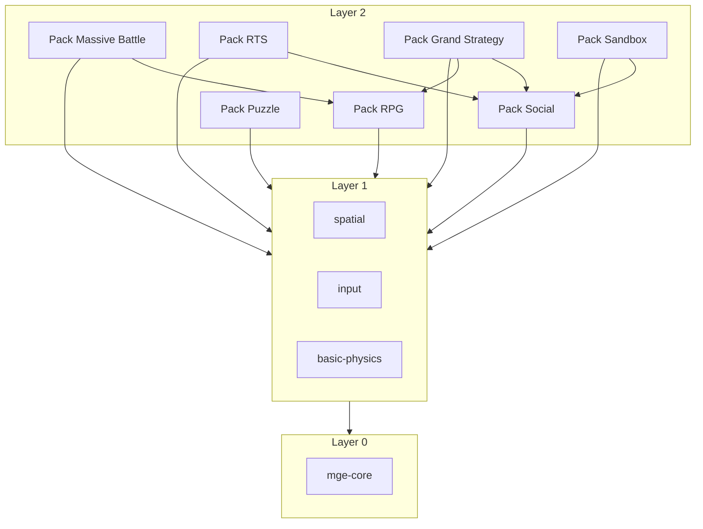

# MGE — Pack Architecture

## Contexte

Le MGE adopte une architecture par packs modulaires. Le kernel (7 crates) et le Core Universal Pack (6 crates) forment la fondation. Les 16 packs genre (~99 crates) s'empilent par composition selon les besoins du jeu.

## Portée / Scope

- **Applicable à :** Conception packs, choix dépendances, composition jeu.
- **Audience :** Architectes, développeurs moteur, développeurs tiers.
- **Statut :** Spécification normative.

---

## 1. Philosophie des packs

### Principe de composition

- **Un jeu = Kernel + Core Universal + packs genre choisis.**
- Aucun pack genre n'est obligatoire.
- Les dépendances entre packs sont déclaratives et minimales.
- Chaque pack est un ensemble de crates cohérents pour un domaine métier.

### Règles de composition

| Règle | Description |
|-------|-------------|
| **Kernel obligatoire** | mge-core, mge-time, mge-rng, mge-event, mge-ecs, mge-query, mge-profiler |
| **Core Universal recommandé** | spatial, input, render-2d, audio, basic-physics, save-load |
| **Packs genre optionnels** | Choisir selon le type de jeu |
| **Dépendances explicites** | Un pack ne peut dépendre que des packs déclarés dans son Cargo.toml |

---

## 2. Couches et dépendances

```
┌─────────────────────────────────────────────────────────────────────────┐
│  Layer 3 — GAME (Allumina, etc.)                                         │
│  Logique métier, contenu, assemblage packs                               │
└─────────────────────────────────────────────────────────────────────────┘
                                    │
                                    ▼
┌─────────────────────────────────────────────────────────────────────────┐
│  Layer 2 — GENRE PACKS (RPG, RTS, Sandbox, Puzzle, …)                    │
│  16 packs, ~99 crates. Dépendances : Core Universal ± autres packs.      │
└─────────────────────────────────────────────────────────────────────────┘
                                    │
                                    ▼
┌─────────────────────────────────────────────────────────────────────────┐
│  Layer 1 — CORE UNIVERSAL PACK (6 crates)                                │
│  spatial | input | render-2d | audio | basic-physics | save-load         │
└─────────────────────────────────────────────────────────────────────────┘
                                    │
                                    ▼
┌─────────────────────────────────────────────────────────────────────────┐
│  Layer 0 — KERNEL (7 crates)                                             │
│  mge-core | mge-time | mge-rng | mge-event | mge-ecs | mge-query | mge-profiler
└─────────────────────────────────────────────────────────────────────────┘
```

---

## 3. Dépendances inter-packs typiques



### Packs sans dépendance inter-pack

- Puzzle, Idle, Factory, Racing, Shooter, Platformer, Roguelike, Tycoon, Visual Novel, TCG

### Packs avec dépendances

- **Massive Battle** → RPG
- **RTS** → Social
- **Grand Strategy** → Social, RPG
- **Sandbox** → Social

---

## 4. Liste des 16 packs

| Pack | Répertoire | Nb crates | Dépendances |
|------|------------|-----------|-------------|
| RPG | `rpg/` | 7 | Core Universal |
| Massive Battle | `massive-battle/` | 6 | Core Universal, RPG |
| Social Simulation | `social/` | 8 | Core Universal |
| RTS | `rts/` | 8 | Core Universal, Social |
| Grand Strategy | `grand-strategy/` | 10 | Core Universal, Social, RPG |
| Puzzle | `puzzle/` | 9 | Core Universal |
| Sandbox | `sandbox/` | 9 | Core Universal, Social |
| Platformer | `platformer/` | 6 | Core Universal |
| Shooter | `shooter/` | 5 | Core Universal |
| Roguelike | `roguelike/` | 4 | Core Universal, RPG (optionnel) |
| Racing | `racing/` | 4 | Core Universal |
| Factory | `factory/` | 4 | Core Universal |
| Idle | `idle/` | 5 | Core Universal |
| Tycoon | `tycoon/` | 4 | Core Universal |
| Visual Novel | `visual-novel/` | 6 | Core Universal |
| TCG | `tcg/` | 5 | Core Universal |

---

## 5. Règles de composition

### Assemblage minimal (headless)

```rust
// Simulation pure, sans rendu
engine.add_plugin(MgePluginSpatial::default());
// + packs métier selon besoin
```

### Assemblage démo 2D jouable

```rust
engine.add_plugin(MgePluginSpatial::default());
engine.add_plugin(MgePluginInput::default());
engine.add_plugin(MgePluginRender2d::default());
engine.add_plugin(MgePluginBasicPhysics::default());
```

### Assemblage multi-pack (ex. Allumina)

```rust
// Core Universal
engine.add_plugin(MgePluginSpatial::default());
engine.add_plugin(MgePluginInput::default());
engine.add_plugin(MgePluginRender2d::default());
engine.add_plugin(MgePluginBasicPhysics::default());
engine.add_plugin(MgePluginSaveLoad::default());
// RPG
engine.add_plugin(MgeRpgStatsPlugin);
engine.add_plugin(MgeRpgCombatPlugin);
// ...
// Social
engine.add_plugin(MgeSocialRelationshipPlugin);
engine.add_plugin(MgeSocialNeedPlugin);
// ...
// Narrative (Visual Novel partiel)
engine.add_plugin(MgeVnScriptPlugin);
engine.add_plugin(MgeVnChoicePlugin);
```

---

## 6. Documentation par pack

Chaque pack possède un document dédié :

| Document | Pack |
|----------|------|
| [MGE - Pack RPG](./packs/MGE%20-%20Pack%20RPG.md) | RPG |
| [MGE - Pack Massive Battle](./packs/MGE%20-%20Pack%20Massive%20Battle.md) | Massive Battle |
| [MGE - Pack Social Simulation](./packs/MGE%20-%20Pack%20Social%20Simulation.md) | Social |
| [MGE - Pack RTS](./packs/MGE%20-%20Pack%20RTS.md) | RTS |
| [MGE - Pack Grand Strategy](./packs/MGE%20-%20Pack%20Grand%20Strategy.md) | Grand Strategy |
| [MGE - Pack Puzzle](./packs/MGE%20-%20Pack%20Puzzle.md) | Puzzle |
| [MGE - Pack Sandbox](./packs/MGE%20-%20Pack%20Sandbox.md) | Sandbox |
| [MGE - Pack Platformer](./packs/MGE%20-%20Pack%20Platformer.md) | Platformer |
| [MGE - Pack Shooter](./packs/MGE%20-%20Pack%20Shooter.md) | Shooter |
| [MGE - Pack Roguelike](./packs/MGE%20-%20Pack%20Roguelike.md) | Roguelike |
| [MGE - Pack Racing](./packs/MGE%20-%20Pack%20Racing.md) | Racing |
| [MGE - Pack Factory](./packs/MGE%20-%20Pack%20Factory.md) | Factory |
| [MGE - Pack Idle](./packs/MGE%20-%20Pack%20Idle.md) | Idle |
| [MGE - Pack Tycoon](./packs/MGE%20-%20Pack%20Tycoon.md) | Tycoon |
| [MGE - Pack Visual Novel](./packs/MGE%20-%20Pack%20Visual%20Novel.md) | Visual Novel |
| [MGE - Pack TCG](./packs/MGE%20-%20Pack%20TCG.md) | TCG |

---

## 7. Références

| Document | Rôle |
|----------|------|
| [MGE - Architecture Générale](./MGE%20-%20Architecture%20Generale.md) | Couches globales |
| [MGE - Roadmap](./MGE%20-%20Roadmap.md) | Phases packs genre |
| [MGE - Document Fondateur](./MGE%20-%20Document%20Fondateur.md) | Vision, philosophie |

---

**Document** : MGE — Pack Architecture  
**Version** : 1.0  
**Date** : 2026-02-20  
**Statut** : Spécification normative
