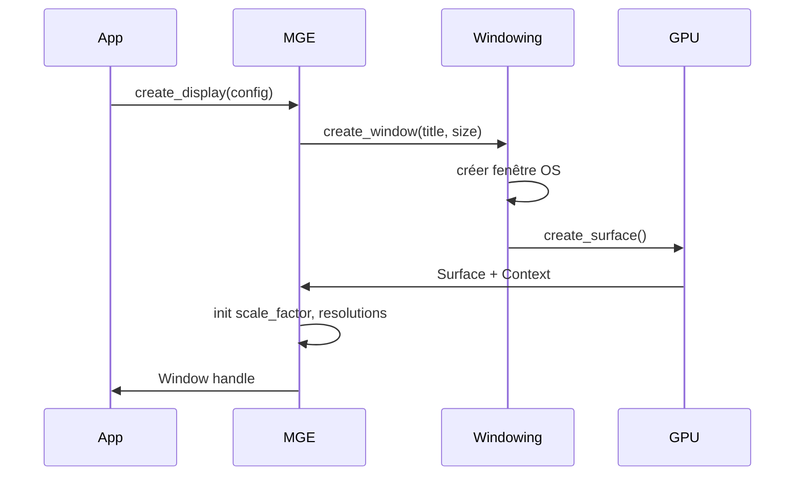
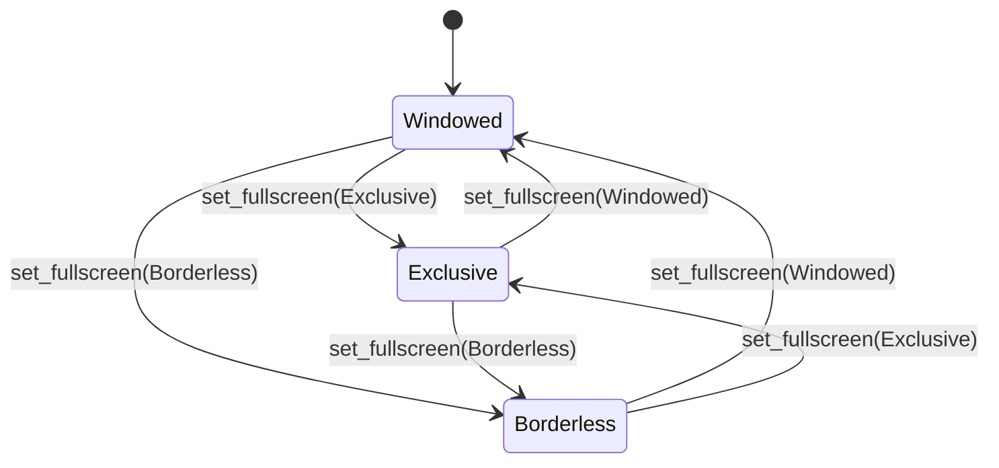
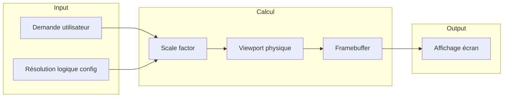

# Affichage et résolution

**Catégorie :** 1. Affichage et rendu  
**Description :** Fenêtre, résolution logique/physique, scale factor, DPI, fullscreen, VSync.  
**Référence technique :** [MGE - Référence technique](../../MGE%20-%20Miyukini%20Game%20Engine%20-%20Reference%20Technique.md)

---

## Contexte

### Rôle dans le moteur

L'affichage et la résolution constituent la base de la pipeline de rendu du MGE. Ce point définit comment la fenêtre d'application est créée, dimensionnée et présentée à l'écran, ainsi que la distinction entre l'espace de coordonnées logique du jeu et les pixels physiques affichés.

### Lien avec les autres points

| Point | Relation |
|-------|----------|
| [Coordonnées](coordonnees.md) | Les coordonnées logiques/physiques sont définies ici |
| [Caméra](camera.md) | Le viewport utilise la résolution logique |
| [Z-order / couches](z-order-couches.md) | Les calques s'affichent dans les limites du viewport |
| [Boucle de jeu](../23-systeme/boucle-jeu.md) | VSync et frame rate sont gérés dans la boucle principale |

### Référence commune

Pour les types `Resolution`, `ScaleFactor`, le cycle de rendu et les conventions, voir [MGE - Référence commune](../../MGE%20-%20Reference%20Commune.md).

---

## Portée

- Fenêtre d'application (création, redimensionnement, bordure)
- Résolution logique (espace de coordonnées du jeu)
- Résolution physique (pixels écran)
- Calcul du scale factor et gestion DPI
- Modes fullscreen (exclusif, borderless)
- Synchronisation verticale (VSync)
- Intégration avec les backends (wgpu, SDL, etc.)

---

## Spécifications techniques

### 1. Résolution logique vs physique

#### Résolution logique

Espace de coordonnées dans lequel le jeu s'affiche. Toutes les coordonnées UI et monde (après projection caméra) sont exprimées dans cet espace.

- **Valeur par défaut :** 1280×720 (16:9)
- **Contraintes :** Largeur et hauteur positives ; ratio recommandé 16:9 ou 4:3
- **Usage :** Viewport virtuel, coordonnées de sprites, calculs de position

#### Résolution physique

Nombre réel de pixels affichés sur l'écran. Dépend du moniteur, du mode fullscreen et du scale factor.

- **Formule :** `physical = logical * scale_factor` (par axe)
- **Cas multi-moniteur :** La résolution physique correspond au moniteur actif

#### Scale factor

Facteur de mise à l'échelle entre logique et physique. Voir `ScaleFactor` dans la [Référence commune](../../MGE%20-%20Reference%20Commune.md#15-scalefactor).

- **Calcul :** `scale_x = physical_width / logical_width`, `scale_y = physical_height / logical_height`
- **Mode uniforme :** `scale_x == scale_y` pour éviter la distorsion (letterbox ou pillarbox si nécessaire)
- **Mode stretch :** Permet scale différent par axe (option déconseillée pour le jeu)

### 2. DPI et scaling

- **DPI (Dots Per Inch) :** Densité de pixels de l'écran. Les écrans haute résolution (Retina, 4K) ont un DPI élevé.
- **Scale DPI :** Le système d'exploitation peut fournir un facteur DPI (ex. 125 %, 150 %) pour l'accessibilité.
- **Recommandation MGE :** Utiliser la résolution demandée par l'utilisateur ; le scale factor est calculé automatiquement. En mode fenêtré, la taille de la fenêtre détermine la résolution physique.

### 3. Fenêtre

#### Propriétés

| Propriété | Options | Détail |
|-----------|---------|--------|
| Redimensionnable | Oui / Non | Détermine si l'utilisateur peut redimensionner la fenêtre |
| Bordure | Oui / Non | Barre de titre, boutons min/max/close |
| Toujours au premier plan | Oui / Non | Utile pour les outils de configuration |
| Transparence | Optionnel | Pour des effets de bordure ou d'overlay |

#### Redimensionnement

- Lors du redimensionnement, la résolution logique peut rester fixe (scale factor change) ou s'adapter (résolution logique = taille fenêtre).
- **Mode recommandé :** Résolution logique fixe ; le scale factor s'adapte. Le jeu conserve son aspect visuel.

### 4. Modes fullscreen

#### Fullscreen exclusif (Exclusive fullscreen)

- La fenêtre prend le contrôle complet du moniteur
- Meilleure latence et performances possibles
- Pas de barre des tâches ni de bordure
- Basculement potentiellement lent entre fenêtre et fullscreen

#### Borderless fullscreen (Fullscreen fenêtré)

- Fenêtre sans bordure, taille = résolution du bureau
- Basculement instantané
- Permet l'alt-tab fluide
- Légèrement plus de latence que l'exclusif

#### Recommandation

- Proposer les deux options dans les paramètres
- Borderless par défaut pour une meilleure UX (alt-tab, second écran)

### 5. VSync (synchronisation verticale)

- **Objectif :** Éviter le screen tearing (décalage horizontal visible quand le frame rate dépasse le rafraîchissement du moniteur)
- **Fonctionnement :** Attend le signal vertical du moniteur avant de présenter la frame
- **Effet :** Limite le FPS au rafraîchissement du moniteur (60 Hz → 60 FPS max)
- **Options :** Activé / Désactivé / Adaptatif (si supporté par le GPU : G-Sync, FreeSync)
- **Recommandation :** Activé par défaut pour la majorité des utilisateurs ; option pour les joueurs souhaitant un FPS non limité

### 6. Frame rate cible

- **Cible standard :** 60 FPS
- **Cible haute fréquence :** 120 FPS ou 144 FPS pour moniteurs adaptés
- **Comportement :** Le delta time est utilisé pour les calculs de mouvement ; le jeu reste cohérent quel que soit le FPS (dans les limites du physique)

### 7. Letterbox et pillarbox

Quand le ratio de la fenêtre ne correspond pas à la résolution logique :

- **Letterbox :** Bandes noires haut/bas (fenêtre plus large que le ratio logique)
- **Pillarbox :** Bandes noires gauche/droite (fenêtre plus haute)
- **Calcul :** Déterminer le scale factor maximal qui respecte le ratio ; centrer le viewport dans la fenêtre

### 8. Multi-moniteur

- **Monitor principal :** Fenêtre créée sur le moniteur par défaut
- **Sélection :** L'utilisateur peut choisir le moniteur en options
- **Fullscreen :** S'applique au moniteur sélectionné
- **Résolution :** Chaque moniteur peut avoir sa propre résolution native

### 9. Intégration backends

| Backend | Fenêtre | Rendu | DPI |
|---------|---------|-------|-----|
| wgpu + winit | winit::Window | wgpu::Surface | window.scale_factor() |
| wgpu + SDL2 | SDL_Window | wgpu (surface) | SDL_GetDisplayDPI |
| Web (WASM) | canvas | WebGPU / WebGL | window.devicePixelRatio |

---

## Modèle de données et API

### Structures principales

```rust
/// Configuration de la fenêtre et de l'affichage
pub struct DisplayConfig {
    /// Résolution logique (espace de jeu)
    pub logical_resolution: Resolution,
    /// Mode plein écran
    pub fullscreen_mode: FullscreenMode,
    /// VSync activé
    pub vsync_enabled: bool,
    /// Titre de la fenêtre
    pub window_title: String,
    /// Icône de la fenêtre
    pub window_icon: Option<Image>,
}

#[derive(Clone, Copy, PartialEq)]
pub enum FullscreenMode {
    Windowed,
    Exclusive(MonitorId),
    Borderless(MonitorId),
}

/// État courant de l'affichage (runtime)
pub struct DisplayState {
    pub logical_resolution: Resolution,
    pub physical_resolution: Resolution,
    pub scale_factor: ScaleFactor,
    pub fullscreen_mode: FullscreenMode,
    pub vsync_enabled: bool,
}
```

### Signatures clés

```rust
/// Crée la fenêtre et le contexte de rendu
pub fn create_window(config: DisplayConfig) -> Result<Window, DisplayError>;

/// Récupère la résolution actuelle (physique)
pub fn current_resolution(&self) -> Resolution;

/// Récupère le scale factor actuel
pub fn scale_factor(&self) -> ScaleFactor;

/// Change le mode fullscreen
pub fn set_fullscreen(&mut self, mode: FullscreenMode) -> Result<(), DisplayError>;

/// Change la résolution logique
pub fn set_logical_resolution(&mut self, res: Resolution);

/// Active/désactive VSync
pub fn set_vsync(&mut self, enabled: bool);
```

### Intégration wgpu / SDL

Le MGE utilise typiquement :

- **wgpu** : API de rendu (Vulkan/Metal/DX12/WebGPU)
- **SDL2** ou **winit** : Création de fenêtre, gestion des événements, DPI

Le scale factor peut être obtenu via `window.scale_factor()` (winit) ou `SDL_GetDisplayDPI` (SDL2).

---

## Diagrammes

### Flux de création de la fenêtre



### États du mode fullscreen



### Pipeline résolution



---

## Exemples et cas d'usage

### Cas 1 : Démarrage avec résolution par défaut

```rust
let config = DisplayConfig {
    logical_resolution: Resolution { width: 1280, height: 720 },
    fullscreen_mode: FullscreenMode::Windowed,
    vsync_enabled: true,
    window_title: "Allumina".to_string(),
    window_icon: Some(load_icon("icon.png")),
};

let window = create_window(config)?;
// Le scale factor est 1.0 si la fenêtre est en 1280×720
```

### Cas 2 : Passage en fullscreen borderless

L'utilisateur active le mode plein écran. La résolution logique reste 1280×720 ; le scale factor augmente pour remplir l'écran (ex. 1920×1080 → scale 1.5). Le rendu est upscalé.

### Cas 3 : Moniteur 4K

- Résolution physique : 3840×2160
- Résolution logique : 1280×720
- Scale factor : 3.0 (ou 2.0 si préféré pour les perfs)
- Le jeu reste lisible grâce au scale ; les assets sont rendus en 1280×720 puis mis à l'échelle

### Cas 4 : Options graphiques (Allumina)

Dans les paramètres du jeu, l'utilisateur peut :
- Choisir la résolution logique (720p, 1080p, 1440p)
- Activer/désactiver VSync
- Choisir Fullscreen exclusif ou Borderless
- Le moteur applique les changements et persiste la config via KindMother

### Cas 5 : Redimensionnement dynamique

L'utilisateur redimensionne la fenêtre de 1280×720 à 800×450. La résolution logique reste 1280×720 ; le scale factor passe de 1.0 à 0.625. Letterbox ou pillarbox selon le ratio. Le jeu reste jouable sans perte de lisibilité (UI adaptative recommandée).

### Cas 6 : Mode portrait (mobile/tablette)

Pour une version mobile future, la résolution logique pourrait être 720×1280 (portrait). Le système supporte nativement les ratios non 16:9.

---

## Cas limites et tests

### Cas limites

| Cas | Comportement attendu |
|-----|----------------------|
| Fenêtre réduite à 1×1 | Clamp à une résolution minimale (ex. 320×240) ou refus |
| Changement de moniteur | Détection du nouveau moniteur ; mise à jour du scale factor |
| Perte du contexte GPU | Récupération ou message d'erreur ; recréation de la fenêtre si nécessaire |
| DPI très élevé (≈200 %) | Scale factor correct ; pas de sur-agrandissement excessif |
| Résolution logique non supportée | Fallback vers la résolution la plus proche supportée |

### Critères de validation

- [ ] La fenêtre s'affiche correctement en mode fenêtré
- [ ] Le passage en fullscreen (exclusif et borderless) fonctionne
- [ ] Le scale factor est correct après redimensionnement
- [ ] VSync limite bien le FPS au rafraîchissement du moniteur
- [ ] Les coordonnées logiques correspondent au viewport (pas de décalage)
- [ ] Le redimensionnement conserve le ratio ou applique letterbox/pillarbox selon la config
- [ ] La configuration est persistée et rechargée au prochain lancement

### Tests unitaires suggérés

```rust
#[test]
fn test_scale_factor_from_resolutions() {
    let logical = Resolution { width: 1280, height: 720 };
    let physical = Resolution { width: 1920, height: 1080 };
    let scale = ScaleFactor::from_resolutions(logical, physical);
    assert_eq!(scale.x, 1.5);
    assert_eq!(scale.y, 1.5);
}

#[test]
fn test_logical_to_physical_conversion() {
    let logical = Vec2::new(640.0, 360.0);
    let scale = ScaleFactor::uniform(2.0);
    let physical = logical * scale;
    assert_eq!(physical, Vec2::new(1280.0, 720.0));
}
```

---

## Configuration et persistance

La configuration d'affichage est persistée via KindMother (Core Miyukini pour la persistance). Au démarrage du jeu, le MGE charge la dernière configuration valide. Les options disponibles dans Allumina :

| Option | Valeurs | Persisté |
|--------|---------|----------|
| Résolution | 720p, 1080p, 1440p, natif | Oui |
| Fullscreen | Fenêtré, Borderless, Exclusif | Oui |
| VSync | On, Off | Oui |
| Moniteur | Liste des écrans | Oui |

---

## Résolutions prédéfinies

| Nom | Largeur | Hauteur | Ratio |
|-----|---------|---------|-------|
| 720p | 1280 | 720 | 16:9 |
| 1080p | 1920 | 1080 | 16:9 |
| 1440p | 2560 | 1440 | 16:9 |
| 4K | 3840 | 2160 | 16:9 |
| 480p | 854 | 480 | 16:9 |

---

## Dépannage

| Problème | Cause possible | Solution |
|----------|----------------|----------|
| Fenêtre noire | Contexte GPU non créé | Vérifier drivers, logs wgpu |
| Scale incorrect | DPI mal détecté | Forcer scale_factor ou désactiver DPI scaling |
| Tearing | VSync désactivé | Activer VSync |
| Latence élevée | Fullscreen exclusif | Essayer Borderless |
| Résolution trop petite | Résolution min non respectée | Clamp à 320×240 ou refuser |

---

## Événements fenêtre

Le MGE doit gérer les événements suivants de la fenêtre :

- `Resized(w, h)` : Recalculer scale factor et viewport
- `ScaleFactorChanged(f)` : Sur certains OS, le DPI change (déplacement entre écrans)
- `FocusLost` / `FocusGained` : Optionnel pour pause automatique
- `CloseRequested` : Confirmation sauvegarde, sortie propre

---

## Choix techniques : wgpu vs alternatives

| Option | Avantages | Inconvénients |
|--------|-----------|---------------|
| wgpu | Cross-platform (Vulkan/Metal/DX12/WebGPU), abstrait | Courbe d'apprentissage, plus complexe |
| SDL2 + OpenGL | Simple, mature | OpenGL déprécié sur certains OS |
| DirectX 11/12 | Performances Windows | Windows uniquement |
| WebGPU (WASM) | Jeu dans le navigateur | Support limité, contraintes |

Le MGE privilégie wgpu pour une base unique desktop + Web future.

---

## Checklist implémentation

- [ ] Création fenêtre avec config
- [ ] Gestion resize et scale factor
- [ ] Fullscreen exclusif et borderless
- [ ] VSync toggle
- [ ] Persistance config (KindMother)
- [ ] Gestion multi-moniteur
- [ ] Détection et fallback résolutions min
- [ ] Événements fenêtre (close, focus)

---

## Résumé des types

| Type | Rôle |
|------|------|
| `Resolution` | (width, height) en pixels |
| `ScaleFactor` | Facteur logique→physique |
| `DisplayConfig` | Config initiale fenêtre |
| `DisplayState` | État runtime |
| `FullscreenMode` | Windowed, Exclusive, Borderless |

Tous définis ou référencés dans la [Référence commune](../../MGE%20-%20Reference%20Commune.md).

---

## Comparaison avec d'autres moteurs

| Moteur | Résolution | Fullscreen | VSync |
|--------|------------|------------|-------|
| Unity | Render scale + display | Standard | Oui |
| Godot | Viewport size | Standard | Oui |
| MGE | Logical + scale | Exclusif + Borderless | Oui |
| Bevy | Window resolution | winit | Oui |

Le MGE suit une approche similaire à Godot (résolution logique fixe + scale).

---

## Références

| Document | Lien | Description |
|----------|------|-------------|
| MGE - Référence commune | [../../MGE - Reference Commune.md](../../MGE%20-%20Reference%20Commune.md) | Types Resolution, ScaleFactor, cycle de rendu |
| Coordonnées | [coordonnees.md](coordonnees.md) | Usage des résolutions dans les conversions |
| Caméra | [camera.md](camera.md) | Viewport et limites |
| Boucle de jeu | [../23-systeme/boucle-jeu.md](../23-systeme/boucle-jeu.md) | VSync, frame rate |
| Index catégorie | [_index.md](_index.md) | Tous les points affichage et rendu |
| Index MGE | [../../points/_index.md](../_index.md) | Index général des points |
