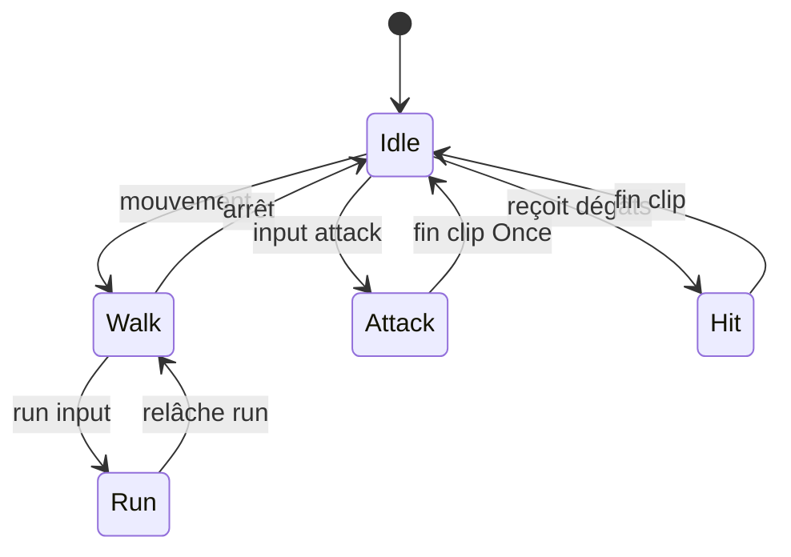
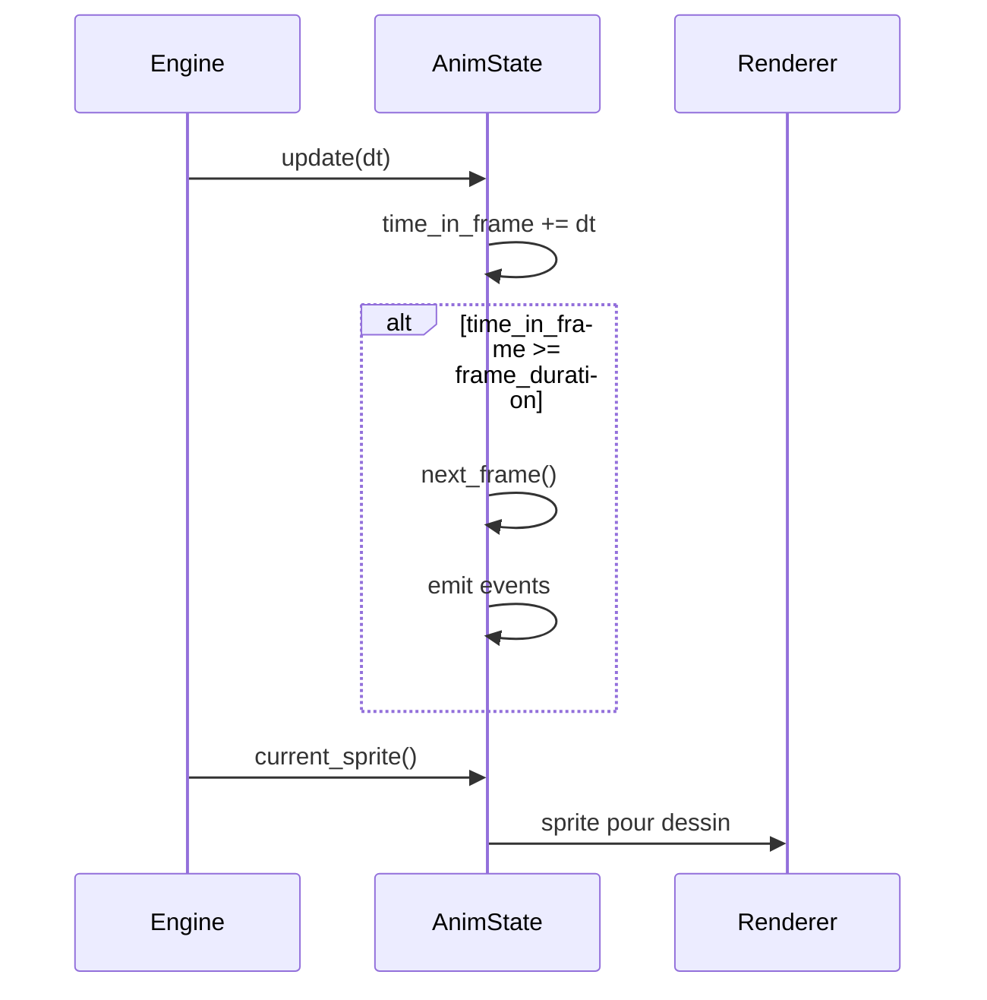
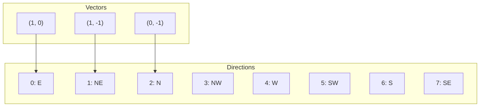

# Animations de sprites

**Catégorie :** 1. Affichage et rendu  
**Description :** Frames, boucles, transitions ; flip horizontal/vertical ; directions multiples.  
**Référence technique :** [MGE - Référence technique](../../MGE%20-%20Miyukini%20Game%20Engine%20-%20Reference%20Technique.md)

---

## Contexte

### Rôle dans le moteur

Les animations de sprites donnent vie aux entités du MGE en affichant des séquences de frames. Ce point couvre la structure des clips, les modes de boucle, les transitions entre animations, le flip (miroir) et les systèmes multi-direction (8 directions typiques pour les personnages).

### Lien avec les autres points

| Point | Relation |
|-------|----------|
| [Gestion des sprites](gestion-sprites.md) | Chaque frame est un sprite |
| [Z-order / couches](z-order-couches.md) | Sprites animés triés par couche |
| [Déplacement 8 directions](../03-deplacement-locomotion/deplacement-8-directions.md) | Direction = choix du clip d'animation |
| [Combat - Action](../07-combat/action.md) | Animations d'attaque |
| [Données joueur](../05-joueur-personnage/donnees-joueur.md) | Apparence persistante |

### Référence commune

Pour le glossaire (frame, clip, sprite) et les conventions, voir [MGE - Référence commune](../../MGE%20-%20Reference%20Commune.md).

---

## Portée

- Structure des clips d'animation
- Frames et durée
- Boucles (loop, once, ping-pong)
- Transitions (blend, instant)
- Flip horizontal / vertical
- Système de directions (8 directions)
- Triggers et événements

---

## Spécifications techniques

### 1. Structure d'un clip

Un clip est une séquence ordonnée de frames avec des paramètres de lecture.

| Paramètre | Description | Valeurs typiques |
|-----------|-------------|------------------|
| Frames | Liste de sprites ou indices | [0, 1, 2, 3] |
| FPS | Vitesse de lecture | 12, 24, 30 |
| Loop | Mode de boucle | Loop, Once, PingPong |
| Flip | Miroir appliqué | None, H, V, HV |

**Durée d'une frame :** `frame_duration = 1.0 / fps` secondes.

### 2. Modes de boucle

| Mode | Comportement |
|------|--------------|
| Loop | Repart au début à la fin ; lecture infinie |
| Once | S'arrête sur la dernière frame ; peut déclencher un événement |
| PingPong | Va et vient (0→1→2→1→0→…) |
| Clamp | Reste sur la dernière frame (similaire à Once) |

### 3. Transitions entre animations

| Type | Description | Usage |
|------|-------------|-------|
| Instant | Changement immédiat ; repart à la frame 0 | Idle → Walk |
| Blend | Fondu entre deux clips (optionnel) | Walk → Run |
| Queue | L'animation en cours finit puis la suivante démarre | Attack → Idle |
| Interrupt | La nouvelle animation écrase sans attendre | Hit → Knockback |

**Recommandation :** Par défaut, transition instantanée ; les transitions personnalisées sont configurables par paire (from_anim, to_anim).

### 4. Flip horizontal / vertical

- **Usage :** Éviter de dupliquer les sprites pour les directions gauche/droite
- **Implémentation :** Scale -1 sur l'axe ou flip UV à la texture
- **Convention :** Sprite par défaut face à droite ; flip H pour face à gauche
- **Flip V :** Moins courant ; pour effets de symétrie ou états (mort, tombé)

### 5. Directions multiples

Système classique pour les personnages en vue 2D isométrique ou top-down :

| Directions | Angles | Usage |
|------------|--------|-------|
| 4 | 0°, 90°, 180°, 270° | Simple |
| 8 | 0°, 45°, 90°, 135°, 180°, 225°, 270°, 315° | Standard MGE/Allumina |

**Mapping direction → clip :** Chaque direction peut avoir son propre sprite sheet ou suffixe de nom : `hero_walk_ne`, `hero_walk_e`, etc. Ou un seul sheet avec 8 lignes (une par direction).

**Angle depuis le vecteur de mouvement :** `angle = atan2(dy, dx)` ; conversion en index de direction (0..7). Pour l'orientation des PNJ, la vitesse de rotation et les axes : voir [orientation-rotation](../03-deplacement-locomotion/orientation-rotation.md).

### 6. Événements (triggers)

- **Frame event :** Déclenchement à une frame précise (ex. frame 3 = contact du pied pour son de pas)
- **End event :** À la fin d'un clip Once (ex. retour à Idle)
- **Usage :** Sons, spawn d'effets, détection de hit en combat

### 7. Sub-states et blocs d'animation

Les animations peuvent être organisées en états (Idle, Walk, Run, Attack). Chaque état a des transitions vers d'autres. Un State Machine ou Animation Tree gère les transitions.

### 8. Animation blending (avancé)

Pour des transitions fluides entre deux clips (ex. Walk → Run), interpoler entre les sprites des deux clips pendant une durée. Plus complexe ; optionnel pour le MVP.

### 9. Variantes par direction

Au lieu de 8 clips séparés, un seul clip peut avoir 8 "tracks" (une par direction). Le système sélectionne le track selon `direction`.

---

## Modèle de données et API

### Structures

```rust
/// Mode de boucle
#[derive(Clone, Copy, PartialEq)]
pub enum LoopMode {
    Loop,
    Once,
    PingPong,
}

/// Définition d'un clip d'animation
pub struct AnimationClip {
    pub name: String,
    pub frames: Vec<SpriteDef>,
    pub fps: f32,
    pub loop_mode: LoopMode,
    pub flip_h: bool,
    pub flip_v: bool,
    pub events: Vec<FrameEvent>,  // (frame_index, event_id)
}

pub struct FrameEvent {
    pub frame: usize,
    pub event_id: String,
}

/// État de lecture en cours
pub struct AnimationState {
    pub clip: AnimationClip,
    pub current_frame: usize,
    pub time_in_frame: f32,
    pub direction: u8,  // 0..7 pour 8 directions
    pub flip_h: bool,   // Override au runtime
}
```

### Signatures principales

```rust
/// Joue un clip (transition instantanée)
pub fn play(&mut self, clip: &str);

/// Joue un clip avec transition
pub fn play_with_transition(&mut self, clip: &str, transition: TransitionType);

/// Met à jour l'animation (delta time)
pub fn update(&mut self, dt: f32) -> Vec<FrameEvent>;

/// Définit la direction (0..7)
pub fn set_direction(&mut self, dir: u8);

/// Définit le flip manuel
pub fn set_flip(&mut self, h: bool, v: bool);

/// Vérifie si un clip Once est terminé
pub fn is_finished(&self) -> bool;

/// Obtient le sprite courant
pub fn current_sprite(&self) -> &SpriteDef;
```

### Conversion direction (vecteur → index)

```rust
pub fn direction_from_vector(v: Vec2) -> u8 {
    let angle = v.y.atan2(v.x).to_degrees();
    let normalized = ((angle + 360.0) % 360.0) / 45.0;
    (normalized.round() as u8) % 8
}
```

---

## Diagrammes

### Machine à états animations



### Lecture d'un clip



### 8 directions



---

## Exemples et cas d'usage

### Cas 1 : Personnage qui marche (Allumina)

- Vecteur mouvement (1, -0.5) → direction NE (index 1)
- Clip `hero_walk` avec variante direction 1 (ou flip du sprite E)
- Boucle Loop, 12 FPS
- À l'arrêt : transition vers `hero_idle`

### Cas 2 : Attaque avec son au contact

- Clip `hero_attack` en Once
- Frame 3 : événement "footstep" ou "slash_contact"
- Le système audio reçoit l'événement et joue le son
- À la fin du clip : retour automatique à Idle

### Cas 3 : Flip pour économiser les sprites

- Un seul sprite "hero_walk_e" (face à droite)
- Quand direction = W (4), même sprite avec flip_h = true
- Réduit par 2 le nombre de frames à dessiner

### Cas 4 : Ping-pong pour un effet

- Animation de pulsation (scale 1.0 → 1.2 → 1.0)
- PingPong évite de dupliquer les frames du milieu

### Cas 5 : Animation d'ouverture de porte

Clip Once, 6 frames. À la fin, l'événement "door_opened" déclenche le changement d'état de la porte (ouverte, collision désactivée).

### Cas 6 : Attaque avec plusieurs hits

Clip d'attaque avec events aux frames 2 et 4. Chaque frame = hitbox active pendant 1 frame. Le système de combat écoute ces events pour appliquer les dégâts.

### Cas 7 : Mort et réapparition

Clip "death" en Once. À la fin, l'entité est despawnée ou passe en état "dead". Le respawn utilise le clip "spawn" (apparition progressive).

---

## Cas limites et tests

### Cas limites

| Cas | Comportement attendu |
|-----|----------------------|
| Clip vide | Pas de crash ; sprite par défaut ou dernière connue |
| FPS = 0 | Interdit ; clamp à 1 |
| Transition vers le même clip | Reset à frame 0 ou ignoré |
| Direction invalide (> 7) | Clamp ou wrap |
| Delta time très grand | Avancer de plusieurs frames ; émettre les events |

### Critères de validation

- [ ] Les animations bouclent correctement (Loop, Once, PingPong)
- [ ] La direction change bien le sprite affiché
- [ ] Le flip s'affiche correctement
- [ ] Les événements de frame sont émis au bon moment
- [ ] La transition instantanée ne laisse pas de frame intermédiaire bizarre
- [ ] Le delta time variable ne déforme pas la vitesse perçue (FPS fixe)

### Tests

```rust
#[test]
fn test_direction_from_vector() {
    assert_eq!(direction_from_vector(Vec2::new(1.0, 0.0)), 0);   // E
    assert_eq!(direction_from_vector(Vec2::new(0.0, -1.0)), 2);  // N
    assert_eq!(direction_from_vector(Vec2::new(-1.0, 0.0)), 4);   // W
}

#[test]
fn test_loop_mode() {
    let mut state = AnimationState::new(clip_loop);
    state.update(1.0); // Plusieurs frames
    assert!(!state.is_finished());
    
    let mut state_once = AnimationState::new(clip_once);
    for _ in 0..100 { state_once.update(0.1); }
    assert!(state_once.is_finished());
}
```

---

## Convention de nommage des clips

Format : `{entity}_{state}_{direction?}`

- `hero_idle`, `hero_walk`, `hero_attack`
- `hero_walk_e`, `hero_walk_ne` (si pas de flip)
- `enemy_goblin_hit`, `enemy_goblin_death`

---

## Intégration avec le système de combat

Les animations d'attaque sont synchronisées avec les hitboxes :

1. Le clip "attack" a des events "hit_start" et "hit_end" à des frames précises
2. Le système de combat active la hitbox entre ces deux frames
3. Les dégâts sont appliqués au premier frame où la hitbox touche la cible
4. L'animation continue jusqu'à la fin du clip

Cette synchronisation est cruciale pour le game feel.

---

## Fichier de définition d'animation (format proposé)

```json
{
  "entity": "hero",
  "states": [
    {
      "name": "idle",
      "clip": "hero_idle",
      "transitions": [
        { "to": "walk", "condition": "moving" }
      ]
    },
    {
      "name": "walk",
      "clip": "hero_walk",
      "direction_based": true,
      "transitions": [
        { "to": "idle", "condition": "!moving" },
        { "to": "attack", "condition": "attack_pressed" }
      ]
    }
  ]
}
```

---

## Calibration FPS

Le FPS des animations influence le feel :
- 12 FPS : Style rétro, économique
- 24 FPS : Fluide pour la plupart des jeux
- 30 FPS : Très fluide, plus d'assets

Allumina cible 24 FPS pour les personnages, 12 FPS pour les effets secondaires.

---

## State machine simplifiée

```
States: Idle, Walk, Run, Attack, Hit, Death
Transitions:
  Idle --[moving]--> Walk
  Walk --[!moving]--> Idle
  Walk --[run_held]--> Run
  Run --[!run_held]--> Walk
  Idle/Walk --[attack]--> Attack
  Attack --[clip_done]--> Idle
  * --[damaged]--> Hit
  Hit --[clip_done]--> Idle
  * --[health=0]--> Death
```

Chaque état pointe vers un ou plusieurs clips (selon direction). Les conditions sont évaluées chaque frame.

---

## Synchronisation réseau (multijoueur)

En multijoueur, les animations des autres joueurs doivent être synchronisées. Options :
1. **État partagé :** Le serveur envoie l'état courant (state, frame, direction). Les clients jouent l'animation localement.
2. **Événements :** Le serveur envoie les transitions (attack_start). Les clients déclenchent l'animation. Légère désynchronisation acceptable.
3. **Timestamp :** Chaque animation a un start_time ; les clients calculent la frame courante. Plus précis mais sensible à la latence.

Allumina utilise l'approche 1 pour le MVP.

---

## Voir aussi

- [Combat - Action](../07-combat/action.md) : Animations d'attaque, hitframes
- [Effets de statut](../08-degats-resistances/effets-statut.md) : Animations de buffs/debuffs
- [Montures](../17-montures-familiers/montures.md) : Animations spécifiques montées

---

## Références

| Document | Lien | Description |
|----------|------|-------------|
| MGE - Référence commune | [../../MGE - Reference Commune.md](../../MGE%20-%20Reference%20Commune.md) | Frame, clip, glossaire |
| Gestion des sprites | [gestion-sprites.md](gestion-sprites.md) | Frames = sprites |
| Déplacement 8 directions | [../03-deplacement-locomotion/deplacement-8-directions.md](../03-deplacement-locomotion/deplacement-8-directions.md) | Vecteur mouvement |
| Combat - Action | [../07-combat/action.md](../07-combat/action.md) | Animations d'attaque |
| Index catégorie | [_index.md](_index.md) | Points affichage |
| Index MGE | [../../points/_index.md](../_index.md) | Index général |
