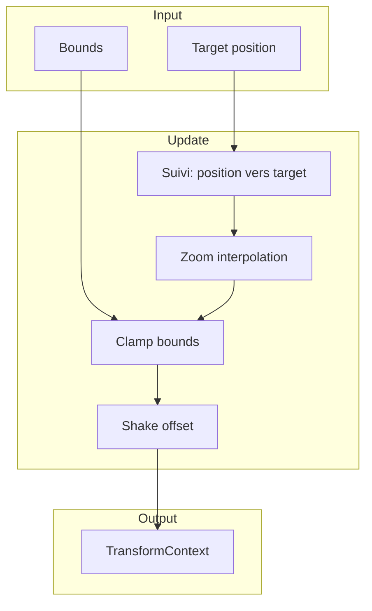
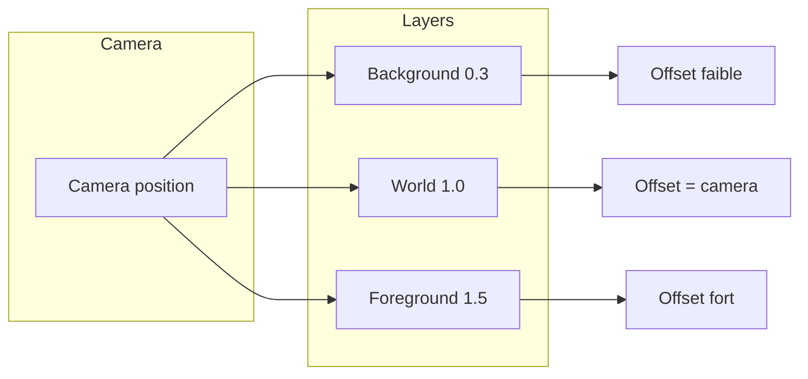
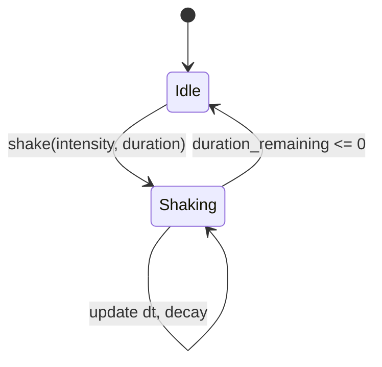

# Caméra

**Catégorie :** 1. Affichage et rendu  
**Description :** Suivi joueur ; zoom ; limites ; couches (parallax) ; shake.  
**Référence technique :** [MGE - Référence technique](../../MGE%20-%20Miyukini%20Game%20Engine%20-%20Reference%20Technique.md)

---

## Contexte

### Rôle dans le moteur

La caméra définit la vue du monde affichée à l'écran. Elle suit le joueur (ou une cible), applique zoom et limites, gère les couches de parallax pour la profondeur, et peut appliquer des effets comme le screen shake pour les impacts ou explosions.

### Lien avec les autres points

| Point | Relation |
|-------|----------|
| [Coordonnées](coordonnees.md) | Transformation monde ↔ écran |
| [Affichage et résolution](affichage-resolution.md) | Viewport et résolution |
| [Z-order / couches](z-order-couches.md) | Couches et parallax |
| [Déplacement joueur](../03-deplacement-locomotion/deplacement-8-directions.md) | Cible du suivi |
| [Données joueur](../05-joueur-personnage/donnees-joueur.md) | Position du personnage |

### Référence commune

Pour `Vec2`, `Rect`, `TransformContext` et le cycle de rendu, voir [MGE - Référence commune](../../MGE%20-%20Reference%20Commune.md).

---

## Portée

- Suivi du joueur (centré, offset, doux)
- Zoom (niveaux, interpolation)
- Limites (bounds) de la caméra
- Parallax par couche
- Screen shake (intensité, durée)
- Vue cinématique (optionnel)

---

## Spécifications techniques

### 1. Suivi du joueur

#### Mode centré

La caméra est toujours centrée sur la cible.
- **Position caméra = position cible**
- Pas de lag ; réactivité maximale
- Convient aux jeux rapides (action, plateforme)

#### Mode offset

Décalage par rapport à la cible (ex. personnage en bas de l'écran, plus de vue devant).
- **Position caméra = position cible + offset**
- Offset typique : (0, -100) pour voir plus haut
- Utile pour les jeux de tir ou de exploration

#### Mode doux (smooth follow)

Interpolation entre la position actuelle de la caméra et la position cible.
- **Position caméra += (cible - position) * factor * dt**
- `factor` : 5..20 typiquement ; plus élevé = plus réactif
- Réduit les secousses ; sensation plus cinématique

### 2. Zoom

| Paramètre | Description | Valeurs typiques |
|-----------|-------------|------------------|
| Zoom level | Facteur de zoom (1.0 = nominal) | 0.5 .. 2.0 |
| Interpolation | Transition douce entre niveaux | Lerp exponentiel |
| Limites | Bornes min/max | 0.25 .. 4.0 |

**Effet :** Zoom &lt; 1 = dézoomer (voir plus) ; zoom &gt; 1 = zoomer (voir moins mais plus grand).

### 3. Limites (bounds)

La caméra ne peut pas sortir des limites du monde (ou de la zone jouable).

- **Bounds :** Rectangle monde (x_min, y_min, x_max, y_max)
- **Clamp :** `camera_pos = clamp(camera_pos, bounds)`
- **Viewport-aware :** Les limites tiennent compte de la taille du viewport et du zoom (la caméra s'arrête quand les bords du monde atteignent les bords de l'écran)

**Formule :** 
```
camera_x = clamp(camera_x, bounds.x_min + viewport_w/(2*zoom), bounds.x_max - viewport_w/(2*zoom))
```

### 4. Parallax par couche

Chaque couche (arrière-plan, avant-plan) a un facteur de parallax.

- **Facteur 0 :** Couche fixe (ne bouge pas avec la caméra) — ciel, décor lointain
- **Facteur 1 :** Couche principale — monde, entités
- **Facteur &gt; 1 :** Avant-plan — se déplace plus vite que la caméra

**Formule :** `layer_offset = (camera_pos - default_pos) * parallax_factor`

Les couches avec parallax &lt; 1 se déplacent moins vite (profondeur) ; parallax &gt; 1 plus vite (avant-plan proche).

### 5. Screen shake

Décalage aléatoire de la position de la caméra pour les impacts.

- **Intensité :** Amplitude du décalage (en pixels monde ou écran)
- **Durée :** Temps total du shake
- **Décroissance :** Linéaire ou exponentielle sur la durée
- **Fréquence :** Nombre de "secousses" par seconde

**Implémentation :** À chaque frame, ajouter un offset aléatoire `(rand(-intensity, intensity), rand(-intensity, intensity))` où `intensity` décroît avec le temps restant.

### 6. Vue cinématique (optionnel)

- Découpage en waypoints
- Interpolation entre waypoints
- Utilisation : intro, cutscenes, déplacements scriptés

### 7. Délai de suivi (look-ahead)

Pour les jeux où le joueur se déplace souvent dans une direction, la caméra peut anticiper : target = position + velocity * look_ahead_time. Réduit la sensation de "caméra qui traîne derrière".

### 8. Dead zone

Une zone morte autour de la cible : la caméra ne bouge que si la cible sort de cette zone. Utile pour les jeux à défilement où de petits mouvements ne doivent pas déplacer la vue.

### 9. Zoom dynamique

Le zoom peut varier selon le contexte : combat de boss (zoom out), dialogue (zoom in sur le PNJ). Transition fluide sur 0.3–0.5 s.

---

## Modèle de données et API

### Structures

```rust
/// Mode de suivi
#[derive(Clone, Copy, PartialEq)]
pub enum FollowMode {
    Instant,    // Centré strict
    Offset(Vec2),
    Smooth { factor: f32 },
}

/// Configuration de la caméra
pub struct CameraConfig {
    pub follow_mode: FollowMode,
    pub zoom: f32,
    pub zoom_min: f32,
    pub zoom_max: f32,
    pub bounds: Option<Rect>,
    pub viewport: Rect,
}

/// État runtime
pub struct CameraState {
    pub position: Vec2,
    pub zoom: f32,
    pub target: Option<Vec2>,
    pub shake: ShakeState,
}

pub struct ShakeState {
    pub intensity: f32,
    pub duration_remaining: f32,
    pub decay: ShakeDecay,
}

pub enum ShakeDecay {
    Linear,
    Exponential { factor: f32 },
}

/// Couche avec parallax
pub struct ParallaxLayer {
    pub layer_id: LayerId,
    pub parallax_factor: f32,
}
```

### Signatures principales

```rust
/// Met à jour la caméra (à appeler chaque frame)
pub fn update(&mut self, dt: f32);

/// Définit la cible de suivi
pub fn set_target(&mut self, target: Option<Vec2>);

/// Définit le zoom (avec interpolation)
pub fn set_zoom(&mut self, zoom: f32);

/// Définit les limites
pub fn set_bounds(&mut self, bounds: Option<Rect>);

/// Déclenche un screen shake
pub fn shake(&mut self, intensity: f32, duration: f32);

/// Obtient le transform context pour world_to_screen
pub fn transform_context(&self) -> TransformContext;

/// Position effective (avec shake)
pub fn effective_position(&self) -> Vec2;
```

---

## Diagrammes

### Pipeline de la caméra



### Parallax



### Shake



---

## Exemples et cas d'usage

### Cas 1 : Suivi fluide du joueur (Allumina)

- Mode Smooth, factor 10
- Cible = position du personnage
- Bounds = limites de la carte (zone jouable)
- La caméra suit sans à-coups

### Cas 2 : Zoom sur un boss

- Au déclenchement du combat : zoom 0.8 pour voir le boss et le joueur
- À la fin : retour à zoom 1.0
- Interpolation sur 0.5 s

### Cas 3 : Parallax forêt

- Couche "ciel" : parallax 0 — fixe
- Couche "arbres lointains" : parallax 0.3 — légère profondeur
- Couche "sol" : parallax 1.0 — monde principal
- Couche "herbe avant" : parallax 1.2 — avant-plan

### Cas 4 : Shake à l'impact

- Joueur reçoit un coup : `camera.shake(4.0, 0.2)`
- Explosion : `camera.shake(8.0, 0.4)`
- Décroissance exponentielle pour un effet naturel

### Cas 5 : Cutscene fixe

Pour une scène narrative, la caméra se fixe sur une position sans suivre le joueur. `set_target(None)` et `set_position(fixed_pos)`.

### Cas 6 : Caméra en salle (donjon)

Chaque salle a une position de caméra prédéfinie. À l'entrée, la caméra snap ou smooth vers cette position. Bounds = limites de la salle.

### Cas 7 : Shake cumulatif

Plusieurs impacts rapides (combo) peuvent déclencher des shakes successifs. Les intensités se cumulent avec une limite max.

---

## Cas limites et tests

### Cas limites

| Cas | Comportement attendu |
|-----|----------------------|
| Target hors bounds | La caméra reste clampée ; la cible peut sortir du centre |
| Zoom hors limites | Clamp à zoom_min/zoom_max |
| Bounds plus petits que viewport | Centrer ; affichage correct |
| Shake pendant transition | Les deux effets se cumulent |
| Target None | La caméra reste sur sa position actuelle (ou dernière) |

### Critères de validation

- [ ] La caméra suit correctement la cible (tous modes)
- [ ] Les limites sont respectées
- [ ] Le parallax produit un effet de profondeur visible
- [ ] Le shake décroît et s'arrête
- [ ] world_to_screen / screen_to_world sont cohérents avec la caméra

### Tests

```rust
#[test]
fn test_camera_bounds_clamp() {
    let mut cam = Camera::new(config_with_bounds(Rect::new(0, 0, 1000, 1000)));
    cam.set_target(Some(Vec2::new(2000.0, 500.0)));
    cam.update(1.0);
    assert!(cam.position.x <= 1000.0); // Clampé
}

#[test]
fn test_shake_decay() {
    let mut cam = Camera::new(config());
    cam.shake(10.0, 1.0);
    let pos_before = cam.effective_position();
    cam.update(1.0); // Fin de la durée
    assert!(!cam.shake_active());
}
```

---

## Paramètres Allumina (exemple)

| Paramètre | Valeur | Note |
|-----------|--------|------|
| Follow mode | Smooth factor 10 | Réactif sans secousses |
| Zoom default | 1.0 | |
| Zoom combat boss | 0.8 | Plus de vue |
| Shake hit | 4.0, 0.2s | |
| Shake explosion | 8.0, 0.4s | |
| Bounds | Zone jouable par carte | |

---

## Implémentation du smooth follow

```rust
fn update_smooth(&mut self, target: Vec2, dt: f32) {
    let diff = target - self.position;
    self.position += diff * (self.factor * dt).min(1.0);
}
```

Avec `factor = 10` et 60 FPS, environ 50% de la distance est couverte par frame. Ajustable selon le feel souhaité.

---

## Implémentation du shake

```rust
fn apply_shake(&self) -> Vec2 {
    if self.shake_duration <= 0.0 { return Vec2::zero(); }
    let t = self.shake_duration / self.shake_total_duration;
    let intensity = self.shake_intensity * t; // décroissance linéaire
    Vec2::new(
        rand(-intensity, intensity),
        rand(-intensity, intensity),
    )
}
```

---

## Bounds dynamiques (zones)

Pour les donjons à salles, les bounds changent à l'entrée de chaque salle. L'API `set_bounds(rect)` est appelée par le gestionnaire de zones. Transition : bounds anciennes → nouvelles sur 0.2 s pour éviter les sauts brusques.

---

## Zoom à la molette (optionnel)

Si l'input supporte la molette : incrémenter/décrémenter le zoom (ex. +/- 0.1) avec des limites. Interpolation sur 0.1 s. Désactiver pendant les cutscenes.

---

## Caméra multiple (split-screen)

Pour le co-op local, plusieurs viewports avec une caméra par joueur. Chaque caméra a sa propre cible. La résolution logique est divisée (ex. 1280×360 par joueur en 2P).

---

## Résumé des paramètres

| Paramètre | Type | Impact |
|-----------|------|--------|
| follow_mode | Enum | Instant, Offset, Smooth |
| smooth_factor | f32 | Vitesse de suivi (Smooth) |
| zoom | f32 | 1.0 = nominal |
| bounds | Rect? | Limites monde |
| viewport | Rect | Zone rendu |
| shake_intensity | f32 | Pixels de décalage |
| shake_duration | f32 | Secondes |

---

## Voir aussi

- [Instances / donjons](../04-entites-monde/instances-donjons.md) : Bounds par salle
- [Cycle jour/nuit](../18-logement-monde/cycle-jour-nuit.md) : Effets sur les couches Background
- [Météo](../18-logement-monde/meteo.md) : Couche Foreground dynamique

---

## Références

| Document | Lien | Description |
|----------|------|-------------|
| MGE - Référence commune | [../../MGE - Reference Commune.md](../../MGE%20-%20Reference%20Commune.md) | TransformContext |
| Coordonnées | [coordonnees.md](coordonnees.md) | Conversions monde/écran |
| Affichage et résolution | [affichage-resolution.md](affichage-resolution.md) | Viewport |
| Z-order / couches | [z-order-couches.md](z-order-couches.md) | Couches et parallax |
| Index catégorie | [_index.md](_index.md) | Points affichage |
| Index MGE | [../../points/_index.md](../_index.md) | Index général |
