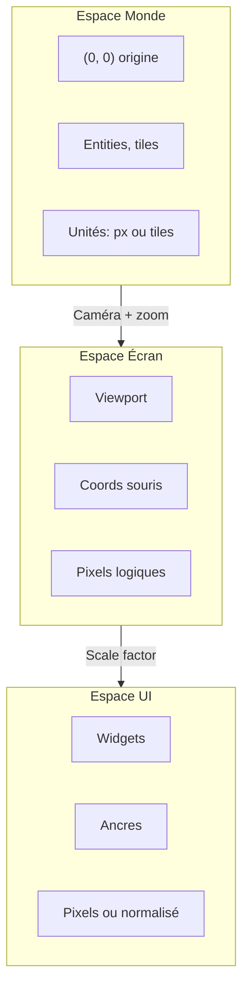
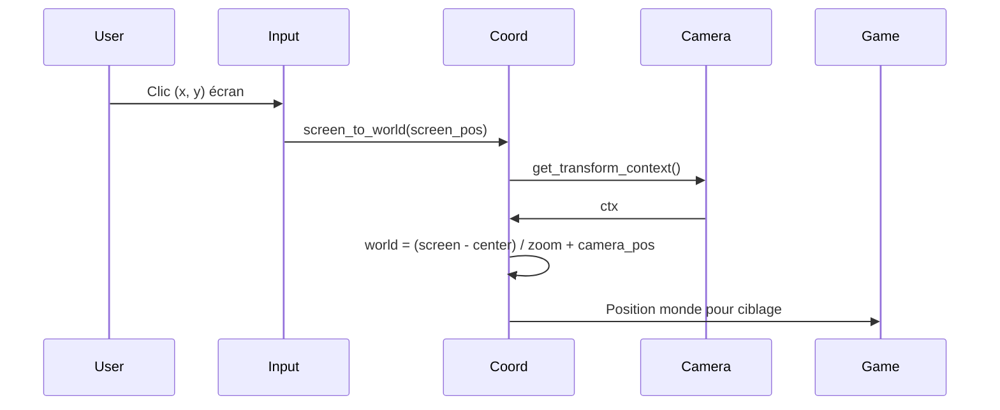
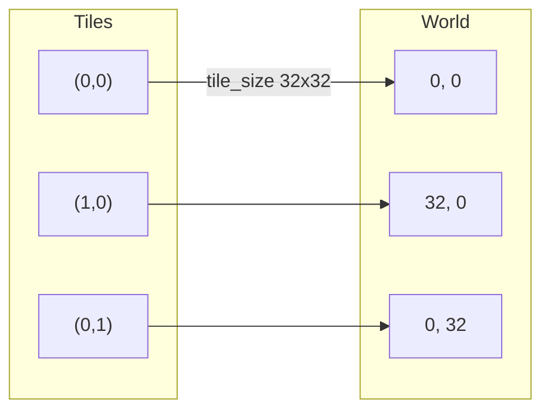

# Coordonnées

**Catégorie :** 1. Affichage et rendu  
**Description :** Système de coordonnées 2D (monde, écran, UI) ; origine ; unités (px, tiles).  
**Référence technique :** [MGE - Référence technique](../../MGE%20-%20Miyukini%20Game%20Engine%20-%20Reference%20Technique.md)

---

## Contexte

### Rôle dans le moteur

Le système de coordonnées définit les espaces dans lesquels le MGE opère : monde du jeu, écran visible et interface utilisateur. Les conversions entre ces espaces sont essentielles pour le positionnement des entités, le ciblage à la souris, le rendu de la caméra et l'ancrage des widgets UI.

### Lien avec les autres points

| Point | Relation |
|-------|----------|
| [Affichage et résolution](affichage-resolution.md) | Résolution logique/physique détermine les bornes écran |
| [Caméra](camera.md) | Transformation monde → écran |
| [Hitbox](../02-physique-collisions/hitbox.md) | Hitbox exprimée en coordonnées monde |
| [Monde tile-based](monde-tile-based.md) | Unité tile et grille |
| [GUI](../20-interface/gui.md) | Coordonnées UI |

### Référence commune

Pour les types `Vec2`, `Rect`, `IVec2`, les systèmes monde/écran/UI et les conventions, voir [MGE - Référence commune](../../MGE%20-%20Reference%20Commune.md).

---

## Portée

- Définition des repères monde, écran et UI
- Origine et orientation des axes
- Unités (pixels, tiles)
- Conversions entre systèmes
- Gestion des ancrages (pivot)

---

## Spécifications techniques

### 1. Système monde (world space)

#### Origine

- **Par défaut :** Coin supérieur gauche de la carte (0, 0)
- **Variante :** Centre de la carte pour certains jeux
- **Convention MGE :** Origine en haut-gauche ; X croît vers la droite ; Y croît vers le bas (convention écran)

#### Unités

| Mode | Unité | Exemple |
|------|-------|---------|
| Pixel | 1 u = 1 px logique | Jeux en pixels (platformer, shoot'em up) |
| Tile | 1 u = 1 tuile (taille fixe) | Jeux tile-based (RPG, stratégie) |

En mode tile, la position monde en pixels = `(tile_x * tile_width, tile_y * tile_height)`.

#### Limites

- Monde potentiellement infini (chunks) ou borné (carte fixe)
- Les entités ont des coordonnées monde continues (f32)

### 2. Système écran (screen space)

#### Origine

- Coin supérieur gauche du viewport (zone où le monde est rendu)
- Coordonnées (0, 0) à (viewport_width, viewport_height)

#### Unité

- Pixels logiques (avant scale vers résolution physique)
- Les coordonnées souris sont fournies en écran ; conversion nécessaire pour le monde

#### Transformation monde → écran

```
screen_x = (world_x - camera_x) * zoom + viewport_center_x
screen_y = (world_y - camera_y) * zoom + viewport_center_y
```

La caméra définit `camera_x`, `camera_y`, `zoom` et le viewport.

### 3. Système UI (UI space)

#### Modes

| Mode | Description | Usage |
|------|-------------|-------|
| Pixels | Coordonnées en px logiques | Positions absolues |
| Normalisées | (0,0) à (1,1) | Position relative à l'écran |
| Ancres | Pourcentages (ex. 50%, 10%) | HUD, barres de vie |

#### Ancrage (anchor / pivot)

- Définit le point de référence du widget : `Center`, `TopLeft`, `BottomRight`, etc.
- Position du widget = point d'ancrage placé aux coordonnées données

### 4. Unité tile

- **Taille :** Configurable (ex. 32×32 px, 64×64 px)
- **Grille :** Coordonnées entières (tile_x, tile_y) ; `IVec2` en Rust
- **Conversion :** `world_pos = (tile_x * tile_width, tile_y * tile_height)` + offset si pivot au centre
- **Référence :** [Monde tile-based](monde-tile-based.md)

### 5. Écran logique → physique

Avec `ScaleFactor` (voir [Référence commune](../../MGE%20-%20Reference%20Commune.md)) :

```
physical_x = logical_x * scale_factor.x
physical_y = logical_y * scale_factor.y
```

### 6. Système de coordonnées souris

La souris fournit des coordonnées en pixels physiques (ou logiques selon l'OS). Pour le ciblage :
1. Convertir en écran logique (si physique) : `logical = physical / scale_factor`
2. Convertir écran → monde : `world = screen_to_world(logical, ctx)`
3. Optionnel : convertir monde → tuile pour pathfinding

### 7. Précision ?oating-point

Les conversions impliquent des f32. Pour des mondes très grands, les erreurs de précision peuvent s'accumuler. En tile-based, les positions cruciales (pathfinding) utilisent des entiers (IVec2) ; le f32 reste pour l'interpolation visuelle.

### 8. Offset de la caméra et shake

Le `TransformContext` inclut la position effective de la caméra (avec shake). Les conversions monde ↔ écran utilisent cette position ; le shake est donc transparent pour le game logic.

---

## Modèle de données et API

### Structures

```rust
/// Espace de coordonnées
#[derive(Clone, Copy, PartialEq)]
pub enum CoordSpace {
    World,
    Screen,
    UI,
}

/// Ancrage pour les éléments UI
#[derive(Clone, Copy, PartialEq)]
pub enum Anchor {
    TopLeft,    TopCenter,    TopRight,
    CenterLeft, Center,       CenterRight,
    BottomLeft, BottomCenter, BottomRight,
}

/// Contexte de transformation (position caméra, zoom, viewport)
pub struct TransformContext {
    pub camera_pos: Vec2,
    pub zoom: f32,
    pub viewport: Rect,
    pub scale_factor: ScaleFactor,
}
```

### Signatures de conversion

```rust
/// Monde → Écran (logique)
pub fn world_to_screen(world: Vec2, ctx: &TransformContext) -> Vec2;

/// Écran → Monde
pub fn screen_to_world(screen: Vec2, ctx: &TransformContext) -> Vec2;

/// Écran logique → physique
pub fn logical_to_physical(logical: Vec2, scale: ScaleFactor) -> Vec2;

/// Tuile → Monde (position haut-gauche de la tuile)
pub fn tile_to_world(tile: IVec2, tile_size: Vec2) -> Vec2;

/// Monde → Tuile (index de tuile)
pub fn world_to_tile(world: Vec2, tile_size: Vec2) -> IVec2;

/// Position UI avec ancrage
pub fn anchor_offset(anchor: Anchor, size: Vec2) -> Vec2;
```

### Implémentation type monde → écran

```rust
pub fn world_to_screen(world: Vec2, ctx: &TransformContext) -> Vec2 {
    let viewport = &ctx.viewport;
    let center_x = viewport.x + viewport.width / 2.0;
    let center_y = viewport.y + viewport.height / 2.0;

    Vec2::new(
        (world.x - ctx.camera_pos.x) * ctx.zoom + center_x,
        (world.y - ctx.camera_pos.y) * ctx.zoom + center_y,
    )
}
```

---

## Diagrammes

### Espaces de coordonnées



### Flux de conversion clic souris



### Grille tile



---

## Exemples et cas d'usage

### Cas 1 : Clic pour déplacer le personnage (Allumina)

1. Souris clic à (400, 300) en écran
2. `screen_to_world((400, 300))` → (1200.5, 890.2) en monde
3. Le pathfinding reçoit la position monde
4. Le personnage se déplace vers cette case

### Cas 2 : Affichage d'un PNJ à l'écran

1. PNJ en monde (1500, 920)
2. Caméra centrée sur (1400, 900), zoom 1.0
3. `world_to_screen((1500, 920))` → (640 + 100, 360 + 20) = (740, 380) en écran
4. Sprite du PNJ dessiné à (740, 380)

### Cas 3 : Barre de vie ancrée en bas-centre

- Ancrage : BottomCenter
- Taille widget : 200×20
- Position : (viewport_width/2, 20) avec offset = (-100, -20) pour centrer
- Le widget reste centré quelle que soit la résolution

### Cas 4 : Détection de la tuile sous le curseur

```rust
let screen_pos = get_mouse_position();
let world_pos = screen_to_world(screen_pos, &ctx);
let tile = world_to_tile(world_pos, tile_size);
// tile = (47, 28) pour la tuile sous la souris
```

### Cas 5 : Minimap centrée sur le joueur

La minimap affiche une vue du monde. Conversion : position joueur en monde → position dans le widget minimap (espace UI normalisé). Offset = (joueur - centre_monde) * scale_minimap.

### Cas 6 : Zone de ramassage (pick-up radius)

Le joueur ramasse les objets dans un rayon. Distance en monde : `world_pos_obj - world_pos_joueur` ; pas de conversion écran nécessaire pour la logique.

### Cas 7 : Raycast pour les projectiles (optionnel 2.5D)

Pour des effets de profondeur, un "ray" depuis la caméra vers le monde peut être utilisé. La conversion écran → monde donne le point de départ du ray.

---

## Cas limites et tests

### Cas limites

| Cas | Comportement attendu |
|-----|----------------------|
| Position hors viewport | Conversion valide ; culling géré en aval |
| Zoom = 0 | Interdit ou clamp à une valeur minimale (ex. 0.1) |
| Monde très grand | Pas de dépassement float ; utiliser f64 si nécessaire pour des mondes énormes |
| Souris hors fenêtre | Coordonnées clampées ou option « hors écran » |
| Tile_size = 0 | Erreur ou assertion |

### Critères de validation

- [ ] Un point monde converti en écran puis en monde redonne la position initiale (à la précision float près)
- [ ] Les coordonnées souris correspondent à la position monde sous le curseur
- [ ] Les ancres placent correctement les widgets aux bords et au centre
- [ ] La grille tile est cohérente (pas de décalage d'une demi-tuile)
- [ ] Le changement de résolution n'introduit pas de décalage systématique

### Tests unitaires

```rust
#[test]
fn test_world_screen_roundtrip() {
    let ctx = TransformContext {
        camera_pos: Vec2::new(100.0, 200.0),
        zoom: 1.5,
        viewport: Rect::new(0.0, 0.0, 1280.0, 720.0),
        scale_factor: ScaleFactor::uniform(1.0),
    };
    let world = Vec2::new(500.0, 400.0);
    let screen = world_to_screen(world, &ctx);
    let back = screen_to_world(screen, &ctx);
    assert!((world.x - back.x).abs() < 0.001);
    assert!((world.y - back.y).abs() < 0.001);
}

#[test]
fn test_tile_conversion() {
    let tile_size = Vec2::new(32.0, 32.0);
    let tile = IVec2::new(10, 5);
    let world = tile_to_world(tile, tile_size);
    assert_eq!(world, Vec2::new(320.0, 160.0));
    assert_eq!(world_to_tile(world, tile_size), tile);
}
```

---

## Table de conversion rapide

| Depuis | Vers | Fonction |
|--------|------|----------|
| Monde | Écran | `world_to_screen` |
| Écran | Monde | `screen_to_world` |
| Monde | Tuile | `world_to_tile` |
| Tuile | Monde | `tile_to_world` |
| Écran logique | Physique | `logical * scale_factor` |
| Physique | Logique | `physical / scale_factor` |

---

## Précision et erreurs courantes

- **Confusion Y haut/bas :** Vérifier la convention du repère (écran vs monde).
- **Oubli du scale factor :** Les coordonnées souris peuvent être en physique ; convertir avant usage.
- **Pivot caméra :** La caméra peut être centrée sur la cible ou avoir un offset ; le TransformContext doit refléter cela.
- **Grille vs position continue :** Pathfinding utilise la grille (IVec2) ; le rendu utilise la position continue (Vec2) pour l'interpolation.

---

## Coordonnées normalisées (0-1)

Pour l'UI responsive, les positions peuvent être normalisées : (0.5, 0.5) = centre écran. Conversion : `pixel = normalized * viewport_size`. Utile pour les ancres (ex. "50% largeur", "10% du bas"). Le système UI du MGE supporte les deux modes (pixels et normalisé).

---

## Exemple complet : pipeline clic → action

```
1. Souris : (mx, my) en pixels physiques
2. Écran logique : (mx / scale.x, my / scale.y)
3. Monde : screen_to_world(logical, ctx)
4. Tuile : world_to_tile(world, tile_size)
5. Pathfinding : find_path(player_tile, target_tile)
6. Rendu : les waypoints en monde, puis world_to_screen pour debug
```

---

## Annexe : Implémentation Rust

```rust
pub struct CoordinateSystem {
    pub viewport: Rect,
    pub scale_factor: ScaleFactor,
}

impl CoordinateSystem {
    pub fn world_to_screen(&self, world: Vec2, camera: &Camera) -> Vec2 {
        let offset = world - camera.position;
        let scaled = offset * camera.zoom;
        Vec2::new(
            self.viewport.x + self.viewport.width / 2.0 + scaled.x,
            self.viewport.y + self.viewport.height / 2.0 + scaled.y,
        )
    }

    pub fn screen_to_world(&self, screen: Vec2, camera: &Camera) -> Vec2 {
        let centered = Vec2::new(
            screen.x - self.viewport.x - self.viewport.width / 2.0,
            screen.y - self.viewport.y - self.viewport.height / 2.0,
        );
        camera.position + centered / camera.zoom
    }
}
```

---

## Voir aussi

- [Pathfinding](../03-deplacement-locomotion/pathfinding.md) : Utilise la grille de tuiles pour la recherche de chemin
- [Click-to-attack](../07-combat/click-to-attack.md) : Ciblage basé sur screen_to_world
- [Carte du monde](../20-interface/carte-monde.md) : Projection du monde sur la minimap

---

## Références

| Document | Lien | Description |
|----------|------|-------------|
| MGE - Référence commune | [../../MGE - Reference Commune.md](../../MGE%20-%20Reference%20Commune.md) | Vec2, Rect, systèmes coordonnées |
| Affichage et résolution | [affichage-resolution.md](affichage-resolution.md) | Résolution logique/physique |
| Caméra | [camera.md](camera.md) | Contexte de transformation |
| Hitbox | [../02-physique-collisions/hitbox.md](../02-physique-collisions/hitbox.md) | Formes en coordonnées monde |
| Monde tile-based | [monde-tile-based.md](monde-tile-based.md) | Unité tile et grille |
| GUI | [../20-interface/gui.md](../20-interface/gui.md) | Espace UI |
| Index catégorie | [_index.md](_index.md) | Points affichage et rendu |
| Index MGE | [../../points/_index.md](../_index.md) | Index général |
