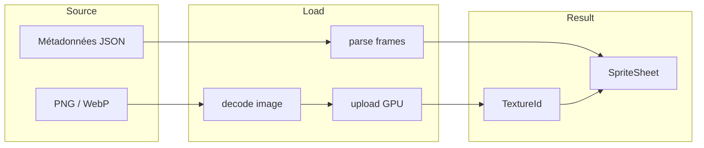
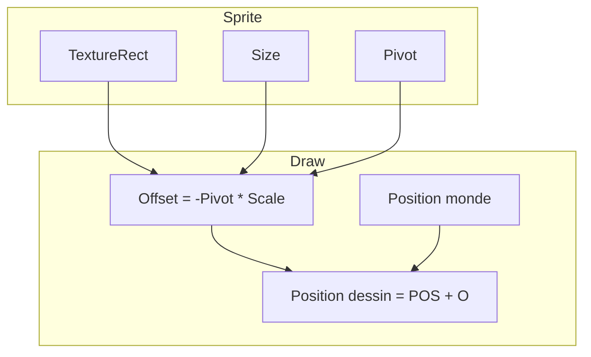
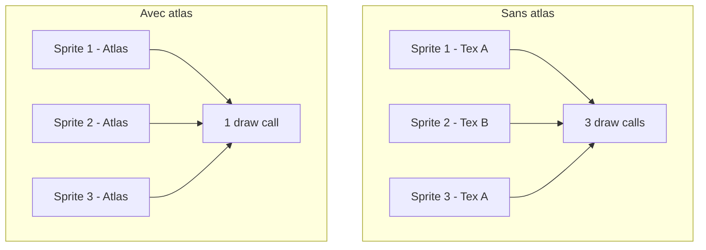

# Gestion des sprites

**Catégorie :** 1. Affichage et rendu  
**Description :** Chargement textures, sprite sheets, atlas ; taille ; anchor/pivot.  
**Référence technique :** [MGE - Référence technique](../../MGE%20-%20Miyukini%20Game%20Engine%20-%20Reference%20Technique.md)

---

## Contexte

### Rôle dans le moteur

La gestion des sprites est le fondement du rendu 2D du MGE. Elle couvre le chargement des textures, l'organisation en sprite sheets et atlas, ainsi que les paramètres de taille et de pivot nécessaires pour positionner et orienter correctement les images à l'écran.

### Lien avec les autres points

| Point | Relation |
|-------|----------|
| [Animations de sprites](animations-sprites.md) | Les frames d'animation sont des sprites ou sous-régions |
| [Z-order / couches](z-order-couches.md) | Les sprites sont triés par couche |
| [Hitbox](../02-physique-collisions/hitbox.md) | Alignement hitbox sur le sprite (pivot) |
| [Chargement assets](../23-systeme/chargement-assets.md) | Pipeline de chargement des textures |
| [Monde tile-based](monde-tile-based.md) | Tuiles = sprites sur grille |

### Référence commune

Pour les types `Vec2`, `Rect`, le glossaire (sprite, atlas, pivot) et les conventions, voir [MGE - Référence commune](../../MGE%20-%20Reference%20Commune.md).

---

## Portée

- Chargement de textures (PNG, WebP)
- Sprite sheets (grille de frames)
- Atlas de textures (regroupement)
- Taille et échelle des sprites
- Anchor / pivot (point d'ancrage)
- Formats et métadonnées

---

## Spécifications techniques

### 1. Formats de texture

| Format | Usage | Transparence |
|--------|-------|--------------|
| PNG | Standard, compression sans perte | Oui (alpha) |
| WebP | Compression avancée | Oui |
| JPEG | Photos, fonds | Non (déconseillé pour sprites) |

**Recommandation MGE :** PNG pour les assets de jeu ; WebP optionnel pour réduire la taille des builds.

### 2. Sprite sheet

Structure en grille :
- **Lignes et colonnes :** Définies par métadonnées (JSON) ou inférées (taille fixe par frame)
- **Espacement :** Padding entre les frames pour éviter le bleeding
- **Taille de frame :** Uniforme (ex. 64×64) ou variable (métadonnées par frame)

**Exemple de métadonnées JSON (format compatible Aseprite/LDtk) :**

```json
{
  "frames": {
    "hero_idle_0": { "x": 0, "y": 0, "w": 64, "h": 64 },
    "hero_idle_1": { "x": 64, "y": 0, "w": 64, "h": 64 }
  },
  "meta": {
    "image": "hero.png",
    "size": { "w": 512, "h": 256 }
  }
}
```

### 3. Atlas de textures

Regroupement de plusieurs sprites (ou sprite sheets) dans une seule texture pour réduire les changements de texture (draw calls).

- **Génération :** Outil (TexturePacker, intégré) ou manuel
- **Format :** Fichier image + fichier de métadonnées (positions, noms)
- **Limites :** Taille max texture GPU (4096×4096 typique) ; découpage en plusieurs atlas si nécessaire

### 4. Taille des sprites

| Référence | Description |
|-----------|-------------|
| Taille source | Pixels dans le fichier source |
| Taille affichée | Peut être différente (scale) pour le rendu |
| Unité tile | Si le sprite = 1 tuile, taille = tile_size (ex. 32×32) |

**Échelle :** Le sprite peut être rendu à une taille différente (ex. sprite 64×64 affiché en 32×32). Le pivot reste défini dans l'espace source.

### 5. Pivot / anchor

Point de référence du sprite pour positionnement et rotation.

| Valeur | Signification | Usage typique |
|--------|---------------|----------------|
| TopLeft | Coin supérieur gauche | UI |
| Center | Centre du sprite | Entités, projectiles |
| BottomCenter | Centre bas | Personnages (pieds au sol) |

**Convention MGE pour les personnages :** Pivot en BottomCenter pour que la position monde corresponde aux pieds (alignement avec la grille et les collisions).

**Formule :** Offset de dessin = `-pivot * scale` par rapport à la position.

### 6. Format de métadonnées (Aseprite)

Aseprite exporte un JSON avec les frames. Le MGE peut parser ce format :

```json
{
  "frames": {
    "hero_0": {
      "frame": {"x":0,"y":0,"w":64,"h":64},
      "pivot": {"x":32,"y":64}
    }
  }
}
```

### 7. Hot reload (développement)

En mode debug, les textures peuvent être rechargées à la volée quand les fichiers sont modifiés. Utile pour l'itération artistique.

### 8. Compression et mipmaps

- **Compression GPU :** Formats compressés (BC, ASTC) pour réduire la VRAM.
- **Mipmaps :** Génération automatique pour le filtrage à distance (réduit l'aliasing).

---

## Modèle de données et API

### Structures

```rust
/// Identifiant de texture (handle GPU)
pub struct TextureId(pub u32);

/// Rectangle de texture (sous-région dans une texture)
#[derive(Clone, Copy)]
pub struct TextureRect {
    pub u_min: f32,  // Coordonnées UV normalisées [0..1]
    pub v_min: f32,
    pub u_max: f32,
    pub v_max: f32,
}

/// Définition d'un sprite (source)
pub struct SpriteDef {
    pub texture_id: TextureId,
    pub rect: TextureRect,
    pub size: Vec2,           // Taille en pixels (largeur, hauteur)
    pub pivot: Vec2,          // Pivot en pixels (0,0 = haut-gauche)
}

/// Instance de sprite à l'écran
pub struct SpriteInstance {
    pub def: SpriteDef,
    pub position: Vec2,
    pub scale: Vec2,
    pub rotation: f32,
    pub color_tint: Color,
    pub layer_id: LayerId,
}
```

### Signatures principales

```rust
/// Charge une texture depuis un fichier
pub fn load_texture(path: &Path) -> Result<TextureId, AssetError>;

/// Charge un sprite sheet avec métadonnées
pub fn load_sprite_sheet(path: &Path, meta_path: &Path) -> Result<SpriteSheet, AssetError>;

/// Récupère un sprite par nom depuis un sheet
pub fn get_sprite(sheet: &SpriteSheet, name: &str) -> Option<SpriteDef>;

/// Crée un TextureRect depuis des coordonnées pixel
pub fn rect_from_pixels(x: u32, y: u32, w: u32, h: u32, tex_w: u32, tex_h: u32) -> TextureRect;

/// Calcule l'offset de dessin pour un pivot donné
pub fn pivot_offset(pivot: Vec2, size: Vec2, scale: Vec2) -> Vec2;
```

### SpriteSheet

```rust
pub struct SpriteSheet {
    pub texture_id: TextureId,
    pub sprites: HashMap<String, SpriteDef>,
    pub size: Vec2,  // Taille totale de la texture
}
```

---

## Diagrammes

### Pipeline de chargement



### Pivot et positionnement



### Atlas et draw calls



---

## Exemples et cas d'usage

### Cas 1 : Chargement d'un personnage (Allumina)

```rust
let sheet = load_sprite_sheet(
    "assets/characters/hero.png",
    "assets/characters/hero.json"
)?;
let idle_frame = sheet.get_sprite("hero_idle_0").unwrap();
// idle_frame.pivot = (32, 64) pour BottomCenter sur sprite 64×64
```

### Cas 2 : Dessin d'une entité

```rust
let sprite = SpriteInstance {
    def: hero_idle_def,
    position: Vec2::new(1500.0, 920.0),  // Monde
    scale: Vec2::new(1.0, 1.0),
    rotation: 0.0,
    color_tint: Color::WHITE,
    layer_id: LayerId::WORLD,
};
renderer.draw_sprite(&sprite, &camera);
```

### Cas 3 : Sprite avec pivot BottomCenter

Pour un personnage de 64×64 px, pivot (32, 64) :
- Position monde = pieds du personnage
- Offset dessin = (-32, -64) → le bas du sprite est aligné sur la position

### Cas 4 : Atlas pour une zone

Tous les sprites d'une zone (tiles, objets, PNJ) sont regroupés dans un atlas "zone_forest.png" pour un seul bind de texture pendant le rendu de la zone.

### Cas 5 : Sprite avec rotation

La rotation s'effectue autour du pivot. Un personnage pivot BottomCenter : la rotation fait tourner le sprite autour de ses pieds, pas du centre.

### Cas 6 : Scale non uniforme

Pour un effet d'étirement (ex. squash and stretch), scale.x ≠ scale.y. Le pivot reste le point de référence.

### Cas 7 : Color tint

Le `color_tint` permet de teinter un sprite (ex. personnages avec variantes de couleur sans assets supplémentaires).

---

## Cas limites et tests

### Cas limites

| Cas | Comportement attendu |
|-----|----------------------|
| Texture manquante | Erreur de chargement ; sprite placeholder optionnel |
| Texture trop grande | Découpage ou erreur si > max GPU |
| Rect hors texture | Assertion ou clamp |
| Pivot hors sprite | Autorisé (ex. pivot sous les pieds pour effets) |
| Scale négatif | Flip (ou interdit selon implémentation) |
| Sprite 0×0 | Ignoré ou erreur |

### Critères de validation

- [ ] Les sprites s'affichent à la bonne position avec le pivot correct
- [ ] La rotation s'effectue autour du pivot
- [ ] Les sprite sheets chargent tous les frames définis
- [ ] Les atlas réduisent le nombre de draw calls
- [ ] Les textures avec transparence s'affichent correctement
- [ ] Le hot reload (dev) recharge les textures modifiées

### Tests

```rust
#[test]
fn test_pivot_offset_center() {
    let pivot = Vec2::new(32.0, 32.0);
    let size = Vec2::new(64.0, 64.0);
    let scale = Vec2::new(1.0, 1.0);
    let offset = pivot_offset(pivot, size, scale);
    assert_eq!(offset, Vec2::new(-32.0, -32.0));
}

#[test]
fn test_texture_rect_uv() {
    let r = rect_from_pixels(64, 0, 64, 64, 512, 256);
    assert_eq!(r.u_min, 64.0/512.0);
    assert_eq!(r.u_max, 128.0/512.0);
    assert_eq!(r.v_min, 0.0);
    assert_eq!(r.v_max, 64.0/256.0);
}
```

---

## Chemins d'assets

Convention de nommage des sprites :

```
assets/sprites/<category>/<name>.png
assets/sprites/<category>/<name>.json  (métadonnées)
assets/atlas/<zone>.png
assets/atlas/<zone>.json
```

Exemple : `assets/sprites/characters/hero.png`, `assets/sprites/characters/hero.json`.

---

## Gestion de la mémoire GPU

- **Limite de textures :** Les GPUs ont une limite de textures simultanées (8-32 selon l'API). Les atlas réduisent ce besoin.
- **Libération :** Quand une zone est déchargée, les textures de la zone peuvent être libérées. Le MGE gère le cycle de vie des TextureIds.
- **Cache :** Les textures fréquemment utilisées (UI, personnage joueur) restent en mémoire ; les textures de zone sont chargées à la demande.

---

## Flip et rotation

Le flip (miroir horizontal/vertical) peut être implémenté de deux façons :
1. **Scale négatif :** scale.x = -1 pour flip H. Propre, pas de décalage.
2. **UV inversées :** Modifier le TextureRect. Plus de contrôle sur les atlas.

La rotation utilise une matrice 2D (cos, sin) appliquée autour du pivot. Le pivot doit être en coordonnées locales du sprite (avant scale).

---

## Batching et instancing

Pour réduire les draw calls, le renderer regroupe les sprites partageant la même texture :
1. Trier par texture_id
2. À l'intérieur d'une texture, trier par layer puis Y
3. Envoyer un batch de quads (positions, UVs, couleurs) en un ou plusieurs draw calls
4. L'instancing GPU (si supporté) permet de dessiner N sprites en un seul call avec un buffer de per-instance data

---

## Sprite batching : structure de données

Pour un draw call efficace, chaque sprite contribue 4 vertices (quad) avec position, UV, color. Le vertex buffer est rempli en une passe :

```
for sprite in sorted_sprites {
    write_quad(buffer, sprite.position, sprite.rect, sprite.color);
}
upload_to_gpu(buffer);
draw_instanced(quad_count);
```

---

## Voir aussi

- [Chargement assets](../23-systeme/chargement-assets.md) : Pipeline de chargement des textures
- [Optimisation](../23-systeme/optimisation.md) : Batching, atlasing, LOD
- [Monde tile-based](monde-tile-based.md) : Les tuiles sont des sprites sur grille

---

## Références

| Document | Lien | Description |
|----------|------|-------------|
| MGE - Référence commune | [../../MGE - Reference Commune.md](../../MGE%20-%20Reference%20Commune.md) | Sprite, atlas, pivot |
| Animations de sprites | [animations-sprites.md](animations-sprites.md) | Frames et clips |
| Hitbox | [../02-physique-collisions/hitbox.md](../02-physique-collisions/hitbox.md) | Alignement hitbox |
| Chargement assets | [../23-systeme/chargement-assets.md](../23-systeme/chargement-assets.md) | Pipeline de chargement |
| Monde tile-based | [monde-tile-based.md](monde-tile-based.md) | Tuiles |
| Index catégorie | [_index.md](_index.md) | Points affichage |
| Index MGE | [../../points/_index.md](../_index.md) | Index général |
