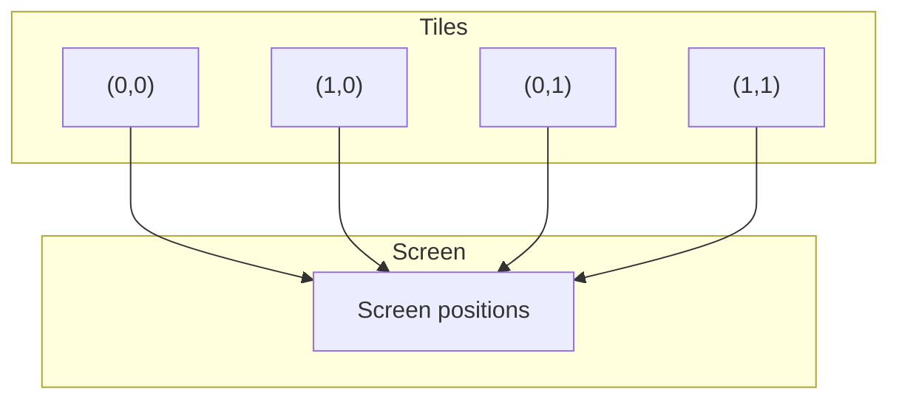
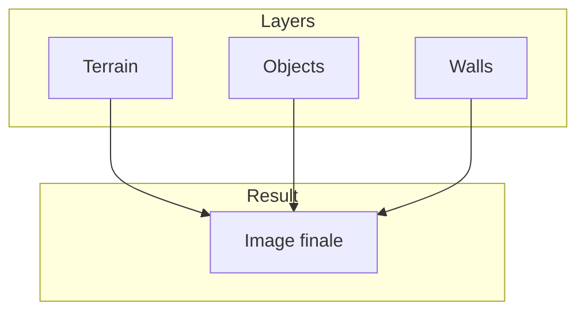
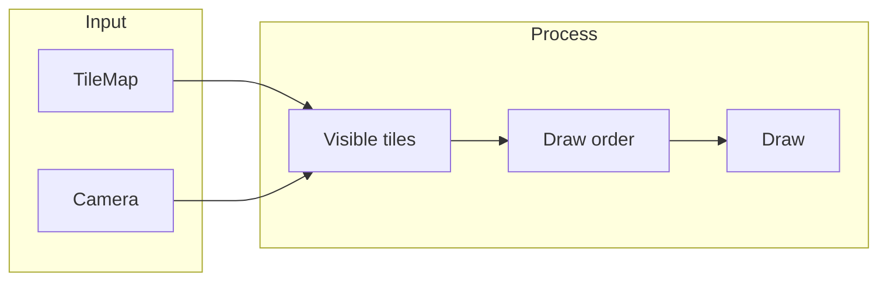

# Monde tile-based

**Catégorie :** 1. Affichage et rendu  
**Description :** Grille 2D isométrique ; tuiles terrain, objets, murs.  
**Référence technique :** [MGE - Référence technique](../../MGE%20-%20Miyukini%20Game%20Engine%20-%20Reference%20Technique.md)

---

## Contexte

### Rôle dans le moteur

Le monde tile-based structure la carte du jeu comme une grille de tuiles. Chaque cellule peut contenir du terrain, des objets ou des murs. La vue isométrique (ou orthographique) donne une perception de profondeur. Ce point couvre la représentation de la grille, les tilesets, le placement et le rendu.

### Lien avec les autres points

| Point | Relation |
|-------|----------|
| [Coordonnées](coordonnees.md) | Unité tile, conversions |
| [Gestion des sprites](gestion-sprites.md) | Tuiles = sprites |
| [Gestion des chunks](../04-entites-monde/gestion-chunks.md) | Monde découpé en chunks |
| [Pathfinding](../03-deplacement-locomotion/pathfinding.md) | Grille de navigation |
| [Collision](../02-physique-collisions/collision.md) | Murs et obstacles |
| [Hitbox](../02-physique-collisions/hitbox.md) | Alignement sur tuiles |

### Référence commune

Pour `IVec2`, `Vec2`, l'unité tile, le glossaire (tile, chunk) et les conventions, voir [MGE - Référence commune](../../MGE%20-%20Reference%20Commune.md).

---

## Portée

- Représentation de la grille
- Tilesets (terrain, décor)
- Placement d'objets et murs
- Rendu isométrique
- Couches de tuiles (terrain, objets, murs)

---

## Spécifications techniques

### 1. Grille 2D

- **Coordonnées :** (tile_x, tile_y) en entiers ; `IVec2`
- **Origine :** (0, 0) en haut-gauche de la carte
- **Taille tile :** Configurable (32×32, 64×64 px typiquement)
- **Taille carte :** Largeur × hauteur en tuiles ; peut être très grande (chunks)

### 2. Vue isométrique

En isométrique, les tuiles sont dessinées en losange (diamant) pour simuler la 3D.

- **Conversion écran :** 
  - `screen_x = (tile_x - tile_y) * (tile_w/2)`
  - `screen_y = (tile_x + tile_y) * (tile_h/2)`
- **Tile diamond :** Largeur et hauteur du losange distinctes (ex. 64×32)
- **Ordre de dessin :** Par diagonale (tile_x + tile_y croissant) pour le bon occlusion

### 3. Vue orthographique (top-down)

Alternative plus simple : tuiles carrées, pas de transformation.

- **screen_x = tile_x * tile_w**
- **screen_y = tile_y * tile_h**
- **Ordre :** Y-sort classique

### 4. Tilesets

| Type | Description |
|------|-------------|
| Terrain | Sol, eau, herbe, pierre ; souvent avec auto-tiling |
| Objets | Arbres, rochers, meubles ; sprites sur la grille |
| Murs | Obstacles, bâtiments ; bloquent le passage |
| Décors | Éléments visuels sans collision |

**Auto-tiling :** Les bords du terrain s'adaptent aux tuiles voisines (bitmask ou ensemble de règles).

### 5. Couches de tuiles

Plusieurs couches superposées :

| Couche | Z | Usage |
|--------|---|-------|
| Terrain | 0 | Sol |
| TerrainDeco | 1 | Détails au sol |
| Objects | 2 | Objets, arbres |
| Walls | 3 | Murs, bâtiments |
| Roofs | 4 | Toits (optionnel, masquent si joueur dedans) |

### 6. Placement d'objets et murs

- **Objets :** Une tuile ou plusieurs (multi-tile) ; position d'ancrage (coin bas-gauche)
- **Murs :** Bloquent le pathfinding et les collisions ; peuvent avoir une hauteur
- **Fichier de carte :** Format Tiled (JSON, TMX), LDtk, ou propriétaire

### 7. Auto-tiling (détail)

Règles pour les bords de terrain : selon les 4 ou 8 voisins, sélectionner la variante de tuile appropriée. Bitmask (4 bits pour N/S/E/W) ou ensemble de règles (Tiled autotiling).

### 8. Culling des tuiles

Ne dessiner que les tuiles visibles dans le viewport. Calculer la plage (tile_min_x..tile_max_x, tile_min_y..tile_max_y) depuis la caméra et les limites.

### 9. Chunks et tuiles

Pour les grandes cartes, les tuiles sont regroupées en chunks. Le chargement/déchargement se fait par chunk (voir [Gestion des chunks](../04-entites-monde/gestion-chunks.md)).

---

## Modèle de données et API

### Structures

```rust
/// Identifiant de tuile dans un tileset
pub type TileId = u32;

/// Donnée d'une cellule
pub struct TileCell {
    pub terrain: Option<TileId>,
    pub objects: Vec<TileId>,
    pub wall: Option<TileId>,
}

/// Carte tile-based
pub struct TileMap {
    pub width: u32,
    pub height: u32,
    pub tile_size: Vec2,
    pub cells: Vec<TileCell>,
}

/// Tileset (texteure + métadonnées)
pub struct Tileset {
    pub texture_id: TextureId,
    pub tile_size: Vec2,
    pub tiles: HashMap<TileId, TextureRect>,
}

/// Configuration isométrique
pub struct IsoConfig {
    pub tile_width: f32,
    pub tile_height: f32,
    pub origin: Vec2,
}
```

### Signatures principales

```rust
/// Récupère la cellule à une position
pub fn get_cell(&self, tx: i32, ty: i32) -> Option<&TileCell>;

/// Définit le terrain
pub fn set_terrain(&mut self, tx: i32, ty: i32, tile: TileId);

/// Conversion tuile → écran (isométrique)
pub fn tile_to_screen(&self, tx: i32, ty: i32) -> Vec2;

/// Conversion écran → tuile
pub fn screen_to_tile(&self, screen: Vec2) -> IVec2;

/// Ordre de dessin pour isométrique
pub fn draw_order_iter(&self) -> impl Iterator<Item = (i32, i32)>;
```

### Ordre de dessin isométrique

```rust
// Par somme tile_x + tile_y (diagonales)
for sum in 0..(width + height) {
    for tx in 0..=sum.min(width-1) {
        let ty = sum - tx;
        if ty < height {
            draw_tile(tx, ty);
        }
    }
}
```

---

## Diagrammes

### Grille isométrique



### Couches de tuiles



### Pipeline de rendu



---

## Exemples et cas d'usage

### Cas 1 : Carte de forêt (Allumina)

- Tileset terrain : herbe, terre, eau
- Objets : arbres (1×1 ou 2×2), rochers
- Murs : limites de zone, rochers infranchissables
- Vue isométrique 64×32 par tuile

### Cas 2 : Ville

- Terrain : pavés, routes
- Objects : maisons (multi-tiles), fontaines
- Walls : murs de bâtiments avec collision
- Couche Roofs pour les toits ; culling quand le joueur entre

### Cas 3 : Donjon

- Tileset donjon : sol pierre, murs
- Objets : torches, coffres
- Grille pour pathfinding et collision
- Chunks pour chargement par zone

### Cas 4 : Conversion clic → tuile

Le joueur clique pour se déplacer :
1. `screen_to_tile(mouse_pos)` → (tx, ty)
2. Pathfinding depuis position actuelle vers (tx, ty)
3. Vérifier que (tx, ty) n'est pas un mur

### Cas 5 : Éditeur de carte

Un outil ou intégration Tiled/LDtk permet de placer les tuiles visuellement. Export en format MGE ou JSON. Les métadonnées (collision, propriétés) sont associées aux tuiles.

### Cas 6 : Cartes procédurales

Génération de terrain à partir de bruit (Perlin, Simplex). Les tuiles sont assignées selon la valeur du bruit. Référence pour les donjons ou mondes infinis.

### Cas 7 : Tuiles animées

Certaines tuiles (eau, lave) ont des animations. Le TileMap supporte des références vers des sprites animés au lieu de sprites statiques.

---

## Cas limites et tests

### Cas limites

| Cas | Comportement attendu |
|-----|----------------------|
| Coordonnées hors carte | Option::None ou wrap selon config |
| Tile invalide (TileId inconnu) | Sprite par défaut ou vide |
| Tile_size = 0 | Erreur |
| Carte vide | Rendu vide ; pas de crash |
| Objet multi-tile débordant | Découper ou refuser le placement |

### Critères de validation

- [ ] Les tuiles s'affichent aux bonnes positions
- [ ] L'ordre de dessin isométrique est correct (pas de Z-fighting)
- [ ] screen_to_tile / tile_to_screen sont réciproques
- [ ] Les couches sont superposées correctement
- [ ] Le culling exclut les tuiles hors écran
- [ ] Les formats Tiled/LDtk sont importables (si supportés)

### Tests

```rust
#[test]
fn test_tile_screen_conversion() {
    let map = TileMap::iso(64.0, 32.0);
    let (tx, ty) = (5, 3);
    let screen = map.tile_to_screen(tx, ty);
    let (tx2, ty2) = map.screen_to_tile(screen);
    assert_eq!(tx, tx2);
    assert_eq!(ty, ty2);
}

#[test]
fn test_draw_order() {
    let map = TileMap::new(3, 3);
    let order: Vec<_> = map.draw_order_iter().collect();
    // (0,0), (1,0), (0,1), (2,0), (1,1), (0,2), ...
    assert!(order.contains(&(0, 0)));
    assert!(order[0] == (0, 0) || order[0] == (1, 0));
}
```

---

## Format Tiled (import/export)

Le MGE supporte l'import de cartes au format Tiled JSON. Structure attendue :

- `layers[]` : Chaque couche a un `data[]` (TileIds) et des propriétés
- `tilesets[]` : Sources des tuiles (image, tilewidth, tileheight)
- Propriétés personnalisées : collision, type de terrain, etc.

---

## Performances

- **Batch rendering :** Dessiner toutes les tuiles visibles d'une couche en un ou quelques draw calls (instancing ou batch de quads).
- **Texture atlas :** Toutes les tuiles d'un tileset dans une texture pour éviter les binds multiples.
- **Culling :** Réduire la plage de tuiles rendues au strict viewport (avec marge pour le parallax).

---

## Formules isométriques détaillées

Pour une tuile de largeur `tw` et hauteur `th` (diamant) :

**Tuile → Écran (coin haut du diamant) :**
```
screen_x = (tile_x - tile_y) * (tw / 2)
screen_y = (tile_x + tile_y) * (th / 2)
```

**Écran → Tuile :**
```
tile_x = (screen_x / (tw/2) + screen_y / (th/2)) / 2
tile_y = (screen_y / (th/2) - screen_x / (tw/2)) / 2
```

Arrondir `tile_x` et `tile_y` pour obtenir l'index de tuile.

---

## Propriétés de tuile (Tiled/LDtk)

Chaque tuile ou objet peut avoir des propriétés personnalisées :

| Propriété | Type | Usage |
|-----------|------|-------|
| collision | bool | Bloque le passage |
| walkable | bool | Inverse de collision |
| water | bool | Zone immergée |
| damage | int | Dégâts par seconde (lave) |
| layer | string | Override couche de rendu |
| custom | * | Données jeu spécifiques |

Ces propriétés sont lues au chargement et exposées via l'API (ex. `tile_map.get_property(tx, ty, "collision")`).

---

## Tilesets Allumina

| Tileset | Taille | Usage |
|---------|--------|-------|
| terrain | 32×32 | Sol, eau, chemins |
| objects | 32×32 | Arbres, rochers |
| walls | 32×32 | Murs, bâtiments |
| interiors | 32×32 | Sol intérieur, meubles |

Chaque tileset a une texture atlas et un fichier de définitions (collision, propriétés par TileId).

---

## Culling des chunks

Pour les mondes en chunks, le culling des tuiles se fait par chunk : si un chunk est hors viewport, aucune de ses tuiles n'est dessinée. Le chargement des chunks est géré séparément (voir Gestion des chunks).

---

## Annexe : Pseudo-code culling

```rust
fn visible_tile_range(camera: &Camera, viewport: Rect, tile_size: Vec2) -> (IVec2, IVec2) {
    let half_w = (viewport.width / (camera.zoom * tile_size.x)).ceil() as i32 + 1;
    let half_h = (viewport.height / (camera.zoom * tile_size.y)).ceil() as i32 + 1;
    let center = world_to_tile(camera.position, tile_size);
    (
        IVec2::new(center.x - half_w, center.y - half_h),
        IVec2::new(center.x + half_w, center.y + half_h),
    )
}
```

La marge (+1) évite les artéfacts au bord de l'écran lors du défilement.

---

## Voir aussi

- [Pathfinding](../03-deplacement-locomotion/pathfinding.md) : Grille de navigation
- [Navmesh](../03-deplacement-locomotion/navmesh.md) : Alternative pour zones complexes
- [Collision](../02-physique-collisions/collision.md) : Murs et obstacles
- [Gestion des chunks](../04-entites-monde/gestion-chunks.md) : Chargement par zone

---

## Références

| Document | Lien | Description |
|----------|------|-------------|
| MGE - Référence commune | [../../MGE - Reference Commune.md](../../MGE%20-%20Reference%20Commune.md) | IVec2, unité tile |
| Coordonnées | [coordonnees.md](coordonnees.md) | Conversions tile |
| Gestion des sprites | [gestion-sprites.md](gestion-sprites.md) | Tiles = sprites |
| Gestion des chunks | [../04-entites-monde/gestion-chunks.md](../04-entites-monde/gestion-chunks.md) | Découpage monde |
| Pathfinding | [../03-deplacement-locomotion/pathfinding.md](../03-deplacement-locomotion/pathfinding.md) | Grille navigation |
| Collision | [../02-physique-collisions/collision.md](../02-physique-collisions/collision.md) | Murs |
| Index catégorie | [_index.md](_index.md) | Points affichage |
| Index MGE | [../../points/_index.md](../_index.md) | Index général |
