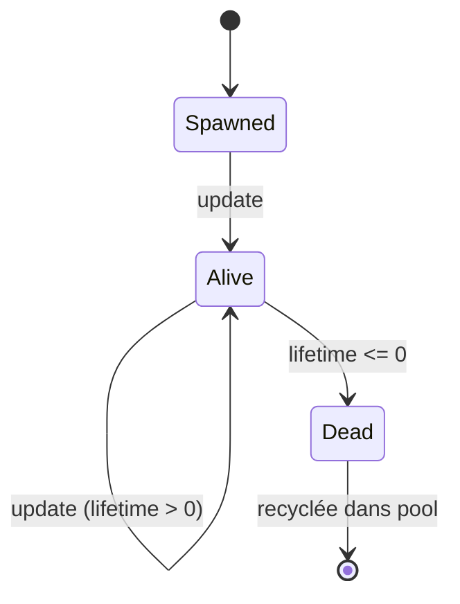
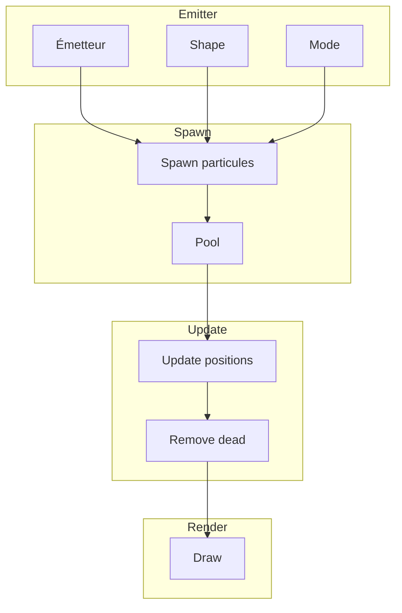
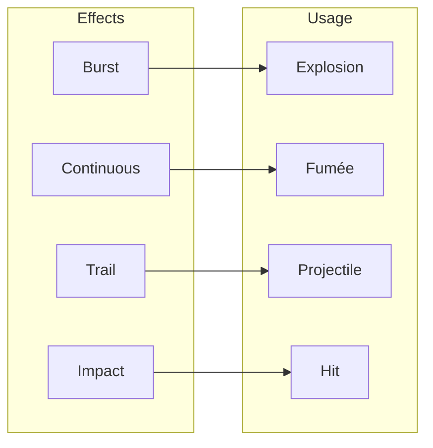

# Particules et effets

**Catégorie :** 1. Affichage et rendu  
**Description :** Système de particules ; effets visuels (traces, impacts).  
**Référence technique :** [MGE - Référence technique](../../MGE%20-%20Miyukini%20Game%20Engine%20-%20Reference%20Technique.md)

---

## Contexte

### Rôle dans le moteur

Le système de particules et effets procure du feedback visuel riche : impacts de combat, traces de projectiles, explosions, poussière, feu, magie. Les particules sont des sprites ou quads de courte durée, animés par des paramètres (vie, vitesse, taille, couleur) et des émetteurs (shape, burst, continuous).

### Lien avec les autres points

| Point | Relation |
|-------|----------|
| [Gestion des sprites](gestion-sprites.md) | Chaque particule peut utiliser un sprite |
| [Z-order / couches](z-order-couches.md) | Couche des effets |
| [Combat - Projectiles](../07-combat/projectiles.md) | Impacts, traces |
| [Combat - Action](../07-combat/action.md) | Effets visuels des compétences |
| [Spawn](../04-entites-monde/spawn.md) | Création d'émetteurs à une position |

### Référence commune

Pour `Vec2`, `Rect`, le glossaire (culling) et les conventions, voir [MGE - Référence commune](../../MGE%20-%20Reference%20Commune.md).

---

## Portée

- Paramètres des particules (vie, vitesse, taille, couleur)
- Émetteurs (shape, burst, continuous)
- Effets de trace (trails)
- Spawn d'impacts
- Optimisation (pooling, culling)

---

## Spécifications techniques

### 1. Paramètres des particules

| Paramètre | Description | Exemple |
|-----------|-------------|---------|
| Lifetime | Durée de vie en secondes | 0.5 .. 3.0 |
| Velocity | Vitesse initiale (direction + magnitude) | Vec2 ou angle + speed |
| Size | Taille (uniforme ou variée) | 4..32 px |
| Color | Couleur initiale et finale (gradient) | RGBA |
| Rotation | Vitesse de rotation | deg/s |
| Gravity | Force appliquée | Optionnel |
| Damping | Réduction de vitesse | 0..1 |

**Évolution :** Les paramètres peuvent être interpolés sur la vie (0..1) : taille décroissante, couleur qui fade.

### 2. Émetteurs

#### Shape (forme de spawn)

| Forme | Description |
|-------|-------------|
| Point | Une position fixe |
| Circle | Rayon ; angle aléatoire |
| Cone | Direction + angle d'ouverture |
| Box | Rectangle 2D |
| Line | Segment |

#### Burst (émission ponctuelle)

- Un nombre fixe de particules créées en une fois
- Usage : impact, explosion, pop

#### Continuous (émission continue)

- Taux de particules par seconde (spawn rate)
- Usage : fumée, feu, pluie, poussière

### 3. Effets de trace (trails)

- **Trail :** Ligne ou bande reliant les positions passées d'un objet
- **Paramètres :** Longueur, largeur, couleur, fade
- **Implémentation :** Historique des N dernières positions ; dessin de quads entre elles
- **Usage :** Projectiles rapides, épée en mouvement, dash

### 4. Spawn d'impacts

- **Impact :** Émetteur burst à la position de collision
- **Configuration :** Nombre de particules, spread, durée
- **Préfabs :** Définition réutilisable "impact_metal", "impact_flesh", "impact_fire"
- **Déclenchement :** Depuis la détection de collision ou l'animation de combat

### 5. Textures des particules

- **Sprite unique :** Carré, cercle soft, étoile
- **Atlas :** Plusieurs textures pour variété (fumée, étincelles)
- **Additive blending :** Pour les effets lumineux (feu, magie)
- **Alpha blending :** Standard pour la fumée, la poussière

### 6. Pooling

Pour éviter les allocations à chaque burst, un pool de particules pré-alloué. Les particules mortes sont recyclées. Taille du pool configurable (ex. 1000).

### 7. Culling

Les particules hors écran (avec marge) ne sont pas mises à jour ni dessinées. Réduit le coût pour les grands effets.

### 8. LOD (Level of Detail)

À distance, réduire le nombre de particules affichées ou leur résolution. Pour les effets lointains (fumée au loin).

---

## Modèle de données et API

### Structures

```rust
/// Définition d'une particule (template)
pub struct ParticleDef {
    pub lifetime: Range<f32>,
    pub velocity: VelocityDef,
    pub size: Range<f32>,
    pub color_start: Color,
    pub color_end: Color,
    pub rotation_speed: Range<f32>,
    pub gravity: Option<Vec2>,
    pub damping: f32,
}

pub enum VelocityDef {
    Constant(Vec2),
    RandomDirection { speed: Range<f32> },
    Cone { direction: f32, angle: f32, speed: Range<f32> },
}

/// Émetteur
pub struct Emitter {
    pub shape: EmitterShape,
    pub mode: EmitterMode,
    pub particle: ParticleDef,
    pub texture: TextureId,
}

pub enum EmitterShape {
    Point,
    Circle { radius: f32 },
    Cone { angle: f32 },
    Box { size: Vec2 },
}

pub enum EmitterMode {
    Burst { count: u32 },
    Continuous { rate: f32 },
}

/// Instance de particule (runtime)
pub struct Particle {
    pub position: Vec2,
    pub velocity: Vec2,
    pub lifetime: f32,
    pub life_remaining: f32,
    pub size: f32,
    pub color: Color,
    pub rotation: f32,
}
```

### Signatures principales

```rust
/// Crée un émetteur burst à une position
pub fn emit_burst(&mut self, emitter: &EmitterDef, position: Vec2);

/// Spawn un impact prédéfini
pub fn spawn_impact(&mut self, impact_id: &str, position: Vec2);

/// Met à jour les particules (à appeler chaque frame)
pub fn update(&mut self, dt: f32);

/// Ajoute une trace pour un objet
pub fn add_trail(&mut self, object_id: EntityId, trail_config: TrailConfig);

/// Enlève une trace
pub fn remove_trail(&mut self, object_id: EntityId);
```

---

## Diagrammes

### Cycle de vie d'une particule



### Pipeline émetteur



### Types d'effets



---

## Exemples et cas d'usage

### Cas 1 : Impact d'épée (Allumina)

- Émetteur burst, 8 particules
- Cone 180° dans la direction de l'attaque
- Particules blanches, lifetime 0.2s, size 4–8 px
- Spawn à la frame de contact de l'animation

### Cas 2 : Fumée de feu

- Émetteur continuous, rate 5/s
- Shape circle, radius 20
- Particules grises, montent (velocity.y &lt; 0), shrink
- Durée infinie tant que la source est active

### Cas 3 : Trace d'un projectile magique

- Trail sur l'entité projectile
- Longueur 50 px, largeur 4 px
- Couleur bleue avec fade
- Supprimé quand le projectile est détruit

### Cas 4 : Explosion de zone

- Burst 30 particules
- Shape point (centre de l'explosion)
- RandomDirection, speed 100–200
- Couleur orange → transparent, size 20→5

### Cas 5 : Pluie

Émetteur continuous, shape box (largeur de l'écran), rate élevé. Particules oblongues, velocity vers le bas, lifetime court.

### Cas 6 : Magie de soin

Burst circulaire autour du joueur, particules vertes/blanches qui montent et s'estompent. Additive blend.

### Cas 7 : Poussière de pas

Petit burst à chaque pas du personnage. Particules brunes, très courte durée. Dense en zone fréquentée.

---

## Cas limites et tests

### Cas limites

| Cas | Comportement attendu |
|-----|----------------------|
| Pool vide | Allouer ou ignorer le spawn |
| Lifetime = 0 | Particule ignorée ou invisible |
| Rate très élevé | Limiter ou throttle |
| Particule hors écran | Culling ; pas de dessin |
| Trail sans positions | Pas de draw |
| Émetteur à position invalide | Spawn au point (0,0) ou ignorer |

### Critères de validation

- [ ] Les particules apparaissent et disparaissent correctement
- [ ] Les burst émettent le bon nombre de particules
- [ ] Les trails suivent l'objet
- [ ] Les impacts se déclenchent à la bonne position
- [ ] Pas de fuite mémoire (pool recyclé)
- [ ] Performances acceptables (milliers de particules)

### Tests

```rust
#[test]
fn test_burst_count() {
    let mut system = ParticleSystem::new();
    let emitter = Emitter::burst(10, particle_def());
    system.emit_burst(&emitter, Vec2::zero());
    system.update(0.016);
    assert_eq!(system.active_count(), 10);
}

#[test]
fn test_particle_lifetime() {
    let mut p = Particle::new(def_with_lifetime(1.0));
    p.update(0.5);
    assert!(p.is_alive());
    p.update(0.6);
    assert!(!p.is_alive());
}
```

---

## Configuration des impacts prédéfinis

Répertoire `assets/effects/` avec des définitions JSON :

```json
{
  "impact_metal": {
    "emitter": "burst",
    "count": 8,
    "particle": { "lifetime": [0.1, 0.2], "size": [2, 6] },
    "texture": "sparks.png"
  }
}
```

Le jeu référence ces IDs pour spawn les impacts sans recréer les configs à chaque fois.

---

## Performances

- Pool initial : 500-1000 particules selon le jeu
- Max particules actives : Limiter pour éviter les spikes
- Culling : Marges de 50-100 px autour du viewport

---

## Structure d'un effet complet

Un effet (ex. explosion) peut combiner :
1. Burst initial de particules
2. Émetteur continuous secondaire (fumée qui persiste)
3. Trail sur un objet en mouvement
4. Impact sonore (event frame 0)

Tout est regroupé dans une définition "explosion" réutilisable.

---

## Blend modes et rendu

| Mode | Formule | Usage |
|------|---------|-------|
| Alpha | src * a + dst * (1-a) | Fumée, poussière |
| Additive | src + dst | Feu, magie, étincelles |
| Multiply | src * dst | Ombres, assombrissement |

Le MGE supporte au minimum Alpha et Additive. Le mode est défini par texture ou par émetteur.

---

## Intégration avec les sons

Les effets peuvent déclencher des sons via les frame events. Exemple : frame 0 de l'impact = son "impact_metal". Le système audio écoute les events du ParticleSystem ou reçoit des callbacks.

---

## Liste d'effets types

| Effet | Type | Paramètres clés |
|-------|------|-----------------|
| Impact métal | Burst | 8 part., cone 360°, gris |
| Impact chair | Burst | 6 part., rouge sombre |
| Feu | Continuous | Rate 5, montant, orange |
| Fumée | Continuous | Rate 3, montant, gris |
| Pluie | Continuous | Box, rate 50, bleu |
| Trace projectile | Trail | Longueur 30, fade |
| Soin | Burst | Cercle, vert, montant |
| Explosion | Burst + continuous | 30 part. + fumée |

---

## Annexe : Update loop

```rust
fn update_particles(particles: &mut [Particle], dt: f32) {
    for p in particles.iter_mut() {
        if !p.is_alive() { continue; }
        p.life_remaining -= dt;
        p.position += p.velocity * dt;
        if let Some(g) = p.gravity {
            p.velocity += g * dt;
        }
        p.velocity *= p.damping;
        p.rotation += p.rotation_speed * dt;
    }
}
```

Les particules mortes sont marquées et recyclées par le pool au prochain burst.

---

## Voir aussi

- [Combat - Projectiles](../07-combat/projectiles.md) : Traces, impacts
- [Zone d'effet](../07-combat/zone-effet-aoe.md) : Effets visuels des AOE
- [Audio](../23-systeme/audio.md) : Sons synchronisés avec les effets

---

## Références

| Document | Lien | Description |
|----------|------|-------------|
| MGE - Référence commune | [../../MGE - Reference Commune.md](../../MGE%20-%20Reference%20Commune.md) | Vec2, conventions |
| Gestion des sprites | [gestion-sprites.md](gestion-sprites.md) | Textures particules |
| Z-order / couches | [z-order-couches.md](z-order-couches.md) | Couche effets |
| Projectiles | [../07-combat/projectiles.md](../07-combat/projectiles.md) | Impacts |
| Spawn | [../04-entites-monde/spawn.md](../04-entites-monde/spawn.md) | Position émetteur |
| Index catégorie | [_index.md](_index.md) | Points affichage |
| Index MGE | [../../points/_index.md](../_index.md) | Index général |
