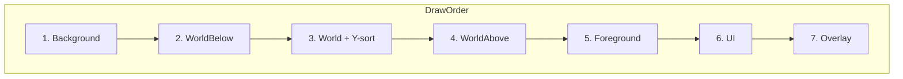
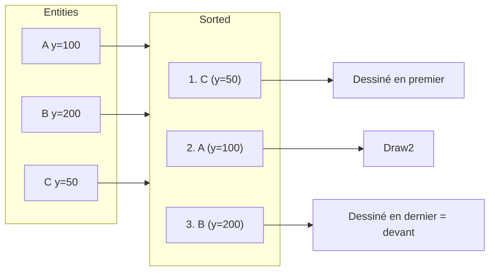
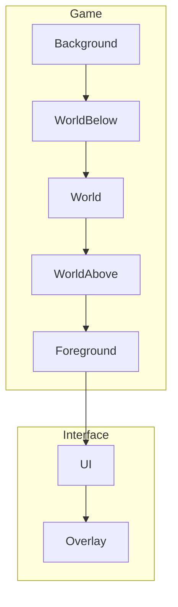

# Z-order / couches

**Catégorie :** 1. Affichage et rendu  
**Description :** Ordre d'affichage ; calques (arrière-plan, monde, avant-plan, UI).  
**Référence technique :** [MGE - Référence technique](../../MGE%20-%20Miyukini%20Game%20Engine%20-%20Reference%20Technique.md)

---

## Contexte

### Rôle dans le moteur

Le Z-order (ordre d'affichage) détermine quels éléments sont dessinés par-dessus les autres. Les couches (layers) structurent le rendu : arrière-plan d'abord, puis monde (entités, tuiles), avant-plan, et enfin l'interface. Le tri peut être fixe (par couche) ou dynamique (Y-sort pour les entités dans la même couche).

### Lien avec les autres points

| Point | Relation |
|-------|----------|
| [Caméra](camera.md) | Parallax par couche |
| [Gestion des sprites](gestion-sprites.md) | Chaque sprite a un `layer_id` |
| [Particules et effets](particules-effets.md) | Particules sur couche dédiée |
| [GUI](../20-interface/gui.md) | Couche UI au-dessus |
| [Monde tile-based](monde-tile-based.md) | Tuiles en couche monde |

### Référence commune

Pour `LayerId`, le glossaire (layer, Z-order, parallax) et les couches prédéfinies, voir [MGE - Référence commune](../../MGE%20-%20Reference%20Commune.md).

---

## Portée

- Système de couches (layers)
- Tri Y-sort / Z-sort
- Couches pour UI (HUD, menus)
- Intégration avec parallax
- Gestion des conflits (même position)

---

## Spécifications techniques

### 1. Couches prédéfinies

| LayerId | Nom | Usage |
|---------|-----|-------|
| 0 | Background | Ciel, fond, décor lointain |
| 5 | WorldBelow | Sol sous les entités |
| 10 | World | Entités, personnages, tuiles objets |
| 15 | WorldAbove | Éléments au-dessus du monde (ponts, toits) |
| 20 | Foreground | Avant-plan (herbe, brouillard) |
| 100 | UI | HUD, barres de vie |
| 110 | Overlay | Menus, dialogues, debug |

**Convention :** Plus la valeur est élevée, plus l'élément est dessiné au-dessus. Les layers 0–99 pour le monde, 100+ pour l'UI.

### 2. Tri par couche

Ordre de dessin : du `LayerId` le plus bas au plus élevé.

```
Background(0) → WorldBelow(5) → World(10) → WorldAbove(15) → Foreground(20) → UI(100) → Overlay(110)
```

### 3. Tri au sein d'une couche (Y-sort)

Pour la couche World, les entités à la même position Y doivent respecter la profondeur visuelle : plus bas à l'écran = plus proche du joueur = dessiné par-dessus.

- **Y-sort :** Trier par position Y croissante (Y vers le haut en monde = dessous à l'écran)
- **Formule :** `sort_key = -world_y` (plus Y est grand, plus on est "devant")
- **Convention isométrique :** Le bas de l'écran = proche ; le haut = loin

### 4. Z-sort (ordre manuel)

Alternative au Y-sort : chaque entité a un `z_index` explicite dans sa couche.

- **Usage :** Quand le Y ne suffit pas (effets, overlapping complexe)
- **Combinaison :** `sort_key = (layer_id << 16) + z_index + y_offset`

### 5. Couches UI

| Sous-couche | Usage |
|-------------|-------|
| HUD | Barres vie/mana, mini-carte |
| Menus | Fenêtres modales |
| Cursor / Tooltips | Au-dessus de tout |
| Debug | Overlay dev (colliders, FPS) |

### 6. Parallax et couches

Chaque couche peut avoir un facteur de parallax (voir [Caméra](camera.md)). Les couches Background ont souvent parallax &lt; 1 pour l'effet de profondeur.

### 7. Optimisation du tri

- **Bucketing par couche :** Séparer les drawables en buckets par LayerId ; trier uniquement le bucket World (Y-sort).
- **Dirty flag :** Ne retrier que si des éléments ont changé.
- **Spatial partitioning :** Pour les très grandes scènes, trier uniquement les entités visibles (après culling).

### 8. Couches dynamiques

Certaines entités peuvent changer de couche à runtime (ex. personnage qui entre dans un bâtiment, passe sous un toit). L'API permet de modifier le `layer_id` d'un drawable.

### 9. Blend modes et transparence

Les couches peuvent utiliser des modes de mélange différents (alpha, additive) pour des effets (verre, magie). L'ordre de dessin reste respecté ; la transparence est gérée par le blend du GPU.

---

## Modèle de données et API

### Structures

```rust
/// Constantes de couches
pub mod layers {
    pub const BACKGROUND: LayerId = LayerId(0);
    pub const WORLD_BELOW: LayerId = LayerId(5);
    pub const WORLD: LayerId = LayerId(10);
    pub const WORLD_ABOVE: LayerId = LayerId(15);
    pub const FOREGROUND: LayerId = LayerId(20);
    pub const UI: LayerId = LayerId(100);
    pub const OVERLAY: LayerId = LayerId(110);
}

/// Élément à dessiner (avec tri)
pub struct Drawable {
    pub layer_id: LayerId,
    pub position: Vec2,
    pub z_index: i32,  // Optionnel, 0 par défaut
    pub sprite: SpriteInstance,
}

/// Comparaison pour le tri
impl Ord for Drawable {
    fn cmp(&self, other: &Self) -> Ordering {
        self.layer_id.cmp(&other.layer_id)
            .then_with(|| self.sort_y().partial_cmp(&other.sort_y()).unwrap())
            .then_with(|| self.z_index.cmp(&other.z_index))
    }
}

fn sort_y(d: &Drawable) -> f32 {
    -d.position.y  // Y-sort : plus Y grand = plus devant
}
```

### Signatures

```rust
/// Ajoute un élément au batch de rendu
pub fn add_drawable(&mut self, drawable: Drawable);

/// Trie et dessine toutes les couches
pub fn flush(&mut self);

/// Définit l'ordre de tri pour une couche
pub fn set_layer_sort_mode(&mut self, layer: LayerId, mode: SortMode);

pub enum SortMode {
    None,       // Ordre d'ajout
    YSort,      // Par position Y
    ZIndex,     // Par z_index
    YSortThenZ,
}
```

---

## Diagrammes

### Ordre de dessin



### Y-sort



### Hiérarchie des couches



---

## Exemples et cas d'usage

### Cas 1 : Personnage devant un arbre (Allumina)

- Personnage Y=500, Arbre Y=400
- Y-sort : Arbre (400) dessiné avant Personnage (500)
- Résultat : Le personnage apparaît devant l'arbre quand il est "en bas"

### Cas 2 : Pont passant devant un bâtiment

- Bâtiment : World (10)
- Pont : WorldAbove (15)
- Le pont est toujours dessiné par-dessus le bâtiment

### Cas 3 : HUD et menu de pause

- HUD : layer UI (100)
- Menu pause : layer Overlay (110)
- Le menu de pause masque le HUD

### Cas 4 : Brouillard d'avant-plan

- Couche Foreground (20) avec texture semi-transparente
- Parallax 1.2 pour suivre légèrement plus vite que la caméra
- Effet de profondeur et d'immersion

### Cas 5 : Projectile en mouvement

Le projectile traverse plusieurs entités. Son Y change à chaque frame. Le Y-sort garantit qu'il apparaît devant ou derrière selon sa position actuelle, sans scintillement si le tri est stable.

### Cas 6 : Toit masquant (Roof layer)

Certains bâtiments ont une couche Roof (WorldAbove). Quand le joueur entre, on peut cacher le toit (z_index négatif ou couche spéciale) ou le rendre semi-transparent.

### Cas 7 : Tooltip au-dessus de tout

Le tooltip d'un objet est sur la couche Overlay (110) avec un z_index élevé. Il reste visible au-dessus des menus et du HUD.

---

## Implémentation recommandée

- Utiliser un `Vec<Drawable>` ou structure similaire ; trier avant le rendu.
- Pour les sprites batchés (instanced rendering), regrouper par texture puis par layer pour réduire les changements d'état GPU.
- Exposer les constantes de couches dans un module dédié pour cohérence projet.

---

## Cas limites et tests

### Cas limites

| Cas | Comportement attendu |
|-----|----------------------|
| Deux entités même Y | Ordre stable (z_index ou ordre d'ajout) |
| LayerId négatif | Interdit ou traité comme Background |
| Entité hors écran | Culling en amont ; pas de tri nécessaire |
| UI derrière le monde | Erreur de config ; UI doit être &gt; 99 |
| Z_index très grand | Pas d'overflow ; tri correct |

### Critères de validation

- [ ] Les couches s'affichent dans le bon ordre
- [ ] Le Y-sort place correctement les entités "devant/derrière"
- [ ] L'UI est toujours au-dessus du monde
- [ ] Le tri est stable (pas de scintillement)
- [ ] Les performances restent acceptables (tri O(n log n) ou meilleur avec buckets par couche)

### Tests

```rust
#[test]
fn test_layer_order() {
    let mut batch = DrawBatch::new();
    batch.add_drawable(create_drawable(layers::UI, (0, 0)));
    batch.add_drawable(create_drawable(layers::WORLD, (100, 100)));
    batch.flush();
    // Vérifier ordre des draw calls : WORLD puis UI
}

#[test]
fn test_y_sort() {
    let a = Drawable { position: Vec2::new(0, 100), .. };
    let b = Drawable { position: Vec2::new(0, 200), .. };
    assert!(a < b); // Y plus petit = dessiné avant = derrière
}
```

---

## Configuration par projet

Chaque jeu (ex. Allumina) peut définir ses propres couches additionnelles dans l'intervalle réservé :

- **0-4 :** Background variants (ciel jour/nuit, etc.)
- **10-14 :** World variants (sous-couches si nécessaire)
- **100-109 :** UI variants (HUD, inventaire, etc.)

Les constantes sont centralisées dans un module `game::layers` pour cohérence.

---

## Ordre de tri détaillé

Pour une entité dans la couche World, la clé de tri complète :

1. `layer_id` (primary)
2. `-position.y` (Y-sort, plus Y grand = devant)
3. `z_index` (tie-breaker)
4. `entity_id` (stabilité, éviter scintillement)

---

## Annexes : Détails d'implémentation

### Tri en Rust

```rust
drawables.sort_by(|a, b| {
    a.layer_id.cmp(&b.layer_id)
        .then_with(|| b.position.y.partial_cmp(&a.position.y).unwrap_or(Equal))
        .then_with(|| a.z_index.cmp(&b.z_index))
        .then_with(|| a.entity_id.cmp(&b.entity_id))
});
```

Note : `b.y.partial_cmp(&a.y)` car plus Y grand = dessiné après = devant.

### Bucketing pour performance

Au lieu de trier toutes les entités, grouper par layer :

```rust
let mut buckets: HashMap<LayerId, Vec<Drawable>> = ...;
for layer_id in [BACKGROUND, WORLD_BELOW, WORLD, ...] {
    let items = buckets.get_mut(&layer_id).unwrap();
    if layer_id == WORLD {
        items.sort_by(y_sort);
    }
    for item in items {
        render(item);
    }
}
```

### Couches et transparence

L'ordre de dessin impacte le rendu des éléments transparents. Les sprites avec alpha doivent être dessinés du fond vers le premier plan. Le blend mode (alpha, additive) est défini par couche ou par texture.

### Debug : affichage des layer_id

En mode debug, afficher visuellement le layer_id de chaque entité (petit chiffre au-dessus) pour vérifier la configuration. Désactiver en release.

### Cas particuliers : projectiles et effets

Les projectiles sont typiquement sur la couche World (10) pour le Y-sort avec les entités. Les effets (particules, impacts) peuvent être sur une sous-couche World (11) ou dédiée (WorldEffects 12) pour contrôler s'ils passent devant ou derrière les personnages. Les particules d'impact au sol : WorldBelow (5) ; les particules en l'air : World (10).

---

## Table des couches Allumina

| ID | Nom | Contenu |
|----|-----|---------|
| 0 | Sky | Ciel dégradé |
| 1 | Clouds | Nuages parallax |
| 5 | Ground | Sol, tuiles terrain |
| 10 | Entities | Joueur, PNJ, monstres |
| 11 | Projectiles | Flèches, sorts |
| 12 | Effects | Impacts, particules |
| 15 | OverlayTerrain | Ponts, toits |
| 20 | Fog | Brouillard avant-plan |
| 100 | HUD | Barres, mini-carte |
| 110 | Menus | Fenêtres |
| 111 | Cursor | Curseur, tooltips |

---

## Notes sur le tri stable

Quand deux entités ont exactement la même position Y (rare mais possible), le tri doit être déterministe pour éviter le z-fighting visuel (scintillement). L'utilisation de `entity_id` comme dernier critère garantit un ordre stable. En Rust, `sort_by` est stable ; `sort_by_key` aussi.

---

## Couches et collision

Les layers de rendu (LayerId) sont distincts des collision layers (voir [Collision layers](../02-physique-collisions/collision-layers.md)). Une entité peut être sur le layer World pour le rendu mais sur le collision layer "Player" pour la physique. Ne pas confondre les deux systèmes.

---

## Voir aussi

- [Caméra](camera.md) : Parallax par couche, shake
- [Culling agressif](../04-entites-monde/culling-agressif.md) : Réduire le nombre d'entités triées en excluant les hors écran
- [Grands effectifs](../04-entites-monde/grands-effectifs-ecran.md) : Optimisation quand des centaines d'unités sont affichées

---

## Références

| Document | Lien | Description |
|----------|------|-------------|
| MGE - Référence commune | [../../MGE - Reference Commune.md](../../MGE%20-%20Reference%20Commune.md) | LayerId, couches |
| Caméra | [camera.md](camera.md) | Parallax par couche |
| Gestion des sprites | [gestion-sprites.md](gestion-sprites.md) | Sprite + layer_id |
| GUI | [../20-interface/gui.md](../20-interface/gui.md) | Couches UI |
| Monde tile-based | [monde-tile-based.md](monde-tile-based.md) | Tuiles |
| Index catégorie | [_index.md](_index.md) | Points affichage |
| Index MGE | [../../points/_index.md](../_index.md) | Index général |
