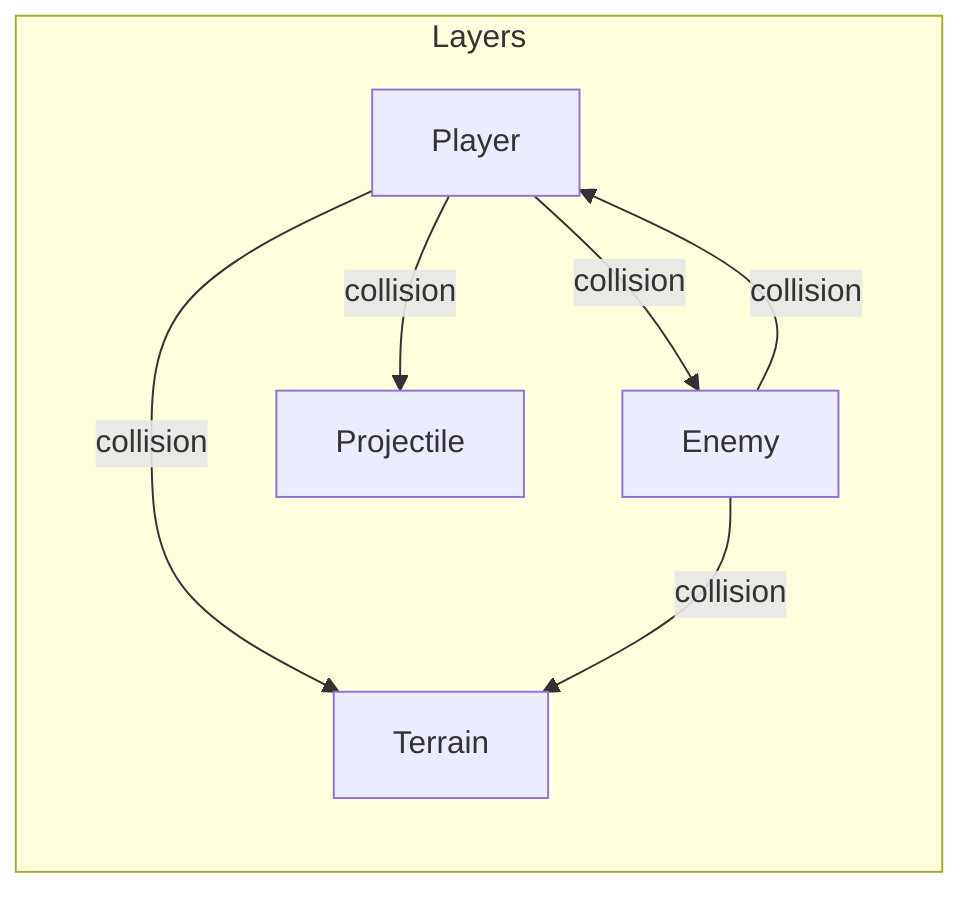
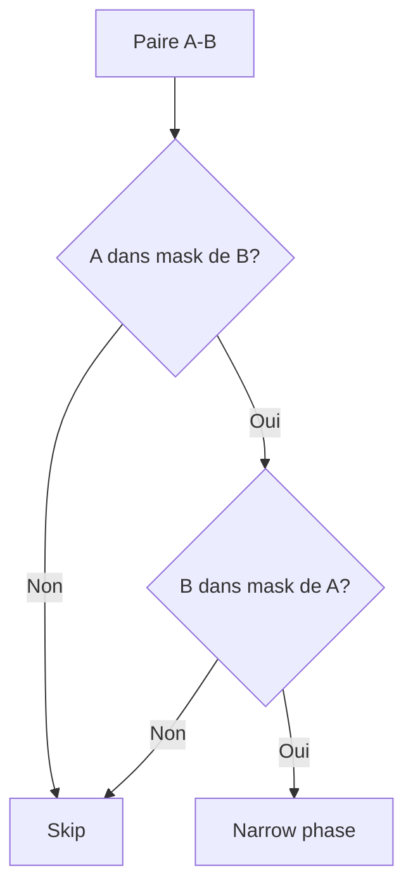

# Collision layers

**Catégorie :** 2. Physique et collisions  
**Description :** Masques de collision ; qui collisionne avec qui.

---

## Résumé

Chaque entité a un layer (couche) et un mask (avec qui collisionner). La paire (A,B) est testée seulement si A.mask contient B.layer et B.mask contient A.layer. Évite les tests inutiles (ex. projectiles alliés entre eux). Voir [collision](collision.md) pour l'intégration.

---

## Contexte et rôle

### Dans le moteur MGE

Les **collision layers** (couches de collision) constituent un système de **masques** qui détermine quelles entités peuvent entrer en collision les unes avec les autres. Sans ce filtrage, chaque paire candidate de la broad phase serait testée ; avec les layers, on exclut a priori les paires non pertinentes (ex. projectiles alliés entre eux, décor avec décor).

Ce point complète la chaîne : **hitbox** → **collision** → **collision-layers**.

### Références centralisées

Type `LayerId` : [Référence Commune](../MGE%20-%20Reference%20Commune.md).

---

## Portée / Scope

- Définition des layers (Player, Enemy, Projectile, Terrain, etc.)
- Masque « je suis sur quel(s) layer(s) »
- Masque « je collisionne avec quel(s) layer(s) »
- Configuration par entité et par type (prefab)
- Éviter les tests inutiles (optimisation)

---

## Spécifications techniques

### Principe du double masque

Chaque entité possède :
1. **Layer** (ou « category ») : le ou les layers sur lesquels elle se trouve. Souvent un seul layer par entité (ex. Player).
2. **Mask** (ou « collision mask ») : les layers avec lesquels elle peut entrer en collision.

Une paire (A, B) est testée **si et seulement si** :
- A est sur un layer inclus dans le mask de B **et**
- B est sur un layer inclus dans le mask de A.

Condition symétrique : les deux sens doivent permettre la collision.

### Représentation

- **Layers** : ensemble fini de noms (ou IDs). Ex. : `Player`, `Enemy`, `Projectile`, `Terrain`, `Pickup`, `Trigger`, `Decor`.
- **LayerId** : entier ou enum (0..31 typiquement, pour des masques 32 bits).
- **LayerMask** : bitmap où le bit i = 1 signifie « ce layer est actif ».
- **Collision matrix** (optionnel) : table N×N indiquant si layer i collisionne avec layer j. Équivalent à des masques bien configurés.

### Exemple de configuration

| Entité | Layer | Mask |
|--------|-------|------|
| Joueur | Player | Terrain, Enemy, Pickup, Trigger |
| Ennemi | Enemy | Terrain, Player, Projectile |
| Projectile joueur | Projectile | Terrain, Enemy |
| Mur / sol | Terrain | Player, Enemy, Projectile |
| Objet ramassable | Pickup | Player |
| Zone dialogue | Trigger | Player |
| Décoration (arbre) | Decor | (aucun) |

Conséquences :
- Joueur ne collisionne pas avec Projectile (allié) — pas de self-hit.
- Enemy ne collisionne pas avec Pickup (pas de ramassage par l'IA).
- Decor ne collisionne avec rien — purement visuel.

### Nombre de layers

- **MVP :** 8 à 16 layers suffisent pour la plupart des jeux 2D.
- **Limite technique :** 32 layers si masque 32 bits ; 64 si u64.
- **Convention MGE :** 16 layers par défaut ; extensible si besoin.

### Contraintes

| Contrainte | Valeur | Raison |
|------------|--------|--------|
| Layers max | 32 | Masque 32 bits |
| Layers utilisés MVP | 8–16 | Simplicité |
| Entité sans layer | Interdit | Toujours au moins un layer |
| Mask vide | Autorisé | Entité ne collisionne avec rien (ex. decor) |

---

## Modèle de données / API

### Structures Rust (proposition)

```rust
/// ID d'un layer (0..31)
pub type LayerId = u8;

/// Masque de layers (bitmap)
#[derive(Debug, Clone, Copy, PartialEq, Eq)]
pub struct LayerMask(pub u32);

impl LayerMask {
    pub fn none() -> Self { Self(0) }
    pub fn all() -> Self { Self(u32::MAX) }
    pub fn layer(id: LayerId) -> Self { Self(1 << id) }
    pub fn contains(&self, id: LayerId) -> bool {
        (self.0 & (1 << id)) != 0
    }
    pub fn with(mut self, id: LayerId) -> Self {
        self.0 |= 1 << id;
        self
    }
}

/// Composant indiquant les layers d'une entité
#[derive(Debug, Clone)]
pub struct CollisionLayers {
    /// Layer(s) de cette entité
    pub layer: LayerId,
    /// Layers avec lesquels cette entité peut collisionner
    pub mask: LayerMask,
}

/// Test : la paire (A, B) doit-elle être testée ?
pub fn should_collide(a: &CollisionLayers, b: &CollisionLayers) -> bool {
    a.mask.contains(b.layer) && b.mask.contains(a.layer)
}
```

### Constantes de layers (exemple)

```rust
pub const LAYER_PLAYER: LayerId = 0;
pub const LAYER_ENEMY: LayerId = 1;
pub const LAYER_PROJECTILE: LayerId = 2;
pub const LAYER_TERRAIN: LayerId = 3;
pub const LAYER_PICKUP: LayerId = 4;
pub const LAYER_TRIGGER: LayerId = 5;
pub const LAYER_DECOR: LayerId = 6;
```

### Intégration dans le pipeline

Après la broad phase, avant la narrow phase :

```rust
for (entity_a, entity_b) in candidate_pairs {
    let layers_a = world.get::<CollisionLayers>(entity_a)?;
    let layers_b = world.get::<CollisionLayers>(entity_b)?;
    if !should_collide(layers_a, layers_b) {
        continue; // Skip this pair
    }
    // ... narrow phase
}
```

---

## Diagrammes

### Matrice de collision (exemple)



### Décision : tester ou pas



### Hiérarchie des layers

```mermaid
graph TD
    subgraph Physique
        Terrain[Terrain]
        Player[Player]
        Enemy[Enemy]
    end
    subgraph Interactifs
        Pickup[Pickup]
        Trigger[Trigger]
    end
    subgraph Projectiles
        Projectile[Projectile]
    end
    subgraph Decor
        Decor[Decor]
    end
```

---

## Exemples et cas d'usage

### Cas 1 : Jeu action (Allumina)

- **Player** : layer Player, mask Terrain | Enemy | Pickup | Trigger.
- **Ennemi** : layer Enemy, mask Terrain | Player | Projectile.
- **Flèche du joueur** : layer Projectile, mask Terrain | Enemy.
- Résultat : la flèche touche les ennemis et les murs, pas le joueur ni les autres flèches.

### Cas 2 : Coopération (multi-joueurs)

- **Player 1, Player 2** : layer Player, mask Terrain | Enemy | Pickup | Trigger.
- Option : ne pas inclure Player dans le mask si les joueurs ne doivent pas se pousser.
- Option : inclure Player pour les poussées (PvP désactivé).

### Cas 3 : PNJ invincible

- **PNJ marchand** : layer Trigger (ou NpcFriendly), mask Player.
- Le joueur peut le « traverser » (trigger) ou le bloquer selon le type de hitbox. Si trigger, pas de blocage physique.

### Cas 4 : Projectiles ennemis

- **Projectile ennemi** : layer Projectile, mask Terrain | Player.
- Ne touche pas les ennemis (évite les dégâts collatéraux).
- Touche le joueur et les murs.

### Cas 5 : Zone de dégâts (AOE)

- **Zone AOE** : layer Trigger (ou DamageZone), mask Player | Enemy selon le type de sort.
- Détection par trigger ; pas de blocage.

### Cas 6 : Décoration

- **Arbre, buisson** : layer Decor, mask none.
- Aucun test de collision ; l'entité est purement visuelle. Les bounds peuvent être utilisées pour le culling uniquement.

### Cas 7 : Bateau et eau

- **Bateau** : layer Player (ou Vehicle), mask Terrain | Trigger.
- **Eau** : peut être Terrain (bloquant) ou Trigger (zone de navigation) selon le design.
- **Quai** : Terrain. Le bateau collisionne avec le quai.

### Cas 8 : Objets destructibles

- **Crate, baril** : layer Terrain (ou nouveau layer Destructible), mask Player | Enemy | Projectile.
- Les projectiles et attaques peuvent les détruire ; le joueur les heurte jusqu'à ce qu'ils cassent.
- Alternative : layer Pickup si l'objet est ramassable après destruction.

### Cas 9 : Portes et clés

- **Porte fermée** : layer Terrain, mask Player | Enemy.
- **Porte ouverte** : layer Trigger ou mask vide — le joueur traverse sans être bloqué.
- La transition fermé → ouvert change le layer ou le mask dynamiquement.

### Cas 10 : Instances / donjons

Dans une instance, les layers peuvent être réutilisés (Player, Enemy, Terrain) ; seuls les layers réseau (MWS, multi-joueur) diffèrent. Les collision layers sont locaux à l'instance.

---

## Cas limites et tests

### Edge cases

| Cas | Description | Comportement attendu |
|-----|-------------|----------------------|
| Layer invalide | layer >= 32 | Panic ou clamp ; documenter |
| Mask = 0 | Entité ne collisionne avec personne | Autorisé (decor, entité désactivée) |
| Layer et mask identiques | layer = Player, mask = Player | Les joueurs se collisionnent entre eux |
| Entité sans CollisionLayers | Composant absent | Fallback : layer 0, mask all ; ou skip la paire |

### Critères de validation

- [ ] Player vs Enemy : collision détectée
- [ ] Player vs Projectile (allié) : pas de test (skip)
- [ ] Projectile vs Enemy : collision détectée
- [ ] Decor vs tout : aucun test
- [ ] Symétrie : (A,B) testé si et seulement si (B,A) testé (éviter doublons dans la broad phase)

### Tests unitaires suggérés

```rust
#[cfg(test)]
mod tests {
    use super::*;

    #[test]
    fn should_collide_symmetric() {
        let a = CollisionLayers {
            layer: LAYER_PLAYER,
            mask: LayerMask::layer(LAYER_TERRAIN),
        };
        let b = CollisionLayers {
            layer: LAYER_TERRAIN,
            mask: LayerMask::layer(LAYER_PLAYER),
        };
        assert!(should_collide(&a, &b));
        assert!(should_collide(&b, &a));
    }

    #[test]
    fn should_not_collide_when_mask_mismatch() {
        let a = CollisionLayers {
            layer: LAYER_PLAYER,
            mask: LayerMask::layer(LAYER_TERRAIN),
        };
        let b = CollisionLayers {
            layer: LAYER_PROJECTILE,
            mask: LayerMask::layer(LAYER_ENEMY),
        };
        assert!(!should_collide(&a, &b));
    }
}
```

---

## Annexes

### Configuration par prefab

Les prefabs (définitions d'entités) incluent les collision layers par défaut :

```json
{
  "prefab_id": "player",
  "components": {
    "collision_layers": {
      "layer": "Player",
      "mask": ["Terrain", "Enemy", "Pickup", "Trigger"]
    }
  }
}
```

### Édition en jeu

En mode éditeur, l'utilisateur peut modifier le layer et le mask d'une entité. Les changements sont visibles immédiatement (pas de redémarrage).

### Correspondance avec d'autres moteurs

| MGE | Unity 2D | Godot | Bevy |
|-----|----------|-------|------|
| Layer | Layer | Layer | Groups / CollisionGroups |
| Mask | Layer Mask | Mask | Filter |
| should_collide | Physics2D raycast layerMask | CollisionObject2D layers | contact_filter |

### Conventions de nommage

- **Layer** : couche ; une entité peut théoriquement être sur plusieurs layers (multi-layer) mais le MVP privilégie un layer par entité.
- **Mask** : masque de collision ; bitmap des layers avec lesquels on peut entrer en collision.
- **Category** : synonyme de layer dans certains moteurs.
- **Filter** : synonyme de mask.

### Multi-layer (optionnel)

Certaines entités pourraient être sur plusieurs layers (ex. Bateau = Vehicle + Player pour les interactions). Dans ce cas :
- **Layer** : bitmap (LayerMask) au lieu d'un seul LayerId.
- **should_collide** : A.mask contient au moins un layer de B **et** B.mask contient au moins un layer de A.
- **Statut MVP :** Un seul layer par entité suffit ; multi-layer en post-MVP si besoin.

### Performance

Le filtrage par collision layers est **avant** la narrow phase. Il évite des tests coûteux (AABB-cercle, etc.) pour des paires qui ne doivent jamais collisionner. L'impact est significatif dans les scènes denses (ex. 50 projectiles, 20 ennemis : sans filtrage, 70×69/2 ≈ 2400 paires ; avec layers, une fraction seulement).

### Suggestion de layers pour Allumina

| LayerId | Nom | Usage |
|---------|-----|-------|
| 0 | Player | Joueur(s) |
| 1 | Enemy | Ennemis, monstres |
| 2 | Projectile | Projectiles (joueur et ennemis) |
| 3 | Terrain | Murs, sol, obstacles |
| 4 | Pickup | Objets ramassables |
| 5 | Trigger | Zones d'interaction (dialogue, checkpoints) |
| 6 | Vehicle | Bateaux, montures |
| 7 | Decor | Décoration, pas de collision |

### Checklist d'intégration

- [ ] Composant CollisionLayers sur chaque entité physique
- [ ] Constantes de layers définies (Player, Enemy, etc.)
- [ ] should_collide appelé avant chaque test narrow phase
- [ ] Configuration par prefab (sérialisation JSON)
- [ ] Édition des layers possible en mode éditeur

### Migration depuis un système sans layers

Si le projet n'avait pas de layers (toutes les paires testées) :
1. Définir les layers canoniques
2. Attribuer un layer par type d'entité
3. Construire les masks selon les besoins de gameplay
4. Tester chaque interaction (joueur-mur, projectile-ennemi, etc.)
5. Ajuster les masks si des collisions manquent ou sont en trop

### Tableau des interactions (matrice)

|  | Player | Enemy | Projectile | Terrain | Pickup | Trigger |
|---|:---:|:---:|:---:|:---:|:---:|:---:|
| **Player** | — | ✓ | — | ✓ | ✓ | ✓ |
| **Enemy** | ✓ | — | ✓ | ✓ | — | — |
| **Projectile** | — | ✓ | — | ✓ | — | — |
| **Terrain** | ✓ | ✓ | ✓ | — | — | — |
| **Pickup** | ✓ | — | — | — | — | — |
| **Trigger** | ✓ | — | — | — | — | — |

Légende : ✓ = collision testée ; — = pas de test (optimisation).

### Glossaire MGE (collision layers)

| Terme | Définition |
|-------|------------|
| Layer | Couche d'appartenance ; chaque entité est sur un ou plusieurs layers |
| Mask | Masque de collision ; layers avec lesquels on peut entrer en collision |
| Category | Synonyme de layer (Unity, etc.) |
| Filter | Synonyme de mask |
| should_collide | Fonction de test : la paire (A,B) doit-elle être testée ? |

### Références croisées

Ce point est utilisé par :
- [Collision](collision.md) — filtrage des paires avant narrow phase

Ce point s'appuie sur :
- [Hitbox](hitbox.md) — les entités avec hitbox ont des layers
- [Référence Commune](../MGE%20-%20Reference%20Commune.md) — type LayerId

### Documentation externe

- Unity 2D — Physics2D Layers et Layer Masks
- Godot — Collision layers et masks
- Rapier — CollisionGroups et collision filtering

### FAQ

**Q : Combien de layers pour un jeu complet ?**  
R : 8 à 16 suffisent. Allumina prévoit 8 (Player, Enemy, Projectile, Terrain, Pickup, Trigger, Vehicle, Decor).

**Q : Une entité peut-elle changer de layer à la volée ?**  
R : Oui. Ex. : porte fermée (Terrain) → ouverte (Trigger ou mask vide).

**Q : Que faire si deux types d'entités doivent collisionner différemment selon le contexte ?**  
R : Créer des layers distincts (ex. EnemyNormal, EnemyBoss) ou modifier le mask dynamiquement.

### Voir aussi

- [Instances / donjons](../04-entites-monde/instances-donjons.md) — les layers sont locaux à l'instance
- [Officiers vs mooks](../07-combat/officiers-vs-mooks.md) — mêmes layers Enemy, distinction par type d'entité

*Document enrichi — Plan MGE Phase 1 (02-physique-collisions). Objectif : 500+ lignes par point.*

### Index des sections

1. Résumé — 2. Contexte et rôle — 3. Portée — 4. Spécifications (principe double masque, représentation, exemple config, contraintes) — 5. Modèle de données / API (Rust, constantes, intégration pipeline) — 6. Diagrammes (matrice, décision, hiérarchie) — 7. Exemples (Allumina, coop, PNJ, projectiles ennemi, AOE, decor, bateau, destructibles, portes, instances) — 8. Cas limites et tests — 9. Annexes (prefab, édition, correspondance, multi-layer, performance, suggestion Allumina, checklist, migration, matrice, glossaire) — 10. FAQ, voir aussi.

---

## Références

- [Référence Commune MGE](../MGE%20-%20Reference%20Commune.md) — LayerId
- [Hitbox](hitbox.md) — Formes
- [Collision](collision.md) — Détection et réponse
- [Index catégorie](_index.md)
- [Index MGE](../_index.md)
