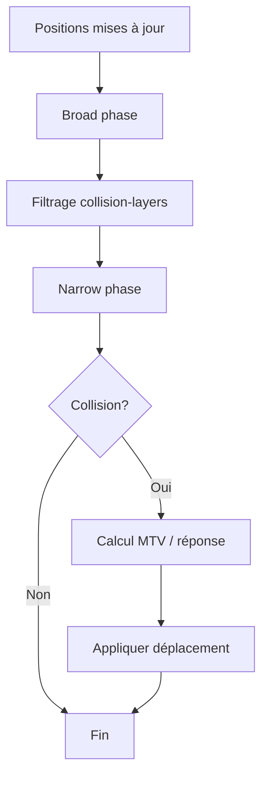
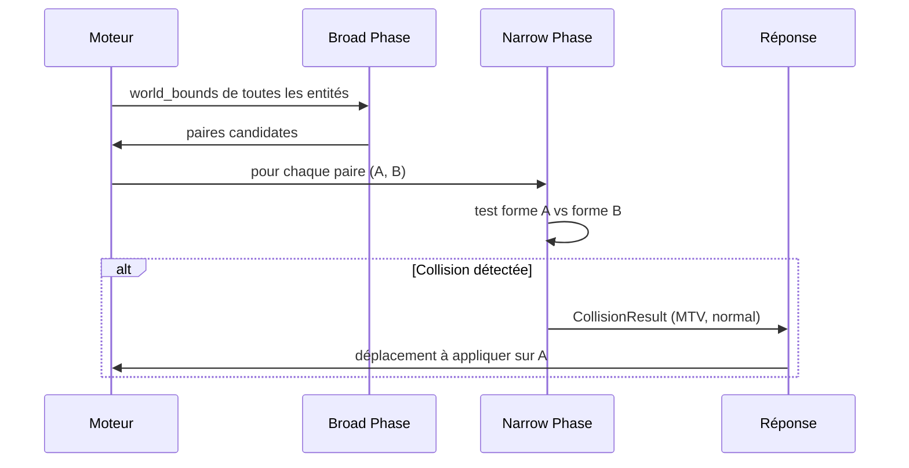
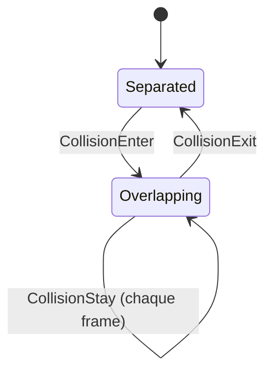
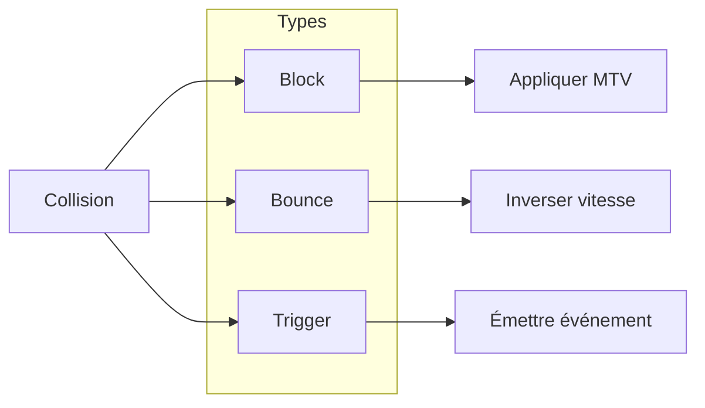

# Collision

**Catégorie :** 2. Physique et collisions  
**Description :** Détection (AABB, cercle, polygone) ; réponse (rebond, blocage).

---

## Résumé

La collision se fait en deux phases (broad puis narrow). Formes supportées : AABB-AABB, cercle-cercle, AABB-cercle. Réponses : Block (MTV), Bounce (restitution), Trigger (événements). Le filtrage collision-layers réduit les tests. Voir [hitbox](hitbox.md) et [collision-layers](collision-layers.md).

**Référence consolidée :** [MGE - Hitbox et collisions - Référence](../../MGE%20-%20Hitbox%20et%20Collisions%20-%20Reference.md) — vue synthétique hitbox + collision + formules.

---

## Contexte et rôle

### Dans le moteur MGE

La **collision** est le processus en deux phases (broad phase + narrow phase) qui détecte les chevauchements entre hitbox et produit une **réponse** (blocage du déplacement, rebond, ou simple notification pour le gameplay).

Ce point s'appuie sur les hitbox définies dans [hitbox](hitbox.md) et respecte les [collision layers](collision-layers.md) pour filtrer les paires à tester.

### Chaîne physique

**hitbox** (forme) → **collision** (détection + réponse) → **collision-layers** (qui avec qui)

### Références centralisées

Types `Vec2`, `Rect`, systèmes de coordonnées : [Référence Commune](../../MGE%20-%20Reference%20Commune.md).

**Guide transversal :** Pour collisions selon l'échelle (entités fines vs foules, RTS, musou) : [MGE - Pathfinding Collisions - Guide Entités Groupes](../../MGE%20-%20Pathfinding%20Collisions%20-%20Guide%20Entites%20Groupes.md).

---

## Portée / Scope

- Détection de collision (broad phase, narrow phase)
- Formes : AABB-AABB, cercle-cercle, AABB-cercle
- Réponse : blocage (résolution de penetration), rebond, trigger (notification sans blocage)
- Intégration avec le déplacement et la boucle de jeu

---

## Spécifications techniques

### Architecture en deux phases

#### Broad phase

Objectif : réduire le nombre de paires à tester en excluant les entités manifestement séparées.

- **Méthode recommandée :** Spatial hashing ou grille fixe (chunks/tiles). Chaque entité est assignée à une ou plusieurs cellules selon ses `world_bounds`.
- **Résultat :** Liste de paires candidates (Entity A, Entity B) qui partagent au moins une cellule.
- **Complexité cible :** O(n) en moyenne pour n entités, si la répartition est raisonnable.

#### Narrow phase

Objectif : déterminer si deux hitbox se chevauchent et, si oui, calculer les données de collision (point de contact, normale, pénétration).

- **Par type de paire :**
  - AABB-AABB : test d'intersection de rectangles (comparaison des bords)
  - Cercle-cercle : distance entre centres vs somme des rayons
  - AABB-cercle : projection du centre sur le rectangle + distance au bord le plus proche

### Formules de détection

#### AABB-AABB

Deux rectangles A et B (x, y, w, h) se chevauchent si et seulement si :

```
A.x < B.x + B.w  ET  B.x < A.x + A.w  ET
A.y < B.y + B.h  ET  B.y < A.y + A.h
```

#### Cercle-cercle

Deux cercles (C1, r1) et (C2, r2) se chevauchent si :

```
distance(C1, C2) < r1 + r2
```

Ou, équivalent : `(C2.x - C1.x)² + (C2.y - C1.y)² < (r1 + r2)²` (évite la racine carrée).

#### AABB-cercle

1. Trouver le point P sur le rectangle le plus proche du centre C du cercle (clamp).
2. Si distance(C, P) < radius → collision.

Le point P est :
- `P.x = clamp(C.x, A.x, A.x + A.w)`
- `P.y = clamp(C.y, A.y, A.y + A.h)`

### Réponse à la collision

#### Blocage (blocking)

L'entité mobile est repoussée le long de l'axe de pénétration minimale (Minimum Translation Vector, MTV) jusqu'à ce qu'elle ne chevauche plus.

- **MTV :** Vecteur de plus courte longueur qui sépare les deux formes.
- **Pour AABB-AABB :** MTV = overlap sur l'axe X ou Y selon la plus petite pénétration.
- **Pour cercle-cercle :** MTV = normalisée(C2 - C1) * (r1 + r2 - distance).
- **Ordre de résolution :** En cas de collisions multiples (ex. coin de mur), résoudre une par une ou utiliser une approche itérative (plusieurs passes).

#### Rebond (bounce)

La composante de vitesse le long de la normale de collision est inversée, éventuellement amortie par un coefficient de restitution (0 = absorption, 1 = rebond parfait).

```
v_new = v - (1 + restitution) * dot(v, normal) * normal
```

#### Trigger (notification)

Aucune modification de position ni de vitesse. Un événement `CollisionEnter` / `CollisionExit` est émis pour le gameplay (zones de dialogue, checkpoints, etc.).

### Contraintes et paramètres

| Paramètre | Plage | Défaut | Description |
|-----------|-------|--------|-------------|
| Restitution | 0..1 | 0 | Coefficient de rebond (0 = blocage pur) |
| Friction | 0..1 | 0.5 | Réduction de vitesse tangentielle (optionnel) |
| Nombre max d'itérations MTV | 1..8 | 4 | Pour résoudre les collisions en tas |
| Tolérance pénétration | 0.001..0.1 | 0.01 | Éviter les micro-oscillations |

### Intégration boucle de jeu

1. **Mise à jour des positions** (mouvement joueur, PNJ, etc.)
2. **Broad phase** : construire les paires candidates
3. **Filtrage collision-layers** : exclure les paires dont les layers ne collident pas
4. **Narrow phase** : pour chaque paire filtrée, test de collision
5. **Réponse** : pour chaque collision détectée, appliquer blocage/rebond
6. **Événements** : émettre les callbacks pour triggers et gameplay

---

## Modèle de données / API

### Structures Rust (proposition)

```rust
/// Type de réponse à la collision
#[derive(Debug, Clone, Copy, PartialEq, Eq)]
pub enum CollisionResponse {
    /// Blocage (résolution MTV)
    Block,
    /// Rebond avec coefficient de restitution
    Bounce { restitution: f32 },
    /// Notification seulement (trigger)
    Trigger,
}

/// Résultat d'un test de collision narrow phase
#[derive(Debug, Clone)]
pub struct CollisionResult {
    /// Entité A (souvent le mobile)
    pub entity_a: EntityId,
    /// Entité B (souvent le statique)
    pub entity_b: EntityId,
    /// Point de contact (monde)
    pub contact_point: Vec2,
    /// Normale de collision (de B vers A)
    pub normal: Vec2,
    /// Profondeur de pénétration
    pub penetration: f32,
    /// Type de réponse appliquée
    pub response: CollisionResponse,
}

/// Système de détection de collision
pub struct CollisionSystem {
    broad_phase: BroadPhase,
    layers: CollisionLayerMask,
}

impl CollisionSystem {
    /// Exécute broad + narrow phase, applique les réponses
    pub fn step(&mut self, world: &mut World, dt: f32);

    /// Test ponctuel AABB-AABB (utilitaire)
    pub fn test_aabb_aabb(a: &Rect, b: &Rect) -> Option<CollisionResult>;

    /// Test ponctuel cercle-cercle
    pub fn test_circle_circle(
        center_a: Vec2, radius_a: f32,
        center_b: Vec2, radius_b: f32,
    ) -> Option<CollisionResult>;
}
```

### Signatures principales

| Fonction | Signature | Rôle |
|----------|-----------|------|
| `test_aabb_aabb` | `(Rect, Rect) -> Option<CollisionResult>` | Test AABB-AABB |
| `test_circle_circle` | `(Vec2, f32, Vec2, f32) -> Option<CollisionResult>` | Test cercle-cercle |
| `test_aabb_circle` | `(Rect, Vec2, f32) -> Option<CollisionResult>` | Test AABB-cercle |
| `resolve_mtv` | `(Vec2, CollisionResult) -> Vec2` | Calcule le déplacement pour résoudre la pénétration |
| `CollisionSystem::step` | `(&mut World, f32)` | Boucle complète broad + narrow + réponse |

### Événements

```rust
pub enum CollisionEvent {
    Enter { entity_a: EntityId, entity_b: EntityId, result: CollisionResult },
    Exit { entity_a: EntityId, entity_b: EntityId },
    Stay { entity_a: EntityId, entity_b: EntityId, result: CollisionResult },
}
```

---

## Diagrammes

### Pipeline de détection



### Séquence : résolution blocage



### États d'une paire (trigger)



### Choix de la réponse



---

## Exemples et cas d'usage

### Cas 1 : Joueur contre mur

- **Joueur :** Hitbox AABB, se déplace vers la droite.
- **Mur :** Hitbox AABB statique.
- **Détection :** AABB-AABB → collision.
- **Réponse :** Block. MTV = (-overlap_x, 0). Le joueur est repoussé à gauche jusqu'à être adjacent au mur.

### Cas 2 : Projectile contre mur

- **Projectile :** Hitbox cercle, vitesse (10, 0).
- **Mur :** AABB.
- **Réponse :** Bounce, restitution 0.5. Vitesse devient (-5, 0) approximativement.
- **Alternative :** Si restitution 0, le projectile disparaît (impact).

### Cas 3 : Joueur dans zone de dialogue (trigger)

- **Joueur :** AABB.
- **Zone PNJ :** Cercle (usage Hit/Trigger).
- **Réponse :** Trigger. Aucun blocage. Événement `CollisionEnter` envoyé au script ; affichage "Appuyez sur E pour parler".

### Cas 4 : Coin de mur (double collision)

- **Joueur :** Se déplace en diagonale vers un coin.
- **Mur horizontal et vertical :** Deux AABB.
- **Problème :** Résoudre d'abord un mur peut laisser une pénétration avec l'autre.
- **Solution :** Itérer la résolution (plusieurs passes) ou résoudre selon la plus grande pénétration en premier.

### Cas 5 : Foule (nombreuses collisions)

- **Contexte :** Plusieurs PNJ dans un couloir.
- **Optimisation :** Broad phase par grille ; narrow phase uniquement pour les paires dans la même cellule.
- **Ordre de résolution :** Résoudre les collisions du joueur en priorité, puis les PNJ par ordre de priorité ou itérativement.

### Cas 6 : Bateau contre quai (Allumina)

- **Bateau :** AABB large.
- **Quai :** AABB.
- **Réponse :** Block. Le bateau s'arrête contre le quai. Pas de rebond (restitution 0).

### Cas 7 : Zone AOE (Area of Effect)

- **Sort AOE :** Cercle centré sur un point.
- **Cibles :** Entités avec hitbox (cercle ou AABB).
- **Détection :** Test cercle-cercle ou cercle-AABB pour chaque cible dans la zone.
- **Réponse :** Trigger (notification dégâts) ; pas de blocage physique.
- **Optimisation :** Broad phase par grille limite les tests aux entités dans la même zone.

### Cas 8 : Ramassage d'objet

- **Objet au sol :** Hitbox cercle, usage Collision.
- **Joueur :** S'approche, entre en collision.
- **Réponse :** Blocage évité si l'objet est "ramassable" — soit l'objet a un layer "Pickup" qui trigger avec "Player", soit un script détecte la proximité et désactive la hitbox avant le blocage.
- **Recommandation :** Utiliser une hitbox trigger pour la zone de ramassage ; la hitbox physique de l'objet peut être désactivée ou sur un layer qui ne bloque pas le joueur.

---

## Cas limites et tests

### Edge cases

| Cas | Description | Comportement attendu |
|-----|-------------|----------------------|
| Pénétration nulle | Les hitbox se touchent exactement (distance = 0) | Collision détectée ; MTV de longueur 0 ou très petite |
| Entités superposées au spawn | A et B créées au même endroit | Collision immédiate ; résolution à la première frame |
| Vitesse très élevée | Déplacement > taille hitbox en une frame (tunneling) | Broad phase peut manquer ; utiliser swept collision ou subdivision temporelle |
| Hitbox dégénérée | Rayon 0, size (0,0) | Éviter (validation dans hitbox) ; si présent, pas de crash |
| Scale 0 | entity_scale = 0 | Hitbox world_bounds nulle ; exclusion de la broad phase |

### Tunneling (percement)

Quand une entité se déplace très vite, elle peut "traverser" un mur entre deux frames. Solutions :
- **Swept collision :** Tester le segment (pos_old, pos_new) contre les obstacles.
- **Subdivision :** Diviser dt en sous-steps si la vitesse est excessive.
- **Continuous collision detection (CCD) :** Pour les projectiles rapides, envisager un raycast ou une capsule.

### Critères de validation

- [ ] AABB-AABB : collision détectée quand les rectangles se chevauchent, pas détectée quand séparés
- [ ] Cercle-cercle : idem avec distance et rayons
- [ ] AABB-cercle : détection correcte pour tous les cas (cercle à l'intérieur, à l'extérieur, tangent)
- [ ] MTV : après application, les hitbox ne se chevauchent plus (ou pénétration < tolérance)
- [ ] Rebond : la vitesse change de signe le long de la normale
- [ ] Trigger : aucun déplacement appliqué, événement émis

### Tests unitaires suggérés

```rust
#[cfg(test)]
mod tests {
    use super::*;

    #[test]
    fn aabb_aabb_overlap() {
        let a = Rect::new(0, 0, 32, 32);
        let b = Rect::new(16, 16, 32, 32);
        assert!(CollisionSystem::test_aabb_aabb(&a, &b).is_some());
    }

    #[test]
    fn aabb_aabb_no_overlap() {
        let a = Rect::new(0, 0, 32, 32);
        let b = Rect::new(50, 50, 32, 32);
        assert!(CollisionSystem::test_aabb_aabb(&a, &b).is_none());
    }

    #[test]
    fn circle_circle_overlap() {
        let r = CollisionSystem::test_circle_circle(
            Vec2::new(0, 0), 10.0,
            Vec2::new(15, 0), 10.0,
        );
        assert!(r.is_some()); // distance 15 < 20
    }

    #[test]
    fn mtv_resolves_penetration() {
        let a = Rect::new(0, 0, 32, 32);
        let b = Rect::new(20, 0, 32, 32);
        let result = CollisionSystem::test_aabb_aabb(&a, &b).unwrap();
        let mtv = result.normal * result.penetration;
        // Appliquer -mtv à a : a.x = 0 - (-12) = 12 ? Non : a doit être repoussé
        // MTV pointe de B vers A, donc on déplace A de -MTV
        assert!(result.penetration > 0.0);
    }
}
```

---

## Annexes

### Formule MTV pour AABB-AABB

Overlap en X : `overlap_x = min(a.max_x, b.max_x) - max(a.min_x, b.min_x)`  
Overlap en Y : `overlap_y = min(a.max_y, b.max_y) - max(a.min_y, b.min_y)`

Si overlap_x < 0 ou overlap_y < 0 : pas de collision.

MTV = si overlap_x < overlap_y : `(-overlap_x, 0)` ou `(overlap_x, 0)` selon le côté ; sinon similar pour Y.

Le signe dépend du côté d'où vient la pénétration (entité A par rapport à B).

### Broad phase : grille spatiale

- Taille de cellule : 32×32 px (ou taille de tile) — paramétrable.
- Pour une entité de bounds (x, y, w, h), elle occupe les cellules `(floor(x/c), floor(y/c))` à `(floor((x+w)/c), floor((y+h)/c))`.
- Paires candidates : toutes les paires (A, B) telles que A et B partagent au moins une cellule, avec A.id < B.id pour éviter les doublons.

### Performance cible

- Broad phase : < 1 ms pour 1000 entités.
- Narrow phase : < 2 ms pour 500 paires (AABB/cercle).
- Total frame : la physique ne doit pas dépasser 5–10 % du budget frame (16 ms à 60 fps).

### Correspondance avec d'autres moteurs

| MGE | Unity 2D | Godot | Bevy |
|-----|----------|-------|------|
| Broad phase | Physics2D | PhysicsDirectSpaceState | Rapier |
| Block | Collider isTrigger=false | CollisionShape2D | Collider |
| Trigger | isTrigger=true | Area2D | Sensor |
| CollisionEvent | OnCollisionEnter2D | body_entered | CollisionEvent |
| MTV | Physics2D.Simulate | get_collision_normal | contact.impact |

### Conventions de nommage

- **MTV** : Minimum Translation Vector — vecteur de séparation minimal.
- **Broad phase** / **narrow phase** : termes standards du domaine physique.
- **Trigger** : zone de détection sans réponse physique.
- **Restitution** : coefficient de rebond (0 à 1).

### Swept collision (aperçu)

Pour éviter le tunneling, on peut tester le volume balayé par l'entité pendant son déplacement :
- **AABB sweep :** Le déplacement forme un prisme (rectangle extrudé). Test d'intersection avec les obstacles.
- **Cercle sweep :** Capsule (cercle déplacé) ou segment + rayon.
- **Implémentation MVP :** Optionnel ; une subdivision en sous-steps (ex. 4 × dt/4) peut suffire pour les vitesses modérées.

### Checklist d'intégration

- [ ] Broad phase opérationnelle (grille ou spatial hash)
- [ ] Narrow phase : AABB-AABB, cercle-cercle, AABB-cercle
- [ ] Filtrage collision-layers appliqué
- [ ] Réponse Block (MTV) fonctionnelle
- [ ] Réponse Bounce optionnelle (restitution)
- [ ] Réponse Trigger avec événements Enter/Exit/Stay
- [ ] Ordre d'exécution correct dans la boucle de jeu (après mouvement, avant rendu)

### Glossaire MGE (collision)

| Terme | Définition |
|-------|------------|
| Broad phase | Phase de filtrage spatial ; réduction des paires à tester |
| Narrow phase | Phase de test précis ; détection effective du chevauchement |
| MTV | Minimum Translation Vector ; vecteur de séparation minimal |
| Restitution | Coefficient de rebond (0 = blocage, 1 = rebond parfait) |
| Trigger | Zone de détection sans réponse physique |
| Tunneling | Percement ; entité traversant un mur à haute vitesse |
| Swept collision | Détection sur le volume balayé pendant le déplacement |

### Références croisées

Ce point utilise :
- [Hitbox](hitbox.md) — formes et world_bounds
- [Collision layers](collision-layers.md) — filtrage des paires

Ce point est utilisé par :
- [Déplacement 8 directions](../03-deplacement-locomotion/deplacement-8-directions.md)
- [Boucle jeu](../23-systeme/boucle-jeu.md)
- [Projectiles](../07-combat/projectiles.md) — collision projectile-cible
- [Zone d'effet (AOE)](../07-combat/zone-effet-aoe.md) — détection des cibles dans la zone

### Documentation externe

- *Real-Time Collision Detection* (C. Ericson) — référence sur la détection de collision
- Box2D (E. Catto) — implémentation open source de physique 2D
- Rapier — moteur de physique Rust (standalone)

---

## Références

- [Référence Commune MGE](../MGE%20-%20Reference%20Commune.md) — Types, coordonnées
- [Hitbox](hitbox.md) — Formes et world_bounds
- [Collision layers](collision-layers.md) — Masques et filtrage
- [Déplacement 8 directions](../03-deplacement-locomotion/deplacement-8-directions.md) — Intégration mouvement
- [Boucle jeu](../23-systeme/boucle-jeu.md) — Ordre des systèmes
- [Index catégorie](_index.md)
- [Index MGE](../_index.md)
