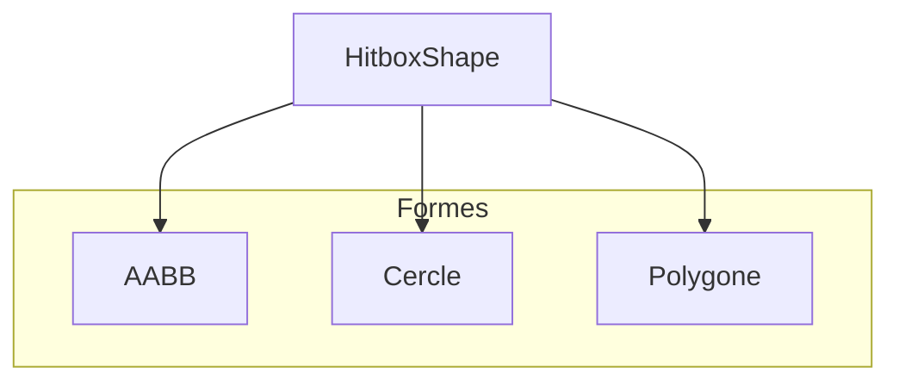
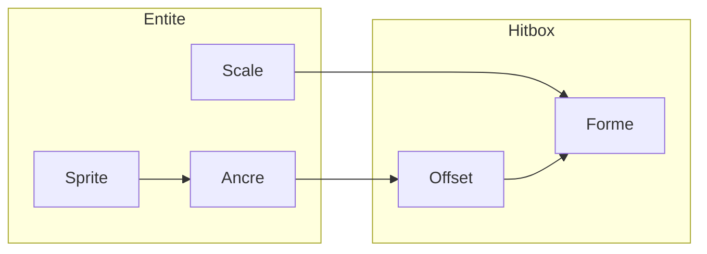
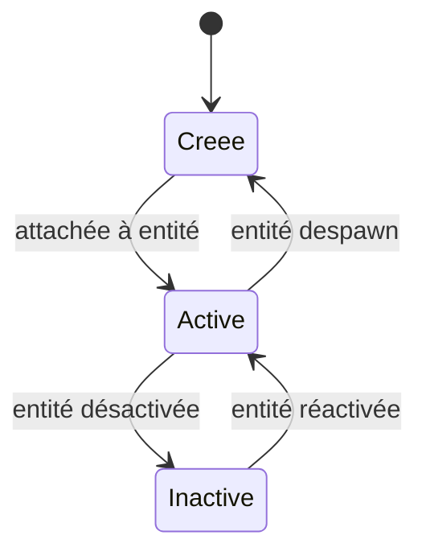

# Hitbox

**Catégorie :** 2. Physique et collisions  
**Description :** Forme et taille des hitbox ; alignement sur la taille finale du sprite.

---

## Résumé

La hitbox définit la zone de collision d'une entité. MGE supporte AABB et cercle (polygone en post-MVP). L'alignement est relatif à l'ancre du sprite. Les world_bounds servent à la broad phase de détection. Voir [Référence Commune](../../MGE%20-%20Reference%20Commune.md) pour les types de base.

**Référence consolidée :** [MGE - Hitbox et collisions - Référence](../../MGE%20-%20Hitbox%20et%20Collisions%20-%20Reference.md) — vue synthétique hitbox + collision.

---

## Contexte et rôle

### Dans le moteur MGE

La **hitbox** (zone de collision) définit la région géométrique utilisée pour la détection de collision entre entités. Elle est distincte du sprite affiché : une entité peut avoir une apparence visuelle complexe tout en possédant une hitbox simplifiée pour des raisons de performance et de cohérence gameplay.

Ce point est le premier de la chaîne physique : **hitbox → collision → collision-layers**. La hitbox décrit *quoi* collisionne ; le point [collision](collision.md) décrit *comment* on détecte le chevauchement ; le point [collision-layers](collision-layers.md) décrit *qui* collisionne avec *qui*.

### Références centralisées

Les types de base (`Vec2`, `Rect`, `Resolution`) sont définis dans la [Référence Commune](../../MGE%20-%20Reference%20Commune.md). Ce document s'appuie sur ces définitions.

**Guide transversal :** Pour hitbox et clearance selon l'échelle (entités fines vs groupes, RTS, musou) : [MGE - Pathfinding Collisions - Guide Entités Groupes](../../MGE%20-%20Pathfinding%20Collisions%20-%20Guide%20Entites%20Groupes.md).

---

## Portée / Scope

- Formes de hitbox supportées (AABB, cercle, polygone convexe)
- Alignement et ancrage par rapport au sprite
- Redimensionnement et mise à l'échelle
- Hitbox multiples par entité (optionnel)
- Cohérence monde vs pixels

---

## Spécifications techniques

### Formes supportées

#### AABB (Axis-Aligned Bounding Box)

- **Définition :** Rectangle aligné sur les axes du monde. Représenté par un `Rect` (position + largeur + hauteur).
- **Avantages :** Détection la plus rapide ; pas de rotation à gérer ; suffisant pour la majorité des cas 2D tile-based.
- **Inconvénients :** Imprécision pour des sprites orientés (ex. personnage en diagonale).
- **Convention MGE :** L'origine du `Rect` est le coin haut-gauche ; axes X (droite) et Y (bas) positifs, selon le système de coordonnées monde (voir [Référence Commune](../MGE%20-%20Reference%20Commune.md)).

#### Cercle

- **Définition :** Centre (`Vec2`) + rayon (scalaire).
- **Avantages :** Détection très rapide ; invariant par rotation ; adapté aux projectiles, PNJ ronds, zones d'effet.
- **Inconvénients :** Moins précis pour des formes allongées (ex. épée, couloir).
- **Convention MGE :** Le centre est exprimé en coordonnées monde.

#### Polygone convexe (optionnel MVP+)

- **Définition :** Liste ordonnée de sommets (`Vec2`) formant un polygone convexe.
- **Avantages :** Précision maximale pour formes complexes.
- **Inconvénients :** Coût CPU plus élevé ; gestion de la convexité requise.
- **Statut MVP :** Peut être reporté en post-MVP.

### Alignement sur le sprite

La hitbox est positionnée **relative à l'entité**. L'ancrage (anchor / pivot) du sprite détermine le point de référence :

- **Convention :** L'ancre du sprite est le point (0, 0) en coordonnées locales de l'entité.
- **Hitbox AABB :** `offset` (Vec2) + `size` (Vec2). L'offset est relatif à l'ancre.
- **Hitbox cercle :** `center_offset` + `radius`. Le centre est relatif à l'ancre.
- **Alignement typique :** Pour un personnage debout, l'ancre est souvent aux pieds (centre bas). La hitbox peut être centrée sur le torse avec un offset Y négatif.

### Taille et scale

- Les dimensions de la hitbox sont exprimées en **unités monde** (pixels logiques ou tiles, selon la convention du jeu).
- Si le sprite est mis à l'échelle (scale), la hitbox peut :
  - **Option A :** Suivre le scale (hitbox homothétique) — cas par défaut.
  - **Option B :** Rester fixe — pour des hitbox "logiques" indépendantes de l'affichage.
- **Convention MGE :** Par défaut, la hitbox suit le scale de l'entité.

### Hitbox multiples

- Une entité peut avoir plusieurs hitbox (ex. corps + arme, zones de dégâts séparées).
- Chaque hitbox a un **usage** : `Collision` (blocage, obstacle) ou `Hit` (dégâts, détection d'attaque).
- Les hitbox de type `Hit` sont décrites plutôt dans le domaine [Combat](../07-combat/).
- Pour le MVP physique, une **seule hitbox de collision** par entité est suffisante.

### Contraintes

| Contrainte | Valeur | Raison |
|------------|--------|--------|
| Rayon min (cercle) | > 0 | Éviter les cas dégénérés |
| Rayon max (cercle) | ≤ 2048 px | Limite raisonnable monde tile-based |
| Nombre de sommets (polygone) | 3–16 | Performances |
| Taille AABB min | 1×1 px | Pas de hitbox nulle |
| Taille AABB max | 4096×4096 px | Limite chunk/entité |

### Conventions de nommage

- **Hitbox** : terme standard du domaine jeu vidéo ; pas de traduction.
- **AABB** : Axis-Aligned Bounding Box ; acronyme international.
- **Offset** : décalage par rapport à l'ancre en unités monde.
- **Bounds** : rectangle englobant en coordonnées monde (pour la broad phase).

### Intégration avec le rendu

La hitbox n'est **pas** rendue par défaut. Pour le debug ou l'édition de niveaux, un mode "afficher hitbox" peut dessiner un contour (AABB en bleu, cercle en vert).

### Sérialisation (prefabs, édition)

Pour la persistance des préfabs (KindMother) ou l'édition de niveaux, la hitbox doit être sérialisable :

```json
{
  "shape": "aabb",
  "offset": { "x": 0, "y": -10 },
  "size": { "x": 20, "y": 40 }
}
```

```json
{
  "shape": "circle",
  "center_offset": { "x": 8, "y": 8 },
  "radius": 8
}
```

Les unités sont en pixels logiques (monde). Pas de référence au glossaire Miyukini pour la hitbox elle-même ; la persistance des préfabs utilise KindMother (Core Strate 4).

### Performance

- **Broad phase :** Le moteur utilise les `world_bounds` (Rect englobant) pour un premier filtrage rapide. Une hitbox cercle a un Rect englobant = centre ± radius sur chaque axe.
- **Narrow phase :** Les paires restantes sont testées avec la forme réelle (AABB-AABB, AABB-cercle, cercle-cercle). Voir [collision](collision.md).

---

## Modèle de données / API

### Structures Rust (proposition)

```rust
/// Forme de hitbox supportée
#[derive(Debug, Clone, PartialEq)]
pub enum HitboxShape {
    /// Rectangle aligné axes (position, taille)
    Aabb { offset: Vec2, size: Vec2 },
    /// Cercle (centre relatif, rayon)
    Circle { center_offset: Vec2, radius: f32 },
    /// Polygone convexe (sommets en coordonnées locales)
    #[cfg(feature = "hitbox-polygon")]
    Polygon { vertices: Vec<Vec2> },
}

/// Usage de la hitbox
#[derive(Debug, Clone, Copy, PartialEq, Eq)]
pub enum HitboxUsage {
    /// Collision physique (blocage, obstacle)
    Collision,
    /// Zone de dégâts / détection d'attaque (combat)
    Hit,
}

/// Composant hitbox attaché à une entité
#[derive(Debug, Clone)]
pub struct Hitbox {
    pub shape: HitboxShape,
    pub usage: HitboxUsage,
    /// Suit le scale de l'entité si true
    pub scale_with_entity: bool,
}

impl Hitbox {
    pub fn aabb(offset: Vec2, size: Vec2) -> Self {
        Self {
            shape: HitboxShape::Aabb { offset, size },
            usage: HitboxUsage::Collision,
            scale_with_entity: true,
        }
    }

    pub fn circle(center_offset: Vec2, radius: f32) -> Self {
        Self {
            shape: HitboxShape::Circle { center_offset, radius },
            usage: HitboxUsage::Collision,
            scale_with_entity: true,
        }
    }

    /// Retourne le Rect englobant en coordonnées monde (pour broad phase)
    pub fn world_bounds(&self, entity_pos: Vec2, entity_scale: Vec2) -> Rect {
        // Détaillé dans le point collision
    }
}
```

### Signatures principales

| Fonction | Signature | Rôle |
|----------|-----------|------|
| `Hitbox::aabb` | `(Vec2, Vec2) -> Hitbox` | Création hitbox AABB |
| `Hitbox::circle` | `(Vec2, f32) -> Hitbox` | Création hitbox cercle |
| `Hitbox::world_bounds` | `(&Hitbox, Vec2, Vec2) -> Rect` | Bounds monde pour broad phase |
| `Hitbox::contains_point` | `(&Hitbox, Vec2, Vec2) -> bool` | Test point dans hitbox |

### Référence aux types communs

- `Vec2` : Vecteur 2D (x, y)
- `Rect` : Rectangle (x, y, width, height)
- Coordonnées : voir [Référence Commune](../MGE%20-%20Reference%20Commune.md) — système monde, écran, UI.

---

## Diagrammes

### Hiérarchie des formes



### Flux : sprite → hitbox



### Cycle de vie de la hitbox



---

## Exemples et cas d'usage

### Cas 1 : Personnage Allumina

- **Sprite :** 32×48 px, ancre au centre bas (16, 48).
- **Hitbox :** AABB offset (-10, -40), size (20, 40).
- **Résultat :** Zone centrée sur le torse, un peu plus étroite que le sprite (évite les collisions sur les bras tendus).

### Cas 2 : Projectile (flèche)

- **Sprite :** 16×4 px, ancre au centre gauche (origine du tir).
- **Hitbox :** Cercle center_offset (8, 2), radius 4.
- **Raisons :** Invariant par rotation ; détection rapide ; suffisant pour un projectile fin.

### Cas 3 : Mur / tuile

- **Sprite :** 32×32 px, ancre (0, 0) coin haut-gauche.
- **Hitbox :** AABB offset (0, 0), size (32, 32).
- **Résultat :** Hitbox identique au tile.

### Cas 4 : PNJ marchand (zone de dialogue)

- **Sprite :** 48×64 px.
- **Hitbox collision :** AABB pour le blocage (corps).
- **Hitbox hit (optionnel) :** Cercle plus large pour la zone d'interaction "parler" — géré dans le module interaction, pas dans la physique pure.

### Cas 5 : Porte / zone de transition

- **Sprite :** 64×96 px (porte fermée).
- **Hitbox :** AABB offset (16, 32), size (32, 64) — ouverture au centre.
- **Raison :** Le joueur ne doit pas se bloquer sur les montants ; la zone de passage est plus étroite que le sprite.

### Cas 6 : Objet ramassable (pièce, objet au sol)

- **Sprite :** 16×16 px.
- **Hitbox :** Cercle center_offset (8, 8), radius 8 — même taille que le sprite.
- **Alternative :** AABB (0, 0, 16, 16) pour simplicité.

### Cas 7 : Bateau (Allumina)

- **Sprite :** 128×64 px, ancre au centre.
- **Hitbox :** AABB offset (-40, -20), size (80, 40) — coque uniquement, pas les voiles.
- **Raison :** Les voiles ne doivent pas bloquer ; la zone de collision correspond à la coque.

### Choix de forme : guide rapide

| Situation | Forme recommandée |
|-----------|-------------------|
| Personnage, PNJ | AABB |
| Projectile | Cercle |
| Mur, tuile | AABB |
| Zone d'effet (AOE) | Cercle |
| Objet au sol | AABB ou Cercle |
| Véhicule (bateau) | AABB |
| Zone trigger (dialogue) | Cercle (usage Hit) |

---

## Cas limites et tests

### Edge cases

| Cas | Description | Comportement attendu |
|-----|-------------|----------------------|
| Hitbox nulle | size (0, 0) ou radius 0 | Refus à la création ou à l'initialisation ; log warning |
| Hitbox hors monde | Bounds en dehors des limites du chunk | Collision possible avec bords du monde ; pas de crash |
| Scale négatif | entity_scale.x ou .y < 0 | Option : clamp à 0 ou utiliser abs ; documenter le choix |
| Polygone non convexe | Vertices en ordre non convexe | Refus ou correction automatique (enveloppe convexe) |

### Critères de validation

- [ ] Hitbox AABB produit un `Rect` monde correct pour une position et un scale donnés
- [ ] Hitbox cercle produit un cercle monde correct
- [ ] `contains_point` retourne true pour un point à l'intérieur, false à l'extérieur
- [ ] Hitbox avec scale 2 double bien les dimensions en monde
- [ ] Hitbox avec `scale_with_entity: false` ignore le scale de l'entité

### Tests unitaires suggérés

```rust
#[cfg(test)]
mod tests {
    use super::*;

    #[test]
    fn hitbox_aabb_world_bounds() {
        let h = Hitbox::aabb(Vec2::new(0, 0), Vec2::new(32, 32));
        let r = h.world_bounds(Vec2::new(100, 200), Vec2::new(1.0, 1.0));
        assert_eq!(r.x, 100.0);
        assert_eq!(r.y, 200.0);
        assert_eq!(r.width, 32.0);
        assert_eq!(r.height, 32.0);
    }

    #[test]
    fn hitbox_circle_contains_point() {
        let h = Hitbox::circle(Vec2::ZERO, 10.0);
        assert!(h.contains_point(Vec2::new(5, 5), Vec2::new(0, 0)));
        assert!(!h.contains_point(Vec2::new(15, 15), Vec2::new(0, 0)));
    }
}
```

---

## Annexes

### Formules : world_bounds

Pour une entité en position `pos` avec scale `s` :

**AABB :**
- `min = pos + offset * s`
- `max = min + size * s`
- Rect = `(min.x, min.y, size.x * s.x, size.y * s.y)`

**Cercle :**
- `center = pos + center_offset * s`
- `r = radius * max(s.x, s.y)` (ou `min` selon convention homothétique)
- Rect englobant = `(center.x - r, center.y - r, 2*r, 2*r)`

### Édition dans l'outil niveau

Lors de l'édition de niveaux, l'outil doit permettre :
- Sélection de la forme (AABB, cercle)
- Ajustement de l'offset (glisser ou saisie manuelle)
- Ajustement de la taille (AABB) ou du rayon (cercle)
- Aperçu en temps réel par rapport au sprite
- Copier/coller de hitbox entre entités similaires

### Correspondance avec d'autres moteurs

| MGE | Unity 2D | Godot | Bevy |
|-----|----------|-------|------|
| Hitbox AABB | BoxCollider2D | CollisionShape2D (Rectangle) | Collider (Cuboid) |
| Hitbox Circle | CircleCollider2D | CollisionShape2D (Circle) | Collider (Ball) |
| offset | offset | position (relatif) | transform |

### Notes d'implémentation

- **Ordre des opérations :** Lors du calcul des world_bounds, appliquer d'abord l'offset (coordonnées locales), puis le scale, enfin la position monde.
- **Précision :** Utiliser `f32` pour les coordonnées ; éviter les cumuls d'erreurs en gardant les offsets en valeurs entières ou fractionnaires simples quand possible.
- **Cache :** Les world_bounds peuvent être mises en cache par le système de collision et invalidées à chaque changement de position/scale de l'entité.
- **Hitbox par défaut :** Si une entité n'a pas de hitbox explicite, le moteur peut générer une AABB à partir des bounds du sprite (fallback), avec un warning en mode debug.

### Checklist d'intégration

- [ ] Hitbox créée et attachée au composant entité
- [ ] Offset et size/radius cohérents avec l'ancre du sprite
- [ ] world_bounds correctement calculée pour la broad phase
- [ ] Serialization/deserialization pour prefabs (KindMother)
- [ ] Mode debug : affichage optionnel des contours

### Glossaire MGE (hitbox)

| Terme | Définition |
|-------|------------|
| Hitbox | Zone de collision ; forme géométrique utilisée pour la détection |
| AABB | Axis-Aligned Bounding Box ; rectangle aligné sur les axes |
| Bounds | Rectangle englobant en coordonnées monde |
| Offset | Décalage de la hitbox par rapport à l'ancre de l'entité |
| Anchor / Pivot | Point de référence du sprite et de l'entité |
| World space | Coordonnées absolues dans le monde de jeu |

### Références croisées

Ce point est utilisé par :
- [Collision](collision.md) — la narrow phase exploite les world_bounds et les formes
- [Déplacement 8 directions](../03-deplacement-locomotion/deplacement-8-directions.md) — le mouvement est bloqué par les collisions
- [Pathfinding](../03-deplacement-locomotion/pathfinding.md) — les obstacles sont définis par leurs hitbox
- [Projectiles](../07-combat/projectiles.md) — les projectiles ont une hitbox (souvent cercle)

### Documentation externe

- *Game Physics* (E. Catto, Box2D) — hitbox et collision 2D
- Mozilla MDN Canvas — coordonnées et transformations
- Spécifications wgpu — systèmes de coordonnées pour le rendu

### Historique des choix

- **AABB par défaut :** Choix pour la majorité des entités (personnages, murs) ; simplicité et performance.
- **Cercle pour projectiles :** Invariant par rotation ; un projectile peut pivoter visuellement sans recalculer la hitbox.
- **Polygone reporté :** Post-MVP ; le gain en précision ne justifie pas la complexité pour le MVP Allumina.
- **Scale_with_entity true par défaut :** Les entités redimensionnées (boss géant) ont une hitbox cohérente avec l'affichage.

### Variations selon le type de jeu

- **Plateforme :** Hitbox personnage souvent plus petite que le sprite (marge pour les sauts).
- **Top-down / RPG :** Hitbox centrée sur le torse ; zone d'interaction (trigger) plus large.
- **Tireur :** Projectiles en cercle ; ennemis en AABB ; zones AOE en cercle.
- **Puzzle :** Hitbox strictement alignées sur la grille ; AABB de taille tile.

### FAQ

**Q : Faut-il une hitbox par frame d'animation ?**  
R : Non. Une hitbox par entité suffit. Elle peut être légèrement plus petite que la plus grande frame pour éviter les faux positifs.

**Q : Hitbox du joueur vs hitbox des ennemis — même taille ?**  
R : Souvent la hitbox joueur est un peu plus petite (meilleure sensation de contrôle). Les ennemis peuvent avoir des hitbox plus généreuses pour faciliter les coups.

**Q : Comment gérer les hitbox des projectiles qui tournent ?**  
R : Cercle. Le centre reste fixe, le rayon couvre la forme dans toutes les orientations.

### Index des sections

1. Résumé
2. Contexte et rôle
3. Portée / Scope
4. Spécifications techniques (formes, alignement, scale, contraintes, sérialisation, performance)
5. Modèle de données / API (structures Rust, signatures, types communs)
6. Diagrammes (formes, flux, cycle de vie)
7. Exemples et cas d'usage (personnage, projectile, mur, PNJ, porte, objet, bateau, guide)
8. Cas limites et tests (edge cases, critères, tests unitaires)
9. Annexes (formules, édition, correspondance moteurs, notes implémentation)
10. Checklist, glossaire, références croisées
11. Documentation externe, historique, variations, FAQ

*Document enrichi — Plan MGE Phase 1 (02-physique-collisions). Objectif : 500+ lignes par point.*

### Voir aussi

- [Monde tile-based](../01-affichage-rendu/monde-tile-based.md) — hitbox des tuiles alignées sur la grille ; chaque tile a une AABB de taille fixe
- [Culling agressif](../04-entites-monde/culling-agressif.md) — les world_bounds servent aussi au culling des entités hors écran
- [Unicité des entités](../04-entites-monde/unicite-entites.md) — chaque entité a un ID unique et peut avoir une hitbox

---

## Références

- [Référence Commune MGE](../MGE%20-%20Reference%20Commune.md) — Types `Vec2`, `Rect`, systèmes de coordonnées
- [Collision](collision.md) — Détection et réponse aux collisions
- [Collision layers](collision-layers.md) — Masques et filtrage des paires
- [Index catégorie](_index.md)
- [Index MGE](../_index.md)
- [Coordonnées](../01-affichage-rendu/coordonnees.md) — Système monde/écran/UI
- [Gestion des sprites](../01-affichage-rendu/gestion-sprites.md) — Ancre, pivot, scale
