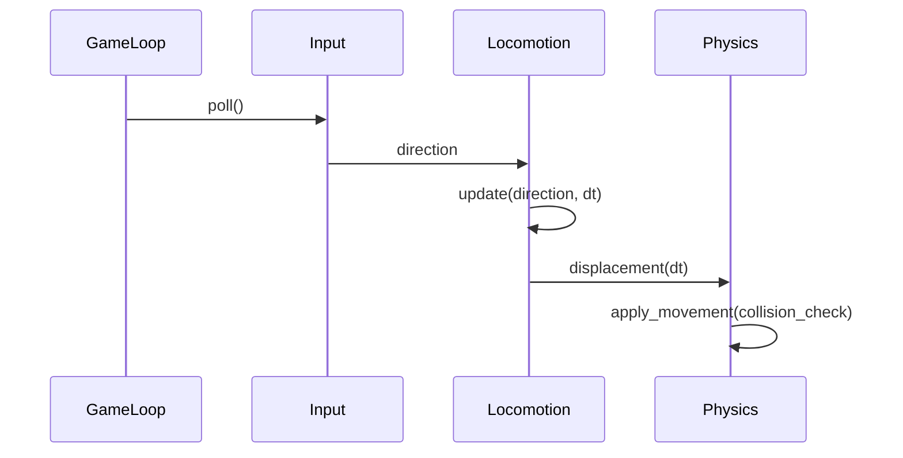
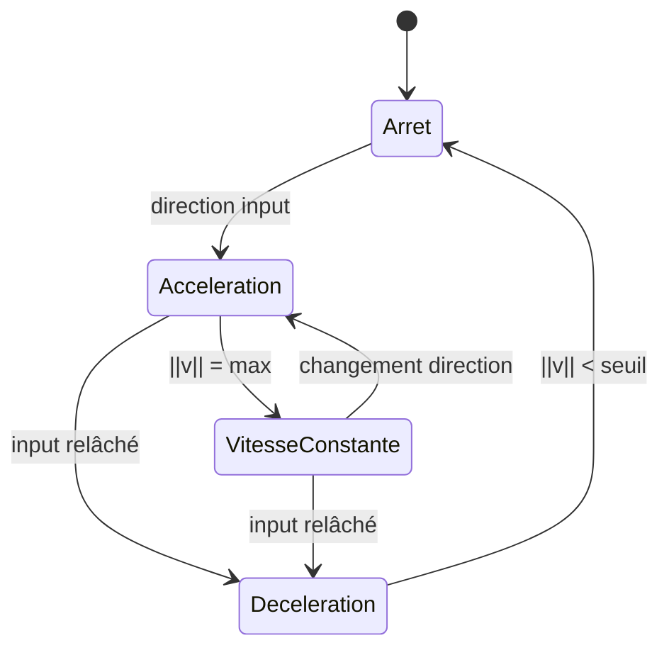
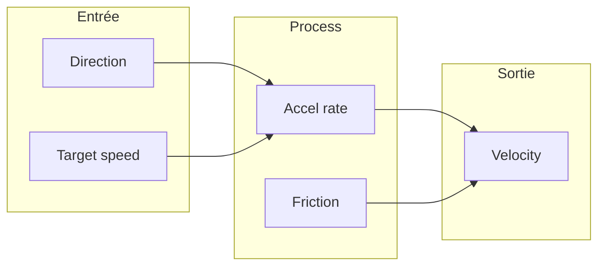

# Accélération / décélération

**Catégorie :** 3. Déplacement et locomotion  
**Description :** Interpolation de vitesse ; friction ; inertie.

---

## Contexte et rôle

### Dans le moteur MGE

L’**accélération** et la **décélération** déterminent la façon dont une entité atteint sa vitesse cible ou s’arrête. Sans interpolation, les déplacements paraissent abrupts ; avec friction et inertie, le mouvement devient naturel et lisible.

Ce point s’inscrit dans la chaîne : [déplacement-8-directions](deplacement-8-directions.md) fournit la direction ; celui-ci applique l’interpolation ; [vitesse-max](vitesse-max.md) limite la norme.

### Références centralisées

Les types de base (`Vec2`, `Rect`) sont définis dans la [Référence Commune](../../MGE%20-%20Reference%20Commune.md). Le cycle de mise à jour (delta time) y est également décrit.

---

## Portée / Scope

- Accélération vers une vitesse cible (direction × magnitude)
- Décélération / friction quand l’input est relâché
- Inertie (conservation du mouvement)
- Intégration temporelle (delta time)
- Paramètres par entité (accel_rate, friction, etc.)

---

## Spécifications techniques

### Formules de base

#### Accélération

Quand une direction est demandée, la vitesse actuelle tend vers la cible :

```
vitesse_cible = direction × vitesse_max_entité
acceleration_instantanee = (vitesse_cible - vitesse_actuelle) × accel_rate × dt
vitesse_nouvelle = clamp(vitesse_actuelle + acceleration_instantanee, 0, vitesse_max)
```

- `accel_rate` : coefficient 0..1 ou en unités/s² selon le modèle
- `dt` : delta time en secondes

#### Décélération / friction

Quand aucune direction n’est demandée :

```
vitesse_nouvelle = vitesse_actuelle × (1 - friction × dt)
```

ou version alternative (friction constante) :

```
vitesse_nouvelle = vitesse_actuelle - friction × dt × signe(vitesse)
vitesse_nouvelle = 0 si |vitesse_nouvelle| < seuil_arrêt
```

- `friction` : coefficient par seconde (ex. 8.0 → arrêt rapide)
- `seuil_arrêt` : valeur sous laquelle on considère l’entité à l’arrêt (ex. 0.01)

### Modèles d’accélération

| Modèle | Formule | Usage |
|--------|---------|--------|
| Linéaire | v += a × dt | Simple, prévisible |
| Exponentiel | v = lerp(v, cible, 1 - exp(-k × dt)) | Transition douce |
| Instantané | v = cible | Pas d’inertie, style arcade |

### Intégration temporelle

- **Variable timestep** : `dt` varie (1/60, 1/144, etc.) — risque de divergence si dt grand.
- **Fixed timestep** : physique à 60 Hz fixe ; interpolation rendu pour fluidité.
- **Convention MGE** : utiliser `dt` réel pour la locomotion, clamp `dt` à un max (ex. 0.1 s) pour éviter les sauts en cas de lag.

### Contraintes

| Contrainte | Valeur typique | Raison |
|------------|----------------|--------|
| accel_rate | 5..20 /s | Équilibre réactivité / inertie |
| friction | 4..12 /s | Arrêt en 0.2 à 0.5 s |
| dt max | 0.1 s | Stabilité en cas de freeze |
| seuil_arrêt | 0.01 | Éviter vitesses résiduelles infinies |

---

## Modèle de données / API

### Structures Rust (proposition)

```rust
/// Paramètres de locomotion pour une entité
#[derive(Debug, Clone)]
pub struct LocomotionParams {
    /// Vitesse max (voir vitesse-max.md)
    pub max_speed: f32,
    /// Accélération (unités par seconde vers la cible)
    pub acceleration_rate: f32,
    /// Friction quand pas d'input (décélération)
    pub friction: f32,
    /// Seuil sous lequel vitesse = 0
    pub stop_threshold: f32,
}

impl Default for LocomotionParams {
    fn default() -> Self {
        Self {
            max_speed: 120.0,
            acceleration_rate: 10.0,
            friction: 8.0,
            stop_threshold: 0.01,
        }
    }
}

/// État de locomotion d'une entité
#[derive(Debug, Clone)]
pub struct LocomotionState {
    pub velocity: Vec2,
    pub params: LocomotionParams,
}

impl LocomotionState {
    /// Met à jour la vitesse selon direction demandée et dt
    pub fn update(&mut self, direction: Vec2, dt: f32) {
        let dt = dt.min(0.1); // Clamp pour stabilité

        if direction.length_squared() < 1e-12 {
            // Pas d'input : friction
            let f = 1.0 - (self.params.friction * dt).min(1.0);
            self.velocity *= f;
            if self.velocity.length() < self.params.stop_threshold {
                self.velocity = Vec2::ZERO;
            }
        } else {
            // Input : accélération vers direction × max_speed
            let target = direction.normalize_or_zero() * self.params.max_speed;
            let acc = (target - self.velocity) * (self.params.acceleration_rate * dt).min(1.0);
            self.velocity += acc;
            self.velocity = self.velocity.clamp_length_max(self.params.max_speed);
        }
    }

    /// Retourne le déplacement à appliquer cette frame
    pub fn displacement(&self, dt: f32) -> Vec2 {
        self.velocity * dt
    }
}
```

### Signatures principales

| Fonction | Signature | Rôle |
|----------|------------|------|
| `LocomotionState::update` | `(&mut self, Vec2, f32)` | Met à jour la vitesse |
| `LocomotionState::displacement` | `(&self, f32) -> Vec2` | Déplacement à appliquer |
| `LocomotionParams::default` | `() -> Self` | Paramètres par défaut |

---

## Diagrammes

### Boucle de mise à jour



### États de vitesse



### Courbe accélération typique



---

## Exemples et cas d'usage

### Cas 1 : Personnage Allumina (marche)

- `max_speed` = 80 px/s, `acceleration_rate` = 12, `friction` = 10.
- Joueur appuie sur D à t=0. Après 0.5 s : vitesse ≈ 75 px/s (proche du max).
- Joueur relâche à t=1. Après 0.3 s : vitesse ≈ 5 px/s, puis 0.

### Cas 2 : PNJ lent (NPC marchand)

- `max_speed` = 40, `acceleration_rate` = 4, `friction` = 6.
- Démarrage plus progressif, arrêt plus lent — sensation de personnage non pressé.

### Cas 3 : Projectile (accélération nulle)

- Pour un projectile, souvent pas d’accélération : vitesse constante dès le spawn.
- Ce composant peut être désactivé ou `acceleration_rate` très élevé + `friction` = 0.

### Cas 4 : Bateau (forte inertie)

- `acceleration_rate` = 2, `friction` = 2.
- Met plusieurs secondes à atteindre la vitesse de croisière et à s’arrêter.

---

## Cas limites et tests

### Edge cases

| Cas | Description | Comportement attendu |
|-----|-------------|----------------------|
| dt = 0 | Pas de temps écoulé | Pas de changement de vitesse |
| dt très grand (1 s) | Lag ou pause | Clamp dt → pas d’ overshoot |
| direction (0, 0) | Input neutre | Friction appliquée |
| direction non normalisée | (2, 2) | Normalisation interne ou comportement défini |
| max_speed = 0 | Entité immobile | Vitesse reste 0 |
| friction très élevé | 100 | Arrêt quasi instantané |

### Critères de validation

- [ ] Vitesse ne dépasse jamais max_speed
- [ ] Avec friction, vitesse tend vers 0
- [ ] Avec direction constante, vitesse tend vers max_speed
- [ ] dt clampé ne provoque pas de saut aberrant
- [ ] stop_threshold évite les vitesses résiduelles infinies

### Tests unitaires suggérés

```rust
#[cfg(test)]
mod tests {
    use super::*;

    #[test]
    fn friction_arrete() {
        let mut state = LocomotionState {
            velocity: Vec2::new(100.0, 0.0),
            params: LocomotionParams::default(),
        };
        for _ in 0..50 {
            state.update(Vec2::ZERO, 0.016);
        }
        assert!(state.velocity.length() < 0.1);
    }

    #[test]
    fn acceleration_vers_max() {
        let mut state = LocomotionState {
            velocity: Vec2::ZERO,
            params: LocomotionParams {
                max_speed: 100.0,
                acceleration_rate: 20.0,
                ..Default::default()
            },
        };
        state.update(Vec2::new(1.0, 0.0), 0.5);
        assert!(state.velocity.x > 80.0);
        assert!(state.velocity.x <= 100.0);
    }

    #[test]
    fn dt_clamp_evite_explosion() {
        let mut state = LocomotionState {
            velocity: Vec2::ZERO,
            params: LocomotionParams::default(),
        };
        state.update(Vec2::new(1.0, 0.0), 5.0); // dt énorme
        assert!(state.velocity.length() <= state.params.max_speed + 1.0);
    }
}
```

---

## Références

- [Référence Commune MGE](../../MGE%20-%20Reference%20Commune.md) — Vec2, cycle de rendu, delta time
- [Déplacement 8 directions](deplacement-8-directions.md) — Direction d’input
- [Vitesse max](vitesse-max.md) — Limite de vitesse
- [Gestion du temps](../../23-systeme/gestion-temps.md) — Delta time, fixed timestep
- [Index catégorie](_index.md)
- [Index MGE](../_index.md)

---

## Paramètres par type d'entité

### Personnage joueur

- acceleration_rate : 10–15
- friction : 8–12
- Réactif, bon contrôle

### PNJ marchand

- acceleration_rate : 4–6
- friction : 6–8
- Lent, déplacements calmes

### Ennemi rapide

- acceleration_rate : 15–20
- friction : 10
- Réactif, poursuite efficace

### Bateau

- acceleration_rate : 2–3
- friction : 2–3
- Forte inertie

---

## Interpolation avancée

### Courbe d'accélération

- Ease-in : démarrage lent, accélération progressive
- Ease-out : arrivée douce
- Ease-in-out : combiné

### Smoothing

- Lisser les changements de direction brusques
- Éviter le "zigzag" lorsque le pathfinding donne des waypoints proches

---

## Debug et éditeur

### Visualisation

- Afficher le vecteur vitesse à l'écran
- Couleur selon norme (vert = lent, rouge = rapide)

### Tuning

- Paramètres éditable en temps réel
- Sliders pour accel_rate, friction, max_speed

---

## Spécifications étendues

### Formule exponentielle détaillée

Pour une transition douce vers la vitesse cible :
`v(t+dt) = v_cible + (v(t) - v_cible) * exp(-k * dt)`
où k = coefficient de lissage (ex. 5.0). Plus k est grand, plus la convergence est rapide.

### Friction avec seuil d'arrêt

Pour éviter les vitesses résiduelles infinies : si |v| < seuil après application de la friction, forcer v = 0. Seuil typique : 0.01 à 0.1.

### Accélération différentielle par axe

Certains véhicules (ex. bateau) accélèrent mieux en avant qu'en arrière. Paramètres séparés : accel_forward, accel_backward, friction.

### Collision pendant l'accélération

Si une collision est détectée après le déplacement, la vitesse peut être projetée sur la surface (slide) ou annulée (stop). Voir point collision.

### Intégration Verlet (optionnel)

Pour une physique plus stable, l'intégration Verlet peut remplacer Euler : position basée sur la position précédente et l'accélération, sans stocker explicitement la vitesse. Conversion possible.

### Courbe d'accélération personnalisée

Une courbe (AnimationCurve, LUT) peut définir comment la vitesse évolue dans le temps. Ex. : démarrage lent, pic au milieu, ralentissement final.
