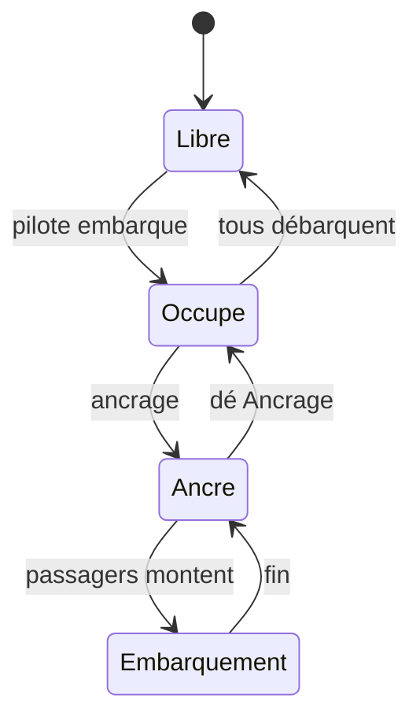
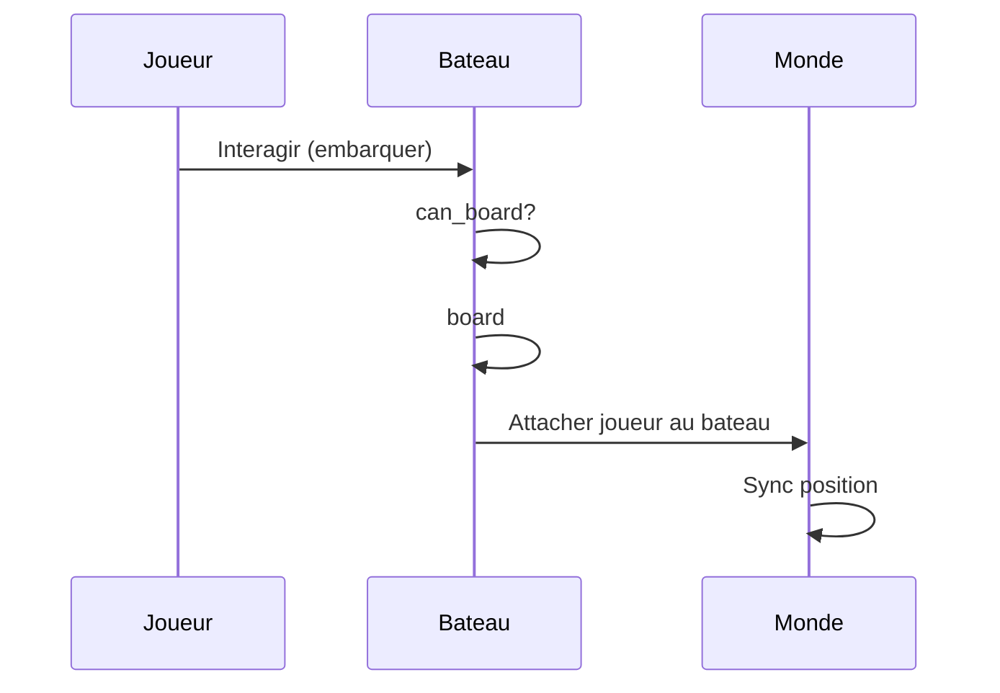
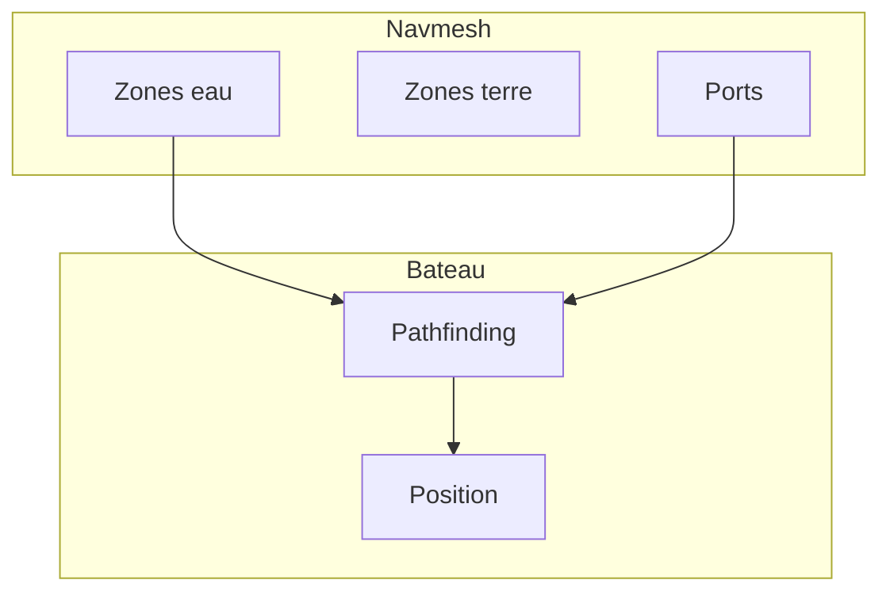

# Bateaux

**Catégorie :** 3. Déplacement et locomotion  
**Description :** Navigation ; multi-passagers ; ancrage.

---

## Contexte et rôle

### Dans le moteur MGE

Les **bateaux** permettent la navigation sur les zones aquatiques. Ils sont des véhicules partagés : plusieurs joueurs peuvent embarquer ; le pilote contrôle le déplacement. L’ancrage permet de stationner le bateau et d’en descendre.

Ce point s’articule avec le [navmesh](navmesh.md) (zones eau), le [combat naval](combat-naval.md) et les [continents](continents.md) (traversées longue distance).

### Références centralisées

Les types `Vec2`, `Rect` et le système de coordonnées sont définis dans la [Référence Commune](../../MGE%20-%20Reference%20Commune.md).

---

## Portée / Scope

- Véhicule flottant (bateau)
- Déplacement sur zones eau
- Embarquement / débarquement
- Multi-passagers (pilote + passagers)
- Ancrage (stationnement)
- Interaction avec quais et ports

---

## Spécifications techniques

### Zones de navigation

- Le [navmesh](navmesh.md) définit les zones **eau** navigables
- Le pathfinding pour bateaux utilise uniquement les nœuds de type eau
- Transitions terre ↔ eau via **ports** (quais, embarcadères)

### Déplacement

- Vitesse typique : 60–120 px/s (plus lent que course à pied sur courte distance, mais traverse l’eau)
- Inertie élevée : [accélération-décélération](acceleration-deceleration.md) avec faible friction
- Direction : 8 directions ou continue selon le design
- Rotation du sprite : le bateau pointe dans la direction du mouvement

### Embarquement

- Interaction sur le bateau ou le quai
- Conditions : bateau ancré ou immobile ; joueur à proximité
- Le joueur devient « passager » ; son hitbox suit le bateau
- Limite de passagers : 1–8 selon le type de bateau

### Pilote

- Un seul pilote à la fois
- Le pilote contrôle la direction et la vitesse
- Changement de pilote : le pilote actuel descend ou transmet le contrôle

### Ancrage

- **Ancrage** : le bateau s’arrête ; les joueurs peuvent monter/descendre
- **Dé Ancrage** : le pilote reprend le contrôle
- Zones d’ancrage : uniquement aux quais ou dans des zones désignées (optionnel)

### Contraintes

| Contrainte | Valeur | Raison |
|------------|--------|--------|
| Vitesse max bateau | 100–150 px/s | Gameplay |
| Rayon interaction embarquer | 32–64 px | Proximité |
| Passagers max | 4–8 | Performance, design |
| Zone ancrage | Quais uniquement | Éviter blocage |

---

## Modèle de données / API

### Structures Rust (proposition)

```rust
/// État d'un bateau
#[derive(Debug, Clone)]
pub struct BoatState {
    pub position: Vec2,
    pub velocity: Vec2,
    pub direction: Vec2,
    pub anchored: bool,
    pub pilot: Option<EntityId>,
    pub passengers: Vec<EntityId>,
    pub max_passengers: u8,
    pub params: BoatParams,
}

/// Paramètres bateau
#[derive(Debug, Clone)]
pub struct BoatParams {
    pub max_speed: f32,
    pub acceleration: f32,
    pub friction: f32,
}

impl BoatState {
    pub fn can_board(&self, entity: EntityId) -> bool {
        self.anchored
            && (self.passengers.len() as u8) < self.max_passengers
            && !self.passengers.contains(&entity)
    }

    pub fn board(&mut self, entity: EntityId) -> bool {
        if !self.can_board(entity) {
            return false;
        }
        if self.pilot.is_none() {
            self.pilot = Some(entity);
        } else {
            self.passengers.push(entity);
        }
        true
    }

    pub fn disembark(&mut self, entity: EntityId) -> Option<Vec2> {
        let exit_offset = Vec2::new(32.0, 0.0); // À côté du bateau
        if self.pilot == Some(entity) {
            self.pilot = self.passengers.pop();
            Some(self.position + exit_offset)
        } else if let Some(pos) = self.passengers.iter().position(|&e| e == entity) {
            self.passengers.remove(pos);
            Some(self.position + exit_offset)
        } else {
            None
        }
    }
}
```

### Signatures principales

| Fonction | Signature | Rôle |
|----------|------------|------|
| `BoatState::can_board` | `(&self, EntityId) -> bool` | Vérifie embarquement |
| `BoatState::board` | `(&mut self, EntityId) -> bool` | Embarquement |
| `BoatState::disembark` | `(&mut self, EntityId) -> Option<Vec2>` | Débarquement |

---

## Diagrammes

### Cycle de vie du bateau



### Flux embarquement



### Intégration navmesh



---

## Exemples et cas d'usage

### Cas 1 : Traversée de lac

- Joueur embarque à un quai
- Pilote le bateau vers l’autre rive
- Ancrage au quai d’arrivée ; débarquement

### Cas 2 : Groupe en bateau

- 4 joueurs ; un pilote, 3 passagers
- Tous se déplacent ensemble
- Passagers peuvent attaquer (voir [combat naval](combat-naval.md)) ou utiliser des compétences

### Cas 3 : Bateau abandonné

- Pilote déconnecte ou meurt
- Bateau immobile ou dérive (design)
- Les passagers peuvent descendre ou prendre le pilotage

### Cas 4 : Traversée continent

- Voir [continents](continents.md) pour les traversées longue distance
- Bateau comme moyen de transport entre cartes

---

## Cas limites et tests

### Edge cases

| Cas | Description | Comportement attendu |
|-----|-------------|----------------------|
| Embarquer bateau en mouvement | Bateau non ancré | Refus embarquement |
| Pilote descend | Qui pilote ? | Premier passager ou personne |
| Bateau détruit | En combat naval | Débarquement forcé |
| Zone hors eau | Bateau poussé sur terre | Arrêt ou glitch à éviter |

### Critères de validation

- [ ] Passagers suivent la position du bateau
- [ ] Ancrage nécessaire pour embarquer
- [ ] Pathfinding reste sur zones eau
- [ ] Collision avec autres bateaux gérée

---

## Types de bateaux

### Canot

- 1–2 passagers
- Vitesse moyenne
- Pas de combat intégré

### Bateau de pêche

- 1–4 passagers
- Lent, stable
- Usage : pêche (voir économie)

### Voilier

- 4–8 passagers
- Vitesse variable (vent)
- Combat naval possible

### Galion

- 8+ passagers
- Lent, puissant
- Multiples canons

---

## Contrôles et inputs

### Pilote

- ZQSD / WASD : direction
- Shift : acceleration (ou touche dédiée)
- Clic : destination (pathfinding vers point)

### Passagers

- Pas de contrôle du mouvement
- Peuvent utiliser compétences, canons (combat naval)
- Peuvent interagir (inventaire, etc.)

---

## Annexe : physique simplifiée

### Inertie

- Accélération faible : 2–3 units/s²
- Friction faible : arrêt en 3–5 s
- Virage : rotation progressive

### Vent (optionnel)

- Direction et force du vent modifient la vitesse
- Bateaux à voile : bonus si vent arrière
- Réalisme vs gameplay

---

## Spawn et despawn

- Bateau spawn à l'ancrage ou au quai
- Despawn si détruit (combat naval) ou si tous débarquent (optionnel)
- Réapparition : cooldown ou coût or

---

## Spécifications étendues

### Rotation et orientation

Le bateau doit pointer dans la direction du mouvement. Interpolation de rotation : slerp ou lerp d'angle pour éviter les à-coups.

### Vagues et bobbing (optionnel)

Mouvement vertical sinusoïdal pour simuler les vagues. Amplitude faible (2–5 px). Phase décalée par position pour variété.

### Son ambiant

Bruit de l'eau, gréement (voilier). Volume selon vitesse. Muet à l'arrêt.

### Propriétaire et permission

Un bateau peut avoir un propriétaire. Seul le propriétaire (ou son groupe) peut piloter ou donner accès. Vol de bateau : mécanique optionnelle.

---

## Annexe : actions disponibles

| Action | Condition | Effet |
|--------|-----------|-------|
| Embarquer | Proche, ancré | Devenir passager/pilote |
| Débarquer | Ancré | Quitter bateau |
| Ancrer | Proche quai | Arrêter |
| Dé Ancrer | Pilote | Reprendre contrôle |

---

## Références

- [Référence Commune MGE](../../MGE%20-%20Reference%20Commune.md)
- [Navmesh](navmesh.md) — Zones eau, ports
- [Combat naval](combat-naval.md) — Cannons, abordage
- [Continents](continents.md) — Traversées
- [Pathfinding](pathfinding.md) — Déplacement sur graphe
- [Index catégorie](_index.md)
- [Index MGE](../_index.md)
