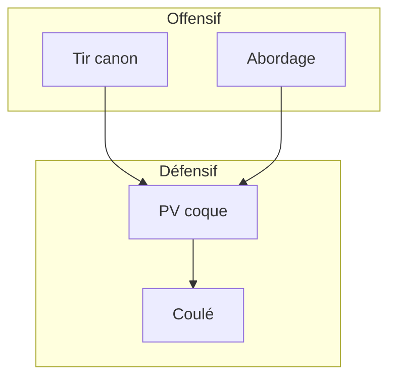
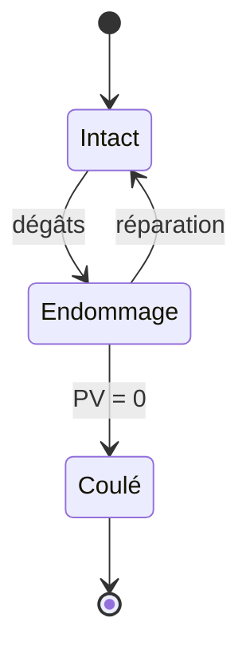
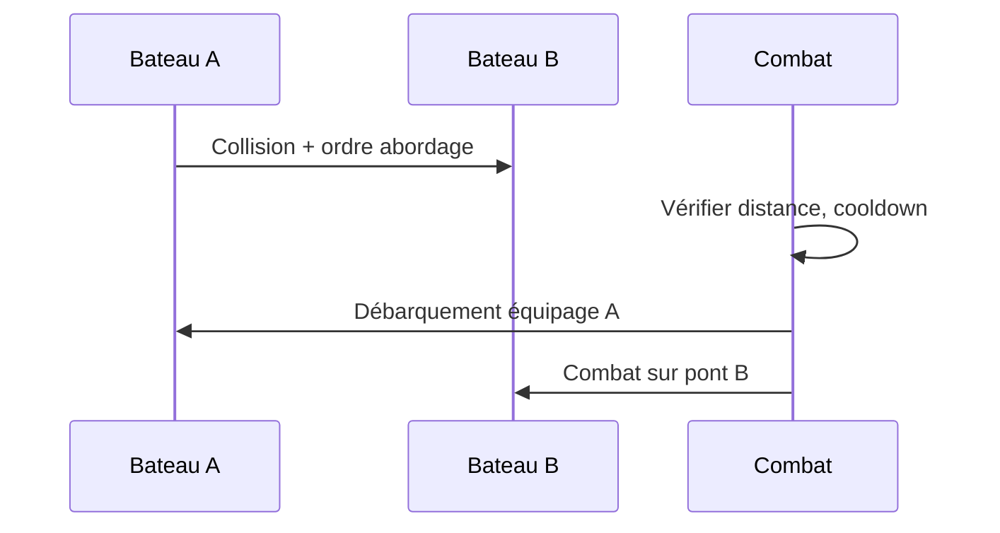

# Combat naval

**Catégorie :** 3. Déplacement et locomotion  
**Description :** Cannons ; abordage ; dégâts.

---

## Contexte et rôle

### Dans le moteur MGE

Le **combat naval** étend les [bateaux](bateaux.md) avec des capacités offensives : canons, abordage, dégâts aux coques. Les passagers peuvent participer (tir, boarding) ou le bateau lui-même est l’unité de combat.

Ce point relie la locomotion maritime et le [combat](../../07-combat/) (dégâts, ciblage, ressources).

### Références centralisées

Les types `Vec2`, `Rect` et le système de coordonnées sont définis dans la [Référence Commune](../../MGE%20-%20Reference%20Commune.md).

---

## Portée / Scope

- Canons (tir, portée, dégâts)
- Abordage (collision entre bateaux, combat au corps à corps)
- Dégâts au navire (PV du bateau)
- Équipage et rôles (pilote, canonnier, etc.)

---

## Spécifications techniques

### Canons

- **Portée** : 200–600 px selon le type
- **Cadence** : 1 tir toutes les 2–5 s
- **Projectile** : boulet avec trajectoire parabolique ou ligne droite
- **Dégâts** : selon [dégâts et résistances](../../08-degats-resistances-effets/) — type physique, possible résistance coque
- **Angle** : canons latéraux (gauche/droite) ou tourelle (360°)

### Abordage

- **Déclenchement** : collision entre deux bateaux à faible vitesse relative, ou compétence dédiée
- **Effet** : transfert en combat corps à corps sur le pont ; ou dégâts immédiats
- **Condition** : proximité (ex. 32 px) + vitesse < seuil

### Dégâts au navire

- **PV du bateau** : barre de vie séparée des joueurs
- **Réparation** : au port, ou compétence, ou objet
- **Coulé** : PV à 0 → bateau détruit ; joueurs à l’eau (noyade ou secours)

### Contraintes

| Contrainte | Valeur | Raison |
|------------|--------|--------|
| Portée max canon | 600 px | Limite abuse |
| Cooldown abordage | 10–30 s | Équilibre |
| PV bateau | 500–2000 | Selon type |

---

## Modèle de données / API

### Structures Rust (proposition)

```rust
/// État combat naval
#[derive(Debug, Clone)]
pub struct NavalCombatState {
    pub boat_id: EntityId,
    pub hull_hp: f32,
    pub hull_max_hp: f32,
    pub cannons: Vec<CannonState>,
    pub boarding_cooldown: f32,
}

/// Canon
#[derive(Debug, Clone)]
pub struct CannonState {
    pub side: CannonSide, // Left, Right, Front
    pub cooldown_remaining: f32,
    pub range: f32,
    pub damage: f32,
}

/// Action de combat naval
#[derive(Debug, Clone)]
pub enum NavalCombatAction {
    FireCannon { cannon_idx: usize, target: Vec2 },
    Board { target_boat: EntityId },
}

impl NavalCombatState {
    pub fn can_fire(&self, idx: usize) -> bool {
        self.cannons.get(idx)
            .map(|c| c.cooldown_remaining <= 0.0)
            .unwrap_or(false)
    }

    pub fn take_hull_damage(&mut self, amount: f32) {
        self.hull_hp = (self.hull_hp - amount).max(0.0);
    }

    pub fn is_sunk(&self) -> bool {
        self.hull_hp <= 0.0
    }
}
```

### Signatures principales

| Fonction | Signature | Rôle |
|----------|------------|------|
| `NavalCombatState::can_fire` | `(&self, usize) -> bool` | Test tir |
| `NavalCombatState::take_hull_damage` | `(&mut self, f32)` | Dégâts coque |
| `NavalCombatState::is_sunk` | `(&self) -> bool` | Bateau coulé |

---

## Diagrammes

### Flux combat naval



### États du bateau



### Séquence abordage



---

## Exemples et cas d'usage

### Cas 1 : Duel de canon

- Deux bateaux en ligne ; chacun tire à portée
- Dégâts à la coque ; le premier à 0 PV coule

### Cas 2 : Abordage réussi

- Bateau A percute Bateau B ; ordre d’abordage
- Équipage de A monte sur B ; combat au corps à corps
- Vainqueur prend le contrôle ou pille

### Cas 3 : Bateau coulé

- PV à 0 ; bateau disparaît
- Joueurs à l’eau : nage vers le rivage ou respawn au dernier port

### Cas 4 : Canonnier passager

- Passager manœuvre un canon ; pilote dirige le bateau
- Coopération équipage

---

## Cas limites et tests

### Edge cases

| Cas | Description | Comportement attendu |
|-----|-------------|----------------------|
| Tir hors portée | Cible trop loin | Refus ou projectile s’arrête |
| Abordage en mouvement rapide | Collision violente | Dégâts additionnels ou refus |
| Bateau coulé avec passagers | Mort/noyade | Débarquement forcé, état à l’eau |
| Deux abordages simultanés | Deadlock | Priorité ou résolution déterministe |

### Critères de validation

- [ ] Canons respectent cooldown et portée
- [ ] Dégâts appliqués à la coque
- [ ] Abordage déclenché dans les conditions prévues
- [ ] Coulé déclenche destruction et évacuation

### Tests unitaires suggérés

```rust
#[cfg(test)]
mod tests {
    use super::*;

    #[test]
    fn hull_damage_reduit_hp() {
        let mut s = NavalCombatState {
            hull_hp: 100.0,
            hull_max_hp: 100.0,
            ..Default::default()
        };
        s.take_hull_damage(30.0);
        assert_eq!(s.hull_hp, 70.0);
    }

    #[test]
    fn is_sunk_quand_hp_zero() {
        let s = NavalCombatState {
            hull_hp: 0.0,
            hull_max_hp: 100.0,
            ..Default::default()
        };
        assert!(s.is_sunk());
    }
}
```

---

## Types de navires et variantes

### Petits bateaux

- **Canot** : 1 canon par côté, PV bas, rapide
- **Sloop** : 2 canons, PV moyen, manœuvrable

### Navires moyens

- **Brick** : 4 canons, bon compromis
- **Frégate** : 6 canons, PV élevé, vitesse moyenne

### Gros navires

- **Galion** : 8+ canons, très résistant, lent
- **Vaisseau de guerre** : 10+ canons, équipage nombreux

---

## Équipage et rôles

### Pilote

- Contrôle direction et vitesse
- Peut ordonner l’ancrage
- Ne peut pas tirer pendant le pilotage (ou avec malus)

### Canonniers

- Un canonnier par canon (ou partagés)
- Action : viser et tirer
- Cooldown partagé ou individuel selon design

### Passagers

- Peuvent participer au combat (arc, mêlée si abordage)
- Ne contrôlent pas le navire

---

## Dégâts et résistances

### Types de dégâts

- **Physique** : boulets de canon
- **Feu** : boulets enflammés (DOT sur la coque)
- **Perforant** : dégâts ignorent partiellement l’armure

### Résistance coque

- Chaque type de navire a des résistances de base
- Équipement (renforts) peut modifier
- Référence : [résistances](../../08-degats-resistances-effets/)

---

## Spécifications étendues

- **Trajectoire boulets** : parabolique ou droite ; collision coque/eau
- **AOE boulet** : rayon 20–40 px, dégâts réduits en bordure
- **Réparation** : au port, coût or/matériaux
- **Canonniers** : un passager par canon ; cooldown partagé ou individuel

---

## Annexe : séquence abordage

1. Collision bateau A – bateau B
2. Vitesse relative < seuil (ex. 20 px/s)
3. Pilote A ordonne abordage
4. Vérification cooldown
5. Équipage A transféré sur pont B
6. Combat au corps à corps (système combat standard)
7. Vainqueur : contrôle du bateau ou pillage

---

## Références

- [Référence Commune MGE](../../MGE%20-%20Reference%20Commune.md)
- [Bateaux](bateaux.md) — Véhicule de base
- [Combat](../../07-combat/) — Dégâts, ciblage
- [Dégâts et résistances](../../08-degats-resistances-effets/) — Formules
- [Projectiles](../../07-combat/) — Trajectoire des boulets
- [Index catégorie](_index.md)
- [Index MGE](../_index.md)
