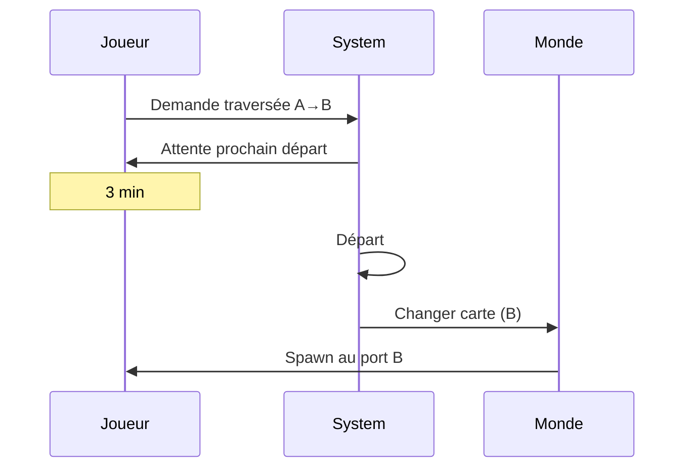
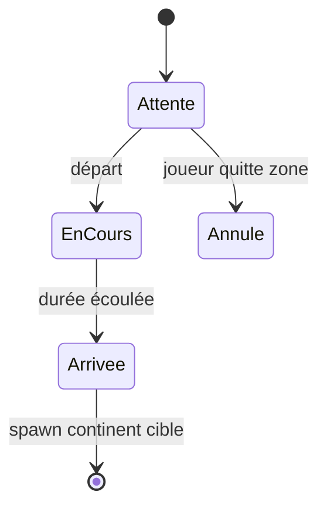
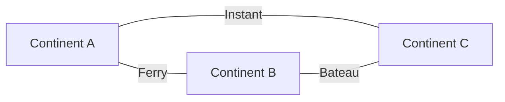

# Continents

**Catégorie :** 3. Déplacement et locomotion  
**Description :** Traversée entre continents ; attente ; horaires.

---

## Contexte et rôle

### Dans le moteur MGE

Les **continents** représentent des cartes ou zones distinctes reliées par des traversées (bateau, ferry, téléportation). La traversée peut être instantanée (écran de chargement) ou simulée avec un temps d’attente et des horaires de départ.

Ce point s’articule avec les [bateaux](bateaux.md), la [téléportation PNJ](pnj-teleportation.md) et les [runes atlas](runes-atlas.md). La persistance de la position du joueur (continent actuel) peut être gérée par **KindMother**.

### Références centralisées

Les types et conventions sont définis dans la [Référence Commune](../../MGE%20-%20Reference%20Commune.md).

---

## Portée / Scope

- Plusieurs continents (cartes)
- Traversées (ferry, bateau, passager)
- Attente et horaires de départ
- Changement de carte (chargement)
- Persistance position (KindMother)

---

## Spécifications techniques

### Modèle de continents

- **Continent** : carte ou zone avec identifiant unique
- **Liaison** : paire (continent A, continent B) avec type de traversée
- **Point de traversée** : position d’embarquement/débarquement (quai, portail)

### Types de traversée

| Type | Temps | Description |
|------|------|-------------|
| Instantané | 0 s | Téléportation directe (écran de chargement) |
| Ferry programmé | 2–10 min | Attente départ ; traversée simulée ou timeout |
| Bateau joueur | Variable | Le joueur pilote (voir [bateaux](bateaux.md)) |
| Passage à pied | 0 s | Porte entre zones même carte |

### Horaires

- **Départ fixe** : ex. toutes les 5 min, à :00, :05, :10...
- **Départ à la demande** : lorsque N joueurs présents ou après délai
- **Horaire jour/nuit** : certains ferries seulement à certaines heures (optionnel)

### Attente

- **Zone d’attente** : le joueur doit rester proche du point d’embarquement
- **Timeout** : si le joueur quitte la zone, annulation ou pénalité
- **Affichage** : timer « Prochain départ dans X min »

### Contraintes

| Contrainte | Valeur | Raison |
|------------|--------|--------|
| Continents max | 10–50 | Design |
| Délai min traversée | 0–30 s | UX |
| Délai max traversée | 5–15 min | Éviter attente excessive |

---

## Modèle de données / API

### Structures Rust (proposition)

```rust
/// Identifiant de continent
#[derive(Debug, Clone, Copy, PartialEq, Eq, Hash)]
pub struct ContinentId(pub u16);

/// Type de traversée
#[derive(Debug, Clone, Copy, PartialEq, Eq)]
pub enum CrossingType {
    Instant,
    Ferry { interval_secs: u32 },
    PlayerBoat,
}

/// Liaison entre continents
#[derive(Debug, Clone)]
pub struct ContinentLink {
    pub from: ContinentId,
    pub to: ContinentId,
    pub from_position: Vec2,
    pub to_position: Vec2,
    pub crossing_type: CrossingType,
}

/// État de traversée en cours
#[derive(Debug, Clone)]
pub struct CrossingState {
    pub link: ContinentLink,
    pub departure_at: Instant,
    pub arrival_at: Instant,
    pub status: CrossingStatus,
}

#[derive(Debug, Clone, Copy, PartialEq, Eq)]
pub enum CrossingStatus {
    Waiting,      // En attente du départ
    InProgress,   // Traversée en cours
    Arriving,     // Arrivée imminente
}
```

### Signatures principales

| Fonction | Signature | Rôle |
|----------|------------|------|
| `request_crossing` | `(EntityId, ContinentLink) -> Result<CrossingState>` | Demande traversée |
| `CrossingState::is_ready` | `(&self, Instant) -> bool` | Départ possible |
| `complete_crossing` | `(EntityId, CrossingState) -> ContinentId` | Effectue le transfert |

---

## Diagrammes

### Flux traversée ferry



### États traversée



### Graphe continents



---

## Exemples et cas d'usage

### Cas 1 : Ferry régulier

- Continent A (ville) ↔ Continent B (île)
- Départ toutes les 5 min
- Joueur attend 2 min ; embarque ; écran de chargement ; arrive sur B

### Cas 2 : Traversée bateau joueur

- Joueur pilote son [bateau](bateaux.md) de A vers B
- Pas d’horaire ; arrivée quand le joueur atteint le port de B
- Transition de carte à l’ancrage

### Cas 3 : Téléportation PNJ

- Voir [pnj-teleportation](pnj-teleportation.md)
- PNJ propose téléport vers continents connus ; coût or ou objet

### Cas 4 : Persistance

- Joueur déconnecte pendant traversée
- Reconnexion : position sur le continent de départ ou d’arrivée selon progression
- KindMother stocke `current_continent_id`, `crossing_state` si pertinent

---

## Cas limites et tests

### Edge cases

| Cas | Description | Comportement attendu |
|-----|-------------|----------------------|
| Déconnect pendant attente | Joueur quitte | Annulation ou reprise au retour |
| Déconnect pendant traversée | En cours | Spawn au continent cible |
| Ferry plein | Capacité limite | Attente prochain départ |
| Lien désactivé | Maintenance | Message, pas de traversée |

### Critères de validation

- [ ] Horaires respectés (départ à l’heure)
- [ ] Joueur spawne au bon point d’arrivée
- [ ] Changement de carte propre (déchage/chargement)
- [ ] Persistance cohérente

---

## Gestion du temps in-game

### Horloge jeu vs réel

- Les ferries peuvent utiliser le temps réel ou le temps in-game
- **Temps réel** : plus simple, prévisible
- **Temps in-game** : jour/nuit ; traversées de nuit uniquement (optionnel)

### Format horaire

- 1 h jeu = 5 min réel (exemple)
- Départs : 00:00, 01:00, 02:00... (temps jeu)

---

## Zone d’attente et pénalités

### Reste dans la zone

- Rayon : 64–128 px autour du point d’embarquement
- Si le joueur sort : annulation ou perte de la place

### Déconnect pendant l’attente

- Option A : perte de la place, refund si coût
- Option B : reprise à la connexion (place réservée X min)

### Déconnect pendant traversée

- Spawn au continent d’arrivée (traversée considérée complète)
- Ou spawn au continent de départ (remboursement)

---

## Capacité et files d’attente

### Ferry limité

- Capacité : 10–30 joueurs par traversée
- File d’attente si plein
- Premier arrivé, premier servi (FIFO)

### Bateau joueur

- Pas de limite (sauf passagers max du bateau)
- Traversée à la demande

---

## Spécifications étendues

- **Horloge** : temps réel ou temps in-game pour horaires
- **Zone attente** : rayon 64–128 px ; sortie = annulation
- **Déconnect** : spawn arrivée (traversée complète) ou départ (remboursement)
- **Capacité ferry** : 10–30 joueurs ; file FIFO si plein

---

## Annexe : exemples de configuration

### Ferry Ville-Île

- Départ : toutes les 5 min
- Durée traversée : 30 s (écran chargement)
- Coût : 50 or
- Capacité : 20 joueurs

### Ferry gratuit hub

- Départ : à la demande (dès 1 joueur)
- Durée : 10 s
- Coût : 0
- Usage : retour rapide au hub

### Bateau joueur

- Pas de coût ferry
- Traversée = temps de navigation du joueur
- Arrivée = ancrage au port de destination

---

## Références

- [Référence Commune MGE](../../MGE%20-%20Reference%20Commune.md)
- [Bateaux](bateaux.md) — Navigation
- [PNJ téléportation](pnj-teleportation.md) — Téléport zones
- [Runes atlas](runes-atlas.md) — Recall, Portail
- [Données joueur](../../05-joueur-personnage/donnees-joueur.md) — Persistance KindMother
- [Index catégorie](_index.md)
- [Index MGE](../_index.md)
