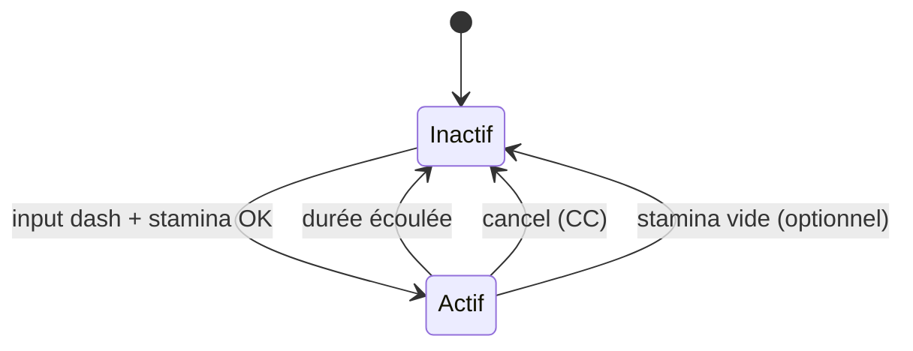
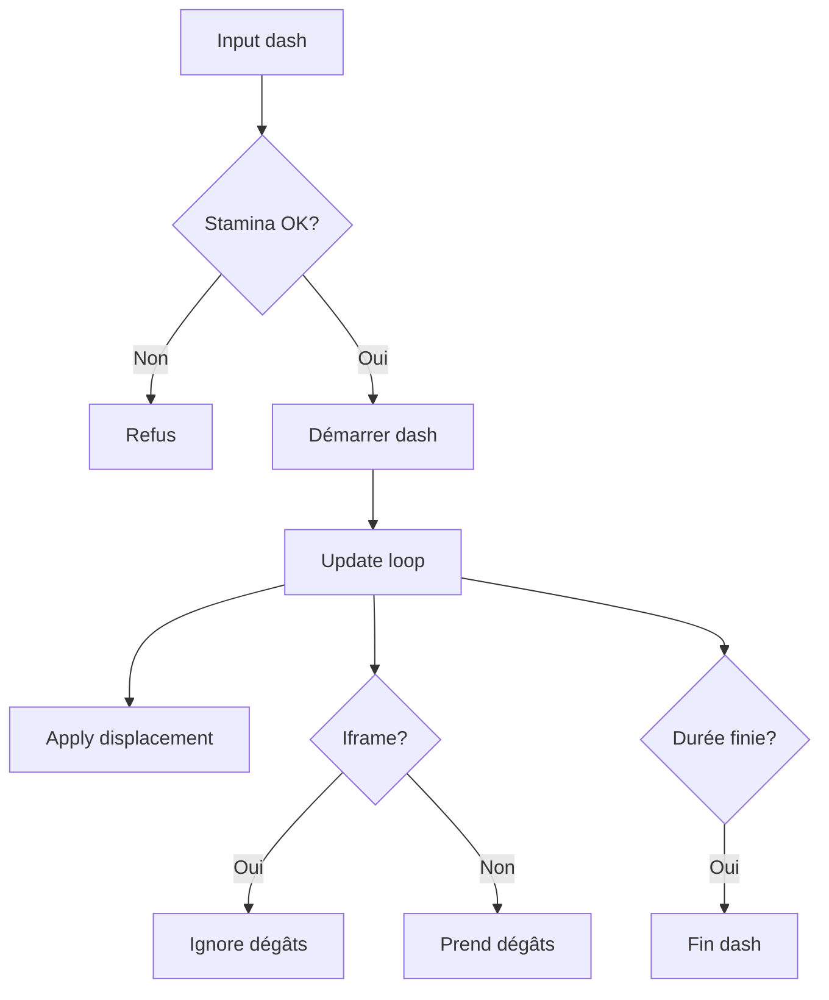

# Dash / esquive

**Catégorie :** 3. Déplacement et locomotion  
**Description :** Déplacement rapide ; invincibilité ; cancel.

---

## Contexte et rôle

### Dans le moteur MGE

Le **dash** (ou esquive) est un déplacement rapide sur courte distance, souvent accompagné d’une brève invincibilité (i-frames). Il consomme de l’[endurance](stamina.md) et peut être annulé par certains effets (stun, root).

Ce point combine locomotion, ressources (stamina) et [combat](../../07-combat/) (invulnérabilité, CC).

### Références centralisées

Les types `Vec2` et le delta time sont définis dans la [Référence Commune](../../MGE%20-%20Reference%20Commune.md).

---

## Portée / Scope

- Déplacement rapide (distance, direction, durée)
- Invincibilité pendant le dash (i-frames)
- Coût en endurance
- Annulation par CC (stun, root, etc.)
- Cooldown global

---

## Spécifications techniques

### Paramètres typiques

| Paramètre | Valeur | Rôle |
|-----------|--------|------|
| Distance | 80–150 px | Portée du dash |
| Durée | 0.15–0.3 s | Temps du déplacement |
| Vitesse effective | Distance / Durée | ~400–600 px/s |
| I-frames | 0.1–0.25 s | Invulnérabilité |
| Coût stamina | 20–40 | Voir [stamina](stamina.md) |
| Cooldown | 3–8 s | Limite le spam |

### Direction

- **Direction input** : dash dans la direction du mouvement (voir [deplacement-8-directions](deplacement-8-directions.md))
- **Direction fixe** : dash toujours vers l’avant (orientation du personnage)
- **Clic direction** : dash vers le curseur (optionnel)

### Invincibilité

- Pendant les i-frames : pas de dégâts, pas de CC
- Les projectiles et AOE qui touchent sont ignorés
- Fin des i-frames avant la fin du dash (optionnel) : les derniers instants peuvent être vulnérables

### Annulation (cancel)

- **Stun, root, freeze** : dash interrompu, personne à l’arrêt
- **Knockback** : peut overwrite le dash selon le design
- **Mort** : dash stoppé

### Contraintes

| Contrainte | Valeur | Raison |
|------------|--------|--------|
| Distance max | 200 px | Éviter exploits |
| Stamina min | Coût du dash | Refus si insuffisant |
| Une seule instance | Pas de dash en dash | Cohérence |

---

## Modèle de données / API

### Structures Rust (proposition)

```rust
/// État du dash
#[derive(Debug, Clone)]
pub struct DashState {
    pub active: bool,
    pub elapsed: f32,
    pub direction: Vec2,
    pub total_duration: f32,
    pub iframe_duration: f32,
    pub distance: f32,
}

impl DashState {
    pub fn start(&mut self, direction: Vec2, params: &DashParams) -> bool {
        if self.active {
            return false;
        }
        self.active = true;
        self.elapsed = 0.0;
        self.direction = direction.normalize_or_zero();
        self.total_duration = params.duration;
        self.iframe_duration = params.iframe_duration;
        self.distance = params.distance;
        true
    }

    pub fn update(&mut self, dt: f32) -> Option<Vec2> {
        if !self.active {
            return None;
        }
        self.elapsed += dt;
        if self.elapsed >= self.total_duration {
            self.active = false;
            return None;
        }
        let progress = self.elapsed / self.total_duration;
        let speed = self.distance / self.total_duration;
        Some(self.direction * speed * dt)
    }

    pub fn is_invincible(&self) -> bool {
        self.active && self.elapsed < self.iframe_duration
    }

    pub fn cancel(&mut self) {
        self.active = false;
    }
}

/// Paramètres dash
#[derive(Debug, Clone)]
pub struct DashParams {
    pub distance: f32,
    pub duration: f32,
    pub iframe_duration: f32,
    pub stamina_cost: f32,
    pub cooldown: f32,
}
```

### Signatures principales

| Fonction | Signature | Rôle |
|----------|------------|------|
| `DashState::start` | `(&mut self, Vec2, &DashParams) -> bool` | Démarrer dash |
| `DashState::update` | `(&mut self, f32) -> Option<Vec2>` | Déplacement frame |
| `DashState::is_invincible` | `(&self) -> bool` | I-frames actives |
| `DashState::cancel` | `(&mut self)` | Annulation |

---

## Diagrammes

### États du dash



### Timeline dash typique

```mermaid
gantt
    title Timeline dash
    dateFormat X
    axisFormat %L
    section Dash
    Déplacement :0, 300
    section I-frames
    Invincible :0, 200
    Vulnérable :200, 300
```



### Intégration



---

## Exemples et cas d'usage

### Cas 1 : Esquive d’AOE

- Zone de dégâts au sol
- Joueur dash vers la sortie
- I-frames évitent les dégâts pendant la traversée

### Cas 2 : Approche rapide

- Ennemi à portée moyenne
- Dash pour se rapprocher et attaquer
- Consommation stamina + cooldown limitent l’abus

### Cas 3 : Fuite

- Dash pour créer de la distance
- Direction = opposée aux ennemis
- Cooldown empêche dash infini

### Cas 4 : Annulation par stun

- Joueur dash ; ennemi applique stun
- Dash cancel ; joueur immobilisé
- Stamina peut être remboursée partiellement ou pas (design)

---

## Cas limites et tests

### Edge cases

| Cas | Description | Comportement attendu |
|-----|-------------|----------------------|
| Dash dans mur | Collision | Arrêt ou slide le long du mur |
| Direction (0,0) | Pas de direction | Dash refusé ou direction par défaut |
| Stun pendant dash | CC appliqué | Dash cancel |
| Double dash | Spam input | Un seul dash ; cooldown |

### Critères de validation

- [ ] Déplacement total ≈ distance paramétrée
- [ ] I-frames empêchent bien les dégâts
- [ ] Cancel stoppe le dash
- [ ] Coût stamina déduit une seule fois
- [ ] Collision avec obstacles gérée

---

## Collision pendant le dash

- **Obstacles statiques** : dash s'arrête au contact ou slide le long du mur
- **Obstacles dynamiques** : traversable ou blocage selon design
- **Projectiles** : ignorés pendant i-frames

---

## Variantes et feedback

- **Dash direction fixe** vs **dash vers curseur**
- Trail visuel et son "whoosh" au départ
- Cooldown et coût stamina affichés en UI

---

## Annexe : paramètres par type

| Type | Distance | Durée | I-frames | Coût stamina | Cooldown |
|------|----------|-------|----------|---------------|----------|
| Esquive base | 100 | 0.2 | 0.15 | 25 | 5 s |
| Esquive avancée | 150 | 0.25 | 0.2 | 35 | 8 s |
| Dash mage | 120 | 0.18 | 0.12 | 20 mana | 4 s |
| Roulement tank | 80 | 0.22 | 0.22 | 30 | 6 s |

---

## Annexe : intégration complète

### Séquence complète d'un dash

1. Joueur appuie sur touche dash
2. Vérification : stamina >= coût, cooldown OK, pas de CC
3. Déduction stamina, démarrage cooldown
4. Direction : input actuel ou vers curseur
5. DashState::start()
6. Chaque frame : DashState::update(dt) → déplacement
7. Pendant i-frames : flag invincible = true
8. Collision : test obstacles, arrêt ou slide si contact
9. Fin durée : DashState::active = false

### Gestion des CC

- Stun, root, freeze : appel DashState::cancel()
- Le déplacement en cours est interrompu
- Stamina non remboursée (design)

### Feedback UI

- Icône dash : grisée si cooldown ou stamina insuffisant
- Timer cooldown : cercle ou barre qui se remplit
- Effet visuel pendant dash : trail, blur

---

## Références

- [Référence Commune MGE](../../MGE%20-%20Reference%20Commune.md)
- [Stamina](stamina.md) — Coût
- [Déplacement 8 directions](deplacement-8-directions.md) — Direction
- [Collision](../../02-physique-collisions/collision.md) — Arrêt sur obstacle
- [Crowd control](../../08-degats-resistances-effets/) — Stun, root
- [Index catégorie](_index.md)
- [Index MGE](../_index.md)
