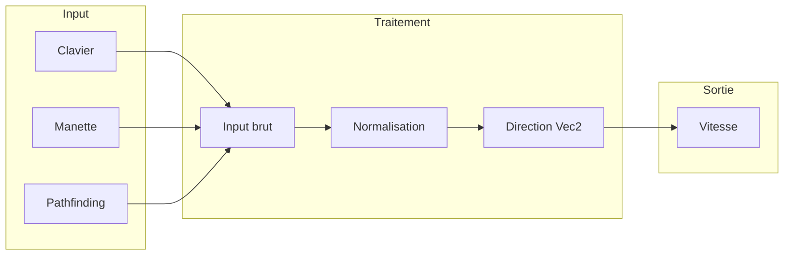
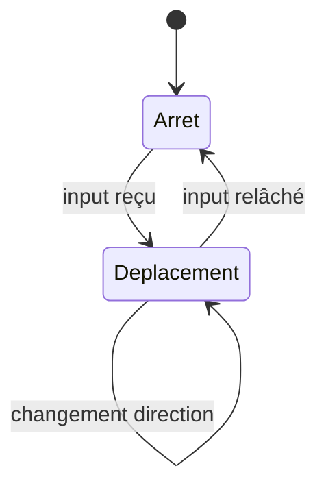
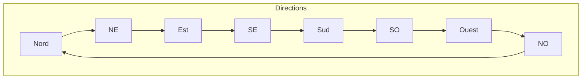

# Déplacement 8 directions

**Catégorie :** 3. Déplacement et locomotion  
**Description :** Haut, bas, gauche, droite + 4 diagonales ; input normalisé.

---

## Contexte et rôle

### Dans le moteur MGE

Le **déplacement 8 directions** est la base fondamentale de la locomotion des personnages et PNJ dans un monde 2D. Il permet de se déplacer selon huit directions distinctes (cardinales + diagonales) à partir d’inputs normalisés (clavier, manette, pathfinding).

Ce point est le premier de la chaîne locomotion : **déplacement-8-directions → accélération-décélération → vitesse-max**. Il définit *comment* l’input est converti en direction de déplacement ; les points suivants gèrent l’interpolation et les limites.

### Références centralisées

Les types de base (`Vec2`, système de coordonnées) sont définis dans la [Référence Commune](../../MGE%20-%20Reference%20Commune.md). Ce document s’appuie sur ces définitions.

---

## Portée / Scope

- Huit directions : N, S, E, W, NE, NW, SE, SW
- Normalisation du vecteur d’input pour éviter la sur-vitesse en diagonale
- Mapping clavier et manette vers direction
- Intégration avec le système d’entrées utilisateur
- Cohérence avec le monde tile-based et les coordonnées

---

## Spécifications techniques

### Directions supportées

| Direction | Angles (degrés) | Vec2 normalisé (exemple) | Touches courantes |
|-----------|----------------|---------------------------|-------------------|
| Nord (N)  | 270° ou -90°   | (0, -1)                   | W ou ↑            |
| Sud (S)   | 90°             | (0, 1)                    | S ou ↓            |
| Est (E)   | 0°              | (1, 0)                    | D ou →            |
| Ouest (W) | 180°            | (-1, 0)                   | A ou ←            |
| Nord-Est (NE) | 315°        | (0.707, -0.707)           | W+D               |
| Nord-Ouest (NW) | 225°       | (-0.707, -0.707)          | W+A               |
| Sud-Est (SE) | 45°          | (0.707, 0.707)            | S+D               |
| Sud-Ouest (SW) | 135°       | (-0.707, 0.707)           | S+A               |

### Normalisation diagonale

Sans normalisation, la combinaison (1, 1) donnerait une norme √2 ≈ 1,41, donc une vitesse supérieure en diagonale. La **normalisation** garantit que toute direction a une norme de 1 :

```
direction_normalisee = input_raw / max(||input_raw||, epsilon)
```

- `input_raw` : (axe_horizontal, axe_vertical)
- `epsilon` : seuil minimal (ex. 0.001) pour éviter les divisions par zéro

### Convention des axes

- **X positif** : droite (Est)
- **Y positif** : bas (Sud) — convention écran 2D classique
- Origine du monde : définie dans la [Référence Commune](../../MGE%20-%20Reference%20Commune.md)

### Mapping input

| Source       | Axe horizontal      | Axe vertical        | Notes                          |
|--------------|---------------------|---------------------|--------------------------------|
| Clavier WASD | A=-1, D=+1          | W=-1, S=+1          | Pas de valeur intermédiaire    |
| Clavier flèches | ←=-1, →=+1      | ↑=-1, ↓=+1          | Idem                           |
| Manette      | Stick gauche X      | Stick gauche Y      | Valeurs analogiques -1..1      |
| Pathfinding  | Vecteur calculé     | Vecteur calculé     | Déjà normalisé ou à normaliser |

### Combinaisons simultanées

- **Cardinal + cardinal** → diagonale (ex. W + D → NE)
- **Pas d’input** → direction (0, 0) — entité à l’arrêt
- **Clavier** : combinaisons binaires (0 ou 1 par axe) → 8 directions + arrêt
- **Manette** : directions continues possibles ; arrondi ou seuillage pour 8 directions « snap » si souhaité

### Contraintes

| Contrainte        | Valeur     | Raison                           |
|-------------------|------------|----------------------------------|
| Epsilon normalisation | 1e-6 à 1e-3 | Éviter division par zéro        |
| Seuil deadzone manette | 0.1 à 0.2 | Ignorer le drift du stick        |
| Nombre de directions | 8 fixe   | Simplification gameplay 2D       |

---

## Modèle de données / API

### Structures Rust (proposition)

```rust
/// Direction de déplacement discrète (8 directions)
#[derive(Debug, Clone, Copy, PartialEq, Eq)]
pub enum Direction8 {
    North,
    NorthEast,
    East,
    SouthEast,
    South,
    SouthWest,
    West,
    NorthWest,
}

impl Direction8 {
    /// Vec2 unitaire correspondant
    pub fn to_vec2(&self) -> Vec2 {
        match self {
            Direction8::North => Vec2::new(0.0, -1.0),
            Direction8::NorthEast => Vec2::new(0.70710678, -0.70710678),
            Direction8::East => Vec2::new(1.0, 0.0),
            Direction8::SouthEast => Vec2::new(0.70710678, 0.70710678),
            Direction8::South => Vec2::new(0.0, 1.0),
            Direction8::SouthWest => Vec2::new(-0.70710678, 0.70710678),
            Direction8::West => Vec2::new(-1.0, 0.0),
            Direction8::NorthWest => Vec2::new(-0.70710678, -0.70710678),
        }
    }

    /// Depuis un Vec2 (arrondi à la direction la plus proche)
    pub fn from_vec2(v: Vec2) -> Option<Self> {
        let len = v.length();
        if len < 1e-6 {
            return None;
        }
        let n = v / len;
        let angle = n.y.atan2(n.x).to_degrees();
        // 0° = Est, 90° = Sud, etc.
        let index = ((angle + 180.0 + 22.5) / 45.0) as i32 % 8;
        Some(match index {
            0 => Direction8::East,
            1 => Direction8::SouthEast,
            2 => Direction8::South,
            3 => Direction8::SouthWest,
            4 => Direction8::West,
            5 => Direction8::NorthWest,
            6 => Direction8::North,
            7 => Direction8::NorthEast,
            _ => Direction8::North,
        })
    }
}

/// Input brut depuis clavier/manette
#[derive(Debug, Clone, Default)]
pub struct MovementInput {
    pub horizontal: f32, // -1 à 1
    pub vertical: f32,   // -1 à 1
}

impl MovementInput {
    /// Normalise pour obtenir une direction (norme 1 ou 0)
    pub fn to_direction(&self, deadzone: f32) -> Vec2 {
        let h = Self::apply_deadzone(self.horizontal, deadzone);
        let v = Self::apply_deadzone(self.vertical, deadzone);
        let v = Vec2::new(h, v);
        let len = v.length();
        if len < 1e-6 {
            Vec2::ZERO
        } else {
            v / len
        }
    }

    fn apply_deadzone(value: f32, deadzone: f32) -> f32 {
        if value.abs() < deadzone {
            0.0
        } else {
            let sign = value.signum();
            (value.abs() - deadzone) / (1.0 - deadzone) * sign
        }
    }
}
```

### Signatures principales

| Fonction | Signature | Rôle |
|----------|------------|------|
| `Direction8::to_vec2` | `(&Direction8) -> Vec2` | Conversion en vecteur unitaire |
| `Direction8::from_vec2` | `(Vec2) -> Option<Direction8>` | Arrondi à la direction la plus proche |
| `MovementInput::to_direction` | `(&MovementInput, f32) -> Vec2` | Normalisation avec deadzone |

---

## Diagrammes

### Flux input → direction → vitesse



### États de direction



### Mapping 8 directions (vue top-down)



---

## Exemples et cas d'usage

### Cas 1 : Personnage Allumina (clavier WASD)

- Joueur appuie sur W et D.
- Input brut : horizontal=1, vertical=-1.
- Direction normalisée : (0.707, -0.707) → Nord-Est.
- La vitesse (gérée par [accélération-décélération](acceleration-deceleration.md)) est appliquée selon cette direction.

### Cas 2 : PNJ suivant un chemin (pathfinding)

- Algorithme A* retourne une liste de waypoints.
- Vecteur vers le prochain waypoint : (100, 50).
- Normalisation : (100, 50) / √(100²+50²) ≈ (0.894, 0.447).
- Arrondi Direction8 : Est ou Sud-Est selon le seuil.
- Le PNJ se déplace dans cette direction jusqu’au waypoint.

### Cas 3 : Manette analogique

- Stick à (0.7, -0.5).
- Après deadzone 0.2 : (0.625, -0.375) rescaled.
- Normalisation → direction ≈ (0.857, -0.514).
- Soit utilisation directe (mouvement fluide) soit snap Direction8 pour un style plus « grid ».

### Cas 4 : Immobilité

- Aucune touche enfoncée : (0, 0).
- Norme < epsilon → direction = (0, 0).
- Composant [accélération-décélération](acceleration-deceleration.md) applique la friction pour ramener la vitesse à zéro.

---

## Cas limites et tests

### Edge cases

| Cas | Description | Comportement attendu |
|-----|-------------|----------------------|
| Input (0, 0) | Aucune touche | Direction (0, 0), pas de division par zéro |
| Input très petit | (1e-7, 1e-7) | Traité comme (0, 0) ou direction arrondie |
| Deadzone totale | Stick dans le cadran mais < deadzone | Direction (0, 0) |
| Diagonale parfaite | (1, 1) | Norme 1 après normalisation, pas √2 |
| Changement brusque | W → S instantané | Direction passe de N à S sans crash |

### Critères de validation

- [ ] Les 8 directions produisent un Vec2 de norme 1
- [ ] Direction8::from_vec2(0,0) retourne None
- [ ] Normalisation (1,1) donne une norme 1
- [ ] Deadzone supprime les petites valeurs
- [ ] Combinaisons clavier WASD donnent les bonnes diagonales

### Tests unitaires suggérés

```rust
#[cfg(test)]
mod tests {
    use super::*;

    #[test]
    fn direction8_norme_unitaire() {
        for d in [
            Direction8::North, Direction8::SouthEast, Direction8::West,
        ] {
            let v = d.to_vec2();
            assert!((v.length() - 1.0).abs() < 1e-5, "{:?}", d);
        }
    }

    #[test]
    fn normalisation_diagonale() {
        let input = MovementInput {
            horizontal: 1.0,
            vertical: 1.0,
        };
        let dir = input.to_direction(0.0);
        assert!((dir.length() - 1.0).abs() < 1e-5);
        assert!((dir.x - 0.707).abs() < 0.01);
    }

    #[test]
    fn deadzone_annule_petit_input() {
        let input = MovementInput {
            horizontal: 0.15,
            vertical: 0.0,
        };
        let dir = input.to_direction(0.2);
        assert_eq!(dir, Vec2::ZERO);
    }
}
```

---

## Références

- [MGE - Paramètres déplacement entité](../../MGE%20-%20Parametres%20Deplacement%20Entite.md) — Tous les paramètres pour se déplacer
- [Référence Commune MGE](../../MGE%20-%20Reference%20Commune.md) — Types `Vec2`, coordonnées
- [Accélération / décélération](acceleration-deceleration.md) — Interpolation de vitesse
- [Vitesse max](vitesse-max.md) — Limite de vitesse
- [Pathfinding](pathfinding.md) — Calcul de direction vers une cible
- [Entrées utilisateur](../../23-systeme/entrees-utilisateur.md) — Source des inputs
- [Index catégorie](_index.md)
- [Index MGE](../_index.md)

---

## Mode 4 directions (optionnel)

- Certains jeux utilisent 4 directions (N, S, E, W) uniquement
- Diagonal = mouvement interdit ou arrondi au cardinal le plus proche
- Plus simple, style rétro

---

## Intégration avec l'animation

- Chaque Direction8 peut mapper à une animation
- idle_north, idle_south, walk_north, walk_south, etc.
- Transition selon la direction du mouvement

---

## Réseau et synchronisation

- Pour le multijoueur : la direction et la position sont synchronisées
- Prédiction côté client ; correction si divergence
- Delta compression pour économiser la bande passante

---

## Spécifications étendues

### Calcul d'angle depuis Vec2

Pour obtenir l'angle en degrés ou radians depuis un vecteur direction :

- `angle = atan2(direction.y, direction.x)` en radians
- Conversion degrés : `angle_deg = angle_rad * 180 / PI`
- Convention : 0° = Est, 90° = Sud, 180° = Ouest, 270° = Nord

**Orientation complète :** Vitesse de rotation, interpolation, sources d'orientation (PNJ, pathfinding, ciblage) : voir [orientation-rotation](orientation-rotation.md).

### Snap à la grille (optionnel)

Si le jeu utilise une grille stricte, la direction peut être "snappée" aux 8 directions avant application. Cela évite les mouvements en diagonal non alignés.

### Interpolation de direction

Pour des mouvements fluides avec manette analogique, la direction peut rester continue (pas de snap). Le sprite peut interpoler entre les frames d'animation pour une orientation précise.

### Table de lookup pour Direction8

Pour optimiser les conversions fréquentes, une table précalculée peut mapper (quadrant_x, quadrant_y) → Direction8. Les quadrants sont déterminés par le signe de x et y.

### Gestion des touches opposées

Si le joueur appuie simultanément sur W et S (ou A et D), le comportement typique est d'annuler : direction = (0, 0). Dernière touche prioritaire est une alternative.

### Support manette : deadzone circulaire

Au lieu d'appliquer la deadzone par axe, une deadzone circulaire : si ||(x,y)|| < deadzone_radius alors input = (0, 0). Plus naturel pour un stick analogique.

### Rémanence de direction (optionnel)

Quand l'input est relâché, la direction peut persister brièvement (0.1 s) pour des attaques en mouvement. Ou disparaître immédiatement.
