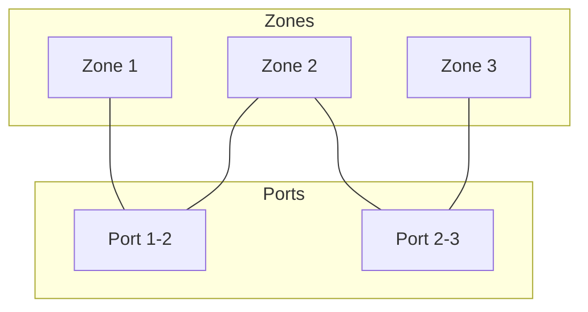
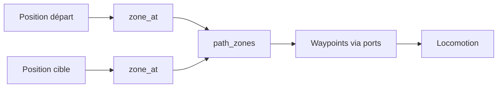
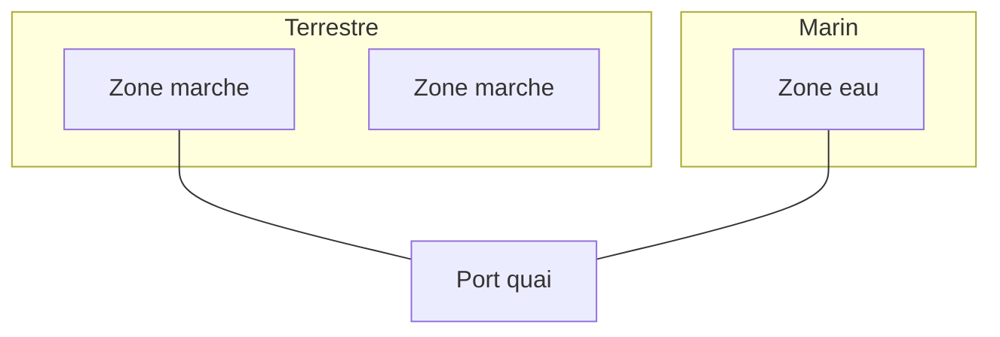

# Navmesh

**Catégorie :** 3. Déplacement et locomotion  
**Description :** Graphe de navigation ; zones navigables ; ports.

---

## Contexte et rôle

### Dans le moteur MGE

Le **navmesh** (navigation mesh) est un graphe représentant les zones navigables du monde. Contrairement à une grille uniforme, il épouse les contours du terrain et permet des chemins plus naturels et moins coûteux en mémoire pour de grandes surfaces.

Ce point complète [pathfinding](pathfinding.md) : le pathfinding opère sur le graphe du navmesh (nœuds = polygones ou centroïdes) plutôt que sur une grille brute. Les « ports » sont les points de connexion entre régions (ex. quais, passages).

### Références centralisées

Les types `Vec2`, `Rect` et le système de coordonnées sont définis dans la [Référence Commune](../../MGE%20-%20Reference%20Commune.md).

---

## Portée / Scope

- Graphe de navigation (nœuds, arêtes)
- Zones navigables (polygones)
- Ports (points de liaison entre zones)
- Génération depuis le monde tile-based ou manuelle
- Intégration avec le pathfinding

---

## Spécifications techniques

### Structure du graphe

- **Nœuds** : régions navigables (polygone convexe ou centre de cellule)
- **Arêtes** : connexions navigables entre nœuds
- **Ports** : segments ou points de passage entre deux régions adjacentes

### Zones navigables

| Type | Description | Usage |
|------|-------------|--------|
| Walkable | Sol terrestre | Personnages, PNJ |
| Water | Surface eau | Bateaux (voir [bateaux](bateaux.md)) |
| Mixed | Rivage, pont | Transitions |

### Ports

- **Définition :** segment ou point partagé entre deux régions
- **Coût :** peut représenter la largeur (passage étroit) ou le type de transition
- **Utilisation :** le pathfinding traverse les ports pour changer de zone

### Génération

- **Manuelle :** édition niveau, zones définies par le designer
- **Automatique :** à partir des tiles walkable, détection de contours, triangulation ou décomposition en polygones convexes
- **Hybride :** zones manuelles + connexions auto

### Contraintes

| Contrainte | Valeur typique | Raison |
|------------|----------------|--------|
| Nombre de nœuds | 100–5000 | Performance pathfinding |
| Taille polygone min | 1–4 tiles | Éviter micro-zones |
| Ports par nœud | 2–8 | Connexions locales |

---

## Modèle de données / API

### Structures Rust (proposition)

```rust
use std::collections::HashMap;

/// Identifiant de zone navigable
#[derive(Debug, Clone, Copy, PartialEq, Eq, Hash)]
pub struct ZoneId(pub u32);

/// Zone navigable (polygone convexe)
#[derive(Debug, Clone)]
pub struct NavZone {
    pub id: ZoneId,
    pub vertices: Vec<Vec2>,
    pub center: Vec2,
    pub neighbors: Vec<(ZoneId, f32)>, // (zone, coût transition)
}

/// Port entre deux zones
#[derive(Debug, Clone, Copy)]
pub struct NavPort {
    pub zone_a: ZoneId,
    pub zone_b: ZoneId,
    pub segment_start: Vec2,
    pub segment_end: Vec2,
    pub cost: f32,
}

/// Navmesh complet
#[derive(Debug, Clone)]
pub struct Navmesh {
    pub zones: HashMap<ZoneId, NavZone>,
    pub ports: Vec<NavPort>,
}

impl Navmesh {
    /// Trouve la zone contenant un point
    pub fn zone_at(&self, pos: Vec2) -> Option<ZoneId> {
        for (id, zone) in &self.zones {
            if Self::point_in_polygon(pos, &zone.vertices) {
                return Some(*id);
            }
        }
        None
    }

    fn point_in_polygon(p: Vec2, vertices: &[Vec2]) -> bool {
        // Algorithme ray-casting ou winding number
        todo!()
    }

    /// Chemins entre zones (pour pathfinding)
    pub fn path_zones(&self, from: ZoneId, to: ZoneId) -> Vec<ZoneId> {
        // A* ou Dijkstra sur le graphe de zones
        todo!()
    }
}
```

### Signatures principales

| Fonction | Signature | Rôle |
|----------|------------|------|
| `Navmesh::zone_at` | `(Vec2) -> Option<ZoneId>` | Zone à une position |
| `Navmesh::path_zones` | `(ZoneId, ZoneId) -> Vec<ZoneId>` | Chemin de zones |
| `NavZone::contains_point` | `(&self, Vec2) -> bool` | Test point dans polygone |

---

## Diagrammes

### Structure navmesh



### Flux pathfinding avec navmesh



### Intégration bateaux / ports



---

## Exemples et cas d'usage

### Cas 1 : Ville avec places

- Zone 1 : place centrale
- Zone 2–5 : rues
- Ports aux intersections
- Pathfinding trouve Zone1 → Zone3 → Zone5

### Cas 2 : Quai / embarcadère

- Zone terrestre et zone eau connectées par un port étroit
- Unité à pied : reste en zone terrestre
- Bateau : transition via port vers zone eau (voir [bateaux](bateaux.md))

### Cas 3 : Pont étroit

- Port avec coût élevé (passage unique)
- Évite que trop d’unités empruntent le pont en même temps (optionnel)

### Cas 4 : Donjon (instances)

- Navmesh par instance
- Pas de connexion entre instances

---

## Cas limites et tests

### Edge cases

| Cas | Description | Comportement attendu |
|-----|-------------|----------------------|
| Position hors navmesh | Point dans mur/eau non navigable | `zone_at` = None |
| Zone dégénérée | Polygone à 2 sommets | Refus ou correction |
| Port invalide | Zones non adjacentes | Erreur à la construction |
| Chemin inexistant | Zones non connectées | Liste vide |

### Critères de validation

- [ ] `zone_at` retourne la bonne zone pour un point intérieur
- [ ] `zone_at` retourne None pour un point hors zones
- [ ] `path_zones` trouve un chemin si connexion existe
- [ ] Ports relient bien des zones adjacentes

---

## Génération automatique

### Depuis grille de tiles

- Tiles walkable → régions connectées
- Détection de contours (marching squares, etc.)
- Décomposition en polygones convexes (ear clipping, trapezoidation)

### Optimisation

- Fusion de petits polygones
- Simplification des contours
- Précalcul des chemins fréquents (optionnel)

---

## Zones spéciales

### Eau / terrain

- Zones eau pour [bateaux](bateaux.md)
- Zones terrain pour personnages à pied
- Ports pour transition

### Hauteur (optionnel 2.5D)

- Zones à différentes hauteurs
- Escaliers, passerelles
- Coût de transition vertical

---

## Annexe : algorithmes point-in-polygon

### Ray casting

- Lance un rayon depuis le point vers l'infini
- Compte les intersections avec les arêtes du polygone
- Nombre impair = intérieur

### Winding number

- Calcule l'angle total autour du point
- 360° = intérieur, 0° = extérieur
- Plus précis pour polygones complexes

---

## Format de stockage

- Navmesh peut être précalculé et stocké en binaire
- Format : liste de polygones + connexions
- Chargement au démarrage de la carte

---

## Spécifications étendues

### Recast/Detour

Bibliothèque standard pour génération navmesh 3D. Pour du 2D, une projection ou une version simplifiée peut suffire.

### Coût par zone

Chaque zone peut avoir un coût de traversée (herbe=1, sable=1.5). Le pathfinding minimise le coût total, pas la distance.

### Zones unidirectionnelles

Certaines connexions (port) ne sont traversables que dans un sens. Ex. : quai → eau OK, eau → quai via un autre port.

### Hauteur et escaliers

En 2.5D, les zones à différentes hauteurs sont connectées par des "links" (escaliers). Le pathfinding doit considérer ces transitions.

---

## Annexe : format binaire navmesh

- Header : nombre de zones, nombre de ports
- Zones : id, nombre de vertices, liste Vec2, center, liste (neighbor_id, cost)
- Ports : zone_a, zone_b, segment_start, segment_end, cost
- Chargement : parsing séquentiel, construction HashMap

- [Référence Commune MGE](../../MGE%20-%20Reference%20Commune.md) — Vec2, coordonnées
- [Pathfinding](pathfinding.md) — Algorithme sur le graphe
- [Bateaux](bateaux.md) — Zones eau, ports
- [Monde tile-based](../../01-affichage-rendu/monde-tile-based.md) — Source du monde
- [Index catégorie](_index.md)
- [Index MGE](../_index.md)
