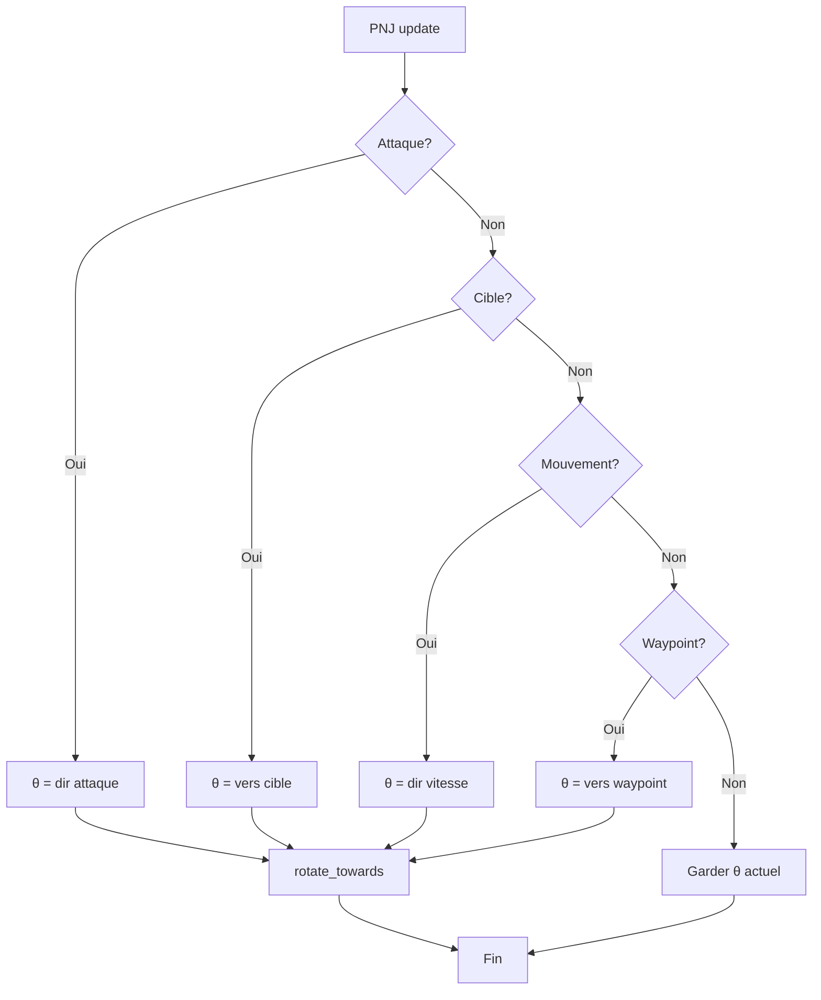
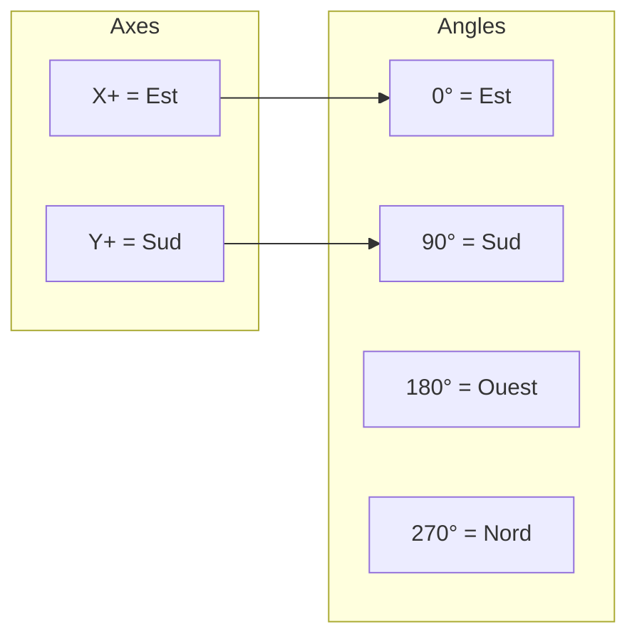

# Orientation et rotation

**Catégorie :** 3. Déplacement et locomotion  
**Description :** Orientation des PNJ et entités ; vitesse de rotation ; axes ; sources d'orientation.

---

## Contexte et rôle

### Dans le moteur MGE

L'**orientation** (facing) définit la direction dans laquelle une entité « regarde ». Elle détermine le rendu du sprite (quelle frame d'animation, flip), la direction des projectiles, des attaques, et le pathfinding relatif (formations). La **vitesse de rotation** contrôle à quel rythme l'orientation converge vers la cible.

Ce point s'articule avec [déplacement-8-directions](deplacement-8-directions.md) (direction de mouvement → orientation), [animations-sprites](../../01-affichage-rendu/animations-sprites.md) (sprite selon direction) et le [Guide Entités Groupes](../../MGE%20-%20Pathfinding%20Collisions%20-%20Guide%20Entites%20Groupes.md) (formation offsets).

### Références centralisées

- Types `Vec2`, coordonnées, unités (`°/s`) : [MGE - Référence Commune](../../MGE%20-%20Reference%20Commune.md)
- Axes monde : [coordonnees](../../01-affichage-rendu/coordonnees.md)

---

## Portée / Scope

- Convention des axes (direction « face »)
- Représentation de l'orientation (angle, Vec2)
- Vitesse de rotation (°/s ou rad/s)
- Sources d'orientation (mouvement, cible, waypoint, attaque)
- Interpolation et lissage
- Cas spécifiques PNJ (pathfinding, ciblage)

---

# 1. Axes et convention d'orientation

## 1.1 Convention MGE

En vue **top-down** ou **isométrique** 2D :

| Axe | Direction positive | Direction « face » par défaut |
|-----|-------------------|------------------------------|
| **X** | Droite (Est) | Face droite = angle 0° |
| **Y** | Bas (Sud) — convention écran | Face bas = angle 90° |

**Angle en radians** : `angle = atan2(direction.y, direction.x)`

- **0 rad (0°)** = Est, face droite
- **π/2 rad (90°)** = Sud, face bas
- **π rad (180°)** = Ouest, face gauche
- **-π/2 rad (-90° ou 270°)** = Nord, face haut

## 1.2 Représentation

| Représentation | Usage | Conversion |
|----------------|-------|------------|
| **Angle** (rad ou °) | Stockage, interpolation | `Vec2(cos(angle), sin(angle))` |
| **Vec2 unitaire** | Direction normalisée | `angle = atan2(y, x)` |
| **Direction8** | Snap discret pour sprites | Voir [déplacement-8-directions](deplacement-8-directions.md) |

**Convention stockée** : Angle en **radians** dans `[-π, π]` ou `[0, 2π]` selon implémentation. L'unité `°/s` (degrés par seconde) est utilisée pour la vitesse de rotation — voir [Référence Commune](../../MGE%20-%20Reference%20Commune.md) §5.2.

## 1.3 Sprite et pivot

- Le sprite est dessiné avec une **rotation** appliquée au pivot (anchor)
- **Pivot typique** : centre-bas du personnage (pieds au centre)
- L'axe de rotation est **perpendiculaire au plan** (axe Z implicite en 2D)

---

# 2. Vitesse de rotation

## 2.1 Définition

La **vitesse de rotation** (turn rate) est la vitesse angulaire maximale à laquelle une entité peut faire pivoter son orientation vers une cible.

| Unité | Valeur typique | Usage |
|-------|----------------|-------|
| **°/s** (degrés/seconde) | 180–720 | Config gameplay, lisible |
| **rad/s** (radians/seconde) | π à 4π | Calculs internes |

## 2.2 Paramètres typiques

| Type d'entité | Vitesse rotation | Raison |
|---------------|------------------|--------|
| Joueur | 360–720 °/s | Réactivité, sensation de contrôle |
| PNJ standard | 180–360 °/s | Un peu plus lent, naturel |
| PNJ lent (boss, tank) | 90–180 °/s | Poids, anticipation |
| Projectile | ∞ (instantané) | Pointe toujours vers la trajectoire |
| Bateau | 45–90 °/s | Inertie, virage large |
| Tourelle | 120–360 °/s | Selon design |

## 2.3 Formule de rotation vers cible

Pour faire tourner l'orientation actuelle `θ_current` vers la cible `θ_target` en un temps limité par la vitesse de rotation `ω` (°/s) :

```
delta = clamp(θ_target - θ_current, -ω * dt, ω * dt)
θ_new = θ_current + delta
```

**Normalisation** : Ramener `θ_new` dans `[-π, π]` pour éviter la dérive. Pour le `delta`, gérer le chemin le plus court (ex. tourner de -170° plutôt que +190°).

```rust
fn shortest_angle_diff(from: f32, to: f32) -> f32 {
    let diff = (to - from).rem_euclid(2.0 * std::f32::consts::PI);
    if diff > std::f32::consts::PI {
        diff - 2.0 * std::f32::consts::PI
    } else {
        diff
    }
}
```

---

# 3. Sources d'orientation

## 3.1 Par type d'entité

| Entité | Source principale | Fallback |
|--------|-------------------|----------|
| **Joueur** | Input direction (ZQSD, manette) | Dernière direction |
| **PNJ en déplacement** | Direction du mouvement (vers waypoint) | Cible / attaque |
| **PNJ en idle** | Dernière direction ou cible proche | Direction par défaut |
| **PNJ en combat** | Direction vers cible | Mouvement |
| **Projectile** | Vecteur vitesse (trajectoire) | — |
| **Bateau** | Direction du mouvement | Voir [bateaux](bateaux.md) |

## 3.2 PNJ : hiérarchie des priorités

L'orientation d'un PNJ peut dépendre de plusieurs facteurs. Ordre de priorité typique :

1. **Attaque en cours** : Orientation = direction du coup (priorité max)
2. **Cible verrouillée** : Orientation = vers la cible (combat)
3. **Mouvement actif** : Orientation = direction de la vitesse
4. **Waypoint** : Orientation = vers le prochain waypoint (pathfinding)
5. **Idle** : Conserver la dernière orientation ou direction par défaut

## 3.3 Orientation depuis le pathfinding

Pour un PNJ qui suit un chemin :

- **Direction** : `direction = (waypoint - position).normalize()`
- **Angle cible** : `θ_target = atan2(direction.y, direction.x)`
- **Mise à jour** : Chaque frame, faire tourner `θ_current` vers `θ_target` selon la vitesse de rotation

Si le PNJ est à l'arrêt (dernier waypoint atteint) : conserver la dernière orientation.

## 3.4 Orientation vers une cible (ciblage)

Pour un PNJ qui vise une entité (ennemi, joueur) :

```
direction = (cible.position - self.position).normalize()
θ_target = atan2(direction.y, direction.x)
```

La rotation est appliquée chaque frame jusqu'à atteindre `θ_target` (à une tolérance près, ex. 2°).

---

# 4. Interpolation et lissage

## 4.1 Rotation instantanée vs interpolée

| Mode | Comportement | Usage |
|------|--------------|-------|
| **Instantané** | `θ = θ_target` immédiatement | Projectiles, snaps 8 directions |
| **Interpolé** | Convergence vers `θ_target` à `ω` °/s | PNJ, joueur, bateaux |

## 4.2 Lerp d'angle

Pour éviter les à-coups, utiliser un **lerp angulaire** (interpolation du plus court chemin) :

```rust
fn lerp_angle(from: f32, to: f32, t: f32) -> f32 {
    let diff = shortest_angle_diff(from, to);
    from + diff * t
}
```

Avec `t = (ω * dt) / |diff|` pour une convergence à vitesse constante, ou `t = 1.0 - exp(-k * dt)` pour un lissage exponentiel.

## 4.3 Lissage exponentiel (optionnel)

Pour une rotation plus douce (accélération puis décélération) :

```
θ_new = lerp_angle(θ_current, θ_target, 1.0 - exp(-turn_smoothness * dt))
```

- `turn_smoothness` : 5–15 typiquement ; plus haut = plus rapide.

## 4.4 Snap aux 8 directions

Pour des sprites avec 8 directions discrètes :

- Calculer `θ_target` comme ci-dessus
- Arrondir à la Direction8 la plus proche
- Changer de clip d'animation immédiatement
- Optionnel : interpolation visuelle entre frames si blending

---

# 5. Modèle de données / API

## 5.1 Structures Rust (proposition)

```rust
/// Composant orientation d'une entité
#[derive(Debug, Clone)]
pub struct Orientation {
    /// Angle actuel en radians [-π, π]
    pub angle: f32,
    /// Vitesse de rotation en degrés/seconde
    pub turn_rate: f32,
    /// Mode : interpolé ou instantané
    pub mode: OrientationMode,
}

#[derive(Debug, Clone, Copy, PartialEq, Eq)]
pub enum OrientationMode {
    /// Rotation à turn_rate vers la cible
    Interpolated,
    /// Snap immédiat
    Instant,
}

impl Orientation {
    /// Direction unitaire (Vec2) correspondant à l'angle
    pub fn to_direction(&self) -> Vec2 {
        Vec2::new(self.angle.cos(), self.angle.sin())
    }

    /// Met à jour l'angle vers target_angle selon turn_rate et dt
    pub fn rotate_towards(&mut self, target_angle: f32, dt: f32) {
        let max_delta = self.turn_rate.to_radians() * dt;
        let diff = shortest_angle_diff(self.angle, target_angle);
        let delta = diff.clamp(-max_delta, max_delta);
        self.angle = (self.angle + delta).rem_euclid(2.0 * std::f32::consts::PI);
        // Ramener dans [-π, π] si souhaité
    }
}
```

## 5.2 Système de mise à jour

```rust
/// Détermine l'angle cible selon le contexte de l'entité
fn get_orientation_target(entity: EntityId, world: &World) -> Option<f32> {
    if let Some(attack) = world.get::<AttackInProgress>(entity) {
        return Some(attack.direction_angle);
    }
    if let Some(target) = world.get::<LockedTarget>(entity) {
        let dir = (target.position - entity.position).normalize();
        return Some(dir.y.atan2(dir.x));
    }
    if let Some(velocity) = world.get::<Velocity>(entity) {
        if velocity.length_squared() > 1e-6 {
            return Some(velocity.y.atan2(velocity.x));
        }
    }
    if let Some(path) = world.get::<Path>(entity) {
        if let Some(waypoint) = path.current_waypoint() {
            let dir = (waypoint - entity.position).normalize();
            return Some(dir.y.atan2(dir.x));
        }
    }
    None // Garder l'orientation actuelle
}
```

---

# 6. Diagrammes

## 6.1 Flux d'orientation PNJ



## 6.2 Convention axes (vue top-down)



---

# 7. Cas limites et tests

## 7.1 Edge cases

| Cas | Description | Comportement attendu |
|-----|-------------|---------------------|
| Cible exactement derrière | diff = π | Tourner le chemin le plus court (±π) |
| Vitesse nulle, pas de cible | — | Garder dernière orientation |
| turn_rate = 0 | Pas de rotation | θ reste fixe |
| turn_rate très élevé | 3600 °/s | Quasi-instantané |
| Angle wraparound | -π ↔ π | Pas de saut visuel |

## 7.2 Critères de validation

- [ ] Orientation converge vers la cible à la vitesse turn_rate
- [ ] Plus court chemin choisi (pas de tour complet inutile)
- [ ] to_direction() produit un Vec2 unitaire
- [ ] Attaque prioritaire sur mouvement

---

# 8. Références

| Document | Rôle |
|----------|------|
| [MGE - Référence Commune](../../MGE%20-%20Reference%20Commune.md) | Types, unités °/s |
| [Déplacement 8 directions](deplacement-8-directions.md) | Direction input, Direction8 |
| [Animations sprites](../../01-affichage-rendu/animations-sprites.md) | Mapping direction → clip |
| [Pathfinding](pathfinding.md) | Waypoints, direction de marche |
| [Bateaux](bateaux.md) | Rotation véhicule |
| [Shift-clic stand attack](shift-clic-stand-attack.md) | Orientation vers cible sans déplacement |
| [Index catégorie](_index.md) |
| [Index MGE](../_index.md) |

---

**Document** : Orientation et rotation  
**Version** : 1.0  
**Date** : 2026-02-18
