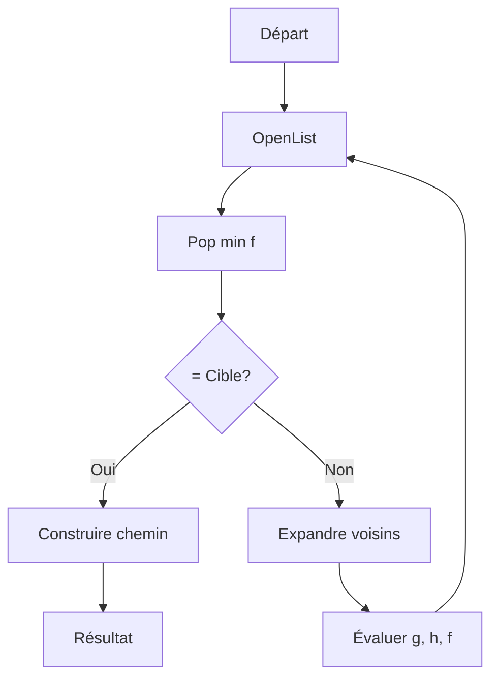
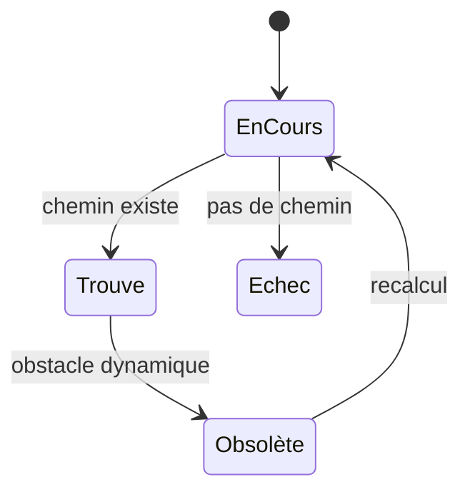
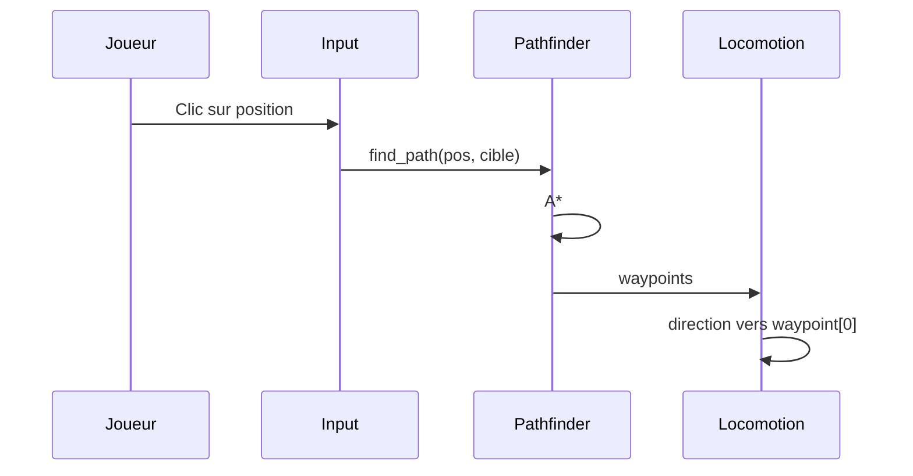

# Pathfinding

**Catégorie :** 3. Déplacement et locomotion  
**Description :** Recherche de chemin (A*, Dijkstra) ; obstacles.

---

## Contexte et rôle

### Dans le moteur MGE

Le **pathfinding** calcule un chemin navigable entre une position de départ et une cible, en contournant les obstacles. Il alimente le déplacement des PNJ, le clic pour se déplacer (click-to-move) et l’IA de déplacement.

Ce point s’articule avec [deplacement-8-directions](deplacement-8-directions.md) (direction vers le prochain waypoint) et [navmesh](navmesh.md) (graphe de navigation précalculé). A* ou Dijkstra opèrent sur une grille ou un graphe.

### Références centralisées

Les types `Vec2`, `Rect` et le système de coordonnées monde sont définis dans la [Référence Commune](../../MGE%20-%20Reference%20Commune.md). La grille tile-based est décrite dans [monde-tile-based](../../01-affichage-rendu/monde-tile-based.md).

**Guide transversal :** Pour le spectre pathfinding fin → pathfinding groupe (RTS, Dynasty Warriors), coût de déplacement détaillé, hitbox et collisions selon l'échelle : [MGE - Pathfinding Collisions - Guide Entités Groupes](../../MGE%20-%20Pathfinding%20Collisions%20-%20Guide%20Entites%20Groupes.md).

---

## Portée / Scope

- Algorithme A* (heuristique)
- Algorithme Dijkstra (sans heuristique)
- Grille 2D (tiles) ou graphe (navmesh)
- Obstacles statiques et dynamiques
- Coût de déplacement (terrain, pentes)
- Recalcul en cas d’obstacle dynamique

---

## Spécifications techniques

### Algorithme A*

**Principe :** recherche du chemin le moins coûteux en évaluant `f(n) = g(n) + h(n)` :

- `g(n)` : coût réel du début au nœud `n`
- `h(n)` : heuristique estimée de `n` à la cible
- `f(n)` : priorité d’exploration

**Heuristiques courantes pour grille 2D :**

| Heuristique | Formule | Propriétés |
|-------------|---------|------------|
| Distance Manhattan | `|dx| + |dy|` | Mouvement 4 directions |
| Distance euclidienne | `√(dx² + dy²)` | Mouvement 8 directions, admissible |
| Distance de Chebyshev | `max(|dx|, |dy|)` | Diagonales à coût 1 |

**Admissibilité :** `h(n)` ne doit jamais surestimer le coût restant pour garantir l’optimalité.

### Algorithme Dijkstra

- Cas particulier de A* avec `h(n) = 0`
- Explore uniformément depuis la source
- Optimal mais plus lent sur grandes cartes
- Utile quand pas de cible unique (ex. calcul de zones d’influence)

### Représentation de la grille

- **Tiles** : chaque cellule a un coût de déplacement (1 = sol, ∞ = obstacle)
- **Voisins** : 4 (N,S,E,W) ou 8 (+ diagonales)
- **Coût diagonal** : √2 ≈ 1,41 pour mouvement 8 directions, ou 1 selon le design

### Obstacles

| Type | Gestion |
|------|---------|
| Statiques (murs, eau) | Inclus dans la grille / navmesh |
| Dynamiques (PNJ, joueur) | Recalcul ou évitement local (repulsion) |
| Temporaires | Marquage temporaire obstacle |

### Contraintes

| Contrainte | Valeur typique | Raison |
|------------|----------------|--------|
| Taille grille max | 1024×1024 | Limite mémoire et CPU |
| Recalcul période | 0.5–2 s | Réactivité vs coût |
| Longueur chemin max | 200–500 tiles | Limite boucles infinies |
| Coût obstacle | ∞ ou très élevé | Garantir contournement |

---

## Modèle de données / API

### Structures Rust (proposition)

```rust
/// Nœud de la grille pour A*
#[derive(Debug, Clone, Copy, PartialEq, Eq, Hash)]
pub struct GridNode {
    pub x: i32,
    pub y: i32,
}

impl GridNode {
    pub fn new(x: i32, y: i32) -> Self {
        Self { x, y }
    }

    pub fn to_vec2(&self, tile_size: f32) -> Vec2 {
        Vec2::new(
            (self.x as f32 + 0.5) * tile_size,
            (self.y as f32 + 0.5) * tile_size,
        )
    }
}

/// Résultat du pathfinding
#[derive(Debug, Clone)]
pub struct PathResult {
    pub waypoints: Vec<Vec2>,
    pub total_cost: f32,
    pub found: bool,
}

/// Configuration pathfinding
#[derive(Debug, Clone)]
pub struct PathfindingConfig {
    pub allow_diagonal: bool,
    pub diagonal_cost: f32,
    pub max_iterations: usize,
}

impl Default for PathfindingConfig {
    fn default() -> Self {
        Self {
            allow_diagonal: true,
            diagonal_cost: 1.414,
            max_iterations: 10000,
        }
    }
}

/// Interface pathfinding
pub trait Pathfinder {
    fn find_path(&self, start: Vec2, goal: Vec2) -> PathResult;
    fn is_walkable(&self, node: GridNode) -> bool;
    fn movement_cost(&self, from: GridNode, to: GridNode) -> f32;
}
```

### Signatures principales

| Fonction | Signature | Rôle |
|----------|------------|------|
| `Pathfinder::find_path` | `(Vec2, Vec2) -> PathResult` | Calcule le chemin |
| `Pathfinder::is_walkable` | `(GridNode) -> bool` | Test traversabilité |
| `Pathfinder::movement_cost` | `(GridNode, GridNode) -> f32` | Coût de déplacement |
| `GridNode::to_vec2` | `(f32) -> Vec2` | Conversion en position monde |

---

## Diagrammes

### Flux A*



### États du chemin



### Intégration avec locomotion



---

## Exemples et cas d'usage

### Cas 1 : PNJ marchand se déplace vers le joueur

- Départ : position actuelle du marchand
- Cible : position du joueur
- A* sur grille 8 directions
- Waypoints transmis au composant de locomotion
- Recalcul si le joueur bouge (période 1 s)

### Cas 2 : Click-to-move (joueur)

- Clic sur le sol → `find_path(pos_joueur, pos_clic)`
- Si chemin trouvé : liste de waypoints
- Le personnage suit les waypoints via [deplacement-8-directions](deplacement-8-directions.md)
- Nouveau clic annule et recalcule

### Cas 3 : Coût de terrain variable

- Herbe : coût 1
- Sable : coût 1.5
- Eau : ∞ (obstacle)
- A* minimise le coût total

### Cas 4 : Obstacle dynamique (autre PNJ)

- Option A : recalcul périodique
- Option B : évitement local (repulsion) sans recalcul global
- Option C : considérer l’autre comme obstacle temporaire

---

## Cas limites et tests

### Edge cases

| Cas | Description | Comportement attendu |
|-----|-------------|----------------------|
| Départ = cible | Même tile | Chemin vide ou singleton |
| Cible dans obstacle | Inaccessible | `found = false`, waypoints vide |
| Cible hors grille | Coordonnées invalides | Erreur ou clamp |
| Départ hors grille | Idem | Erreur ou clamp |
| Grille sans chemin | Île isolée | `found = false` |
| Max iterations dépassé | Carte très grande | Abandon, `found = false` |

### Critères de validation

- [ ] Chemin trouvé est continu (pas de téléportation)
- [ ] Chemin évite les obstacles
- [ ] Chemin est optimal (ou proche) selon l’heuristique
- [ ] Coût total cohérent avec la somme des coûts
- [ ] Recalcul en cas de changement d’obstacle

### Tests unitaires suggérés

```rust
#[cfg(test)]
mod tests {
    use super::*;

    #[test]
    fn chemin_direct_sans_obstacle() {
        let pf = GridPathfinder::new(10, 10, |_| 1.0);
        let r = pf.find_path(Vec2::new(0.5, 0.5), Vec2::new(5.5, 5.5));
        assert!(r.found);
        assert!(r.waypoints.len() >= 2);
    }

    #[test]
    fn obstacle_bloque() {
        let pf = GridPathfinder::new(5, 5, |n| {
            if n.x == 2 && n.y >= 0 && n.y <= 4 { f32::INFINITY } else { 1.0 }
        });
        let r = pf.find_path(Vec2::new(0.5, 2.5), Vec2::new(4.5, 2.5));
        assert!(!r.found || r.waypoints.len() > 5); // Contourne
    }
}
```

---

## Optimisations

- **Broad phase** : partitionnement spatial pour limiter les tests
- **Cache de chemins** : pour PNJ avec trajets répétitifs
- **Simplification waypoints** : suppression des points redondants

---

## Intégration monde et obstacles dynamiques

- Recalcul périodique (0.5–2 s) si obstacles mobiles
- Évitement local sans recalcul global
- Chunks : pathfinding limité aux zones chargées

---

## Paramètres avancés

- Coût diagonal : √2 ou 1.0
- Coût terrain : pente, type de tuile
- Zones interdites temporaires (AOE, dégâts au sol)

---

## Coût de déplacement (détail)

Le coût de déplacement détermine le chemin optimal. Chaque cellule ou arête du graphe a un coût ; A* minimise la somme. Voir le [Guide Entités Groupes](../../MGE%20-%20Pathfinding%20Collisions%20-%20Guide%20Entites%20Groupes.md) pour le spectre complet.

### Coût par terrain

| Terrain | Coût | Notes |
|---------|------|-------|
| Sol, herbe | 1.0 | Référence |
| Sable, gravier | 1.2–1.5 | Ralentissement |
| Marécage | 2.0–3.0 | Walkable lent |
| Eau peu profonde | 2.5–5.0 | Optionnel selon jeu |
| Eau profonde, mur | ∞ | Obstacle |

### Coût dynamique et par type d'unité

- **Zones dangereuses** : AOE, pièges — coût ×2 ou ∞ selon design
- **Type d'unité** : Cavalerie pénalisée sur sable ; bateau : eau=1, terre=∞
- **Obstacles dynamiques** : Autre PNJ — optionnel obstacle temporaire ou évitement local

### API coût

Le trait `Pathfinder::movement_cost(from, to)` retourne le coût de traverser de `from` à `to`. Une implémentation typique agrège : `terrain_cost(to) * diagonal_mult * unit_modifier * danger_mult`.

---

## Pathfinding groupe (flow field, formations)

Pour des **groupes** (RTS, musou type Dynasty Warriors), un A* par unité est prohibitif. Voir le [Guide Entités Groupes](../../MGE%20-%20Pathfinding%20Collisions%20-%20Guide%20Entites%20Groupes.md) pour les détails.

### Flow field

Champ de vecteurs pré-calculé : une exécution BFS ou A* inverse depuis la cible ; chaque cellule a un vecteur vers la sortie. Chaque unité consulte le champ en O(1). Idéal pour des foules vers une destination commune.

### Formations

Position cible = position du leader + offset selon rang. Chaque unité pathfind vers sa cible ; évitement local (boids) évite les chevauchements. Voir [comportement-foule](../04-entites-monde/comportement-foule.md).

### Choix selon échelle

| Échelle | Entités | Méthode |
|---------|---------|---------|
| Fin | 1–10 | A* individuel |
| Moyen | 10–50 | A* leader + évitement local |
| Grande | 50–500+ | Flow field + boids |

---

## Spécifications étendues

- **Heuristique admissible** : ne pas surestimer le coût (euclidienne OK pour 8 dir)
- **Tie-breaking** : priorité au nœud le plus proche de la cible si f égal
- **Path smoothing** : raycast entre waypoints pour supprimer les points redondants
- **D* Lite** : recalcul partiel pour obstacles dynamiques
- **Clearance** : unités larges évitent les passages étroits

---

## Annexe : algorithme A* résumé

```
OpenList = {start}
ClosedList = {}
tant que OpenList non vide:
    n = pop(OpenList) avec f minimal
    si n == goal: reconstruire chemin, retour
    ajouter n à ClosedList
    pour chaque voisin v de n:
        si v dans ClosedList: continuer
        g_temp = g[n] + cost(n,v)
        si v pas dans OpenList OU g_temp < g[v]:
            g[v] = g_temp
            h[v] = heuristic(v, goal)
            f[v] = g[v] + h[v]
            parent[v] = n
            ajouter v à OpenList
retour échec
```

- [MGE - Pathfinding Collisions - Guide Entités Groupes](../../MGE%20-%20Pathfinding%20Collisions%20-%20Guide%20Entites%20Groupes.md) — Spectre entités → groupes, coût, hitbox, collisions
- [Plan démo pathfinding labyrinthe](../../../implementation/MGE%20-%20Plan%20Demo%20Pathfinding%20Labyrinthe.md) — Plan d'implémentation démo technique
- [Référence Commune MGE](../../MGE%20-%20Reference%20Commune.md) — Vec2, coordonnées
- [Navmesh](navmesh.md) — Graphe de navigation
- [Déplacement 8 directions](deplacement-8-directions.md) — Suivi des waypoints
- [Monde tile-based](../../01-affichage-rendu/monde-tile-based.md) — Grille
- [Hitbox](../../02-physique-collisions/hitbox.md) — Collision avec obstacles
- [Index catégorie](_index.md)
- [Index MGE](../_index.md)
