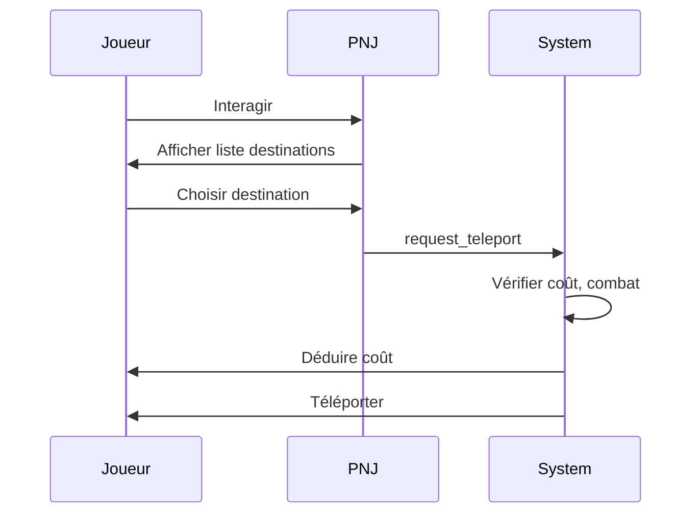
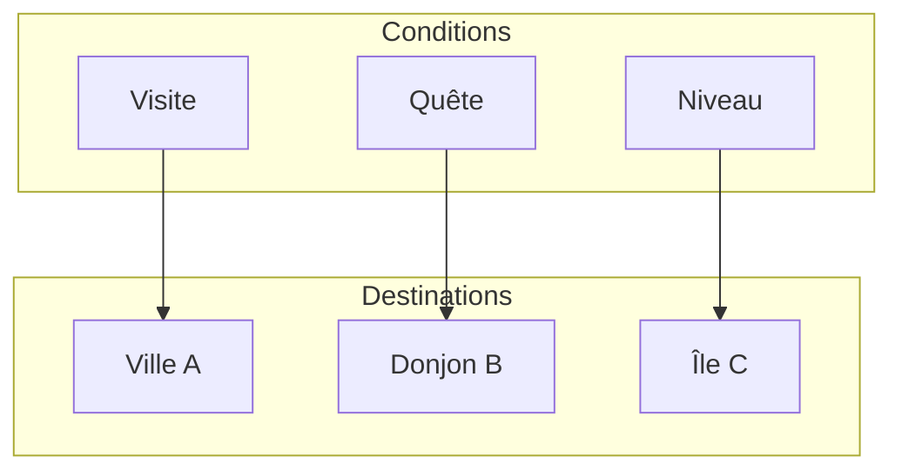

# PNJ de téléportation

**Catégorie :** 3. Déplacement et locomotion  
**Description :** Téléport vers des zones connues ; coût.

---

## Contexte et rôle

### Dans le moteur MGE

Les **PNJ de téléportation** permettent au joueur de se déplacer instantanément vers des lieux déjà découverts (villes, donjons, etc.) en échange d’un coût (or, objet, compétence). Ils centralisent la logique de téléportation « rapide » par opposition à la marche ou aux [ferries](continents.md).

Ce point s’articule avec les [runes atlas](runes-atlas.md) (Recall, Portail), les [continents](continents.md) et la persistance des données joueur (lieux connus) via **KindMother**.

### Références centralisées

Les types `Vec2` et le système de coordonnées sont définis dans la [Référence Commune](../../MGE%20-%20Reference%20Commune.md).

---

## Portée / Scope

- PNJ proposant une liste de destinations
- Destinations : lieux connus (débloqués par visite ou quête)
- Coût : or, objet, ou gratuit (selon design)
- Téléportation instantanée (changement de carte si besoin)
- Intégration KindMother pour persistance

---

## Spécifications techniques

### Déblocage des destinations

- **Visite** : le joueur a déjà visité le lieu
- **Quête** : déblocage via objet ou étape de quête
- **Niveau** : certaines destinations requièrent un niveau minimal
- **Faction** : réputation ou allégeance

### Coûts

| Type | Exemple |
|------|---------|
| Or | 100–1000 par destination |
| Objet | Parchemin de téléportation |
| Gratuit | Ville de départ, hub principal |
| Cooldown | 1 téléport / 30 min (optionnel) |

### Comportement PNJ

- Interaction ouverture d’une interface de choix
- Liste des destinations disponibles avec coût affiché
- Confirmation avant téléportation
- Animation ou délai court (1–2 s) avant transfert

### Téléportation

- **Même continent** : changement de position uniquement
- **Autre continent** : changement de carte + position (voir [continents](continents.md))
- Position d’arrivée : point de spawn fixe (ex. place centrale, entrée donjon)

### Contraintes

| Contrainte | Valeur | Raison |
|------------|--------|--------|
| Destinations max par PNJ | 5–20 | UX, lisibilité |
| Coût max | Équilibrage | Éviter inflation |
| En combat | Refus | Pas de fuite facile |

---

## Modèle de données / API

### Structures Rust (proposition)

```rust
/// Identifiant de destination de téléportation
#[derive(Debug, Clone, Copy, PartialEq, Eq, Hash)]
pub struct TeleportDestinationId(pub u32);

/// Destination connue du joueur
#[derive(Debug, Clone)]
pub struct TeleportDestination {
    pub id: TeleportDestinationId,
    pub name: String,
    pub continent_id: ContinentId,
    pub position: Vec2,
    pub cost_gold: u32,
    pub cost_item: Option<ItemId>,
}

/// État du PNJ téléporteur
#[derive(Debug, Clone)]
pub struct TeleportNpcState {
    pub npc_id: EntityId,
    pub destinations: Vec<TeleportDestination>,
}

/// Demande de téléportation
pub fn request_teleport(
    player: EntityId,
    destination: TeleportDestinationId,
    npc: EntityId,
) -> Result<(), TeleportError> {
    // Vérifier : destination connue, coût OK, pas en combat
    // Déduire coût
    // Changer position/carte
    todo!()
}

#[derive(Debug)]
pub enum TeleportError {
    UnknownDestination,
    CannotAfford,
    InCombat,
    TooFarFromNpc,
}
```

### Signatures principales

| Fonction | Signature | Rôle |
|----------|------------|------|
| `request_teleport` | `(EntityId, TeleportDestinationId, EntityId) -> Result` | Lance la téléportation |
| `get_available_destinations` | `(EntityId, EntityId) -> Vec<TeleportDestination>` | Liste des destinations pour un joueur |

---

## Diagrammes

### Flux téléportation



### Déblocage destinations



---

## Exemples et cas d'usage

### Cas 1 : Retour rapide en ville

- Joueur en donjon ; fin de session
- Interagit avec PNJ téléporteur à l’entrée
- Choisit « Capitale » ; paie 200 or
- Téléportation à la place centrale

### Cas 2 : Destination non débloquée

- Donjon non visité
- Destination grisée dans la liste avec indication « Découvrez d’abord ce lieu »
- Pas de coût affiché ; pas sélectionnable

### Cas 3 : Coût en objet

- Parchemin de téléportation = 1 usage
- Joueur en possède 3
- Sélectionne destination ; consomme 1 parchemin

### Cas 4 : En combat

- Joueur attaqué par des mobs
- Tente d’utiliser le PNJ téléporteur
- Refus : « Vous ne pouvez pas vous téléporter en combat »

---

## Cas limites et tests

### Edge cases

| Cas | Description | Comportement attendu |
|-----|-------------|----------------------|
| Or insuffisant | Coût 500, joueur a 300 | Refus, message |
| Déconnect pendant sélection | Interface ouverte | Annulation |
| Destination continent désactivé | Maintenance | Refus ou message |
| PNJ trop loin | Joueur s’éloigne avant confirmation | Annulation ou vérification distance |

### Critères de validation

- [ ] Seules les destinations connues sont proposées
- [ ] Coût déduit correctement
- [ ] Position d’arrivée correcte
- [ ] Changement de carte si nécessaire
- [ ] Refus si en combat

---

## Interface utilisateur

### Affichage des destinations

- Liste triée par continent ou par nom
- Indicateurs : coût, niveau requis, statut débloqué
- Icône selon type (ville, donjon, zone PvP, etc.)

### Confirmation

- Popup de confirmation avant téléportation
- Affichage du coût et de la destination
- Boutons : Valider / Annuler

### Feedback

- Barre de chargement ou fondu pendant le chargement de carte
- Message de succès
- En cas d’erreur : message explicite (or insuffisant, en combat, etc.)

---

## Déblocage détaillé

### Par visite

- Le joueur doit avoir mis le pied dans la zone au moins une fois
- Rayon de déclenchement : centre de la zone ou point d’entrée
- Persistance : KindMother stocke `visited_locations: Set<TeleportDestinationId>`

### Par quête

- Une étape de quête débloque la destination
- Ex. : « Parler au garde » → Capitale débloquée

### Par objet

- Obtenir un « Sceau de la forteresse » débloque la forteresse
- Objet peut être consommé ou permanent

---

## Coûts dynamiques

### Distance

- Coût proportionnel à la « distance » (continent éloigné = plus cher)
- Ou coût fixe par destination

### Réputation

- Faction alliée : réduction du coût
- Faction ennemie : refus ou coût très élevé

### Prime time

- Coût augmenté aux heures de pointe (optionnel, pour répartir la charge)

---

## Spécifications étendues

- **Interface** : liste triée, icônes par type, confirmation avant téléport
- **Feedback** : barre chargement, message succès/erreur
- **Déblocage** : visite, quête, objet, niveau, réputation
- **Refus combat** : message explicite

---

## Annexe : structure de données destination

```rust
struct TeleportDestination {
    id: TeleportDestinationId,
    name: String,
    continent_id: ContinentId,
    position: Vec2,
    cost_gold: u32,
    cost_item: Option<ItemId>,
    unlock_condition: UnlockCondition,
}

enum UnlockCondition {
    Visited,
    QuestStep(QuestId, Step),
    Item(ItemId),
    Level(u32),
    Reputation(FactionId, i32),
}
```

- [Référence Commune MGE](../../MGE%20-%20Reference%20Commune.md)
- [Continents](continents.md) — Traversées, changement de carte
- [Runes atlas](runes-atlas.md) — Recall, Portail (téléport perso)
- [Données joueur](../../05-joueur-personnage/donnees-joueur.md) — Lieux connus, KindMother
- [Index catégorie](_index.md)
- [Index MGE](../_index.md)
