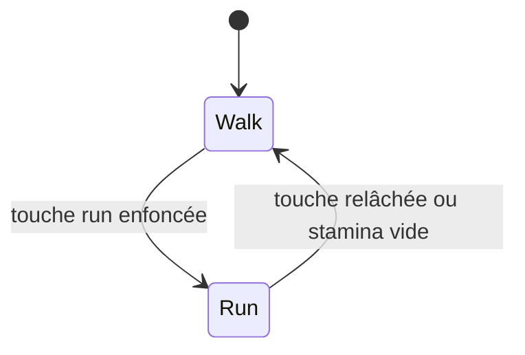
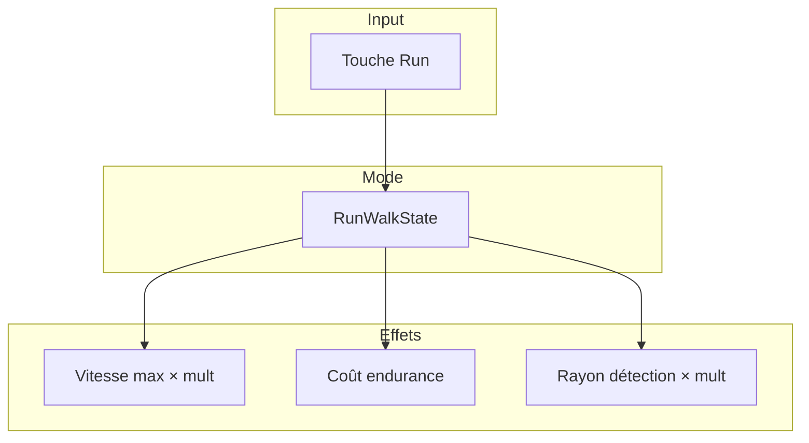

# Run / walk

**Catégorie :** 3. Déplacement et locomotion  
**Description :** Mode course vs marche ; impact sur l’aggro.

---

## Contexte et rôle

### Dans le moteur MGE

Le mode **run/walk** permet d’alterner entre marche (lente, silencieuse) et course (rapide, bruyante). La course consomme de l’[endurance](stamina.md) ; elle peut aussi augmenter la détection par les ennemis (aggro / bruit).

Ce point s’articule avec [vitesse-max](vitesse-max.md) (multiplicateur de vitesse) et [stamina](stamina.md) (coût de la course).

### Références centralisées

Les types et le système de coordonnées sont définis dans la [Référence Commune](../../MGE%20-%20Reference%20Commune.md).

---

## Portée / Scope

- Deux modes : marche (walk) et course (run)
- Vitesse différente par mode
- Consommation d’endurance en course
- Impact sur l’aggro (détection par ennemis)
- Raccourci clavier (ex. Shift ou touche dédiée)

---

## Spécifications techniques

### Vitesses

| Mode | Multiplicateur | Vitesse relative |
|------|----------------|------------------|
| Marche | 1.0 | 100 % (base) |
| Course | 1.3 à 1.6 | 130–160 % |

- La [vitesse max](vitesse-max.md) de base est multipliée selon le mode
- Transition immédiate ou interpolée (optionnel)

### Consommation d’endurance

- **Marche** : régénération ou aucun coût
- **Course** : coût par seconde ou par distance
- Formule typique : `cost_per_second = base_cost × (1 + bonus_run_speed)`
- Voir [stamina](stamina.md) pour la jauge et la régénération

### Impact aggro

- **Marche** : rayon de détection normal
- **Course** : rayon augmenté (ex. ×1.5)
- Les ennemis « entendent » ou « voient » plus facilement un personnage qui court
- Intégration avec le système de menace (aggro) du [combat](../../07-combat/)

### Contraintes

| Contrainte | Valeur typique | Raison |
|------------|----------------|--------|
| Multiplicateur run | 1.4–1.6 | Équilibre gameplay |
| Coût course | 5–15 %/s endurance | Limiter spam course |
| Rayon aggro run | 1.2–2.0 × walk | Pénilité si trop haute |

---

## Modèle de données / API

### Structures Rust (proposition)

```rust
/// Mode de déplacement
#[derive(Debug, Clone, Copy, PartialEq, Eq)]
pub enum MovementMode {
    Walk,
    Run,
}

/// Paramètres run/walk
#[derive(Debug, Clone)]
pub struct RunWalkParams {
    pub walk_speed_mult: f32,
    pub run_speed_mult: f32,
    pub run_stamina_cost_per_sec: f32,
    pub run_aggro_mult: f32,
}

impl Default for RunWalkParams {
    fn default() -> Self {
        Self {
            walk_speed_mult: 1.0,
            run_speed_mult: 1.5,
            run_stamina_cost_per_sec: 10.0,
            run_aggro_mult: 1.5,
        }
    }
}

/// État run/walk d'une entité
#[derive(Debug, Clone)]
pub struct RunWalkState {
    pub mode: MovementMode,
    pub params: RunWalkParams,
}

impl RunWalkState {
    pub fn speed_multiplier(&self) -> f32 {
        match self.mode {
            MovementMode::Walk => self.params.walk_speed_mult,
            MovementMode::Run => self.params.run_speed_mult,
        }
    }

    pub fn aggro_multiplier(&self) -> f32 {
        match self.mode {
            MovementMode::Walk => 1.0,
            MovementMode::Run => self.params.run_aggro_mult,
        }
    }

    pub fn stamina_cost_per_sec(&self) -> f32 {
        match self.mode {
            MovementMode::Walk => 0.0,
            MovementMode::Run => self.params.run_stamina_cost_per_sec,
        }
    }
}
```

### Signatures principales

| Fonction | Signature | Rôle |
|----------|------------|------|
| `RunWalkState::speed_multiplier` | `(&self) -> f32` | Multiplicateur vitesse |
| `RunWalkState::aggro_multiplier` | `(&self) -> f32` | Multiplicateur aggro |
| `RunWalkState::stamina_cost_per_sec` | `(&self) -> f32` | Coût endurance |

---

## Diagrammes

### États du mode



### Intégration avec vitesse et stamina



---

## Exemples et cas d'usage

### Cas 1 : Joueur en exploration

- Mode marche par défaut
- Appui sur Shift → mode course
- Vitesse passe de 80 à 120 px/s
- Endurance diminue progressivement

### Cas 2 : Fuite face à un ennemi

- Joueur en course pour s’échapper
- Endurance vide → bascule marche automatique
- Ennemi poursuit ; le joueur doit gérer la ressource

### Cas 3 : Infiltration (stealth)

- Joueur en marche pour réduire le rayon de détection
- Course attirerait les gardes
- Trade-off vitesse / discrétion

### Cas 4 : PNJ

- Certains PNJ ont un mode fixe (toujours marche)
- PNJ fuyant : mode run temporaire

---

## Cas limites et tests

### Edge cases

| Cas | Description | Comportement attendu |
|-----|-------------|----------------------|
| Stamina à 0 en course | Plus d’endurance | Bascule marche automatique |
| Touche run toggle vs hold | Design choix | Comportement cohérent |
| PNJ sans stamina | Pas de coût | Mode run possible sans limite |
| Aggro mult = 0 | Bug config | Traiter comme 1.0 |

### Critères de validation

- [ ] Vitesse applique bien le multiplicateur
- [ ] Stamina diminue en course, pas en marche
- [ ] Bascule marche quand stamina vide
- [ ] Aggro utilise le multiplicateur pour le rayon

---

## Raccourci et configuration

### Touche par défaut

- **Shift** : maintenu pour courir (comportement classique)
- **Caps Lock** : toggle marche/course (alternative)
- **Touche dédiée** : « Courir » mappable

### Mode par défaut

- Au spawn : marche ou course selon config
- En ville : certains jeux forcent la marche (immersion)

---

## Intégration aggro

### Rayon de détection

- **Marche** : rayon de base R
- **Course** : rayon R × run_aggro_mult (ex. 1.5 × R)
- Les ennemis dans le rayon ont une chance de « repérer » le joueur

### Types d’ennemis

- **Aveugles** : pas d’impact du bruit
- **Normaux** : sensibles au multiplicateur
- **Vigilants** : détection augmentée même en marche

---

## Animation et feedback

### Sprite

- Animation de marche vs animation de course
- Transition fluide entre les deux
- Référence : [animations sprites](../../01-affichage-rendu/animations-sprites.md)

### Audio

- Bruit de pas en marche : faible
- Bruit de pas en course : fort
- Impact sur le système de son spatial pour l’aggro

### UI

- Indicateur marche/course (icône)
- Barre de stamina visible en course

---

## Tests et validation

```rust
#[cfg(test)]
mod tests {
    #[test]
    fn run_speed_multiplier() {
        let rw = RunWalkState { mode: MovementMode::Run, params: Default::default() };
        assert!((rw.speed_multiplier() - 1.5).abs() < 0.01);
    }
}
```

---

## Spécifications étendues

- **Touche par défaut** : Shift maintenu ou Caps Lock toggle
- **Mode ville** : marche forcée dans certaines zones (immersion)
- **Rayon aggro** : marche = R, course = R × 1.5
- **Ennemis vigilants** : détection augmentée même en marche

---

## Annexe : calcul aggro

- rayon_detection = base_radius × aggro_multiplier(mode)
- aggro_multiplier(walk) = 1.0
- aggro_multiplier(run) = params.run_aggro_mult (ex. 1.5)
- Les ennemis dans le rayon font un check perception

- [Référence Commune MGE](../../MGE%20-%20Reference%20Commune.md)
- [Vitesse max](vitesse-max.md) — Application du multiplicateur
- [Stamina](stamina.md) — Jauge d’endurance
- [Aggro](../../07-combat/) — Système de menace
- [Index catégorie](_index.md)
- [Index MGE](../_index.md)
