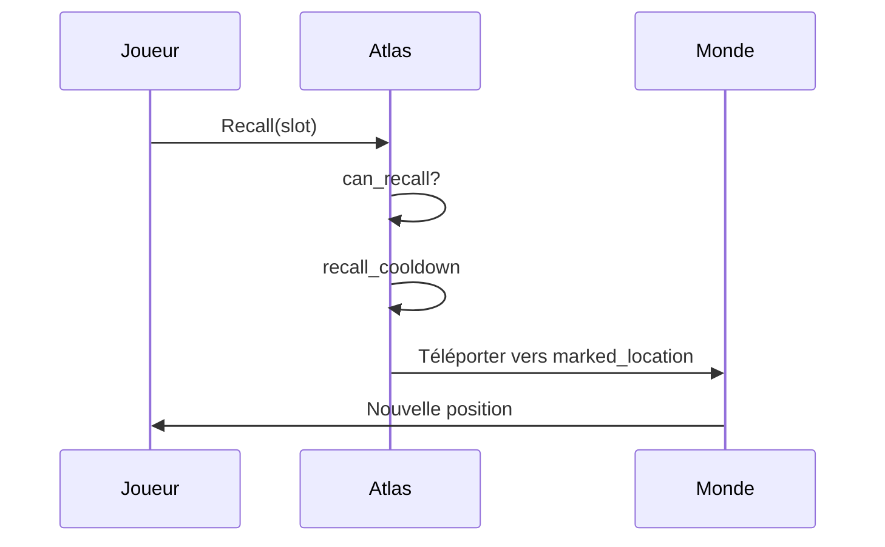
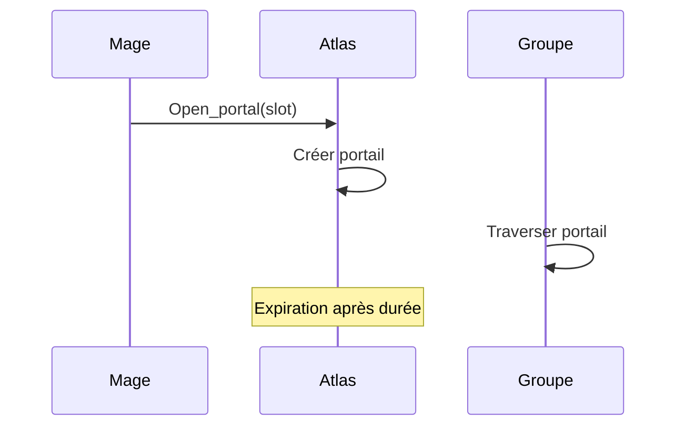
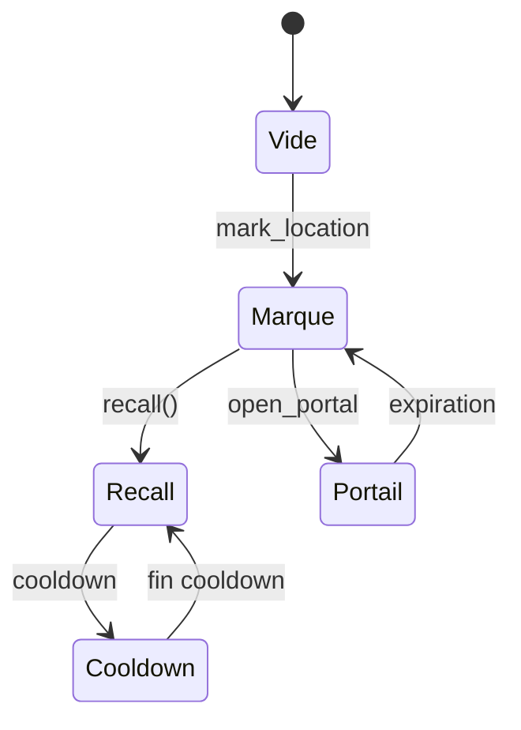

# Runes et atlas

**Catégorie :** 3. Déplacement et locomotion  
**Description :** Marquer des lieux ; Recall et Portail.

---

## Contexte et rôle

### Dans le moteur MGE

Les **runes** et l’**atlas** permettent au joueur de marquer des positions dans le monde et de s’y téléporter. Deux usages principaux : **Recall** (retour à un lieu sauvegardé, souvent la maison ou un hub) et **Portail** (création d’un portail vers un lieu marqué, pour soi ou le groupe).

Ce point s’articule avec la [téléportation PNJ](pnj-teleportation.md) (téléport vers lieux fixes) et la persistance via **KindMother** (emplacements sauvegardés).

### Références centralisées

Les types `Vec2` et les coordonnées sont définis dans la [Référence Commune](../../MGE%20-%20Reference%20Commune.md).

---

## Portée / Scope

- Marquer des lieux (runes, bookmarks)
- Recall : téléportation vers un lieu sauvegardé
- Portail : ouverture d’un portail vers un lieu marqué
- Atlas : interface de gestion des lieux
- Limite d’emplacements sauvegardés
- Coûts et cooldowns

---

## Spécifications techniques

### Recall

- **Définition** : téléportation instantanée vers un lieu prédéfini (maison, point de bind)
- **Cast time** : 5–10 s (interruptible par dégâts selon le design)
- **Coût** : mana, or, ou gratuit
- **Cooldown** : 30 min à 2 h typiquement
- **Usage** : retour rapide après une expédition

### Portail

- **Définition** : ouverture d’un portail vers un lieu marqué par une rune
- **Durée** : portail actif 1–5 min ; les joueurs du groupe peuvent le traverser
- **Coût** : mana, objet (rune), cooldown
- **Limite** : un portail actif à la fois

### Runes (marqueurs)

- **Rune** : objet ou compétence permettant de sauvegarder la position actuelle
- **Emplacements** : 3–10 emplacements nommés (« Maison », « Donjon X », etc.)
- **Persistance** : stockage KindMother ; continent_id + position

### Atlas

- **Atlas** : interface listant les lieux marqués
- Actions : renommer, supprimer, sélectionner comme cible Recall/Portail
- Affichage : nom, continent, icône

### Contraintes

| Contrainte | Valeur | Raison |
|------------|--------|--------|
| Emplacements max | 5–15 | Équilibre |
| Recall cooldown | 30–120 min | Limiter spam |
| Portail durée | 1–5 min | Coopération limitée |
| Zones interdites | Donjons instanciés, etc. | Éviter exploits |

---

## Modèle de données / API

### Structures Rust (proposition)

```rust
use std::collections::HashMap;
use std::time::{Duration, Instant};

/// Identifiant d'emplacement
#[derive(Debug, Clone, Copy, PartialEq, Eq, Hash)]
pub struct LocationSlotId(pub u8);

/// Lieu marqué (rune)
#[derive(Debug, Clone)]
pub struct MarkedLocation {
    pub id: LocationSlotId,
    pub name: String,
    pub continent_id: ContinentId,
    pub position: Vec2,
}

/// État atlas du joueur
#[derive(Debug, Clone)]
pub struct AtlasState {
    pub locations: HashMap<LocationSlotId, MarkedLocation>,
    pub max_slots: u8,
    pub recall_cooldown_until: Option<Instant>,
    pub active_portal: Option<PortalState>,
}

/// État d'un portail actif
#[derive(Debug, Clone)]
pub struct PortalState {
    pub target: MarkedLocation,
    pub expires_at: Instant,
}

impl AtlasState {
    pub fn mark_location(&mut self, slot: LocationSlotId, loc: MarkedLocation) -> bool {
        if self.locations.len() >= self.max_slots as usize && !self.locations.contains_key(&slot) {
            return false;
        }
        self.locations.insert(slot, loc);
        true
    }

    pub fn can_recall(&self, now: Instant) -> bool {
        self.recall_cooldown_until.map_or(true, |t| now >= t)
    }

    pub fn recall(&mut self, slot: LocationSlotId, cooldown_secs: u32) -> Option<MarkedLocation> {
        let loc = self.locations.get(&slot)?.clone();
        if !self.can_recall(Instant::now()) {
            return None;
        }
        self.recall_cooldown_until = Some(Instant::now() + Duration::from_secs(cooldown_secs as u64));
        Some(loc)
    }

    pub fn open_portal(&mut self, slot: LocationSlotId, duration_secs: u32) -> Option<MarkedLocation> {
        let loc = self.locations.get(&slot)?.clone();
        if self.active_portal.is_some() {
            return None; // Déjà un portail actif
        }
        self.active_portal = Some(PortalState {
            target: loc.clone(),
            expires_at: Instant::now() + Duration::from_secs(duration_secs as u64),
        });
        Some(loc)
    }
}
```

### Signatures principales

| Fonction | Signature | Rôle |
|----------|------------|------|
| `AtlasState::mark_location` | `(&mut self, slot, loc) -> bool` | Marquer un lieu |
| `AtlasState::recall` | `(&mut self, slot, cooldown) -> Option<MarkedLocation>` | Lancer Recall |
| `AtlasState::open_portal` | `(&mut self, slot, duration) -> Option<MarkedLocation>` | Ouvrir portail |
| `AtlasState::can_recall` | `(&self, now) -> bool` | Test cooldown |

---

## Diagrammes

### Flux Recall



### Flux Portail



### États atlas



---

## Exemples et cas d'usage

### Cas 1 : Retour à la maison

- Joueur a marqué « Maison » (sa résidence)
- Utilise Recall ; cast 8 s ; téléportation
- Cooldown 1 h

### Cas 2 : Portail pour le groupe

- Mage ouvre un portail vers « Donjon des Ombres »
- Les 4 membres du groupe traversent
- Portail se ferme après 2 min

### Cas 3 : Nouveau marqueur

- Joueur découvre un point intéressant
- Utilise une rune pour sauvegarder la position
- Nomme « Cache secrète »

### Cas 4 : Lieu en zone interdite

- Tentative de marquer en plein donjon instancié
- Refus : « Vous ne pouvez pas marquer ce lieu »
- Évite les retours gratuits dans des instances

---

## Cas limites et tests

### Edge cases

| Cas | Description | Comportement attendu |
|-----|-------------|----------------------|
| Slots pleins | Marquer quand max atteint | Refus ou écrasement (design) |
| Recall interrompu | Dégâts pendant cast | Annulation, pas de cooldown ou cooldown réduit |
| Portail expiré pendant traversée | Joueur à moitié dans le portail | Téléportation complète ou annulation |
| Continent supprimé | Lieu marqué invalide | Nettoyage ou message d’erreur |

### Critères de validation

- [ ] Marquer enregistre correctement continent + position
- [ ] Recall applique le cooldown
- [ ] Portail expire au bon moment
- [ ] Traversée de portail téléporte vers la cible
- [ ] Persistance KindMother des marqueurs

---

## Interface atlas

### Liste des lieux

- Affichage des emplacements (nom, continent, icône)
- Actions : renommer, supprimer, définir comme recall par défaut
- Tri par nom, continent, ou date de marquage

### Raccourcis

- Touche ou icône rapide pour Recall
- Sélection du slot avant ou après activation

### Portail groupe

- Le mage ouvre le portail ; les membres voient l’invite « Traverser »
- Indicateur de durée restante

---

## Persistance KindMother

### Données sauvegardées

- `marked_locations: Map<SlotId, MarkedLocation>`
- `recall_cooldown_until: Option<Timestamp>`
- Par personnage ou par compte selon design

### Synchronisation

- Sauvegarde à la déconnexion
- Sauvegarde périodique (auto-save)
- Conflits : last-write-wins ou merge selon stratégie

---

## Zones interdites au marquage

- Donjons instanciés
- Zones PvP actives
- Zones temporaires (événements)
- Intérieur de bâtiments (optionnel)

---

## Coûts Recall et Portail

- Recall : mana, or, ou gratuit ; cooldown 30 min – 2 h
- Portail : objet rune, mana ; durée 1–5 min ; un actif à la fois

---

## Cas Allumina (exemple)

- Marqueurs : Maison, Donjon Ombres, Ville Capitale
- Recall vers Maison : cast 8 s, cooldown 1 h
- Portail groupe vers Donjon : 2 min actif

---

## Spécifications étendues

### Recall interrompu

Si le joueur prend des dégâts pendant le cast de Recall, l'action est annulée. Cooldown appliqué ou non selon design (souvent oui pour éviter les abus).

### Portail et groupe

Seuls les membres du groupe peuvent traverser le portail. Limite : 5–8 joueurs. Ordre de traversée : premier arrivé, premier servi.

### Marqueurs partagés

Dans certains jeux, les marqueurs peuvent être partagés entre personnages d'un même compte. Ou chaque personnage a son propre atlas.

### Rune comme objet consommable

Utiliser une rune = marquer la position actuelle. Objet consommé. Limite le nombre de marquages gratuits.

### Cooldown global Recall

Un seul Recall possible toutes les X minutes, même si plusieurs emplacements sont définis. Évite le téléport spam.

---

## Annexe : comparaison Recall vs PNJ vs Portail

| Méthode | Cible | Coût | Cooldown | Groupe |
|---------|-------|------|----------|--------|
| Recall | Lieu marqué | Variable | 30 min – 2 h | Non |
| PNJ téléport | Lieux connus | Or/objet | Aucun | Non |
| Portail | Lieu marqué | Mana/objet | Par utilisation | Oui |

- [Référence Commune MGE](../../MGE%20-%20Reference%20Commune.md)
- [PNJ téléportation](pnj-teleportation.md) — Téléport vers lieux fixes
- [Continents](continents.md) — Changement de carte
- [Données joueur](../../05-joueur-personnage/donnees-joueur.md) — Persistance KindMother
- [Index catégorie](_index.md)
- [Index MGE](../_index.md)
