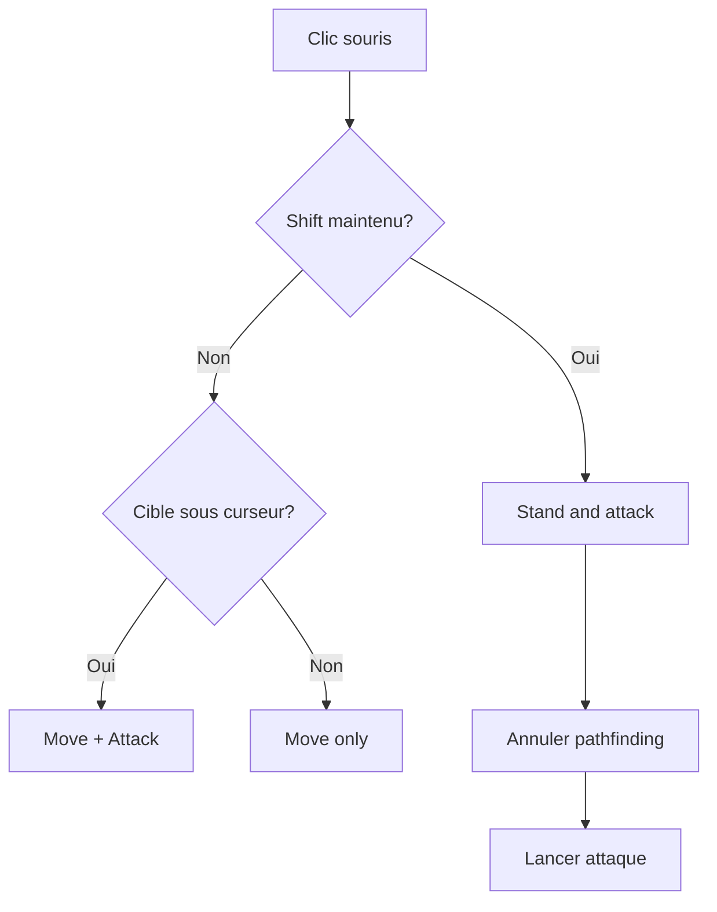
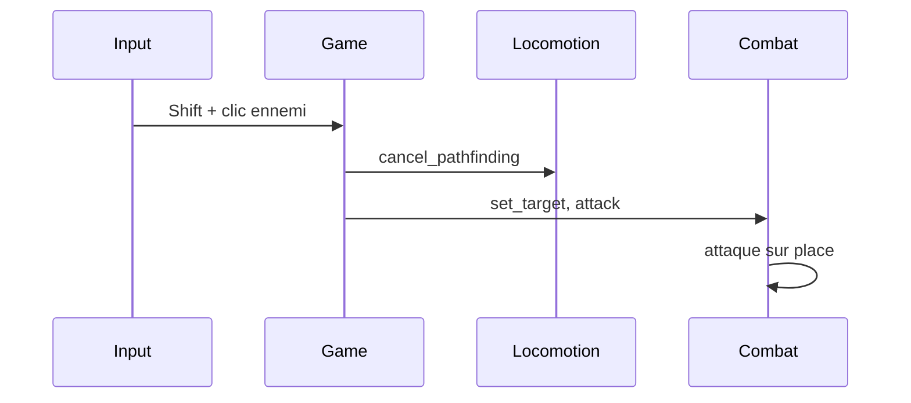

# Shift-clic (stand and attack)

**Catégorie :** 3. Déplacement et locomotion  
**Description :** Rester sur place et attaquer dans une direction.

---

## Contexte et rôle

### Dans le moteur MGE

Le **shift-clic** (ou stand and attack) permet au joueur de rester immobile tout en attaquant une cible ou une direction. Sans cette commande, un clic sur un ennemi déclencherait à la fois le déplacement (click-to-move) et l’attaque. Avec Shift maintenu, le personnage ne se déplace pas et attaque uniquement.

Ce point relie la [locomotion](deplacement-8-directions.md) et le [combat](../../07-combat/) : il s’agit d’une commande d’**attaque sur place** qui annule ou préempte le déplacement.

### Références centralisées

Les types `Vec2` et les coordonnées sont définis dans la [Référence Commune](../../MGE%20-%20Reference%20Commune.md).

---

## Portée / Scope

- Input : Shift + clic (souris)
- Comportement : annuler déplacement en cours, attaquer sans bouger
- Ciblage : entité (clic sur ennemi) ou position/direction (clic sur le sol)
- Intégration avec système combat et pathfinding

---

## Spécifications techniques

### Logique d’input

| Condition | Action |
|-----------|--------|
| Clic simple sur ennemi | Déplacement + attaque (ou attaque en approche) |
| Shift + clic sur ennemi | Pas de déplacement ; attaque sur place |
| Shift + clic sur sol | Pas de déplacement ; attaque dans la direction du clic (optionnel) |

### Priorité des commandes

- **Shift-clic** préempte le pathfinding en cours : le personnage s’arrête et attaque
- Le [pathfinding](pathfinding.md) est interrompu ; la liste de waypoints est vidée

### Ciblage

- **Clic sur entité** : cible = l’entité cliquée (ennemi, PNJ neutre selon règles)
- **Clic sur sol** : cible = position ; le personnage peut attaquer « dans le vide » ou vers la direction (attaques de zone, projectiles)

### Contraintes

| Contrainte | Valeur | Raison |
|------------|--------|--------|
| Portée d’attaque | Selon arme/sort | Pas d’attaque si hors portée |
| Cooldown | Selon combat | Pas de spam |
| Angle | Selon attaque | Certaines attaques exigent face à la cible |

---

## Modèle de données / API

### Structures Rust (proposition)

```rust
/// Type de commande de clic
#[derive(Debug, Clone, Copy, PartialEq, Eq)]
pub enum ClickCommand {
    MoveOnly(Vec2),
    MoveAndAttack(Vec2, Option<EntityId>),
    StandAndAttack(Option<EntityId>, Vec2),
}

/// Interprétation du clic selon modificateurs
pub fn interpret_click(
    position: Vec2,
    entity_under_cursor: Option<EntityId>,
    shift_held: bool,
) -> ClickCommand {
    if shift_held {
        ClickCommand::StandAndAttack(entity_under_cursor, position)
    } else if let Some(eid) = entity_under_cursor {
        ClickCommand::MoveAndAttack(position, Some(eid))
    } else {
        ClickCommand::MoveOnly(position)
    }
}

/// Traitement stand-and-attack
pub fn handle_stand_and_attack(
    entity: &mut PlayerEntity,
    target: Option<EntityId>,
    direction_pos: Vec2,
) {
    entity.cancel_pathfinding();
    entity.set_attack_target(target);
    entity.set_attack_direction(direction_pos - entity.position());
    entity.trigger_attack();
}
```

### Signatures principales

| Fonction | Signature | Rôle |
|----------|------------|------|
| `interpret_click` | `(Vec2, Option<EntityId>, bool) -> ClickCommand` | Décodage input |
| `handle_stand_and_attack` | `(&mut PlayerEntity, Option<EntityId>, Vec2)` | Exécution |
| `cancel_pathfinding` | Sur entité | Annule déplacement |

---

## Diagrammes

### Flux de décision



### Séquence stand-and-attack



---

## Exemples et cas d'usage

### Cas 1 : Tank en position

- Le tank veut rester sur sa position pour maintenir l’aggro
- Shift-clic sur le boss → attaque sans avancer
- Évite de se faire pousser ou d’entrer dans une zone de danger

### Cas 2 : DPS à distance

- Archer à bonne portée
- Shift-clic sur l’ennemi → pas de déplacement accidentel, tir sur place

### Cas 3 : Attaque de zone (direction)

- Mage veut lancer une AOE devant lui
- Shift-clic sur le sol à 10 m devant → attaque dans cette direction sans avancer

### Cas 4 : Foule d’ennemis

- Clic simple pourrait envoyer le joueur au milieu du groupe
- Shift-clic sur un ennemi en bordure → attaque sans s’engluer

---

## Cas limites et tests

### Edge cases

| Cas | Description | Comportement attendu |
|-----|-------------|----------------------|
| Cible hors portée | Ennemi trop loin | Attaque refusée ou message |
| Cible alliée | Clic sur coéquipier | Pas d’attaque (ou action spécifique) |
| Cible invalide | Entité morte, disparue | Annuler ou recibler |
| Shift relâché pendant clic | Timing edge | Traiter selon état au moment du clic |

### Critères de validation

- [ ] Shift-clic annule le pathfinding en cours
- [ ] Personnage ne se déplace pas pendant stand-and-attack
- [ ] Attaque déclenchée avec la bonne cible ou direction
- [ ] Portée et cooldowns respectés

### Tests unitaires suggérés

```rust
#[cfg(test)]
mod tests {
    use super::*;

    #[test]
    fn interpret_click_shift_ennemi() {
        let cmd = interpret_click(
            Vec2::new(100.0, 100.0),
            Some(EntityId(42)),
            true,
        );
        assert!(matches!(cmd, ClickCommand::StandAndAttack(Some(_), _)));
    }

    #[test]
    fn interpret_click_sans_shift_sol() {
        let cmd = interpret_click(Vec2::new(50.0, 50.0), None, false);
        assert!(matches!(cmd, ClickCommand::MoveOnly(_)));
    }
}
```

---

## Raccourcis et alternatives

### Touches alternatives

- **Shift** : touche par défaut pour stand-and-attack
- **Ctrl** : alternative possible (selon config joueur)
- **Touche dédiée** : « Attaque sur place » mappable dans les options

### Mode « Attaque uniquement » (optionnel)

Certains jeux proposent un mode toggle : une fois activé, tous les clics sont des stand-and-attack jusqu’à désactivation. Utile pour les phases de combat prolongées.

---

## Intégration avec le système de combat

### Priorité des actions

L’ordre de priorité recommandé :

1. Shift-clic → Stand and attack (priorité haute)
2. Clic sur ennemi → Move and attack (approche puis attaque)
3. Clic sur sol → Move only

### Annulation du déplacement

Quand le joueur lance un stand-and-attack :

- La cible de déplacement (waypoint) est supprimée
- La vitesse est maintenue à 0 ou ramenée à 0 immédiatement
- Le personnage s’oriente vers la cible ou la direction du clic

### Orientation

- **Cible entité** : le personnage tourne pour faire face à la cible
- **Clic sur sol** : le personnage tourne vers la position cliquée
- Référence : [déplacement 8 directions](deplacement-8-directions.md) pour le calcul d’angle

---

## Spécifications détaillées

### Mapping input (détail)

| Touche | État | Effet sur le clic |
|--------|------|-------------------|
| Shift gauche | Enfoncée | Force stand-and-attack |
| Shift droit | Enfoncée | Idem (configurable) |
| Ctrl | Enfoncée | Option : idem ou autre action |
| Alt | Enfoncée | Souvent : pas d’action de combat |

### Rayon de ciblage

Pour un clic sur entité :

- Le raycast depuis le curseur doit atteindre la hitbox de l’entité
- Priorité en cas de chevauchement : entité la plus proche du joueur, ou la plus proche du centre de l’écran (design)
- Référence : [hitbox](../../02-physique-collisions/hitbox.md)

### Feedback visuel

- **Curseur** : changement d’icône selon contexte (épée, croix, etc.)
- **Indicateur** : « Attaque sur place » affiché brièvement
- **Message** : « Hors de portée » si cible trop loin

---

## Annexe : séquence d'exécution

1. Clic souris détecté ; vérifier Shift
2. Raycast : entité sous curseur ?
3. Si Shift : StandAndAttack ; sinon MoveAndAttack ou MoveOnly
4. Si StandAndAttack : cancel_pathfinding, set_target, trigger_attack
5. Pas de déplacement appliqué

---

## Références

- [Référence Commune MGE](../../MGE%20-%20Reference%20Commune.md)
- [Déplacement 8 directions](deplacement-8-directions.md) — Locomotion
- [Pathfinding](pathfinding.md) — Annulation
- [Combat](../../07-combat/) — Attaque, ciblage
- [Entrées utilisateur](../../23-systeme/entrees-utilisateur.md) — Gestion Shift
- [Index catégorie](_index.md)
- [Index MGE](../_index.md)
