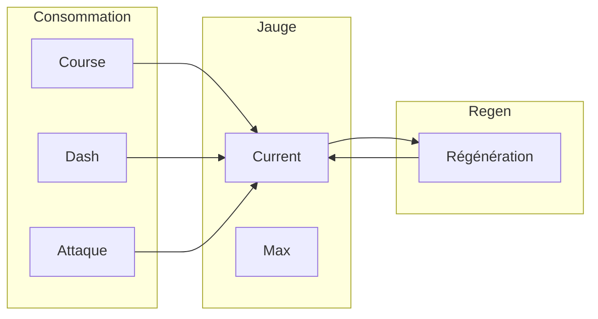
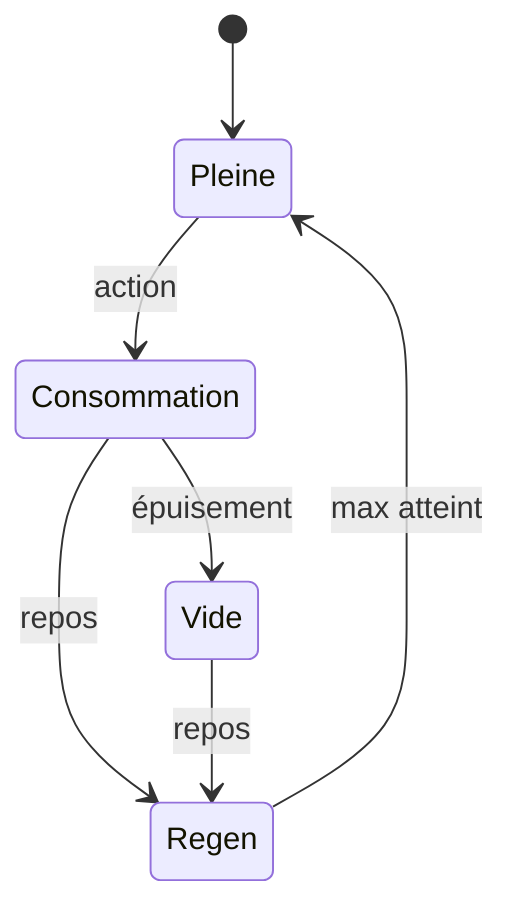
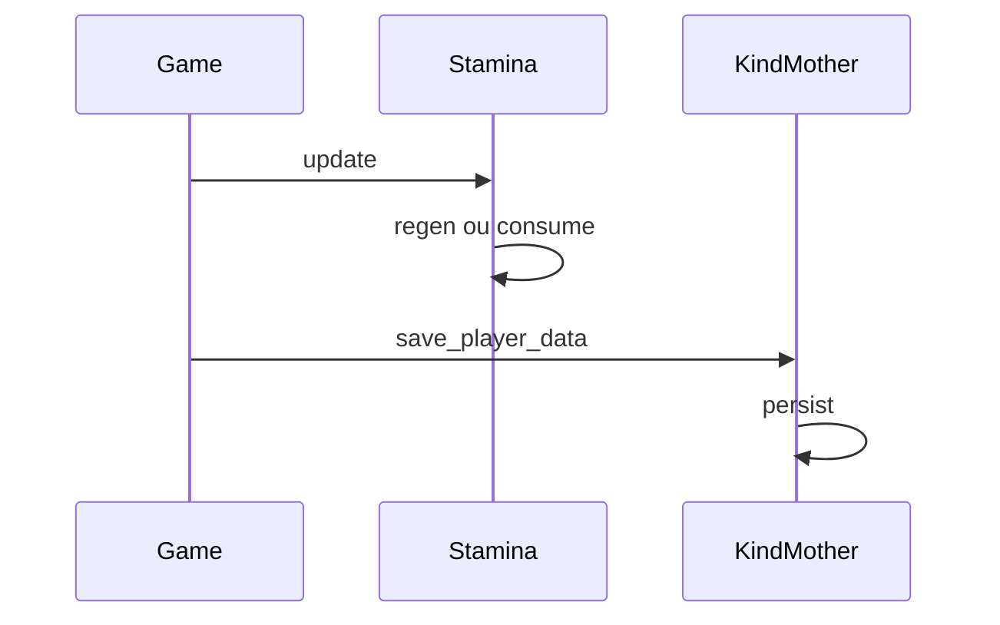

# Stamina

**Catégorie :** 3. Déplacement et locomotion  
**Description :** Jauge d'endurance ; régénération.

---

## Contexte et rôle

### Dans le moteur MGE

La **stamina** (endurance) est une ressource consommée par des actions physiques : course ([run-walk](run-walk.md)), [dash](dash-esquive.md), attaques lourdes, etc. Elle se régénère au repos et peut limiter les comportements spam.

La persistance des données joueur (stamina max, bonus) peut être gérée via **KindMother** (Core Strate 4, domaine données) — voir glossaire Miyukini.

### Références centralisées

Les types et conventions sont définis dans la [Référence Commune](../../MGE%20-%20Reference%20Commune.md).

---

## Portée / Scope

- Jauge : valeur actuelle / max
- Consommation (course, dash, attaques)
- Régénération (passive, hors combat)
- Modificateurs (buffs, équipement)
- Persistance (KindMother)

---

## Spécifications techniques

### Formules

#### Consommation

- **Course** : `cost = params.run_cost_per_sec × dt`
- **Dash** : `cost = params.dash_cost_flat`
- **Attaque** : selon le combat

#### Régénération

- **Hors combat** : `regen = params.regen_per_sec × dt`
- **En combat** : régen réduite ou nulle (ex. 50 %)
- **Seuil** : régen possible seulement si stamina < max

```
stamina_new = min(stamina + regen × dt, max_stamina)
```

### Paramètres typiques

| Paramètre | Valeur | Rôle |
|-----------|--------|------|
| max_stamina | 100–200 | Jauge de base |
| regen_per_sec | 5–15 | Récupération |
| run_cost_per_sec | 8–12 | Coût course |
| dash_cost | 20–40 | Coût dash |
| combat_regen_mult | 0–0.5 | Réduction en combat |

### Contraintes

| Contrainte | Valeur | Raison |
|------------|--------|--------|
| Stamina min | 0 | Pas de valeur négative |
| Stamina max | 1–9999 | Limite raisonnable |
| Regen | ≥ 0 | Pas de dégénération passive |

---

## Modèle de données / API

### Structures Rust (proposition)

```rust
/// Paramètres stamina
#[derive(Debug, Clone)]
pub struct StaminaParams {
    pub max: f32,
    pub regen_per_sec: f32,
    pub combat_regen_mult: f32,
}

impl Default for StaminaParams {
    fn default() -> Self {
        Self {
            max: 100.0,
            regen_per_sec: 10.0,
            combat_regen_mult: 0.25,
        }
    }
}

/// État stamina
#[derive(Debug, Clone)]
pub struct StaminaState {
    pub current: f32,
    pub params: StaminaParams,
    pub in_combat: bool,
}

impl StaminaState {
    pub fn consume(&mut self, amount: f32) -> bool {
        if self.current >= amount {
            self.current -= amount;
            true
        } else {
            false
        }
    }

    pub fn update(&mut self, dt: f32) {
        let regen_mult = if self.in_combat {
            self.params.combat_regen_mult
        } else {
            1.0
        };
        let regen = self.params.regen_per_sec * regen_mult * dt;
        self.current = (self.current + regen).min(self.params.max);
    }

    pub fn can_afford(&self, cost: f32) -> bool {
        self.current >= cost
    }

    pub fn percent(&self) -> f32 {
        if self.params.max <= 0.0 {
            0.0
        } else {
            self.current / self.params.max
        }
    }
}
```

### Signatures principales

| Fonction | Signature | Rôle |
|----------|------------|------|
| `StaminaState::consume` | `(&mut self, f32) -> bool` | Consommation |
| `StaminaState::update` | `(&mut self, f32)` | Régénération |
| `StaminaState::can_afford` | `(&self, f32) -> bool` | Test coût |
| `StaminaState::percent` | `(&self) -> f32` | Pourcentage 0–1 |

---

## Diagrammes

### Cycle stamina



### États



### Intégration KindMother



---

## Exemples et cas d'usage

### Cas 1 : Course prolongée

- Joueur court 5 s ; coût 10/s → 50 stamina consommés
- S'arrête ; régén 10/s → 5 s pour récupérer

### Cas 2 : Dash sans stamina

- Coût dash 25 ; stamina actuel 20
- `can_afford(25)` = false → dash refusé ou réduit

### Cas 3 : Combat prolongé

- Stamina utilisée pour attaques ; régén en combat à 25 %
- Sortie de combat → régén normale

### Cas 4 : Données joueur (KindMother)

- `max_stamina` modifié par équipement ou bonus niveau
- Sérialisation dans le profil joueur ; chargement au login

---

## Cas limites et tests

### Edge cases

| Cas | Description | Comportement attendu |
|-----|-------------|----------------------|
| Consommer plus que dispo | cost > current | `consume` retourne false |
| max = 0 | Division | percent = 0 |
| dt très grand | Overflow regen | clamp à max |
| in_combat toggle | Changement | Régen adaptée |

### Critères de validation

- [ ] current ne dépasse jamais max
- [ ] current ne devient pas négatif
- [ ] consume retourne false si insuffisant
- [ ] Régénération applique combat_regen_mult

### Tests unitaires suggérés

```rust
#[cfg(test)]
mod tests {
    use super::*;

    #[test]
    fn consume_insuffisant_refuse() {
        let mut s = StaminaState {
            current: 10.0,
            params: StaminaParams::default(),
            in_combat: false,
        };
        assert!(!s.consume(20.0));
        assert_eq!(s.current, 10.0);
    }

    #[test]
    fn regen_plafonne_max() {
        let mut s = StaminaState {
            current: 95.0,
            params: StaminaParams {
                max: 100.0,
                regen_per_sec: 100.0,
                ..Default::default()
            },
            in_combat: false,
        };
        s.update(1.0);
        assert_eq!(s.current, 100.0);
    }
}
```

---

## Références

- [Référence Commune MGE](../../MGE%20-%20Reference%20Commune.md)
- [Run / walk](run-walk.md) — Consommation course
- [Dash / esquive](dash-esquive.md) — Consommation dash
- [Données joueur](../../05-joueur-personnage/donnees-joueur.md) — Persistance KindMother
- [Index catégorie](_index.md)
- [Index MGE](../_index.md)

---

## UI et affichage

- Barre de stamina (jauge horizontale ou circulaire)
- Couleur : vert (pleine), jaune (moitié), rouge (vide)
- Animation de pulsation quand vide

---

## Buffs et modificateurs

- Max stamina augmenté (équipement, niveau)
- Régénération augmentée (buffs)
- Consommation réduite (talents)

---

## Intégration combat

- Certaines attaques consomment de la stamina
- Block/parade : coût par blocage
- Compétences spéciales : coût variable

---

## Spécifications étendues

- **Régen hors combat** : 100 %. En combat : 0–50 % après délai (ex. 5 s)
- **Table de coûts** : course 10/s, dash 25, attaque lourde 15, block 5
- **Overcap** : régen s'arrête à max, pas de réserve au-delà
- **Action coût > disponible** : refus avec feedback

---

## Annexe : courbe de régénération

- Hors combat : ligne droite, pente = regen_per_sec
- En combat : pente réduite après délai (ex. 5 s)
- À max : plate, pas de dépassement
