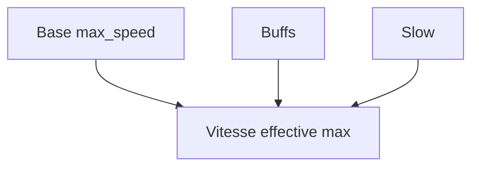

# Vitesse max

**Catégorie :** 3. Déplacement et locomotion  
**Description :** Limite de vitesse ; clamp.

---

## Contexte et rôle

### Dans le moteur MGE

La **vitesse max** définit la borne supérieure du déplacement d’une entité. Sans limite, des bugs ou des exploits pourraient faire apparaître des vitesses aberrantes ; le clamp garantit la cohérence physique et le balancement du jeu.

Ce point complète [accélération-décélération](acceleration-deceleration.md) : après interpolation, la vitesse est toujours bornée par cette valeur. Il peut aussi s’appliquer aux projectiles, véhicules et effets (knockback, dash).

### Références centralisées

Les types `Vec2` et unités (px/s, tiles/s) sont définis dans la [Référence Commune](../../MGE%20-%20Reference%20Commune.md).

---

## Portée / Scope

- Vitesse max par entité (configurable)
- Clamp par norme (pas de dépassement en diagonale)
- Clamp par axe (optionnel, pour certains jeux)
- Modificateurs temporaires (buff course, slow, etc.)
- Unités cohérentes (px/s ou tiles/s)

---

## Spécifications techniques

### Clamp par norme

La contrainte principale : la **norme** du vecteur vitesse ne doit pas dépasser `max_speed`.

```
si ||v|| > max_speed alors v = v × (max_speed / ||v||)
```

- Garantit que la vitesse en diagonale ne dépasse pas la vitesse en ligne droite.
- Cohérent avec la [normalisation des directions](deplacement-8-directions.md).

### Clamp par axe (optionnel)

Pour certains gameplay (ex. déplacement grille stricte, plateformeur) :

```
v.x = clamp(v.x, -max_speed_x, max_speed_x)
v.y = clamp(v.y, -max_speed_y, max_speed_y)
```

- Peut créer une vitesse diagonale de norme plus grande que max_speed_x/y.
- À utiliser seulement si le design le requiert.

### Modificateurs

La vitesse effective peut être multipliée par des effets :

```
vitesse_effective_max = max_speed_base × mult_buffs × (1 - mult_slow)
```

- `mult_buffs` : ex. 1.5 pour « course » (voir [run-walk](run-walk.md))
- `mult_slow` : ex. 0.3 pour ralentissement 30 %

### Contraintes

| Contrainte | Valeur typique | Raison |
|------------|----------------|--------|
| min max_speed | 1 px/s | Éviter division par zéro |
| max max_speed | 2000 px/s | Limite raisonnable (éviter tunneling) |
| Unité | px/s ou tiles/s | Cohérence mondiale |

---

## Modèle de données / API

### Structures Rust (proposition)

```rust
/// Mode de clamp de la vitesse
#[derive(Debug, Clone, Copy, PartialEq, Eq)]
pub enum SpeedClampMode {
    /// Limite la norme du vecteur (défaut)
    Norm,
    /// Limite chaque axe séparément
    PerAxis,
}

/// Paramètres de vitesse max
#[derive(Debug, Clone)]
pub struct MaxSpeedParams {
    pub value: f32,
    pub mode: SpeedClampMode,
    /// Modificateur multiplicatif (buffs, debuffs)
    pub multiplier: f32,
}

impl Default for MaxSpeedParams {
    fn default() -> Self {
        Self {
            value: 120.0,
            mode: SpeedClampMode::Norm,
            multiplier: 1.0,
        }
    }
}

impl MaxSpeedParams {
    pub fn effective_max(&self) -> f32 {
        (self.value * self.multiplier).max(0.01)
    }

    /// Clamp le vecteur vitesse selon les paramètres
    pub fn clamp_velocity(&self, v: Vec2) -> Vec2 {
        let max = self.effective_max();
        match self.mode {
            SpeedClampMode::Norm => v.clamp_length_max(max),
            SpeedClampMode::PerAxis => Vec2::new(
                v.x.clamp(-max, max),
                v.y.clamp(-max, max),
            ),
        }
    }
}
```

### Signatures principales

| Fonction | Signature | Rôle |
|----------|------------|------|
| `MaxSpeedParams::effective_max` | `(&self) -> f32` | Vitesse max après modificateurs |
| `MaxSpeedParams::clamp_velocity` | `(&self, Vec2) -> Vec2` | Clamp du vecteur |
| `Vec2::clamp_length_max` | (méthode standard) | Clamp par norme |

---

## Diagrammes

### Flux de clamp

```mermaid
flowchart LR
    V[Vitesse brute] --> Check{||v|| > max?}
    Check -->|Oui| Clamp[Clamp norme]
    Check -->|Non| V
    Clamp --> Vout[Vitesse sortie]
    V --> Vout
```

### Hiérarchie des modificateurs



---

## Exemples et cas d'usage

### Cas 1 : Personnage marche

- `max_speed` = 80 px/s.
- Vitesse après accélération = (60, 60) → norme ≈ 85 > 80.
- Clamp → (56.6, 56.6) → norme 80.

### Cas 2 : Mode course (run)

- `max_speed_base` = 80, `multiplier` = 1.5.
- `effective_max` = 120 px/s.
- Voir [run-walk](run-walk.md) pour l’alternance marche/course.

### Cas 3 : Ralentissement (CC)

- Effet slow 50 % : `multiplier` = 0.5.
- `effective_max` = 40 px/s.

### Cas 4 : Projectile

- Vitesse constante fixe, pas d’accélération.
- Clamp appliqué une fois au spawn ; ensuite invariance.

---

## Modificateurs empilables

- Les modificateurs se multiplient : effective = base × mult1 × mult2
- Ordre : base → run/walk → buffs → debuffs → clamp final
- Cap optionnel à 2.0 ou 3.0 pour éviter abus

---

## Unité et échelle

- Vitesse en px/s (cohérent avec delta time)
- Ou tiles/s si monde tile-based ; 1 tile = N pixels

---

## Annexe : tableaux de référence

### Vitesses par type d'entité (px/s)

| Entité | Marche | Course | Notes |
|--------|--------|--------|-------|
| Joueur humain | 80 | 120 | Base |
| PNJ marchand | 40 | — | Pas de course |
| Ennemi loup | 90 | 130 | Poursuite |
| Bateau canot | 60 | — | Eau |
| Projectile flèche | 400 | — | Constant |
| Knockback léger | 150 | — | 0.2 s |
| Dash | 500 | — | 0.2 s |

### Formules de modificateurs

- Buff +20 % : multiplier = 1.2
- Slow -30 % : multiplier = 0.7
- Course : multiplier = 1.5 (via run-walk)
- Empilage : 1.2 × 0.7 = 0.84 (buff puis slow)

---

## Annexe : exemples de configuration

### Personnage niveau 1

- max_speed base : 100
- Marche : 100
- Course (×1.5) : 150

### Personnage avec buff vitesse

- max_speed base : 100
- Buff +20 % : multiplier 1.2
- Effective : 120 marche, 180 course

### Personnage avec slow

- max_speed base : 100
- Slow -50 % : multiplier 0.5
- Effective : 50

### Projectile

- Vitesse fixe 400, pas de modificateur
- Clamp appliqué une fois au spawn

---

## Cas limites et tests

### Edge cases

| Cas | Description | Comportement attendu |
|-----|-------------|----------------------|
| max_speed = 0 | Entité immobile | Vitesse forcée à (0, 0) |
| v = (0, 0) | Vitesse nulle | Pas de modification |
| v déjà sous la limite | Pas de changement | Retour inchangé |
| multiplier négatif | Erreur de config | Clamp à 0 ou valeur min |

### Critères de validation

- [ ] Après clamp norme, ||v|| ≤ max_speed
- [ ] Après clamp per-axis, |v.x| et |v.y| ≤ max
- [ ] multiplier = 0.5 divise bien la limite
- [ ] Vitesse exactement à la limite reste inchangée

### Tests unitaires suggérés

```rust
#[cfg(test)]
mod tests {
    use super::*;

    #[test]
    fn clamp_norme_reduit_diagonale() {
        let p = MaxSpeedParams {
            value: 100.0,
            mode: SpeedClampMode::Norm,
            multiplier: 1.0,
        };
        let v = Vec2::new(100.0, 100.0);
        let c = p.clamp_velocity(v);
        assert!((c.length() - 100.0).abs() < 0.01);
    }

    #[test]
    fn clamp_ne_modifie_pas_sous_limite() {
        let p = MaxSpeedParams::default();
        let v = Vec2::new(50.0, 0.0);
        let c = p.clamp_velocity(v);
        assert_eq!(c, v);
    }
}
```

---

## Références

- [Référence Commune MGE](../../MGE%20-%20Reference%20Commune.md) — Vec2, unités
- [Déplacement 8 directions](deplacement-8-directions.md) — Direction
- [Accélération / décélération](acceleration-deceleration.md) — Interpolation
- [Run / walk](run-walk.md) — Modificateur course
- [Index catégorie](_index.md)
- [Index MGE](../_index.md)
