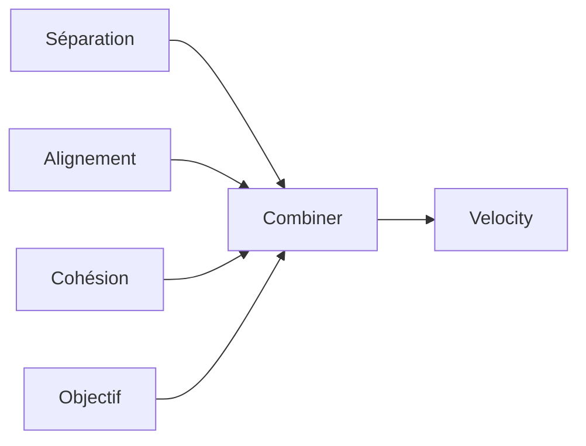
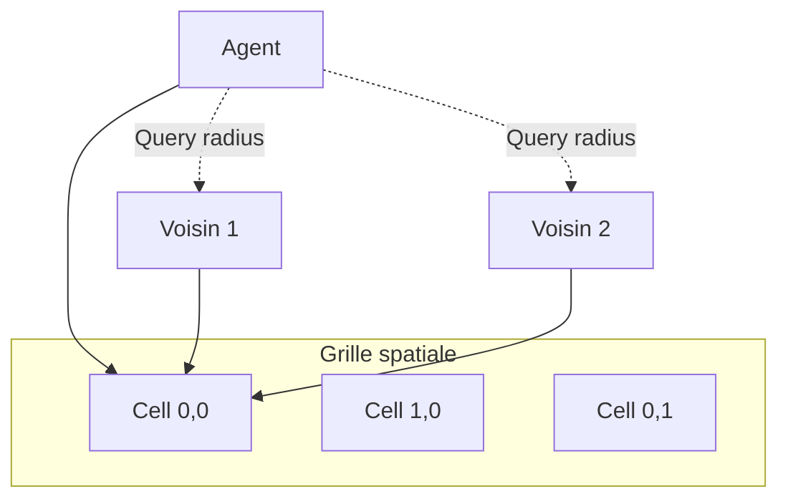
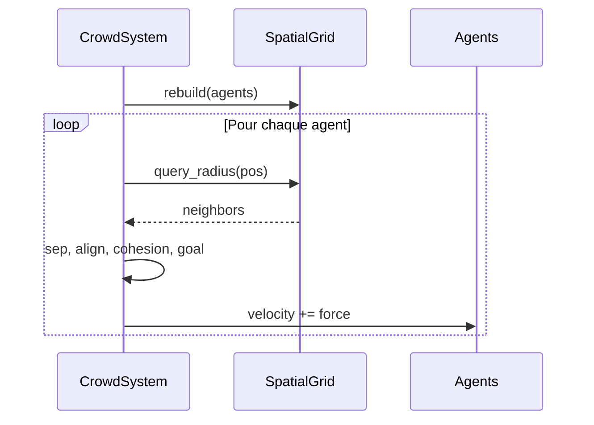

# Comportement en foule

**Catégorie :** 4. Entités et monde  
**Description :** Mouvements de masse ; évitement ; boids.

---

## En-tête et contexte

### Rôle dans le moteur

Le comportement en foule (crowd behaviour) gère le déplacement de nombreuses entités proches sans qu'elles se chevauchent ou se bloquent mutuellement. Techniques : évitement local (local avoidance), règles de boids (séparation, alignement, cohésion), flow fields, ou chemins partagés. Ce point spécifie les algorithmes et les paramètres pour des mouvements de masse fluides et performants.

### Liens vers la référence commune

- `Vec2`, coordonnées monde — voir [MGE - Référence Commune](../MGE%20-%20Reference%20Commune.md)
- [grands-effectifs-ecran](grands-effectifs-ecran.md) : rendu des foules
- [pathfinding](../03-deplacement-locomotion/pathfinding.md) : recherche de chemin individuelle

### Terminologie

| Terme | Définition |
|-------|------------|
| **Boids** | Algorithme de Reynolds : séparation, alignement, cohésion |
| **Local avoidance** | Évitement à courte portée pour ne pas se chevaucher |
| **Flow field** | Champ de vecteurs indiquant la direction de déplacement |
| **RVO** | Reciprocal Velocity Obstacles — évitement réciproque |
| **Agent** | Entité membre de la foule |

---

## Spécifications techniques

### Contraintes

1. **Performance** : O(n) ou O(n log n) par frame pour des centaines d'agents
2. **Fluidité** : Pas de blocage mutuel ; mouvements naturels
3. **Direction** : Les agents convergent vers un objectif (optionnel)
4. **Obstacles** : Prise en compte des murs et obstacles statiques

### Règles de boids (simplifiées)

| Règle | Description | Poids typique |
|-------|-------------|---------------|
| Séparation | S'éloigner des voisins trop proches | 1.5 |
| Alignement | Aller dans la direction moyenne des voisins | 1.0 |
| Cohésion | Se rapprocher du centre de masse des voisins | 1.0 |
| Objectif | Se diriger vers une cible | 1.0–2.0 |

### Paramètres

| Paramètre | Valeur typique | Description |
|-----------|----------------|-------------|
| Rayon de perception | 50–80 px | Distance pour considérer un voisin |
| Rayon de séparation | 20–30 px | Distance min entre agents |
| Vitesse max | 100–150 px/s | Limite par agent |
| Force max | 2–5 | Clamp sur l'accélération |

### Formules

- **Séparation** : `force = sum((pos - neighbor_pos).normalize() / distance)`
- **Alignement** : `force = normalize(mean(neighbor_velocities)) - my_velocity`
- **Cohésion** : `force = center_of_mass - pos`
- **Combinaison** : `final = w1*sep + w2*align + w3*cohesion + w4*goal`

### Références croisées

- **pathfinding** : Chemins individuels ou flow field global
- **navmesh** : Zones navigables
- **grands-effectifs-ecran** : Rendu des foules
- **culling-agressif** : Ne calculer que les agents actifs

---

## Modèle de données et API

### Structures Rust (pseudo-code)

```rust
pub struct BoidParams {
    pub separation_radius: f32,
    pub alignment_radius: f32,
    pub cohesion_radius: f32,
    pub separation_weight: f32,
    pub alignment_weight: f32,
    pub cohesion_weight: f32,
    pub goal_weight: f32,
    pub max_speed: f32,
    pub max_force: f32,
}

pub struct CrowdAgent {
    pub entity_id: EntityId,
    pub position: Vec2,
    pub velocity: Vec2,
    pub goal: Option<Vec2>,
}

pub struct CrowdSystem {
    params: BoidParams,
    agents: Vec<CrowdAgent>,
    spatial_grid: SpatialGrid,  // Pour voisinage O(1)
}
```

### API

```rust
impl CrowdSystem {
    pub fn add_agent(&mut self, entity_id: EntityId, position: Vec2);
    pub fn remove_agent(&mut self, entity_id: EntityId);
    pub fn set_goal(&mut self, entity_id: EntityId, goal: Option<Vec2>);
    pub fn update(&mut self, dt: f32);
    pub fn get_velocity(&self, entity_id: EntityId) -> Vec2;
}
```

### Algorithme de mise à jour

```rust
fn update_boids(dt: f32) {
    spatial_grid.rebuild(agents);
    for agent in agents.iter_mut() {
        let neighbors = spatial_grid.query_radius(agent.position, perception_radius);
        let sep = separation(agent, &neighbors);
        let align = alignment(agent, &neighbors);
        let coh = cohesion(agent, &neighbors);
        let goal = goal_force(agent);
        let accel = sep * w1 + align * w2 + coh * w3 + goal * w4;
        agent.velocity += accel.clamp(max_force) * dt;
        agent.velocity = agent.velocity.clamp_len(max_speed);
        agent.position += agent.velocity * dt;
    }
}
```

---

## Diagrammes

### Règles de boids



### Spatial grid pour voisinage



### Flux de mise à jour



---

## Exemples et cas d'usage

### Cas 1 : Foule de village (Allumina)

PNJ se déplaçant dans les rues. Boids avec cohésion faible, objectif = point aléatoire. Séparation pour éviter le chevauchement. 50–100 PNJ.

### Cas 2 : Armée en marche

Soldats en formation. Alignement fort, cohésion forte, objectif = direction du général. Séparation pour garder l'espacement. 200+ unités.

### Cas 3 : Fuite

En cas d'alarme, objectif = sortie. Cohésion et alignement réduits ; séparation maintenue. Les agents convergent vers les portes.

### Cas 4 : File d'attente

Objectif = position en file. Pas de boids classiques ; plutôt un système de waypoints en chaîne avec évitement local.

---

## Cas limites et tests

### Edge cases

| Cas | Comportement attendu | Validation |
|-----|----------------------|------------|
| Zone surpeuplée | Ralentissement ou étalement | Pas de blocage total |
| Objectif inaccessible | Comportement dégradé (rester sur place) | Pas de boucle infinie |
| Agent seul | Pas de division par zéro | Velocity = goal_force |
| Obstacle au centre | Contournement (flow field ou recul) | Pas de traversée de mur |

### Critères de validation

1. **Pas de chevauchement** : Séparation suffisante
2. **Performance** : 1000 agents en < 5 ms (objectif)
3. **Fluidité** : Mouvements naturels, pas de jitter

### Tests suggérés

```rust
#[test]
fn separation_prevents_overlap() { /* ... */ }

#[test]
fn alignment_converges() { /* ... */ }

#[test]
fn goal_reached_within_tolerance() { /* ... */ }

#[bench]
fn update_1000_boids() { /* ... */ }
```

---

## Optimisations avancées

### Spatial hashing

Grille avec cellules de taille ~ perception_radius. Chaque agent est dans une cellule ; la recherche de voisins ne regarde que les 9 cellules adjacentes.

### LOD comportemental

Les agents loin du joueur : pas de boids, mouvement simplifié (scripté ou statique). Réduction du coût.

### Parallelisation

Les calculs par agent sont indépendants (sans écriture partagée) ; parallel_for sur les agents.

### Flow field global

Pour des foules allant vers une même zone (ex. sortie), pré-calculer un flow field une fois ; les agents le suivent. Moins de calcul par frame.

---

## Détails d'implémentation

### RVO (Reciprocal Velocity Obstacles)

Alternative aux boids : chaque agent calcule les vitesses à éviter pour ne pas entrer en collision avec ses voisins. Plus précis pour l'évitement local, mais plus coûteux. Utilisé dans les navmeshes de type Crowd.

### Flow field

Pour des foules allant vers une destination commune, pré-calculer une grille où chaque cellule a un vecteur direction vers la sortie. Les agents suivent ce champ. Coût O(1) par agent par frame (juste lookup), après un calcul A* ou BFS initial pour construire le flow field.

### Comportement mixte

Combiner boids pour le mouvement naturel et flow field pour la direction : `velocity = boid_force + flow_field_direction * weight`.

---

## Obstacles et murs

Les boids purs ignorent les obstacles. Pour les prendre en compte : ajouter une force de répulsion depuis les obstacles proches (raycast ou distance au mur), ou utiliser un navmesh et contraindre les agents aux chemins navigables.

---

## Annexes

### Annexe A : Paramètres boids typiques

Pour une foule de village : separation_radius 25, alignment_radius 60, cohesion_radius 80. Poids : sep 1.5, align 1.0, cohesion 0.8, goal 1.2. Max speed 100, max force 3.

Pour une armée en marche : alignment et cohesion plus forts (1.5), goal 2.0. Separation plus faible (1.0) pour une formation plus serrée.

### Annexe B : Spatial grid - taille des cellules

La taille de cellule optimale ≈ perception_radius. Ainsi chaque agent ne regarde que sa cellule et les 8 voisines (9 au total). Réduit la complexité de O(n²) à O(n * k) où k est le nombre moyen de voisins par cellule.

### Annexe C : Boids et pathfinding

Pour des agents avec destination précise : combiner boids (évitement local) avec pathfinding (chemin global). Le pathfinding donne des waypoints ; les boids gèrent le mouvement entre waypoints en évitant les autres. Le goal_force pointe vers le prochain waypoint.

---

## Guide d'implémentation

1. Créer une grille spatiale (cell size ≈ perception_radius). 2. Chaque frame : rebuild la grille avec les positions des agents. 3. Pour chaque agent : query les voisins (sa cellule + 8 adjacentes). 4. Calculer séparation, alignement, cohésion, goal_force. Combiner avec les poids. 5. Appliquer l'accélération (clamp max_force), mettre à jour velocity (clamp max_speed), intégrer position. Si des obstacles existent, ajouter une force de répulsion ou utiliser un navmesh.

---

## FAQ et décisions de design

**Q : Boids vs RVO vs flow field ?**  
R : Boids = simple, naturel pour foules libres. RVO = précis pour évitement. Flow field = efficace pour destination commune. Combiner : boids + flow field pour des foules dirigées.

**Q : Rayon de perception : trop grand ?**  
R : Trop grand = plus de voisins = plus de calcul. 50–80 px est typique. Adapter à la densité (foule serrée = rayon plus petit).

**Q : Poids séparation > alignement ?**  
R : Souvent oui. La séparation évite les chevauchements (priorité). Alignement et cohésion donnent le mouvement de groupe.

**Q : Objectif pour tous les agents ?**  
R : Non. Certains agents errent (goal = random). D'autres vont vers un point (goal = position). Le goal_force est 0 si pas d'objectif.

**Q : Obstacles : force de répulsion ou navmesh ?**  
R : Répulsion = simple, pas de pré-calcul. Navmesh = plus propre, évite les traversées de mur. Pour des foules dans des couloirs, navmesh recommandé.

**Q : Performance : 1000 boids en 5 ms ?**  
R : Oui avec spatial grid. Sans : O(n²) = lent. Avec grille : O(n*k) où k = voisins par cellule. Typiquement k << n.

**Q : Culling des agents loin du joueur ?**  
R : Oui. Les agents hors du rayon de simulation n'ont pas besoin de boids. Mouvement scripté ou statique. Réduit le coût.

**Q : Formation (armée) vs foule désordonnée ?**  
R : Formation = alignement et cohésion forts, séparation faible. Foule = équilibré ou séparation forte. Adapter les poids.

---

## Spécifications étendues

### BoidParams par type de foule

| Type | Sep | Align | Coh | Goal |
|------|-----|-------|-----|------|
| Village | 1.5 | 1.0 | 0.8 | 1.2 |
| Armée | 1.0 | 1.5 | 1.5 | 2.0 |
| Fuite | 1.5 | 0.5 | 0.3 | 2.0 |

### SpatialGrid cell size

- perception_radius = 60 → cell_size = 60
- Nombre de cellules = world_size / cell_size
- Query = 9 cellules (3x3)

---

## Notes techniques complémentaires

### Boids et frame rate

Si le jeu drop des frames, les boids peuvent être mis à jour à taux fixe (ex. 30 Hz) indépendamment du rendu. Ou réduire le nombre d'agents actifs (culling).

### Boids et determinism

Pour le multijoueur (replay, réseau), les boids doivent être déterministes. Même seed, même ordre de traitement. Éviter les float qui divergent.

### Flow field et coût

Le flow field est pré-calculé (A* ou BFS depuis la destination). Coût one-shot. Les agents le consultent en O(1). Utile pour des foules > 100 agents vers une même sortie.

---

## Résumé et checklist

| Étape | Action |
|-------|--------|
| 1 | Créer grille spatiale (cell = perception_radius) |
| 2 | Rebuild grille chaque frame |
| 3 | Pour chaque agent : query voisins (9 cellules) |
| 4 | Calculer sep, align, cohesion, goal |
| 5 | Combiner, clamp, intégrer |
| 6 | Obstacles : répulsion ou navmesh |
| 7 | Benchmark : 1000 boids < 5 ms |

---

## Références

| Document | Rôle |
|----------|------|
| [MGE - Référence Commune](../MGE%20-%20Reference%20Commune.md) | Vec2, coordonnées |
| [pathfinding](../03-deplacement-locomotion/pathfinding.md) | Chemins |
| [navmesh](../03-deplacement-locomotion/navmesh.md) | Navigation |
| [grands-effectifs-ecran](grands-effectifs-ecran.md) | Rendu |
| [culling-agressif](culling-agressif.md) | Agents actifs |
| [_index 04](_index.md) | Index catégorie |
| [Index MGE](../_index.md) | Index global |
