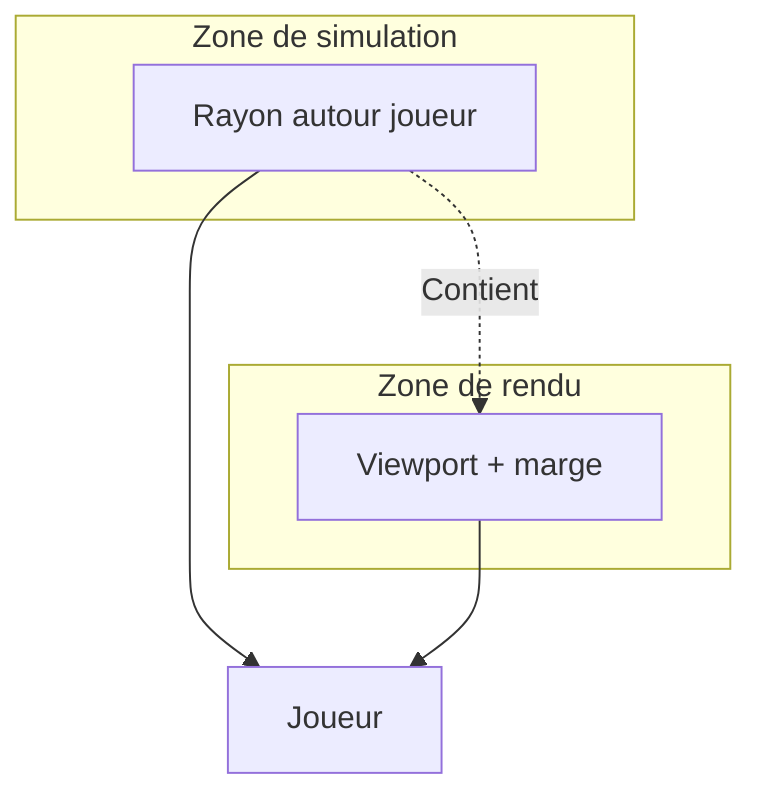
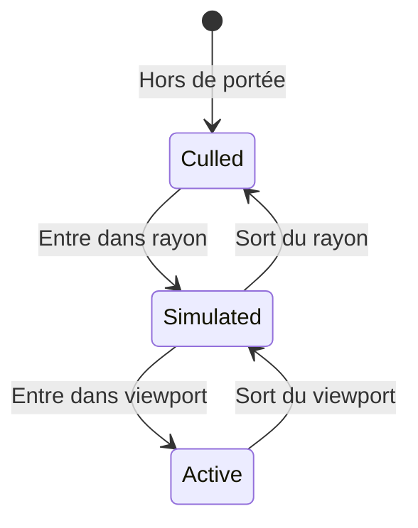
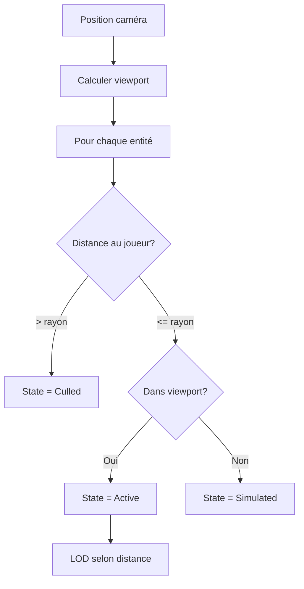

# Culling agressif

**Catégorie :** 4. Entités et monde  
**Description :** Ne pas traiter les entités hors écran (ou hors de portée).

---

## En-tête et contexte

### Rôle dans le moteur

Le culling agressif exclut du traitement (simulation, rendu, collisions) les entités qui ne sont pas visibles ou proches du joueur. Objectifs : réduire la charge CPU/GPU, maintenir un frame rate stable (60 fps), et permettre des mondes de grande taille sans dégradation. Ce point définit les stratégies de culling : frustum, distance, chunks, et LOD (Level of Detail).

### Liens vers la référence commune

- `Vec2`, `Rect`, coordonnées monde/écran — voir [MGE - Référence Commune](../MGE%20-%20Reference%20Commune.md)
- Cycle de rendu : intégration dans le pipeline
- Caméra : frustum, viewport

### Terminologie

| Terme | Définition |
|-------|------------|
| **Culling** | Exclusion d'entités du traitement |
| **Frustum** | Volume de visibilité de la caméra (rectangle 2D ou cône 3D) |
| **Viewport** | Zone de l'écran correspondant au monde visible |
| **LOD** | Level of Detail — réduire la complexité à distance |
| **Margin** | Marge autour du viewport pour éviter le pop-in |

---

## Spécifications techniques

### Contraintes

1. **Cohérence** : Une entité cullée ne doit pas être simulée (mouvement, IA, combat)
2. **Réactivation** : Quand une entité rentre dans la zone active, elle reprend normalement
3. **Marge** : Zone de buffer pour éviter apparition/disparition brutale (pop-in/pop-out)
4. **Priorité** : Certaines entités sont toujours actives (joueur, objectifs critiques)

### Types de culling

| Type | Critère | Usage |
|------|---------|-------|
| Frustum | Dans le viewport caméra | Rendu uniquement |
| Distance | Rayon autour du joueur | Simulation (IA, physique) |
| Chunk | Chunk chargé ou non | Chargement/déchargement |
| Occlusion | Caché par un obstacle | Optionnel, plus coûteux |

### Paramètres

| Paramètre | Valeur typique | Unité | Description |
|-----------|----------------|-------|-------------|
| Simulation radius | 3–5 | chunks | Ou 200–400 px |
| Render margin | 1 | chunk | Ou 32–64 px |
| LOD distance 1 | 0–100 | px | Sprites pleine résolution |
| LOD distance 2 | 100–200 | px | Sprites réduits / simplifiés |
| LOD distance 3 | 200+ | px | Invisible ou icône |

### Formules

- **Dans le frustum** : `world_to_screen(pos).in_viewport(viewport)`
- **Dans le rayon** : `distance(player_pos, entity_pos) <= simulation_radius`
- **Chunk actif** : `chunk_id in loaded_chunks`

### Références croisées

- **gestion-chunks** : Chunks chargés = préréquis pour le culling par chunk
- **grands-effectifs-ecran** : Optimisation quand beaucoup d'entités sont visibles
- **camera** : Viewport, frustum
- **coordonnées** : Conversion monde → écran

---

## Modèle de données et API

### Structures Rust (pseudo-code)

```rust
pub struct CullingConfig {
    pub simulation_radius: f32,   // Pixels ou tiles
    pub render_margin: f32,
    pub lod_distances: [f32; 3],
    pub always_active_tags: HashSet<EntityTag>,
}

pub enum CullState {
    Active,       // Simulé + rendu
    Simulated,    // Simulé, hors écran (marge)
    Culled,       // Ni simulé ni rendu
    Lod2,        // Rendu simplifié
    Lod3,        // Invisible ou icône
}

pub struct CullingSystem {
    config: CullingConfig,
    entity_states: HashMap<EntityId, CullState>,
}
```

### API

```rust
impl CullingSystem {
    pub fn update(&mut self, camera: &Camera, entities: &[Entity]);
    
    pub fn is_active(&self, id: EntityId) -> bool;
    
    pub fn should_simulate(&self, id: EntityId) -> bool;
    
    pub fn should_render(&self, id: EntityId) -> bool;
    
    pub fn lod_level(&self, id: EntityId) -> u8;  // 0, 1, 2, 3
    
    pub fn active_entities(&self) -> &[EntityId];
}
```

### Intégration dans le pipeline

```rust
// Chaque frame
culling_system.update(&camera, &all_entities);
for id in culling_system.active_entities() {
    simulation_system.tick(id);
}
for id in culling_system.entities_to_render() {
    render_system.draw(id, culling_system.lod_level(id));
}
```

---

## Diagrammes

### Zones de culling



### États de culling



### Flux de mise à jour



---

## Exemples et cas d'usage

### Cas 1 : Champ de bataille Allumina

Des centaines de soldats. Seuls ceux dans un rayon de 400 px sont simulés (IA, déplacement). Le rendu utilise une marge de 64 px pour éviter le pop-in. Au-delà, les unités sont cullées.

### Cas 2 : Ville peuplée

PNJ en arrière-plan : LOD 2 (sprite réduit) au-delà de 150 px ; LOD 3 (invisible) au-delà de 300 px. Le joueur et les PNJ en dialogue restent toujours actifs.

### Cas 3 : Donjon étroit

Corridors : le viewport couvre presque tout le chunk. Culling par chunk suffit ; peu d'entités hors écran.

### Cas 4 : Boss de raid

Le boss est tagué `always_active` ; jamais cullé même s'il est temporairement hors écran (phase de transition).

---

## Cas limites et tests

### Edge cases

| Cas | Comportement attendu | Validation |
|-----|----------------------|------------|
| Entité à la frontière | Hysteresis pour éviter oscillation | Pas de flickering |
| Joueur téléporté | Mise à jour immédiate des zones | Pas de délai |
| Très nombreux à l'écran | Fallback : culling par priorité | Pas de crash |
| Caméra qui bouge vite | Marge suffisante pour éviter pop-in | UX fluide |

### Critères de validation

1. **Performance** : Réduction mesurable du temps de simulation (50 %+ en monde ouvert)
2. **Cohérence** : Aucune entité cullée ne doit être « visible » (déjà traitée) côté joueur
3. **Réactivation** : Entité qui revient reprend correctement (pas d'état figé)

### Tests suggérés

```rust
#[test]
fn culling_excludes_far_entities() { /* ... */ }

#[test]
fn always_active_never_culled() { /* ... */ }

#[test]
fn reentry_restores_state() { /* ... */ }

#[test]
fn lod_levels_by_distance() { /* ... */ }
```

---

## Optimisations avancées

### Spatial hashing

Utiliser une grille spatiale (spatial hash) pour retrouver rapidement les entités dans le rayon : O(1) au lieu de O(n) par entité.

### Hiérarchie

Pour des foules, culler par groupe (batch) plutôt que par entité individuelle.

### Async culling

Sur multithread, le culling peut précéder la simulation ; la liste des entités actives est préparée en parallèle.

---

## Détails d'implémentation

### Calcul du frustum 2D

En 2D, le frustum est un rectangle (viewport) étendu par la marge. Une entité est visible si `viewport.expand(margin).contains(world_to_screen(entity_pos))`. La conversion monde → écran utilise la matrice de vue et de projection de la caméra.

### Hysteresis pour éviter l'oscillation

À la frontière, une entité peut entrer et sortir à chaque frame. Hysteresis : on utilise une marge plus grande pour « entrer » que pour « sortir ». Ex. : marge entrée = 64 px, marge sortie = 48 px. Réduit le flickering.

### Tags always_active

Les entités avec le tag `always_active` (ex. joueur, boss de raid, objectif de quête) ne sont jamais cullées. Elles sont simulées et rendues même hors écran. À utiliser avec parcimonie.

---

## Intégration ECS

Dans un ECS, le culling peut filtrer les entités avant qu'elles soient passées aux systèmes de simulation. Une approche : `SimulationSystem` ne traite que les entités dans `culling_system.active_entities()`. Le rendu utilise une liste similaire pour le draw.

---

## Annexes

### Annexe A : Config culling (exemple)

```yaml
culling:
  simulation_radius: 400
  render_margin: 64
  lod_distances: [100, 200, 350]
  hysteresis_in: 70
  hysteresis_out: 55
  always_active_tags: [player, raid_boss, quest_target]
```

### Annexe B : Culling et particules

Les systèmes de particules peuvent être cullés : si l'émetteur est hors écran, ne pas simuler les particules. Ou les simuler à basse résolution (moins de particules).

### Annexe C : Occlusion en 2D

En 2D isométrique, l'occlusion (entité cachée derrière un mur) est plus simple : tri par profondeur et culling des entités derrière des tuiles opaques. Coût supplémentaire pour le raycast ou la comparaison de positions.

---

## Guide d'implémentation

1. Chaque frame : récupérer la position de la caméra et le viewport. 2. Pour chaque entité : calculer la distance au joueur et la position à l'écran. 3. Appliquer les règles : hors rayon simulation → Culled ; dans rayon mais hors viewport+marge → Simulated ; dans viewport → Active. 4. Appliquer LOD selon la distance. 5. Exposer les listes active_entities et entities_to_render aux systèmes concernés. Utiliser une grille spatiale pour accélérer le « quelles entités sont dans le rayon ».

---

## FAQ et décisions de design

**Q : Culling de l'IA ou du rendu ou des deux ?**  
R : Les deux. Simulation (IA, physique) et rendu doivent utiliser le culling. Une entité cullée n'est ni simulée ni dessinée. Gain maximal.

**Q : Marge pour éviter le pop-in ?**  
R : 1 chunk ou 32–64 px. Les entités entrent dans la zone de rendu avant d'être visibles (marge). Réduit l'apparition brutale au bord de l'écran.

**Q : Hysteresis pour éviter l'oscillation ?**  
R : Oui. Marge entrée > marge sortie. Ex. : entrée à 70 px, sortie à 50 px. Une entité à 60 px reste active (ne clignote pas).

**Q : Toujours actif : quelles entités ?**  
R : Joueur, boss de raid, objectifs de quête critiques, PNJ en dialogue. Limiter à < 10 pour ne pas annuler le bénéfice du culling.

**Q : LOD : combien de niveaux ?**  
R : 3–4. 0 = full, 1 = réduit, 2 = très réduit, 3 = invisible ou icône. Adapter les seuils de distance au type de jeu.

**Q : Culling et multithreading ?**  
R : Le culling peut précéder la simulation. Calculer la liste des actives en parallèle, puis les systèmes consomment cette liste. Réduit le temps de frame.

**Q : Frustum 2D : simple AABB ?**  
R : Oui. En 2D, le frustum est un rectangle (viewport). Pas besoin de cône 3D. Contains(point) suffit.

**Q : Culling par chunk ?**  
R : Complémentaire. Les chunks non chargés n'ont pas d'entités à culler. Le culling s'applique aux entités des chunks chargés.

---

## Spécifications étendues

### CullState transitions

- Culled → Simulated : distance < simulation_radius
- Simulated → Active : dans viewport + margin
- Active → Simulated : sort du viewport
- Simulated → Culled : distance > unload_radius

### Configuration par scène

- Monde ouvert : radius 400, margin 64
- Donjon : radius 200, margin 32
- Boss : always_active pour le boss

---

## Notes techniques complémentaires

### Culling et spatial hash

Pour « entités dans le rayon », une grille spatiale : chaque cellule contient les EntityIds. Query = regarder les cellules intersectant le cercle. Complexité O(k) au lieu de O(n).

### Culling et LOD dynamique

Le niveau LOD peut dépendre de la densité : si beaucoup d'entités à l'écran, augmenter les seuils de distance pour LOD (afficher plus en LOD1/LOD2 pour garder 60 fps).

### Culling et ombres

En 2D, les ombres sont souvent des sprites. Si l'entité est cullée, ne pas dessiner son ombre non plus. Cohérence visuelle.

---

## Résumé et checklist

| Étape | Action |
|-------|--------|
| 1 | Calculer viewport et simulation radius |
| 2 | Pour chaque entité : distance, position écran |
| 3 | Déterminer state (Active, Simulated, Culled) |
| 4 | Appliquer LOD par distance |
| 5 | Hysteresis aux frontières |
| 6 | Exposer listes aux systèmes |
| 7 | Tester réduction charge (50 %+ en monde ouvert) |

---

## Références

| Document | Rôle |
|----------|------|
| [MGE - Référence Commune](../MGE%20-%20Reference%20Commune.md) | Coordonnées, viewport |
| [gestion-chunks](gestion-chunks.md) | Chunks |
| [grands-effectifs-ecran](grands-effectifs-ecran.md) | Densité élevée |
| [camera](../01-affichage-rendu/camera.md) | Viewport |
| [coordonnées](../01-affichage-rendu/coordonnees.md) | Monde/écran |
| [_index 04](_index.md) | Index catégorie |
| [Index MGE](../_index.md) | Index global |
