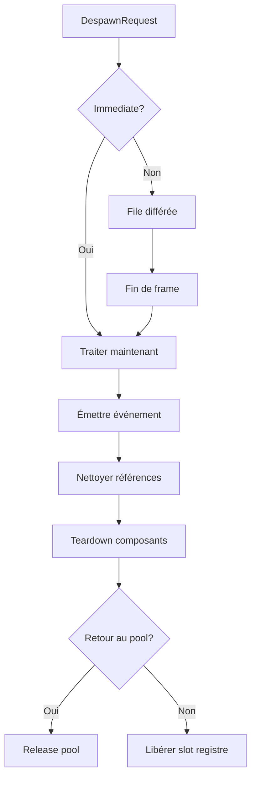
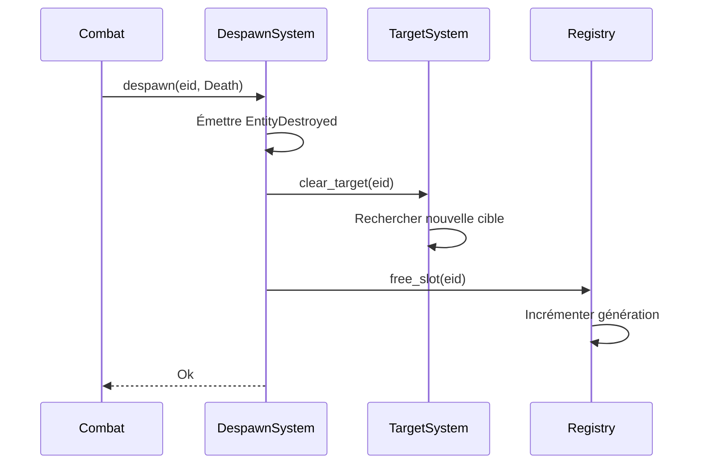
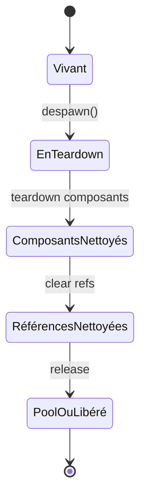

# Despawn

**Catégorie :** 4. Entités et monde  
**Description :** Destruction ; nettoyage des références.

---

## En-tête et contexte

### Rôle dans le moteur

Le despawn est le point de sortie du cycle de vie des entités. Il assure la destruction propre : libération de l'EntityId, nettoyage des composants, suppression des références (ciblage, agro, groupes), retour au pool d'objets si applicable, et notification des systèmes concernés (loot, statistiques, événements).

### Liens vers la référence commune

- `EntityId` — voir [MGE - Référence Commune](../MGE%20-%20Reference%20Commune.md) et [unicite-entites](unicite-entites.md)
- Cycle de rendu : désinscription des entités des listes de rendu

### Terminologie

| Terme | Définition |
|-------|------------|
| **Despawn** | Action de retirer une entité du monde et de libérer ses ressources |
| **Destruction différée** | Marquer pour destruction ; exécuter à la fin du frame (éviter itération invalide) |
| **Nettoyage des références** | Mise à jour de tout pointeur ou ID pointant vers l'entité détruite |
| **Teardown** | Phase finale du despawn (libération mémoire, désabonnement événements) |

---

## Spécifications techniques

### Contraintes

1. **Idempotence** : Despawn d'une entité déjà détruite ne doit pas provoquer d'erreur critique (no-op ou retour Ok)
2. **Ordre de nettoyage** : Composants → références externes → registre → pool
3. **Pas de référence pendante** : Aucun système ne doit garder une référence utilisable vers une entité despawn
4. **Destruction différée** : Les demandes de despawn pendant une itération (ex. dans un système de combat) sont mises en file et traitées en fin de frame

### Paramètres

| Paramètre | Type | Description |
|-----------|------|--------------|
| `entity_id` | `EntityId` | Entité à détruire |
| `reason` | `DespawnReason` | Cause (mort, timeout, script, hors limites) |
| `immediate` | `bool` | Si false, mise en file pour fin de frame |
| `return_to_pool` | `bool` | Si true et entité poolable, retour au pool |

### Références croisées

- **unicite-entites** : Libération du slot, incrément de génération
- **spawn** : Pool : les entités despawn avec `return_to_pool` vont au pool
- **collision** : Retrait des paires de collision impliquant l'entité
- **aggro** : Nettoyage des tables d'agro

---

## Modèle de données et API

### Structures Rust (pseudo-code)

```rust
#[derive(Clone, Copy, Debug)]
pub enum DespawnReason {
    Death,           // Tué (PVE/PVP)
    Timeout,         // Durée de vie atteinte (projectiles)
    OutOfBounds,     // Hors des limites du monde
    Scripted,        // Déclenché par script/event
    InstanceEnd,     // Fin d'instance (donjon)
    Manual,          // Commande explicite
}

pub struct DespawnRequest {
    pub entity_id: EntityId,
    pub reason: DespawnReason,
    pub immediate: bool,
    pub return_to_pool: bool,
}
```

### API

```rust
pub trait DespawnSystem {
    /// Détruire une entité
    fn despawn(&mut self, request: DespawnRequest) -> Result<(), DespawnError>;
    
    /// Détruire immédiatement (raccourci)
    fn despawn_immediate(&mut self, entity_id: EntityId, reason: DespawnReason) 
        -> Result<(), DespawnError>;
    
    /// Marquer pour destruction en fin de frame
    fn despawn_deferred(&mut self, entity_id: EntityId, reason: DespawnReason);
    
    /// Traiter la file des despawns différés
    fn flush_deferred_despawns(&mut self);
}
```

### Ordre de nettoyage (interne)

```rust
fn destroy_entity(id: EntityId) {
    // 1. Émettre événement (pour loot, achievements, etc.)
    emit(EntityDestroyed { id, reason });
    
    // 2. Nettoyer références externes
    target_system.clear_target(id);
    agro_system.remove_from_all_tables(id);
    group_system.remove_from_party(id);
    
    // 3. Teardown composants (ordre inverse de création)
    for comp in components.iter().rev() {
        comp.on_destroy();
    }
    
    // 4. Retirer du registre ou du pool
    if return_to_pool {
        pool.release(prefab_id, id);
    } else {
        registry.free_slot(id);
    }
}
```

---

## Diagrammes

### Flux de despawn



### Séquence despawn avec références



### États de l'entité pendant le despawn



---

## Exemples et cas d'usage

### Cas 1 : Mort d'un mob

Le système de combat appelle `despawn(mob_id, DespawnReason::Death)` après réduction des PV à 0. Le système de loot écoute `EntityDestroyed` pour faire drop les objets.

### Cas 2 : Projectile qui expire

Le projectile a un composant `Lifetime` ; à expiration, `despawn_deferred(proj_id, Timeout)` est appelé. En fin de frame, l'entité est détruite et retournée au pool.

### Cas 3 : Fin d'instance de donjon

À la sortie ou fin du timer, le système d'instance appelle `despawn` pour toutes les entités de l'instance (sauf le joueur, qui est téléporté). `reason = InstanceEnd`.

### Cas 4 : Éviter les itérations invalides

Dans une boucle `for e in enemies.iter()`, on ne doit pas appeler `despawn(e)` directement (modification pendant itération). Utiliser `despawn_deferred(e, Manual)` et `flush_deferred_despawns()` en fin de frame.

---

## Cas limites et tests

### Edge cases

| Cas | Comportement attendu | Validation |
|-----|----------------------|------------|
| Double despawn | No-op, retour Ok | Pas de panic |
| Despawn d'entité inexistante | Err(NotFound) ou Ok | Dépend de la sémantique |
| Référence gardée après despawn | `get(id)` = None | Génération invalide |
| Despawn pendant itération | Différé uniquement | Pas de modification invalide |
| Pool saturé | Libérer quand même (pas de pool illimité) | Ou drop l'entité |

### Critères de validation

1. **Aucune référence valide** : Après despawn, aucun système ne peut accéder à l'entité
2. **Mémoire** : Pas de fuite ; les allocations sont libérées ou retournées au pool
3. **Événements** : `EntityDestroyed` est bien émis
4. **Idempotence** : Double despawn ne crashe pas

### Tests suggérés

```rust
#[test]
fn despawn_invalidates_registry_lookup() { /* ... */ }

#[test]
fn deferred_despawn_executed_end_of_frame() { /* ... */ }

#[test]
fn pool_receive_on_despawn_with_return() { /* ... */ }

#[test]
fn double_despawn_no_panic() { /* ... */ }
```

---

## Détails d'implémentation

### File des despawns différés

Une `VecDeque<DespawnRequest>` ou similaire. À chaque frame, après tous les systèmes, `flush_deferred_despawns` parcourt la file et appelle `destroy_entity` pour chaque requête. Les systèmes ne modifient pas le registre pendant leur propre exécution.

### Ordre de teardown des composants

L'ordre inverse de création évite les dépendances : si A dépend de B, B est créé avant A, donc A est détruit avant B. Les composants qui ont des références croisées doivent gérer le teardown explicitement.

### Événement EntityDestroyed

Émis avant la libération du slot. Permet au système de loot de faire un drop, aux achievements de compter un kill, aux quêtes de mettre à jour les objectifs. Les listeners ne doivent pas garder de référence vers l'entité après l'événement.

---

## Cas particuliers

### Despawn d'une entité avec enfants

Si une entité a des « enfants » (ex. projectile attaché, familier), deux stratégies : despawn en cascade (tous les enfants d'abord), ou orphelinage (les enfants deviennent indépendants). Selon le design.

### Despawn et persistance

Les entités avec `flags.persistent` sont sauvegardées avant despawn (ou le despawn est une « suppression logique » qui retire du monde mais garde en base). Pour une vraie destruction, suppression de la persistance après confirmation.

---

## Annexes

### Annexe A : Ordre des systèmes et despawn

Les systèmes s'exécutent dans un ordre défini. Le DespawnSystem doit s'exécuter après les systèmes qui peuvent déclencher des despawns (Combat, Lifetime, etc.) mais avant la fin de frame. Une alternative : tous les systèmes enregistrent des despawns différés ; un système final les traite.

### Annexe B : Debug des fuites

Si une entité n'est jamais despawn malgré qu'elle devrait l'être, vérifier : qui détient une référence ? Le système de ciblage ? L'agro ? Les groupes ? Chaque système qui stocke un EntityId doit s'abonner à EntityDestroyed et nettoyer.

### Annexe C : Despawn en masse

Lors de la destruction d'une instance (donjon, raid), despawn de centaines d'entités. Optimisation : ne pas émettre un événement par entité, ou utiliser un événement batch `InstanceDestroyed { entity_ids: Vec }`. Les systèmes qui écoutent peuvent traiter en lot.

---

## Guide d'implémentation

1. Créer une file de despawns différés. 2. Chaque système qui veut despawn appelle `despawn_deferred`. 3. En fin de frame, `flush_deferred_despawns` traite la file. 4. Pour chaque requête : émettre EntityDestroyed, nettoyer références, teardown composants, libérer ou pool. 5. Tester avec des spawn/despawn massifs pour vérifier l'absence de fuites.

---

## FAQ et décisions de design

**Q : Despawn immédiat vs différé, quand choisir ?**  
R : Différé quand on est dans une boucle (itération sur des entités). Immédiat pour les cas isolés (timeout projectile). En cas de doute, différé est plus sûr.

**Q : Événement EntityDestroyed : qui l'écoute ?**  
R : Loot (drop au sol), achievements, quêtes, agro (nettoyage cible), groupes (retrait). Tout système qui garde une référence à une entité.

**Q : Pool : quand retourner vs libérer ?**  
R : Entités à courte durée de vie et haute fréquence (projectiles, effets) → pool. Entités uniques (boss, joueur) → libérer.

**Q : Despawn en cascade pour les enfants ?**  
R : Si un parent est despawn, les enfants peuvent être despawn en cascade (récursif) ou orphelinés (deviennent indépendants). Cascade pour les projectiles attachés ; orphelin pour les familiers qui survivent.

**Q : Références faibles pour éviter les fuites ?**  
R : En Rust, on n'a pas de weak ref. On utilise EntityId + génération. Au despawn, la génération change ; les anciennes références deviennent invalides. Vérifier avant chaque usage.

**Q : Ordre de teardown des composants ?**  
R : Inverse de la création. Si A dépend de B (A créé après B), alors A est détruit avant B. Éviter les use-after-free dans les dépendances.

**Q : Despawn et réseau ?**  
R : Le serveur autorise le despawn. Les clients reçoivent une notification et retirent l'entité localement. Pas de despawn client-initiated sans validation serveur (sauf pour des entités纯 client-side comme des effets visuels).

**Q : Performance du despawn en masse ?**  
R : Lors de la destruction d'instance : traiter par batch, éviter N événements si possible (un InstanceDestroyed avec liste), libérer les slots en bloc. Profiler pour confirmer.

---

## Spécifications étendues

### DespawnReason détaillé

- `Death` : Tué au combat
- `Timeout` : Durée de vie atteinte (projectile)
- `OutOfBounds` : Sorti du monde
- `Scripted` : Déclenché par script
- `InstanceEnd` : Fin d'instance
- `Manual` : Commande explicite

### Ordre de nettoyage

1. Émettre EntityDestroyed
2. Ciblage, agro, groupes
3. Teardown composants (ordre inverse)
4. Pool ou registre.free

---

## Notes techniques complémentaires

### Délai de réutilisation (deframe)

Pour éviter les use-after-free, ne pas réutiliser un slot immédiatement. Une file de « slots à libérer dans N frames » peut être utilisée. Chaque frame, décrémenter les compteurs ; à 0, le slot rejoint le free list.

### Références circulaires

Si A référence B et B référence A (rare), le teardown doit casser le cycle. Une approche : détruire les deux en une opération, ou utiliser des Option pour permettre la rupture.

### Debug : compteur d'entités

Maintenir un compteur global `total_entities` pour détecter les fuites. À l'équilibre, create = destroy sur la durée. Si total_entities croît sans limite, fuite probable.

### Intégration avec le système d'événements

EntityDestroyed peut être un événement global. Les systèmes s'abonnent via un event bus. Découplage : le DespawnSystem n'a pas à connaître tous les consommateurs.

---

## Résumé et checklist

| Étape | Action |
|-------|--------|
| 1 | Créer la file de despawns différés |
| 2 | Implémenter destroy_entity (ordre de nettoyage) |
| 3 | Émettre EntityDestroyed avant libération |
| 4 | Intégrer pool release ou registry.free |
| 5 | Appeler flush en fin de frame |
| 6 | Tester idempotence (double despawn) |
| 7 | Vérifier absence de fuites (refs orphelines) |

---

## Références

| Document | Rôle |
|----------|------|
| [MGE - Référence Commune](../MGE%20-%20Reference%20Commune.md) | Types de base |
| [unicite-entites](unicite-entites.md) | Libération EntityId |
| [spawn](spawn.md) | Pool, création |
| [gestion-chunks](gestion-chunks.md) | Despawn hors chunk chargé |
| [_index 04](_index.md) | Index catégorie |
| [Index MGE](../_index.md) | Index global |
