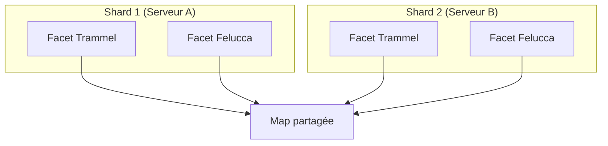
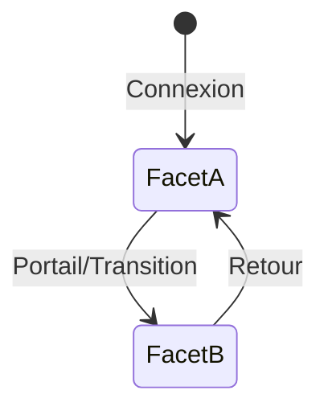
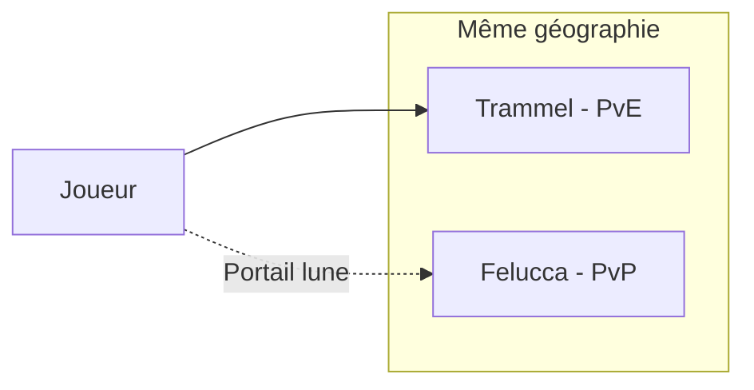

# Facets et shards

**Catégorie :** 4. Entités et monde  
**Description :** Mondes parallèles ; miroirs.

---

## En-tête et contexte

### Rôle dans le moteur

Les **facets** (ou **shards**) permettent d'avoir plusieurs « copies » du monde avec des règles ou des états différents. Cas d'usage : serveurs multiples (sharding), mondes miroirs (Trammel/Felucca), saisons, ou variantes PvP/PvE. Ce point décrit l'architecture pour isoler les états par facet tout en partageant les assets et la logique.

### Liens vers la référence commune

- `InstanceId`, notions de monde — voir [MGE - Référence Commune](../MGE%20-%20Reference%20Commune.md)
- MWS (Miyukini Webway System) : sharding possible via plusieurs Origin/Relay

### Terminologie

| Terme | Définition |
|-------|------------|
| **Facet** | Copie logique du monde avec des règles propres |
| **Shard** | Instance physique (serveur) ; peut héberger une ou plusieurs facets |
| **Miroir** | Deux facets partagent la géographie mais pas l'état (ex. Trammel/Felucca) |
| **Cross-facet** | Interactions entre facets (limitées ou interdites) |

---

## Spécifications techniques

### Contraintes

1. **Isolation d'état** : Les entités d'une facet ne voient pas celles d'une autre
2. **Géographie partagée** : Optionnel ; certaines facets partagent la map, d'autres ont des maps différentes
3. **Transition** : Passage d'une facet à l'autre via portail ou mécanisme dédié
4. **Persistence** : Chaque facet a son propre espace de sauvegarde (KindMother)

### Cas d'usage types

| Cas | Description | Exemple |
|-----|-------------|---------|
| Sharding | Plusieurs serveurs ; chaque shard = une copie du monde | Répartir la charge |
| Trammel/Felucca | Miroir : même map, PvE vs PvP | UO |
| Saison | Nouvelle facet temporaire ; reset périodique | Diablo |
| Donjons parallèles | Même donjon, difficultés = facets | Variantes Hard/Nightmare |

### Paramètres

| Paramètre | Description |
|-----------|-------------|
| FacetId | Identifiant unique (0 = défaut) |
| Rules | PvP on/off, loot modifiers, etc. |
| Map | Partagée ou dédiée |
| Transition | Portails, objets, commandes |

### Références croisées

- **monde-persistant-instancie** : Modèle instance/facet
- **instances-donjons** : Facet = instance étendue
- **gestion-chunks** : Chunks sont par facet
- **MWS** : Plusieurs COG/Relay pour sharding physique

---

## Modèle de données et API

### Structures Rust (pseudo-code)

```rust
#[derive(Clone, Copy, PartialEq, Eq, Hash)]
pub struct FacetId(pub u32);

pub const DEFAULT_FACET: FacetId = FacetId(0);

pub struct FacetConfig {
    pub id: FacetId,
    pub name: String,
    pub map_id: MapId,           // Partagé ou dédié
    pub rules: FacetRules,
    pub transition_portals: Vec<PortalDef>,
}

pub struct FacetRules {
    pub pvp_enabled: bool,
    pub loot_multiplier: f32,
    pub xp_multiplier: f32,
    pub death_penalty: DeathPenalty,
}
```

### API

```rust
pub fn current_facet(player_id: PlayerId) -> FacetId;

pub fn transition_to_facet(player_id: PlayerId, facet_id: FacetId, position: Vec2) 
    -> Result<(), TransitionError>;

pub fn get_facet_config(facet_id: FacetId) -> Option<&FacetConfig>;

pub fn entities_in_facet(facet_id: FacetId) -> impl Iterator<Item = EntityId>;
```

---

## Diagrammes

### Relation facet / shard



### Transition facet



### Architecture miroir



---

## Exemples et cas d'usage

### Cas 1 : Sharding classique

Shard 1, 2, 3 : chacun a une copie du monde. Les joueurs sont répartis (par choix ou automatiquement) pour équilibrer la charge.

### Cas 2 : Trammel/Felucca

Deux facets, même map. Trammel : pas de PvP. Felucca : PvP libre. Les joueurs choisissent via des portails. Les maisons et objets sont séparés par facet.

### Cas 3 : Saison Allumina

Facet « Saison 1 » : monde fresh, objectifs, classement. À la fin de la saison, fusion ou archive. Nouvelle facet « Saison 2 ».

### Cas 4 : Donjons miroirs

Donjon « Caverne » en Normal et Nightmare. Même map, règles différentes. FacetId différent par difficulté.

---

## Cas limites et tests

### Edge cases

| Cas | Comportement attendu | Validation |
|-----|----------------------|------------|
| Transition pendant combat | Interdit ou interrupt | Spécifier |
| Objets cross-facet | Interdit par défaut | Pas de duplication |
| Déco en transition | Compléter ou annuler | Pas de corruption |
| Map différente | Position mappée (spawn point) | Pas de hors limites |

### Critères de validation

1. **Isolation** : Aucune fuite d'état entre facets
2. **Persistence** : Sauvegarde par facet correcte
3. **Transition** : Position et état cohérents après passage

### Tests suggérés

```rust
#[test]
fn facet_isolation() { /* ... */ }

#[test]
fn transition_preserves_state() { /* ... */ }

#[test]
fn persistence_per_facet() { /* ... */ }
```

---

## Détails d'implémentation

### Persistance KindMother par facet

Chaque facet possède un namespace ou une base séparée dans KindMother. Les clés incluent le `FacetId` pour éviter les collisions. Exemple : `facet:{id}:player:{player_id}:position`.

### Sharding physique et MWS

Le MWS permet plusieurs Origin/Relay. Chaque shard physique peut héberger une ou plusieurs facets. Les joueurs se connectent au Tracker qui les route vers le bon shard selon la population et le choix du joueur.

### Transition et portails

Un portail définit : facet source, facet cible, position d'arrivée, conditions (objet, quête). Au passage, le joueur est désinscrit de la facet source et inscrit dans la cible. Les états (inventaire, etc.) restent avec le joueur sauf si les règles de facet imposent des restrictions.

---

## Miroir Trammel / Felucca (référence UO)

### Principe

Deux facets partagent la même géographie (map, positions). Les différences : PvP (Felucca) vs PvE (Trammel), maisons et objets séparés, monstres et loot éventuellement différents.

### Implémentation

- Même `MapId` pour les deux facets
- États (maisons, objets droppés) stockés avec `FacetId`
- Portails lunaires ou objets pour passer de l'une à l'autre
- Certains endroits peuvent être facet-uniques (dungeons Felucca only)

---

## Saisons et reset

### Cycle de saison

1. Création facet « Saison N » avec monde fresh
2. Période de jeu (ex. 3 mois)
3. Fin : classement, récompenses, fusion optionnelle vers facet permanente
4. Reset ou archive de la facet ; création « Saison N+1 »

### Données non réinitialisables

Le compte joueur (login, abonnement) n'est pas lié à une facet. Seuls les personnages et leur progression dans la facet saison sont reset.

---

## Sharding et charge

### Répartition des joueurs

- **Choix manuel** : Liste de serveurs, le joueur choisit
- **Auto** : Selon la population, le Tracker redirige vers le shard le moins chargé
- **Amis / guilde** : Préférence pour le même shard que les contacts

### Limites par shard

Chaque shard a une capacité max (ex. 2000 joueurs connectés). Au-delà, nouveaux joueurs en file d'attente ou redirection vers un autre shard.

---

## Annexes

### Annexe A : Structure de données KindMother par facet

Clé : `facet:{facet_id}:entity:{entity_id}` pour les entités. Les joueurs : `facet:{id}:player:{player_id}:*`. Les objets au sol : `facet:{id}:world:{chunk_x}:{chunk_y}:dropped`.

### Annexe B : MWS et sélection de shard

Le Tracker MWS maintient la liste des serveurs (shards) avec population et statut. Le client demande une connexion ; le Tracker renvoie l'URL du meilleur shard ou met en file d'attente.

### Annexe C : Transition et doublons

Lors d'une transition, le joueur ne doit pas exister en double dans deux facets. Opération atomique : retrait de la source, ajout à la cible. En cas d'échec (source déjà vide), rollback ou erreur.

---

## Guide d'implémentation

1. Chaque joueur a un current_facet (FacetId). Les entités sont filtrées par facet. 2. Portail ou mécanisme déclenche transition_to_facet(facet_id). 3. Valider (conditions, zone de transition). 4. Sauvegarder position actuelle si besoin. Retirer le joueur de la facet source. Ajouter à la facet cible. Téléporter à la position d'arrivée. 5. Persister le current_facet dans KindMother. Pour le sharding MWS, le Tracker route selon le shard du joueur.

---

## FAQ et décisions de design

**Q : Facet et instance, quelle différence ?**  
R : Facet = copie logique du monde (règles, état). Instance = copie d'une zone (donjon, raid). Une facet peut contenir des instances. Souvent on simplifie : instance = zone temporaire, facet = variante permanente (Trammel/Felucca).

**Q : Transition facet = perte d'inventaire ?**  
R : Non par défaut. L'inventaire suit le joueur. Exceptions : certaines facets (saison) peuvent avoir un inventaire séparé.

**Q : Sharding et amis sur un autre shard ?**  
R : Limitation connue. Solutions : sélection manuelle du shard pour jouer ensemble, ou cross-shard pour certaines fonctionnalités (chat, guildes).

**Q : Saison : que devient le personnage après ?**  
R : Option A : fusion vers la facet permanente (items, XP transférés). Option B : archive (lecture seule). Option C : suppression. Dépend du design.

**Q : Trammel/Felucca : même position après transition ?**  
R : Souvent oui (même map, même coords). Les objets au sol, les maisons diffèrent. Le joueur apparaît à la même position physique dans l'autre facet.

**Q : Combien de facets par shard ?**  
R : Variable. Trammel+Felucca = 2. Saison = +1 temporaire. Simplifier si possible pour réduire la complexité.

**Q : Cross-facet trade ?**  
R : Généralement interdit. Les objets sont liés à une facet. Éviter la duplication ou l'exploitation.

**Q : Facet par difficulté (Normal/Nightmare) ?**  
R : Oui, chaque difficulté peut être une facet. Même map, règles différentes. Ou : même instance avec scaling à l'entrée.

---

## Spécifications étendues

### FacetRules complet

- pvp_enabled, loot_multiplier, xp_multiplier
- death_penalty (full, partial, none)
- allow_trade, allow_party
- max_level, min_level

### Transition validation

- Player not in combat
- No debuffs blocking travel
- Facet exists and is joinable
- Position valid in target facet

---

## Notes techniques complémentaires

### Facet et sérialisation

Lors de la sauvegarde, inclure le facet_id dans la clé. `facet:0:player:123` pour le monde par défaut, `facet:1:player:123` pour Trammel, etc. Au chargement, restaurer dans la bonne facet.

### Sharding et amis

Pour permettre aux amis de jouer ensemble malgré le sharding : liste de shards préférés par joueur, ou système de « rejoindre l'ami » qui téléporte vers le shard de l'ami (si pas plein).

### Saison et migration

À la fin de saison : export des personnages vers une archive, ou fusion vers la facet permanente. Les items peuvent être convertis (saison-only → version permanente). Gérer les conflits (nom déjà pris).

---

## Résumé et checklist

| Étape | Action |
|-------|--------|
| 1 | Définir FacetId, FacetConfig, FacetRules |
| 2 | Stockage KindMother par facet (namespace) |
| 3 | transition_to_facet avec validation |
| 4 | Retrait source, ajout cible, téléport |
| 5 | Persister current_facet |
| 6 | Sharding MWS : Tracker route par shard |
| 7 | Tester isolation (pas de fuite d'état) |

---

## Références

| Document | Rôle |
|----------|------|
| [MGE - Référence Commune](../MGE%20-%20Reference%20Commune.md) | Types de base |
| [monde-persistant-instancie](monde-persistant-instancie.md) | Modèle instance |
| [instances-donjons](instances-donjons.md) | Donjons |
| [MWS](../../miyukini-webway-system/) | Sharding réseau |
| [_index 04](_index.md) | Index catégorie |
| [Index MGE](../_index.md) | Index global |
