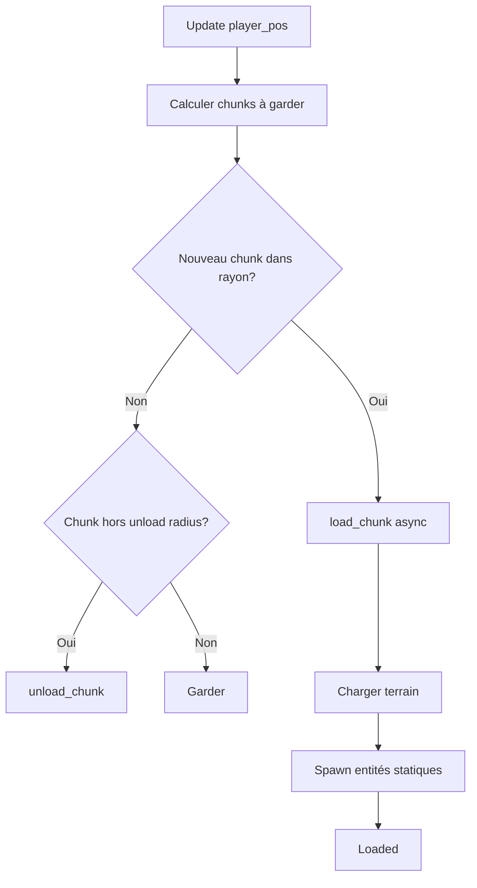
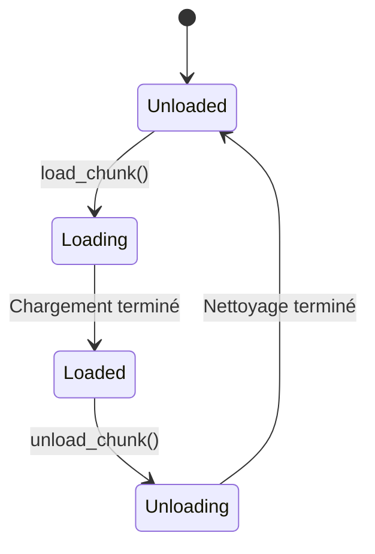
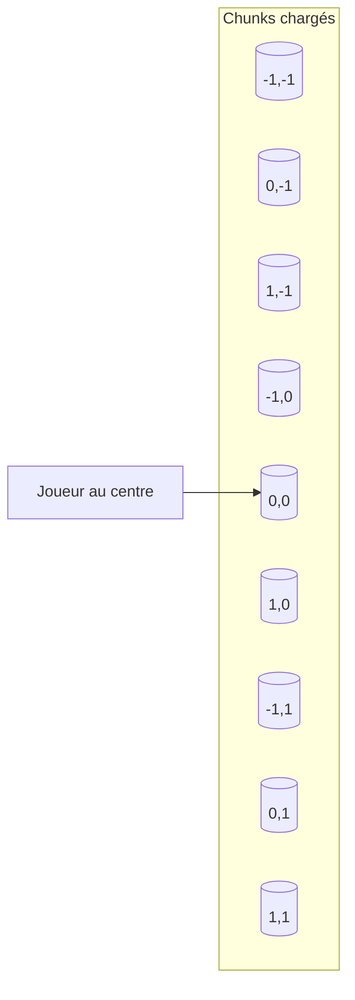

# Gestion des chunks

**Catégorie :** 4. Entités et monde  
**Description :** Chargement/déchargement ; culling.

---

## En-tête et contexte

### Rôle dans le moteur

Le monde MGE est divisé en **chunks** (regions rectangulaires) pour permettre le chargement et déchargement progressif, le culling spatial, et la parallélisation. La gestion des chunks détermine quelles régions du monde sont actives (chargées en mémoire, simulées) et lesquelles sont déchargées ou en standby.

### Liens vers la référence commune

- `Vec2`, `Rect`, `ChunkId` — voir [MGE - Référence Commune](../MGE%20-%20Reference%20Commune.md)
- Monde tile-based : alignement des chunks sur la grille
- Cycle de rendu : intégration avec le culling

### Terminologie

| Terme | Définition |
|-------|------------|
| **Chunk** | Région rectangulaire du monde (ex. 32×32 ou 64×64 tiles) |
| **ChunkId** | Identifiant unique (coords ou index) |
| **Chargement** | Activation d'un chunk (charger données, instancier entités statiques) |
| **Déchargement** | Désactivation (despawn entités non persistantes, libérer données) |
| **Culling** | Exclusion des chunks hors écran ou trop loin du joueur |

---

## Spécifications techniques

### Contraintes

1. **Taille fixe** : Chunks de dimensions constantes (configurable : 16, 32, 64, 128 tiles)
2. **Grille alignée** : Les chunks sont alignés sur la grille du monde
3. **Région active** : Seuls les chunks dans un rayon donné autour du joueur (ou de la caméra) sont chargés
4. **Transition fluide** : Chargement/déchargement asynchrone pour éviter les stutters

### Paramètres

| Paramètre | Valeur typique | Unité | Description |
|-----------|----------------|-------|-------------|
| Chunk size | 32 ou 64 | tiles | Largeur et hauteur d'un chunk |
| Load radius | 2–4 | chunks | Rayon de chargement autour du joueur |
| Unload radius | 3–5 | chunks | Rayon au-delà duquel on décharge |
| Hysteresis | 1 | chunk | Éviter oscillements load/unload à la frontière |

### Formules

- **ChunkId depuis position monde** : `chunk_id = (floor(x / chunk_size), floor(y / chunk_size))`
- **Position dans chunk** : `local_x = x % chunk_size`, `local_y = y % chunk_size`
- **Chunks visibles** : intersection de (chunks dans load radius) et (chunks dans le frustum caméra)

### Références croisées

- **culling-agressif** : Ne pas traiter entités des chunks non chargés
- **monde-tile-based** : Grille et tuiles
- **spawn** : Spawn des entités lors du chargement d'un chunk
- **despawn** : Despawn lors du déchargement

---

## Modèle de données et API

### Structures Rust (pseudo-code)

```rust
/// Coordonnées de chunk (x, y dans la grille de chunks)
#[derive(Clone, Copy, PartialEq, Eq, Hash)]
pub struct ChunkId(pub i32, pub i32);

impl ChunkId {
    pub fn from_world_pos(pos: Vec2, chunk_size: u32) -> Self {
        let x = (pos.x / chunk_size as f32).floor() as i32;
        let y = (pos.y / chunk_size as f32).floor() as i32;
        Self(x, y)
    }
    
    pub fn to_world_rect(&self, chunk_size: u32) -> Rect {
        Rect::new(
            self.0 as f32 * chunk_size as f32,
            self.1 as f32 * chunk_size as f32,
            chunk_size as f32,
            chunk_size as f32,
        )
    }
}

pub enum ChunkState {
    Unloaded,
    Loading,
    Loaded,
    Unloading,
}

pub struct Chunk {
    pub id: ChunkId,
    pub state: ChunkState,
    pub entities: Vec<EntityId>,
    pub terrain_data: Option<TerrainData>,
}
```

### API

```rust
pub trait ChunkManager {
    /// Obtenir le chunk contenant une position
    fn chunk_at(&self, pos: Vec2) -> ChunkId;
    
    /// Chunks actuellement chargés
    fn loaded_chunks(&self) -> &HashSet<ChunkId>;
    
    /// Charger un chunk (async)
    fn load_chunk(&mut self, id: ChunkId) -> impl Future<Output = Result<(), LoadError>>;
    
    /// Décharger un chunk
    fn unload_chunk(&mut self, id: ChunkId) -> Result<(), UnloadError>;
    
    /// Mettre à jour (déterminer quels chunks charger/décharger)
    fn update(&mut self, player_pos: Vec2);
    
    /// Entités dans un chunk
    fn entities_in_chunk(&self, id: ChunkId) -> &[EntityId];
}
```

---

## Diagrammes

### Flux de chargement



### États d'un chunk



### Vue top-down des chunks



---

## Exemples et cas d'usage

### Cas 1 : Monde ouvert Allumina

Le joueur se déplace. Tous les 100 ms, le ChunkManager recalcule les chunks dans un rayon de 3. Les chunks qui sortent du rayon sont déchargés (despawn des mobs, libération du terrain) ; les nouveaux sont chargés (spawn des mobs selon tables de respawn).

### Cas 2 : Donjon linéaire

Dans un donjon corridor, les chunks sont chargés séquentiellement. Quand le joueur avance, le chunk derrière est déchargé ; celui devant est chargé. Load radius = 1 ou 2.

### Cas 3 : Réduction mémoire

Sur plateforme mobile, réduction du load radius à 2 et du chunk size à 16 pour limiter la mémoire.

### Cas 4 : Sauvegarde KindMother

Seuls les chunks chargés contenant des entités persistantes sont sérialisés. Les chunks déchargés ont leurs données terrain en streaming depuis le stockage.

---

## Cas limites et tests

### Edge cases

| Cas | Comportement attendu | Validation |
|-----|----------------------|------------|
| Joueur à la frontière | Hysteresis évite load/unload en boucle | Pas de flickering |
| Chunk corrompu | Fallback ou erreur gracieuse | Pas de crash |
| Chargement lent | Affichage placeholder ou loading | UX acceptable |
| Transition brutale | LOD ou fade pour masquer le pop-in | Pas de coupure visible |

### Critères de validation

1. **Cohérence** : Les entités d'un chunk déchargé ne sont plus accessibles
2. **Performance** : Chargement d'un chunk < 16 ms (objectif 60 fps)
3. **Mémoire** : Pas de fuite après 100 cycles load/unload

### Tests suggérés

```rust
#[test]
fn chunk_id_from_world_pos() { /* ... */ }

#[test]
fn load_unload_cycle() { /* ... */ }

#[test]
fn entities_despawn_on_unload() { /* ... */ }
```

---

## Détails d'implémentation

### Chargement asynchrone

`load_chunk` retourne une Future. Le chargement peut inclure : lecture du fichier de terrain, décompression, création des entités statiques, chargement des spawn points. Pendant ce temps, le jeu continue ; le chunk passe à Loaded quand la Future est résolue.

### Streaming et LOD terrain

Pour des mondes très grands, le terrain peut avoir plusieurs niveaux de détail. Chunks proches : haute résolution. Chunks éloignés : basse résolution ou même vide. Le passage d'un niveau à l'autre se fait progressivement pour éviter le pop-in.

### Entités et chunks

Chaque entité est associée à un ChunkId (celui qui contient sa position). Lors des déplacements, si l'entité change de chunk, elle est retirée de la liste du chunk source et ajoutée à celle du chunk cible. Les requêtes « entités dans le rayon » peuvent utiliser cette structure.

---

## Sauvegarde KindMother

Les chunks persistants (monde persistant) sont sauvegardés avec leur ChunkId. Format : `world:{facet}:chunk:{x}:{y}`. Les entités persistantes sont incluses. Au chargement, seuls les chunks chargés sont restaurés ; les autres restent sur disque.

---

## Performance

| Métrique | Cible | Unité |
|----------|-------|-------|
| Temps chargement chunk | < 16 ms | Par chunk |
| Chunks chargés max | 25–49 | 5x5 ou 7x7 |
| Mémoire par chunk | 100–500 KB | Selon densité |

---

## Annexes

### Annexe A : Format de fichier chunk

Chaque chunk peut être stocké dans un fichier binaire ou JSON. Structure : en-tête (ChunkId, version), données terrain (tiles), liste des entités statiques, spawn points. Les entités dynamiques (mobs) ne sont généralement pas sauvegardées dans le chunk ; elles sont respawnées.

### Annexe B : Chunks et multithreading

Le chargement peut être sur un thread dédié (I/O). Une fois les données prêtes, elles sont transférées au thread principal pour l'instanciation. Attention aux race conditions si le joueur se déplace pendant le chargement.

### Annexe C : LOD des chunks

Pour des mondes très grands, les chunks éloignés peuvent avoir une version « low detail » : terrain simplifié, pas d'entités. Quand le joueur s'approche, le chunk full est chargé. Transition progressive pour éviter le pop-in brutal.

---

## Guide d'implémentation

1. Calculer ChunkId depuis la position du joueur. 2. Déterminer les chunks à garder (rayon), ceux à charger (nouveaux), ceux à décharger (sortis du rayon). 3. Pour chaque nouveau chunk : lancer load_chunk (async). 4. Quand le chargement est terminé, spawn les entités statiques, enregistrer le chunk comme Loaded. 5. Pour chaque chunk à décharger : despawn les entités non persistantes, libérer les ressources, retirer de la liste. 6. Utiliser une hysteresis (rayon décharge > rayon charge) pour éviter les oscillations.

---

## FAQ et décisions de design

**Q : Taille de chunk : 16, 32 ou 64 tiles ?**  
R : 32 est un bon compromis. 16 = plus de chunks, plus de load/unload. 64 = moins de chunks mais chargements plus lourds. Adapter au monde (donjon étroit vs monde ouvert).

**Q : Chargement synchrone ou async ?**  
R : Async recommandé. Le jeu continue pendant le chargement. Un chunk en Loading peut afficher un placeholder (tuiles vides, message). À la fin du chargement, swap vers le contenu réel.

**Q : Entités à la frontière de chunks ?**  
R : Une entité appartient au chunk qui contient son centre (ou son origine). Quand elle traverse la frontière, elle change de chunk. Mettre à jour les listes entity_per_chunk.

**Q : Chunks persistants et sauvegarde ?**  
R : Monde persistant : sauvegarder les chunks modifiés (objets au sol, portes, etc.). Ne pas sauvegarder les mobs (respawn selon tables). Instances : souvent pas de sauvegarde (état éphémère).

**Q : Streaming de très grands mondes ?**  
R : Chunks + LOD. Chunks éloignés = version low-detail (terrain simplifié, pas d'entités). Transition progressive quand le joueur s'approche.

**Q : Chunk corrompu ou manquant ?**  
R : Fallback : chunk vide ou terrain par défaut. Log l'erreur. Éviter le crash. Optionnel : régénération procédurale si le monde le supporte.

**Q : Multithreading du chargement ?**  
R : Oui. Thread I/O charge les fichiers. Thread principal instancie (spawn, setup). Transférer les données via channel ou queue. Attention aux race conditions.

**Q : Pré-chargement des chunks voisins ?**  
R : Charger les chunks adjacents à la direction du mouvement en priorité. Si le joueur va vers l'est, charger les chunks à l'est en premier.

---

## Spécifications étendues

### ChunkState machine

```
Unloaded --load_chunk--> Loading --done--> Loaded
Loaded --unload_chunk--> Unloading --done--> Unloaded
```

### Paramètres par plateforme

| Plateforme | Chunk size | Load radius | Memoire cible |
|------------|------------|-------------|---------------|
| PC | 64 | 4 | 50 MB |
| Console | 32 | 3 | 30 MB |
| Mobile | 32 | 2 | 15 MB |

---

## Notes techniques complémentaires

### Format fichier chunk (binaire)

En-tête : magic (4B), version (2B), chunk_x (4B), chunk_y (4B), tile_count (4B). Corps : array de tile_ids (2B chacun). Footer : entity_count, entities (position + prefab_id).

### Priorité de chargement

Les chunks dans la direction du mouvement du joueur ont priorité. Si le joueur va vers (1,0), charger (cx+1, cy) avant (cx-1, cy).

### Chunks et instances

Chaque instance a son propre ensemble de chunks chargés. Instance 0 (monde persistant) et instance N (donjon) ne partagent pas les chunks. Les maps sont différentes.

---

## Résumé et checklist

| Étape | Action |
|-------|--------|
| 1 | Définir ChunkId et taille de chunk |
| 2 | Implémenter load_chunk (async) et unload_chunk |
| 3 | Calculer chunks à garder/charger/décharger |
| 4 | Hysteresis pour éviter oscillations |
| 5 | Associer entités aux chunks (entity_per_chunk) |
| 6 | Intégrer spawn au load, despawn au unload |
| 7 | Tester transition fluide (pas de pop-in) |

---

## Références

| Document | Rôle |
|----------|------|
| [MGE - Référence Commune](../MGE%20-%20Reference%20Commune.md) | Types Vec2, Rect, ChunkId |
| [culling-agressif](culling-agressif.md) | Exclusion spatiale |
| [monde-tile-based](../01-affichage-rendu/monde-tile-based.md) | Grille et tuiles |
| [spawn](spawn.md) | Spawn au chargement |
| [despawn](despawn.md) | Despawn au déchargement |
| [_index 04](_index.md) | Index catégorie |
| [Index MGE](../_index.md) | Index global |
