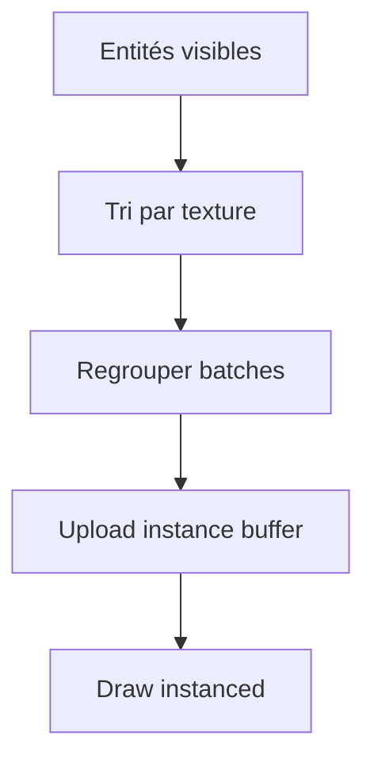
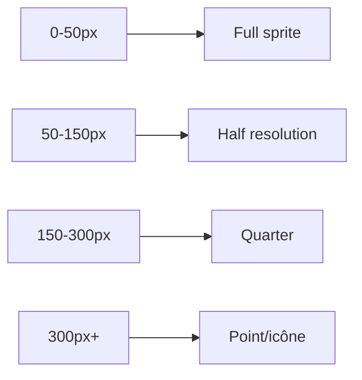
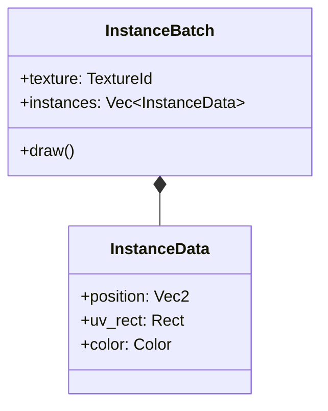

# Grands effectifs à l'écran

**Catégorie :** 4. Entités et monde  
**Description :** Centaines ou milliers d'unités ; optimisation du rendu.

---

## En-tête et contexte

### Rôle dans le moteur

Certains scénarios (batailles, foules, effets de masse) mettent des centaines voire des milliers d'entités à l'écran simultanément. Ce point traite des techniques pour maintenir des performances acceptables : instancing, batching, simplification des sprites, LOD, et réduction du coût par entité.

### Liens vers la référence commune

- Rendu, cycle de frame — voir [MGE - Référence Commune](../MGE%20-%20Reference%20Commune.md)
- [culling-agressif](culling-agressif.md) : réduire le nombre d'entités traitées
- [comportement-foule](comportement-foule.md) : déplacements de masse

### Terminologie

| Terme | Définition |
|-------|------------|
| **Instancing** | Dessiner plusieurs copies d'un mesh/sprite en un seul draw call |
| **Batching** | Regrouper les entités partageant le même matériau/texture |
| **Sprite sheet** | Atlas contenant plusieurs sprites ; un seul bind de texture |
| **LOD** | Level of Detail — réduction de la complexité à distance |
| **Culling** | Ne pas dessiner ce qui est hors écran |

---

## Spécifications techniques

### Contraintes

1. **Objectif** : 60 fps avec 500–1000 entités visibles (configurable selon plateforme)
2. **Draw calls** : Minimiser (cible < 50 par frame pour les entités)
3. **Mémoire** : Éviter l'explosion des allocations (pooling, pré-allocation)
4. **Qualité** : Dégradation progressive, pas de rupture visuelle

### Techniques

| Technique | Gain | Coût |
|-----------|------|------|
| Instancing | 1 draw call pour N entités | Nécessite GPU support |
| Texture atlas | Moins de bind | Atlas management |
| LOD par distance | Moins de pixels | Calcul distance |
| Batching par texture | Moins de draw calls | Tri par texture |
| Simplification sprite | Moins de tris | Sprites LOD |
| Culling frustum | Moins d'entités | Calcul viewport |

### Paramètres

| Paramètre | Valeur | Description |
|-----------|--------|-------------|
| Max instances per draw | 1024+ | Selon backend (wgpu) |
| Atlas size | 2048×2048 | Ou 4096 |
| LOD levels | 3–4 | 0 = full, 3 = icône |
| Batch size | 256–512 | Entités par batch |

### Formules

- **Coût rendu estimé** : `draw_calls * overhead + pixels_drawn * fill_cost`
- **Objectif** : `total_entities / instances_per_draw <= 20` (draw calls)

### Références croisées

- **culling-agressif** : Réduire les entités rendues
- **gestion-sprites** : Atlas, sprite sheets
- **particules** : Système de particules pour les effets de masse
- **comportement-foule** : Mouvement des unités

---

## Modèle de données et API

### Structures Rust (pseudo-code)

```rust
pub struct InstanceBuffer {
    pub positions: Vec<Vec2>,
    pub rotations: Vec<f32>,
    pub scales: Vec<f32>,
    pub colors: Vec<Color>,
    pub texture_rects: Vec<Rect>,  // Pour atlas
}

pub struct Batch {
    pub texture_id: TextureId,
    pub instances: InstanceBuffer,
    pub blend_mode: BlendMode,
}

pub struct HighDensityRenderer {
    batches: Vec<Batch>,
    max_instances_per_batch: usize,
}

impl HighDensityRenderer {
    pub fn add_entity(&mut self, sprite: &Sprite, transform: &Transform);
    pub fn flush(&mut self, ctx: &mut RenderContext);
}
```

### Pipeline de rendu optimisé

```rust
// 1. Culling : filtrer entités visibles
let visible = culling_system.visible_entities();

// 2. Trier par texture (batching)
let sorted = visible.sort_by_texture();

// 3. Grouper en batches
let batches = group_into_batches(sorted, 512);

// 4. Instanced draw
for batch in batches {
    renderer.draw_instanced(batch);
}
```

---

## Diagrammes

### Pipeline de rendu



### LOD par distance



### Architecture batching



---

## Exemples et cas d'usage

### Cas 1 : Armée Allumina

500 soldats à l'écran. Tous utilisent le même sprite sheet « soldat ». Un seul atlas bind ; instancing pour les 500. Résultat : 1–2 draw calls pour les soldats au lieu de 500.

### Cas 2 : Foule de village

Mélange de PNJ (5–10 types). Batching par texture : un batch par type de PNJ. Avec 200 PNJ de 5 types, ~5 draw calls.

### Cas 3 : Particules + unités

Les projectiles et effets utilisent le système de particules (déjà optimisé). Les unités utilisent l'instancing. Séparation des concerns.

### Cas 4 : Mobile

Sur mobile, réduction du max visible à 200, LOD plus agressif (LOD2 à 80 px), textures compressées.

---

## Cas limites et tests

### Edge cases

| Cas | Comportement attendu | Validation |
|-----|----------------------|------------|
| 2000+ entités | Dégradation progressive ou cap | Pas de crash |
| Textures multiples | Batching par texture, pas de surcoût excessif | Draw calls limités |
| Transparences | Tri par profondeur si nécessaire | Ordre correct |
| Très petit viewport | Scaling correct des LOD | Pas de pixelisation excessive |

### Critères de validation

1. **Performance** : 60 fps avec 500 entités (benchmark configurable)
2. **Qualité** : LOD invisible ou acceptable à distance normale
3. **Mémoire** : Pas de fuite lors du spawn/despawn massif

### Tests suggérés

```rust
#[test]
fn batch_coalescing() { /* ... */ }

#[test]
fn instance_count_limits() { /* ... */ }

#[bench]
fn render_1000_entities() { /* ... */ }
```

---

## Optimisations avancées

### GPU instancing (wgpu)

Utiliser `draw_indexed_indirect` ou `draw_indexed` avec instance buffer pour minimiser les appels CPU → GPU.

### Occlusion culling (optionnel)

Pour des scènes avec obstacles, ne pas dessiner les entités cachées. Coût CPU supplémentaire ; à évaluer.

### Animation partagée

Si plusieurs entités ont la même animation, partager les données d'animation (frame courante) pour réduire le coût.

### Spatial partitioning pour le tri

Utiliser une grille ou un quadtree pour trier rapidement les entités par position (pour le tri depth) sans O(n log n) global.

---

## Détails d'implémentation

### Instancing avec wgpu

```rust
// Simplified: one draw call for N instances
render_pass.draw_indexed(
    0..index_count,
    0,
    0..instance_count,
);
```

L'instance buffer contient les matrices ou les positions/rotations/scales. Mise à jour chaque frame depuis les données des entités visibles.

### Tri par texture

Avant de construire les batches, trier les entités par `texture_id`. Les entités partageant la même texture sont regroupées. Réduit les changements de texture (binds) entre draw calls.

### LOD et sprite swapping

À chaque niveau LOD, un sprite différent peut être utilisé (plus petit, moins de frames). Le système de rendu sélectionne le sprite selon la distance au joueur avant de l'ajouter au batch.

---

## Plateformes

| Plateforme | Max entités cible | LOD agressif |
|------------|-------------------|---------------|
| PC | 1000+ | Non |
| Console | 500–800 | Léger |
| Mobile | 200–400 | Oui |
| Low-end | 100–200 | Très agressif |

---

## Annexes

### Annexe A : Structure InstanceData (wgpu)

Pour l'instancing, chaque instance peut avoir : `[[position.xy, scale, rotation], [uv_rect], [color_rgba]]`. Packed pour un vertex buffer ou storage buffer. Mise à jour chaque frame depuis les entités visibles.

### Annexe B : Batching et tri depth

Si des transparences sont utilisées, le tri par profondeur peut être nécessaire. Alternatives : dessiner en deux passes (opaque puis transparent), ou accepter des artefacts mineurs pour la performance.

### Annexe C : Réduction des draw calls en pratique

Objectif : < 20 draw calls pour les entités. Avec instancing, 1000 entités de 5 types = 5 draw calls. Les décors (tiles) sont typiquement 1–2 draw calls supplémentaires (atlas terrain). Total cible : < 30 draw calls pour une scène chargée.

---

## Guide d'implémentation

1. Culling : filtrer les entités visibles (voir culling-agressif). 2. Trier par texture_id pour regrouper. 3. Pour chaque groupe : construire l'instance buffer (positions, UVs, colors). 4. Upload du buffer sur le GPU. 5. Draw instanced pour chaque texture. Adapter le LOD (sprite différent) selon la distance avant d'ajouter au batch. Sur mobile, réduire le max visible et les LOD.

---

## FAQ et décisions de design

**Q : Instancing supporté sur toutes les plateformes ?**  
R : wgpu/Vulkan/Metal/D3D12 oui. OpenGL ES 2 : non. WebGL 1 : limité. Vérifier les capacités. Fallback : batching sans instancing (plus de draw calls).

**Q : Taille de l'instance buffer ?**  
R : Typiquement 1024–4096 instances par draw call. wgpu et les APIs modernes supportent plus. Limiter pour la compatibilité mobile.

**Q : Tri par texture : coût ?**  
R : O(n log n) pour trier. Faire une fois par frame après le culling. Moins cher que les draw calls supplémentaires sans tri.

**Q : Transparences et ordre de dessin ?**  
R : Les sprites transparents nécessitent un tri par profondeur. Deux passes : opaque d'abord, puis transparents triés. Ou accepter des artefacts si la performance prime.

**Q : Atlas : une texture ou plusieurs ?**  
R : Moins de textures = moins de binds. Un atlas 2048x2048 peut contenir des centaines de sprites. Plusieurs atlas si dépassement (4096 pour certains GPUs).

**Q : LOD des sprites : assets multiples ?**  
R : Oui. Chaque niveau LOD peut avoir un sprite différent (résolution, complexité). Ou : scale-down à la volée (moins beau mais un seul asset).

**Q : 60 fps avec 1000 entités : réaliste ?**  
R : Oui avec instancing + culling. Sans : difficile. Mesurer sur la plateforme cible. Mobile : viser 200–400.

**Q : Particules vs entités ?**  
R : Les particules sont dans un système dédié (optimisé, pas d'IA). Les entités (mobs, PNJ) utilisent l'instancing. Ne pas mélanger (particules = système séparé).

---

## Spécifications étendues

### InstanceData layout (GPU)

```
struct Instance {
    vec2 position;
    float rotation;
    float scale;
    vec4 uv_rect;
    vec4 color;
}
```

### Draw call budget

- Entités : max 20 calls
- Tiles : 2–3 calls
- UI : 5–10 calls
- Total cible : < 35 calls @ 60 fps

---

## Notes techniques complémentaires

### Instancing et palette de couleurs

Si les sprites supportent le tint, l'instance data inclut une couleur. Permet des variantes (équipes, états) sans textures supplémentaires.

### Batching et transparent sorting

Pour les sprites transparents, trier par depth (y ou z) avant de construire les batches. Un batch peut être split si le tri casse le regroupement par texture.

### Profiling

Mesurer : temps de culling, temps de construction des batches, temps de draw. Identifier le goulot. Sur mobile, le fill rate peut limiter avant le CPU.

---

## Résumé et checklist

| Étape | Action |
|-------|--------|
| 1 | Culling : filtrer entités visibles |
| 2 | Trier par texture pour batching |
| 3 | Construire instance buffers |
| 4 | Upload GPU, draw instanced |
| 5 | LOD selon distance |
| 6 | Adapter max visible par plateforme |
| 7 | Benchmark : 500 entités @ 60 fps |

---

## Références

| Document | Rôle |
|----------|------|
| [MGE - Référence Commune](../MGE%20-%20Reference%20Commune.md) | Cycle de rendu |
| [culling-agressif](culling-agressif.md) | Réduction du nombre rendu |
| [comportement-foule](comportement-foule.md) | Mouvements de masse |
| [gestion-sprites](../01-affichage-rendu/gestion-sprites.md) | Atlas |
| [particules](../01-affichage-rendu/particules-effets.md) | Effets |
| [_index 04](_index.md) | Index catégorie |
| [Index MGE](../_index.md) | Index global |
